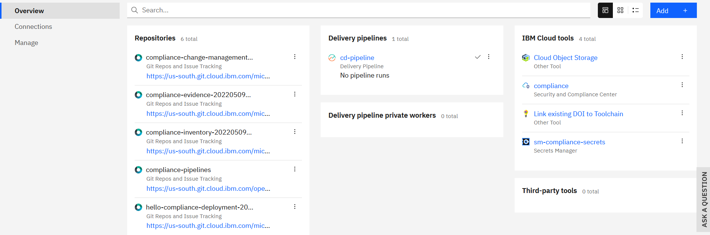
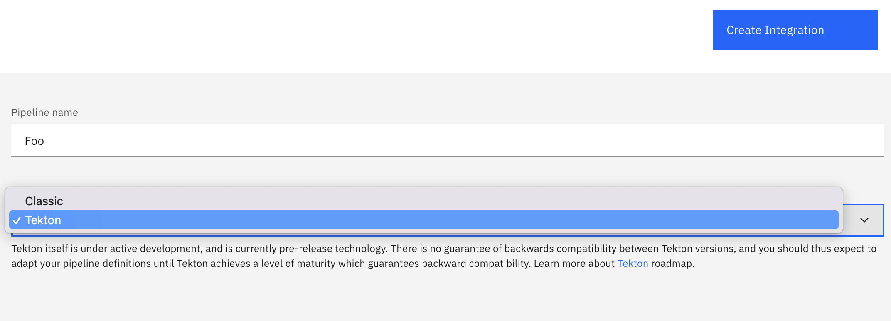

---

copyright:
  years: 2021, 2022
lastupdated: "2022-05-11"

keywords: DevSecOps, ibm cloud, tekton, classic, pipeline

subcollection: devsecops

---

{{site.data.keyword.attribute-definition-list}}

# Adding a pipeline to an existing toolchain
{: #devsecops-add-pipeline}

You can add a pipeline to an existing toolchain by creating a new Delivery Pipeline tool integration.
{: shortdesc}

To add a pipeline to an existing toolchain, complete these steps:

1. From the Toolchain Overview page, click **Add +** to add a tool integration for your toolchain.

   {: caption="Figure 1. Toolchain overview" caption-side="bottom"}

2. Search and click **Delivery Pipeline** tool integration tile.

   {: caption="Figure 2. Set up your pipeline" caption-side="bottom"}

3. Choose between Classic pipeline that is defined through the UI, or the new Tekton-based 'pipeline as code' that is defined in a Git repository. 

   Tekton pipelines are currently available only with Private Workers.
   {:  important}

4. Name your pipeline, choose the pipeline configuration method, and then select **Create Integration**. This action takes you to the pipeline configuration page to finish setting it up.

5. Click **Create Integration**.

For more information about setting up a Tekton-based delivery pipeline, see [Creating a Delivery Pipeline for Tekton](/docs/ContinuousDelivery?topic=ContinuousDelivery-tekton-pipelines&interface=ui#configure_tekton_pipeline).
