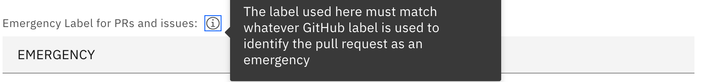

---

copyright:
  years: [{CURRENT_YEAR}]
lastupdated: "[{LAST_UPDATED_DATE}]"

keywords: DevSecOps

subcollection: devsecops

---

[{METADATA_ATTRIBUTES}]

# Manually approving change requests
{: #cd-devsecops-approve-cr}

With {{site.data.keyword.contdelivery_full}}, you can either approve change requests manually or automatically.
{: shortdesc}

By default, standard change requests are created and if all of the required compliance checks pass, the deployment readiness is set to `true`. When a change request is of the standard type and the deployment readiness is set to `true`, it is automatically approved. 

If one or more compliance checks fail, deployment readiness is set to `false`, the continuous delivery pipeline breaks, and the deployment stops because of the unapproved change request.

You can deploy a manually approved change request by adding an emergency label to the promotion pull request 
or by providing a manually pre-approved (with label `status_approved`) change request.

## Adding emergency label to promotion PR
{: #cd-devsecops-emergency-label}

If you need to deploy emergency changes immediately, you can use emergency mode. When you promote a change, add an emergency label to the promotion pull request to prompt the continuous delivery pipeline to create an emergency change request. Emergency change requests allow deployment to continue even if the approval is missing.

Use the emergency mode sparingly and with caution.
{:  important}

You can set the value of the emergency label (`default: EMERGENCY`) that the continuous delivery pipeline looks for on the promotion pull request when you create the toolchain.

 

You can also change the value of the emergency label from the pipeline's environment variables:

 

After the deployment completes, the emergency change request is set to the `Review` state, which indicates that it requires the assigned approvers to review and approve it.

## Provide a manually pre-approved CR
{: #cd-devsecops-manual-preapprove}

If the deployment is not an emergency, you can wait for the change request to be manually approved. Use the existing, manually pre-approved change request number that is set in the continuous delivery pipeline environment variables. The default value is `notAvailable`, which means the continuous delivery pipeline creates a new change request.

 
