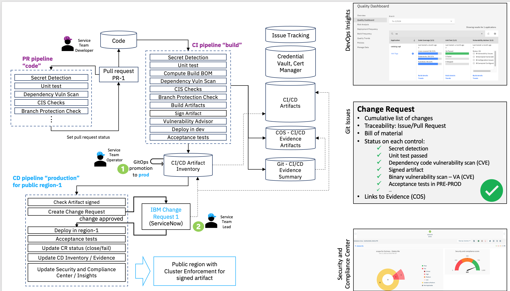

---

copyright:
  years: 2021, 2024
lastupdated: "2024-10-09"

keywords: DevSecOps, architecture, compliance, secure, CI, CD, CC, IBM Cloud

subcollection: devsecops

---

{{site.data.keyword.attribute-definition-list}}

# DevSecOps reference implementation workflow
{: #cd-devsecops-arch}

The DevSecOps reference architecture streamlines compliance and audit-readiness by using building blocks like Tekton task library and toolchain templates.
{: shortdesc}

Because the continuous integration, continuous deployment, and continuous compliance processes are standardized, application development teams can be sure that they are following security best practices. The [DevSecOps](#x9892260){: term} reference architecture provides a set of predefined continuous integration, continuous deployment, and continuous compliance toolchain templates. These templates use a collection of tool integrations and customizable reference Tekton pipelines for build, scan, test, change management, and deploy. The pipelines definitions are managed and updated by IBM periodically unless you change the default setting when you create the toolchains.

The Tekton pipelines provide a framework of custom scripts that you can use to ensure the compliant and automated orchestration of code and configuration changes. The pipelines can also help to maintain a GitOps release inventory, while it collects and stores evidence that can be used to generate auditable change requests.

You can use the pipelines to deploy to public cloud or hybrid target environments by using Tekton private pipeline workers. The Tekton pipelines run in predefined container images along with some user scripts. You can run anything that can be scripted, within the boundaries of the Tekton pipelines.

## Shift-Left continuous integration, continuous deployment design
{: #cd-devsecops-design}

The following diagram shows the implementation workflow and main features of the DevSecOps architecture.

{: caption="Reference implementation workflow" caption-side="bottom"}

* Pull or merge request validation uses a specific pull request pipeline that echoes status back to the pull request. This feature allows developers to find problems early in the development cycle.
* Integration is achieved by using a continuous integration pipeline that implements many controls out of the box and collects normalized evidence for these integrations in an evidence repository (repo). It also writes metadata on the artifacts to deploy into an artifacts inventory repo, which enables GitOps practices.
* Delivery is performed by using a continuous deployment pipeline to process content from the artifacts inventory and collect evidence to generate a change request for each deployment. It can also record compliance facts in the {{site.data.keyword.compliance_short}}, and these facts can be assessed against a compliance profile.

As part of a continuous deployment staging deployment, continuous integration pipelines typically emit to the inventory master branch by using pull requests to promote the changes to a staging branch. Then, when ready, the changes are promoted again from staging to production with a subsequent branch promotion. To drive a coordinated release deployment, you can have multiple continuous deployment pipelines that output to a shared inventory and evidence repo.

Only one change request is created when multiple artifacts in that inventory are promoted.
{: tip}

You can have multiple continuous deployment pipelines that pull from a shared inventory and evidence repo, which enables multiple environments to be targeted from the same continuous integration input.
