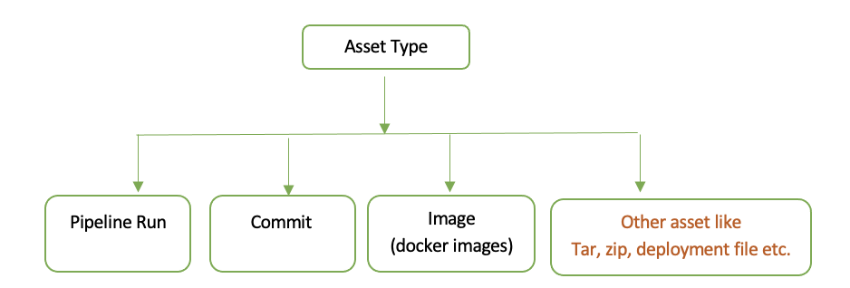

---

copyright:
  years: 2023
lastupdated: "2023-11-07"

keywords: DevSecOps, evidence collection, generic asset, inventory, application, microservice

---

{{site.data.keyword.attribute-definition-list}}

# Asset creation and Evidence collection in DevSecOps
{: #devsecops-asset-evidence-collection}


In the DevSecOps process, maintaining security compliance requires tracking what you build, test, and deploy. Asset creation and evidence collection provide this traceability, ensuring that security seamlessly integrates with every phase of the software development lifecycle. This approach embodies the concept of "shift-left security," where security is not an afterthought but an inherent part of the development process.

This guide explains how to implement asset-based evidence collection in your DevSecOps pipelines. By following these practices, you can:
- Track all artifacts produced in your CI/CD pipelines
- Collect evidence of security scans and compliance checks
- Maintain an auditable trail for regulatory compliance
- Automate issue management and change requests

## Understanding the workflow
{: #devsecops-workflow-overview}

The asset and evidence collection process follows three main stages:

1. **Capture asset information** - As you build artifacts (images, deployments, etc.), save their metadata
2. **Register in inventory** - Create inventory entries that track assets across environments
3. **Collect evidence** - Link security scan results and test outcomes to specific assets

This workflow ensures that every artifact in your pipeline has a complete compliance history, from build to deployment.

## What is an asset?
{: #devsecops-asset-definition}

In DevSecOps, an **asset** is any artifact or entity that undergoes security testing and scanning. Think of an asset as the "subject" of your compliance checks - it's what you're testing, scanning, and ultimately deploying.

### Common asset types

Assets can take many forms in your pipeline:

- **Source code commits** - The code being built and tested
- **Container images** - Docker images produced by your builds
- **Deployment artifacts** - Kubernetes manifests, Helm charts, or configuration files
- **Pipeline runs** - The pipeline execution itself

The following diagram shows the various asset types supported in DevSecOps:

{: caption="Types of assets." caption-side="bottom"}

### How to identify assets

Each asset must be uniquely and immutably identified. This ensures that evidence collected for an asset always refers to the exact same artifact, even as your pipeline runs multiple times.

**Asset identification formats:**

- **Commit Asset**: Repository and commit hash
  ```
  https://repo.url/org/repo#<COMMIT-SHA>
  ```

- **Image Asset**: Docker image and its digest
  ```
  docker://registry.URL/name@sha256:<SHA256-DIGEST>
  ```

- **Pipeline Run Asset**: Pipeline and run ID
  ```
  pipelinerun://<PIPELINE_ID>/<RUN_ID>
  ```

- **Other Assets**: Fully qualified URL examples
  - Commit asset with file name (helm chart or config file):
    ```
    https://repo.url/org/repo#<COMMIT-SHA>/<filename>
    ```
  - Artifact asset:
    ```
    <artifactory-url>/artifact.<filetype>
    ```

Use immutable identifiers (commit SHAs, image digests) rather than mutable labels (tags, branches) to ensure evidence always references the exact artifact version.
{: important}

## What is evidence?
{: #devsecops-evidence-definition}

**Evidence** is a record that proves a specific security scan, test, or compliance check was performed on an asset. Evidence entries contain:
- The type of check performed (e.g., vulnerability scan, unit tests)
- The tool that performed the check (e.g., SonarQube, Jest)
- The result status (success, failure, pending)
- Links to detailed results, issues, and attachments

Evidence is a metadata which points to the asset, tool it ran to collect and what is the result along with the attachments if any. This design allows you to track compliance across multiple environments while maintaining a single source of truth for each asset.

## Inventory management standards
{: #devsecops-asset-inventory}

The inventory serves as your central registry of all assets metadata across environments. To ensure consistency and enable automated issue management, follow these field standards when saving assets and creating inventory entries:

1. **Type**: Reserved keywords to indicate the type of the artifact:
   - `commit` for commit assets
   - `image` for image assets
   - `generic` for pipeline-run assets
   
   For any other artifact type, you can choose a string that appropriately indicates its inherent type (for example, `deployment` for deployment files, `tar` for tar files).

2. **Name**: Maintain a static artifact name throughout the pipeline run. Avoid incorporating dynamic elements like commit hashes in the name to ensure the correctness of auto-closing issues.
   
   Examples:
   - `us.icr.io/my-registry/my-app:20230828074614-master-commit-1@sha256:sha256-1`
   - `my-app-202304211845444721_IKS_deployment`

3. **Provenance**: Provide a fully qualified domain URL to establish the artifact's origin.
   
   Examples:
   - `us.icr.io/my-registry/my-app:20230828074614-master-commit-1@sha256:sha256-1`

4. **Digest**: Follow the regex pattern: Start with `sha256`, followed by a colon (`:`), and then the actual SHA256 hash (`sha256:<sha256>`).
   
   Example:
   - `sha256:sha256-1`

5. **Signature**: If the artifact is signed, include the relevant signature information.

Following these standardized guidelines enhances the inventory management process, ensuring accurate tracking and retrieval of assets.


## Implementing the workflow
{: #devsecops-implementation}

Now that you understand the concepts, let's implement the three-stage workflow in your pipeline.

## Stage 1: Capture asset information
{: #devsecops-store-asset}

As your pipeline builds artifacts, capture their metadata using the `save_repo` and `save_artifact` commands. This information will be used later to create inventory entries and collect evidence.

### Save repository information

When your pipeline checks out source code, use the [`save_repo` command](/docs/devsecops?topic=devsecops-devsecops-pipelinectl#save_repo) to record the repository details. This associates your build artifacts with the specific commit that produced them.

**Example:**

```bash
save_repo app-repo \
  url=<app_url> \
  path=my-app \
  commit=commit1 \
  branch=master \
  buildnumber=1
```
{: codeblock}


### Save artifact information

After building artifacts (images, deployment files, etc.), use the [`save_artifact` command](/docs/devsecops?topic=devsecops-devsecops-pipelinectl#save_artifact) to record their details. This captures the artifact's name, type, digest, and provenance.

**When to use this:**
- After building a Docker image
- After generating deployment manifests
- After creating any artifact that will be deployed

**Example: Saving a Docker image**

After your pipeline builds and pushes a Docker image:

```bash
save_artifact app-image \
  name=us.icr.io/my-registry/my-app:20230828074614-master-commit-1@sha256:sha2561 \
  type=image \
  digest=sha256:sha2561 \
  tags=mytag1 \
  source=<source_url> \
  signature=sign-1 \
  provenance=us.icr.io/my-registry/my-app:20230828074614-master-commit-1@sha256:sha2561
```
{: codeblock}

**Example: Saving a deployment artifact**

For non-image artifacts like Kubernetes manifests or Helm charts:

```bash
save_artifact artifact-1 \
  name=my-app_IKS_deployment \
  type=deployment \
  signature=sign2 \
  deployment_type=IKS \
  provenance=<url>
```
{: codeblock}


## Stage 2: Create inventory entries
{: #devsecops-inventory-asset-creation}

After capturing asset information, register the assets in your inventory. The inventory tracks assets across environments and enables promotion workflows from development through production.

### Understanding inventory parameters

Use the [`cocoa inventory add`](/docs/devsecops?topic=devsecops-cd-devsecops-cli#inventory-add) command with the following parameters:

| Argument | Description | Required/Optional | Notes |
|----------|-------------|-------------------|-------|
| `artifact` | Artifact name | [string] [required] | Used for the subject in issue management |
| `version` | The version of the application | [string] [required] | Version of the artifact |
| `repository-url` | The repository of the application | [string] [required] | URL of the repository where this asset is built |
| `pipeline-run-id` | The ID of the pipeline run | [string] [required] | Used to scope the evidence in CD and CC pipelines |
| `commit-sha` | The exact commit of the application version | [string] [required] | Commit SHA of the repository URL where this asset is built |
| `name` | The name of the application | [string] [required] | File name or inventory entry for the asset |
| `build-number` | The build number | [string] [required] | Build number of the asset, used for insights updates |
| `type` | Type of the artifact: `commit`, `image`, `generic`, `deployment`, or other custom types | [string] [required] | Must match the type saved using the `save_artifact` command |
| `app-artifacts` | Additional information about the asset | [string] [optional] | JSON format for extra metadata |
| `sha256` | The SHA256 hash of the artifact | [string] [required] | Used to define the path of the asset in the locker |
| `provenance` | The fully qualified URL where the artifact is stored | [string] [required] | Complete URL to the artifact location |
| `signature` | The artifact's signature | [string] [required] | Used to verify the signature of the asset |
| `environment` | The name of the environment where the entry should be added | [string] [optional] | The inventory branch where the entry is added (defaults to master) |
{: caption="Argument information" caption-side="top"}


### Creating inventory entries

The following examples show how to create inventory entries for different asset types. Note how the parameters match the information saved earlier with `save_artifact`.

**Example: Registering a Docker image in inventory**

This example creates an inventory entry for the Docker image we saved earlier:

```bash
cocoa inventory add \
  --artifact=us.icr.io/my-registry/my-app:20230828074614-master-commit-1@sha256:sha2561 \
  --name=my-app \
  --app-artifacts='{ "app": "my-app", "tags": "20230828074614-master-commit1" }' \
  --signature=sign1 \
  --provenance=us.icr.io/my-registry/my-app:20230828074614-master-commit-1@sha256:sha2561 \
  --sha256=sha256:sha2561 \
  --type=image \
  --repository-url=<repo_url> \
  --commit-sha=commit1 \
  --version=commit1 \
  --build-number=1 \
  --pipeline-run-id=pipeline-run-1 \
  --org=Org \
  --repo=my-inventory-20230421184544472 \
  --git-provider=github \
  --git-token-path=./inventory-token \
  --git-api-url=<api_url>
```
{: codeblock}

**Example: Registering a deployment artifact in inventory**

For deployment artifacts, the process is similar but uses the `deployment` type:
```bash
cocoa inventory add \
  --artifact=my-app_IKS_deployment \
  --name=my-app_IKS_deployment \
  --app-artifacts='{ "app": "my-app", "tags": "20230828074614-master-commit1" }' \
  --signature=sign2 \
  --provenance=<provenance_url> \
  --sha256=sha256:sha2562 \
  --type=deployment \
  --repository-url=<repo_url> \
  --commit-sha=commit1 \
  --version=commit1 \
  --build-number=1 \
  --pipeline-run-id=pipeline-run-1 \
  --org=Org \
  --repo=my-inventory-20230421184544472 \
  --git-provider=github \
  --git-token-path=./inventory-token \
  --git-api-url=<api_url>
```
{: codeblock}

## Stage 3: Collect evidence
{: #devsecops-asset-based-evidence-collection}

As your pipeline runs security scans and tests, collect evidence that links the results to specific assets. This creates an auditable trail showing which checks were performed on each artifact.

### Collecting evidence for assets

Use the [`collect-evidence`](/docs/devsecops?topic=devsecops-devsecops-collect-evidence) command after each scan or test. The `asset-key` parameter must match the key used when saving the asset with `save_artifact` or `save_repo`.
For detailed information about the `collect-evidence` command, including all parameters, supported tool formats, and CLI usage, see [collect-evidence script](/docs/devsecops?topic=devsecops-devsecops-collect-evidence).

**Example: Collecting evidence for tests on source code**

For tests run against the source code repository:
```bash
collect-evidence \
  --tool-type "jest" \
  --status "success" \
  --evidence-type "com.ibm.unit_tests" \
  --asset-type "repo" \
  --asset-key "repo-1"
```
{: codeblock}

**Example: Collecting evidence for unit tests on an artifact**

After running acceptance tests, collect evidence on artifact:
```bash
collect-evidence \
  --tool-type "jest" \
  --status "success" \
  --evidence-type "com.ibm.acceptance_tests" \
  --asset-type "artifact" \
  --asset-key "app-image"
```
{: codeblock}

After running acceptance tests, collect evidence on multiple artifact:
```bash
collect-evidence \
  --tool-type "jest" \
  --status "success" \
  --evidence-type "com.ibm.acceptance_tests" \
  --evidence-per-asset \
  --assets "app-image:artifact" \
  --assets "artifact-1:artifact"
```
{: codeblock}

## Best practices
{: #devsecops-best-practices}

### Use immutable identifiers
Always use commit SHAs and image digests rather than tags or branch names. Mutable references can change, breaking the link between evidence and assets.

### Maintain consistent naming
Keep artifact names static throughout the pipeline run. Avoid embedding dynamic values like timestamps in the name field to ensure proper issue tracking and auto-closure.

### Match asset types
Ensure the `type` parameter in `cocoa inventory add` matches the type used in `save_artifact`. Mismatched types can cause evidence collection failures.

### Reference provenance in deployments
In CD pipelines, use the `provenance` field to download artifacts rather than the `artifact` field. The provenance URL provides the complete, immutable location of the artifact.

## Next steps
{: #devsecops-next-steps}

Now that you understand asset-based evidence collection, you can:
- [Configure evidence validation in CD pipelines](/docs/devsecops?topic=devsecops-evidence-checks-validation)
- [Set up automated change management](/docs/devsecops?topic=devsecops-cd-devsecops-automate-changemgmt)
- [Explore evidence types and compliance checks](/docs/devsecops?topic=devsecops-devsecops-evidence)
- [Learn about inventory management](/docs/devsecops?topic=devsecops-devsecops-asset-inventory)

### Evidence reuse for optimized pipeline execution
{: #evidence-reuse-for-assets}

To optimize pipeline execution time and resource usage, you can enable evidence reuse. This feature allows you to skip scans or tests when the asset (artifact or repo) being scanned has not changed since the last scan.

For more information on evidence reuse, including conditions for reuse, validity periods, and advanced configuration, see [Reuse of evidences across PR and CI pipelines](/docs/devsecops?topic=devsecops-devsecops-evidence-reuse).

In the CD pipeline, the deployment should refer to a provenance field instead of an artifact to download the artifact
{: note}
