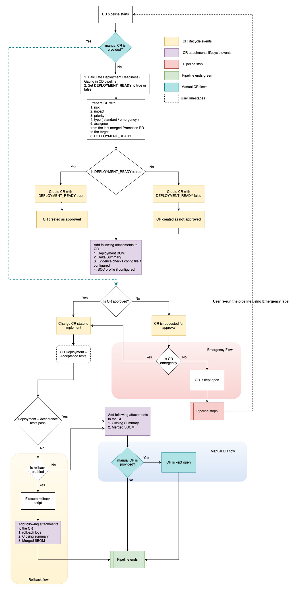
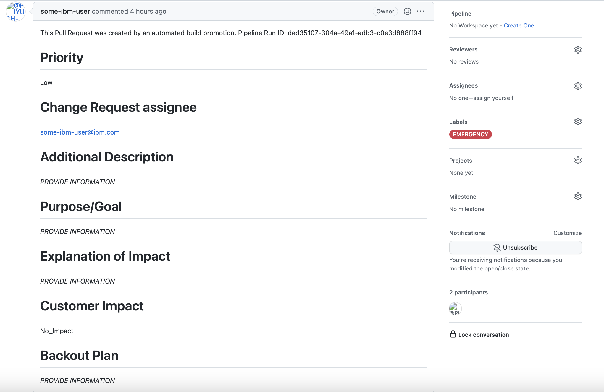

---

copyright: 
  years: 2021, 2026
lastupdated: "2026-06-09"

keywords: DevSecOps, automate change management, change management, ibm cloud

subcollection: devsecops

---

{{site.data.keyword.attribute-definition-list}}

# Automating change management
{: #cd-devsecops-automate-changemgmt}

Change management automation is an important part of the DevSecOps pipeline reference implementation. Developers, approvers, and auditors can monitor the compliance aspects of deployments. Every deployment must follow an organization's change management policy.
{: shortdesc}

Change management automation can be visualized via the following flowchart. The flowchart illustrates a standard change management automation, emergency change management, a manual change request flow, and the change management automation flow when inline rollback is involved.

{: caption="Change management automation" caption-side="bottom"}

## Before you begin
{: #cd-devsecops-change-prereq}

Become familiar with the process and terminology before proceeding. For more information, see [Automated change management](/docs/devsecops?topic=devsecops-cd-devsecops-change-management).

---

## Standard change management flow
{: #cd-devsecops-standard-flow}

The standard change management flow is the default path the CD pipeline follows for every deployment that does not carry an emergency label and is not supplied with a pre-existing manual change request.

### Pre-deployment readiness assessment
{: #cd-devsecops-readiness}

Before a change request is created, the pipeline calculates **Deployment Readiness** and sets the `DEPLOYMENT_READY` flag to `true` or `false`. This flag is derived from evidence collected across the CI and CD stages. If any evidence check indicates a deviation, or a missing or an unsuccessful check, scan, or test related to the deployed set of artifacts, `DEPLOYMENT_READY` is set to `false`.

The change request is prepared with the following fields sourced from the last merged Promotion PR to the target branch:

- `risk`
- `impact`
- `priority`
- `assignee`
- `description`
- `purpose`
- `customer impact`
- `deployment impact`
- `backout plan`

### Change request creation
{: #cd-devsecops-cr-creation}

The prepared change request is submitted in one of two initial states depending on `DEPLOYMENT_READY`:

| `DEPLOYMENT_READY` | Initial CR state | Effect |
|---|---|---|
| `true` | **Approved** | Pipeline proceeds to deployment without waiting for manual approval. |
| `false` | **Not approved** | CR is sent for human review. Deployment is blocked until approval is granted. |

The change management system also automatically approves change requests when the implementation does not cause any downtime (outage duration is zero) and `DEPLOYMENT_READY` is `true`, and deployment risk is within acceptable limits.

If your changes require planned downtime, you must create the change request manually and send it for approval. After it is approved, you can start deployment by providing the change request ID. The pipeline checks its approval state and then runs the deployment. For more information, see [Manually approving change requests](/docs/devsecops?topic=devsecops-cd-devsecops-approve-cr).
{: note}

### Pre-deployment attachments
{: #cd-devsecops-pre-deploy-attachments}

Immediately after the change request is created, the pipeline attaches the following artifacts to the CR record:

- **Deployment BOM** — lists all components included in the deployment
- **Delta Summary** — evidence posture of all the components participating in the deployment
- **Evidence Checks Config File** — attached only if required evidence checks based gating is configured in the pipeline
- **SCC Profile** — attached only if a Security and Compliance Configuration is configured

### Approval gate
{: #cd-devsecops-approval-gate}

If the change request was created as **Not Approved**, it is placed in an unapproved state and sent for human review. No deployment occurs until approval is granted.

You can read the created change request ID from the pipeline logs, wait for approval, and then restart the deployment by using the same change request ID. The pipeline checks the approval state and continues the deployment.
{: tip}

### Deployment and acceptance tests
{: #cd-devsecops-deployment}

With the CR in **Implement** state, the pipeline executes:

- **CD Deployment** — promotes code to the target environment
- **Acceptance Tests** — validates the deployment outcome

This two are user-driven run-stages.

### Post-deployment CR closure
{: #cd-devsecops-post-deploy}

When deployment and acceptance tests pass, the pipeline attaches closing artifacts and closes the change request:

- **Closing Summary** — a summary of the evidences for all the inventory entries at the target commit level.
- **Merged SBOM** — the post-deployment software bill of materials across all the components in the inventory.

The CR is then closed with a `close_category` based on `DEPLOYMENT_READY` at closure time:

| `DEPLOYMENT_READY` | `close_category` |
|---|---|
| `true` | `successful` |
| `false` | `successful with issues` |

#### Manual CR flow

If a manual CR was provided at pipeline start, it is kept open after the post-deployment attachments are added.

---

## Creating change requests for deployments
{: #cd-devsecops-change-fields}
{: step}

Use the pull request template provided in the inventory for promotion pull requests to populate the change request fields. Because these fields cannot be automatically populated, you must populate them manually to promote changes. By doing so, you trigger the deployment and continue automatic data collection for the rest of the change request.

{: caption="Promotion pull request" caption-side="bottom"}

The promotion pull request template contains the following fields:

- **Priority** Required. The priority of the change. Valid values are: `critical`, `high`, `moderate`, `low`, and `planning`.
- **Change Request assignee** Required. The email address of the person the change request is assigned to.
- **Additional Description** Describes the change process. Extra content from the automation is appended here.
- **Purpose/Goal** Describes the purpose of the change.
- **Explanation of Impact** Describes the possible impact of the change.
- **Customer Impact** Required. Describes the impact for the customer. Valid values are: `critical`, `high`, `moderate`, `low`, `no_impact`.
- **Deployment Impact** Required. Describes the impact upon deployment. Valid values are: `small`, `large`.
- **Backout Plan** Describes the rollback or backout plan.

You must also set two additional fields from the environment properties:

- `target-environment-purpose` (Required) Valid values are: `production`, `pre_prod`. Any non-production deployment qualifies as `pre_prod`.
- `target-environment-detail` (Required) A string describing the `target-environment` where the change is deployed.

For more information on change request data, see [Data included in change requests](/docs/devsecops?topic=devsecops-cd-devsecops-cr-data).

### Types of change
{: #cd-devsecops-change-type}

Change Request Management supports two types of change: **emergency** or **regular**.

If the current change is an emergency change, add the `emergency` label to the promotion pull request.

There is no emergency flow on the CI pipeline side. However, setting the CI pipeline/trigger property `skip-inventory-update-on-failure` to an empty value or `0` allows the inventory repository to be updated even if issues are detected in the CI pipeline run. With this updated inventory, an emergency change can be activated.
{: note}

---

## Responding to a Critical Incident Event (CIE)
{: #cd-devsecops-cie-response}

A Critical Incident Event (CIE) represents a service outage or severe degradation requiring immediate action. This is distinct from a routine security fix or bug fix — a CIE is declared when restoring service takes priority over all other concerns, including the standard evidence gating and approval process.

Once a CIE is declared and the scope of the incident is understood, there are two supported recovery paths. The choice between them depends on whether a known-good configuration is available to revert to, or whether a new fix must be built and deployed forward.

### Choosing a recovery path
{: #cd-devsecops-cie-path}

**Path 1: Full rollback using the dedicated rollback listener**

If a last-known-good configuration exists — that is, a previously deployed state that is confirmed stable — the fastest path to service restoration is a full rollback. This uses a dedicated rollback listener that is purpose-built for this scenario and does not require a new build or promotion.

For step-by-step instructions and the parameters to configure, see [Full rollback using the dedicated rollback listener](/docs/devsecops?topic=devsecops-cd-devsecops-cd-pipeline-overview#cd-devsecops-full-rollback).

**Path 2: Fix-forward as an emergency change**

If no viable rollback target exists, or if the investigation has already produced a patch, the fix can be deployed as an emergency change. This path short-circuits the standard evidence gating logic: the pipeline allows the change to be implemented immediately, and the change request is subject to retroactive review and approval after the incident is resolved.

Using this path means accepting that the code deployed to production may still contain unresolved vulnerabilities or open evidence gaps. Service restoration is treated as the higher priority, and outstanding compliance items must be addressed after the incident is closed.
{: important}

These two paths are not mutually exclusive. In practice, teams may initiate a full rollback first to restore service immediately, and then follow up with a fix-forward once the patch is ready and validated. The sequencing is left to the operator's judgement based on the situation at hand.
{: tip}

### Fix-forward procedure
{: #cd-devsecops-cie-fix-forward}

To deploy a fix as an emergency change during a CIE, follow these steps:

1. **Rebuild the affected component.** Run the CI pipeline to build a new artifact version containing the fix. If CI evidence checks are failing due to incident conditions, set the pipeline or trigger property `skip-inventory-update-on-failure` to an empty value or `0` to allow the inventory to be updated despite the failures, so that the emergency change can proceed.

2. **Promote the fix through environments.** Create promotion pull requests starting from the lowest environment and promote upward toward production. If time permits, verify the fix at each stage before promoting further. If the situation is critical, promote directly to production and reconcile lower environments after service is restored.

3. **Apply the emergency label.** On the promotion pull request targeting production, add the `emergency` label. This signals to the pipeline that standard evidence gating should be bypassed and the change should be treated as an emergency deployment.

4. **Deploy to production.** Run the CD pipeline. The pipeline detects the emergency label, skips the approval wait, and proceeds immediately to deployment and acceptance tests. The change request is created and closed with `close_category = successful with issues`, reflecting that the change was deployed under emergency conditions.

5. **Reconcile lower environments.** After the production incident is resolved, deploy the same emergency fix artifact to lower environments — staging, pre-production, and so on — so that all environments are in a consistent state with production. If lower environments were verified before promoting to production, confirm that the same artifact version is in place across all tiers.

### Post-CIE obligations
{: #cd-devsecops-cie-post}

An emergency deployment incurs compliance obligations that must be addressed after the incident is closed:

- The change request must be retroactively reviewed and approved by the appropriate approvers.
- Any evidence gaps accepted during the emergency — unresolved vulnerabilities, incomplete scans, or failed checks — must be remediated and the pipeline re-run under standard conditions.
- A root cause analysis (RCA) should be conducted and documented.

The change request record, including the Delta Summary, Closing Summary, and Merged SBOM attached by the pipeline, serves as the primary audit trail for the post-CIE review.

---

## Emergency change request flow
{: #cd-devsecops-emergency-flow}

The emergency change request flow provides an expedited deployment path when a change cannot wait for the standard approval cycle. It is activated when a CR is in a not-approved state at the approval gate and the user runs the pipeline with the **Emergency label** attached to the promotion pull request.

### Invoking the emergency flow
{: #cd-devsecops-ecr-invoke}

The emergency flow is user-initiated:

1. The user runs the pipeline with the `emergency` label applied to the promotion pull request.
2. The pipeline detects the emergency designation and deployment and acceptance tests proceed immediately without waiting for standard approval.
3. The CR is closed with the closing notes as `successful with issues`.

If the current change is an emergency change, add the `emergency` label to the promotion pull request before running the pipeline.
{: important}

### Post-emergency deployment
{: #cd-devsecops-ecr-post}

Once the emergency flow completes deployment and tests, it rejoins the standard flow at the post-deployment stage:

- Closing Summary and Merged SBOM are attached to the CR.
- The CR is closed following the same `DEPLOYMENT_READY`-based `close_category` logic as the standard flow.

If the CR type is `emergency`, the change request must be retroactively reviewed and approved after deployment.
{: important}

---

## Inline-Rollback flow
{: #cd-devsecops-inline-rollback-flow}

The inline-rollback flow is a recovery sub-flow triggered when deployment or acceptance tests fail during the standard change management flow.

### Triggering condition
{: #cd-devsecops-inline-rollback-triggering}

The inline-rollback flow is entered when deployment or acceptance tests do not pass. The pipeline then evaluates whether inline-rollback is enabled:

- **Inline-Rollback not enabled**: The CR is left open with `close_category = unsuccessful` and the pipeline exits. No automatic recovery is attempted.
- **Rollback enabled**: The rollback script is executed to revert the target environment, and rollback artifacts are gathered and attached to the CR.

### Inline Rollback execution
{: #cd-devsecops-inline-rollback-exec}

When inline-rollback is enabled, the pipeline:

1. Executes the inline-rollback script if deployment or acceptance test has failed in the CD pipeline.
2. Collects the following artifacts:
   - **Rollback Logs** — output from the rollback script execution
   - **Closing Summary** — reflects the rollback outcome
   - **Merged SBOM** — post-rollback software bill of materials
3. Attaches all three artifacts to the open CR record.

### CR closure after rollback
{: #cd-devsecops-inline-rollback-closure}

After inline-rollback and artifact attachment, the CR is left open with `close_category = unsuccessful`. This signals to change management that the deployment was attempted, failed, and was automatically reverted.

A CR with `close_category = unsuccessful` is the expected and correct outcome when a deployment is reversed - not an indication of a process failure. Operations teams should use the attached rollback logs to investigate root cause.
{: note}

---

## Running deployments by using an existing change request ID
{: #cd-devsecops-cr-existing}
{: step}

### Running pipeline with a pre-approved change request
{: #cd-devsecops-cr-preapproved}

You can use a pre-approved change request (CR) for deployment. Two scenarios are possible:

**When the CD pipeline recognizes the CR as created by an earlier CD pipeline run**, it fast-paths the deployment by:
- Reusing the precomputed delta and evidence summary from the CR evidence.
- Skipping peer review and signature verification steps.
- Deploying the pre-computed delta.

**When the CD pipeline cannot determine whether the CR was created by an earlier CD pipeline run**, or the provided CR does not match the deployment target of the current run:
- It does not reuse any precomputed delta or evidence summaries.
- It does not skip peer-review or artifact signature verification.
- It recomputes delta and summary from scratch.
- It does not create a new CR, since one was already supplied.

### Rerunning pipeline against a failed deployment
{: #cd-devsecops-cr-rerun}

If you do not want to use automated change management, you can provide a previously created and approved change request instead. Rerun failed deployments in the following scenarios:

- The latest automatically created change request is not ready for deployment and was not auto-approved. You received approval and must restart deployment using the same change request.
- The deployment requires downtime. You created the change request, it was approved, and you followed your organization's Change Management Policy.
- No code or configuration changed. You created the change request, explained what changed, received approval, and started a deployment using the approved change request.

The change request (CR) remains open after the CD pipeline completes.
{: note}

You can start the DevSecOps reference continuous deployment pipeline by using a pre-approved change request and entering the change request ID for the **change-request-id** property.

{: caption="Pre-approved change request" caption-side="bottom"}

If the **change-request-id** property is set, the pipeline skips data collection for the change request and moves ahead to check the approval state. If **change-request-id** is set to `notAvailable` by default, a change request is automatically created by the pipeline.

---

## Flow comparison
{: #cd-devsecops-flow-comparison}

The following table summarizes the key characteristics of each change management flow:

| Characteristic | Standard Flow | Inline-Rollback Flow | Emergency Flow |
|---|---|---|---|
| **Trigger** | Every standard CD pipeline run | Deployment or acceptance test failure | User re-run with Emergency label |
| **Approval required?** | Yes, if `DEPLOYMENT_READY=false` | N/A — no new deployment | No — bypasses approval wait |
| **Deployment occurs?** | Yes | Attempted, then reversed | Yes — immediately |
| **Rollback script used?** | No | Yes, if enabled | No |
| **CR outcome** | `successful` or `successful with issues` | `unsuccessful` (CR left open) | `successful` or `successful with issues` |
| **Post-deploy attachments** | Closing Summary, Merged SBOM | Rollback Logs, Closing Summary, Merged SBOM | Closing Summary, Merged SBOM |
| **Pipeline end state** | Ends green | Exits (CR open, unsuccessful) | Ends green |
