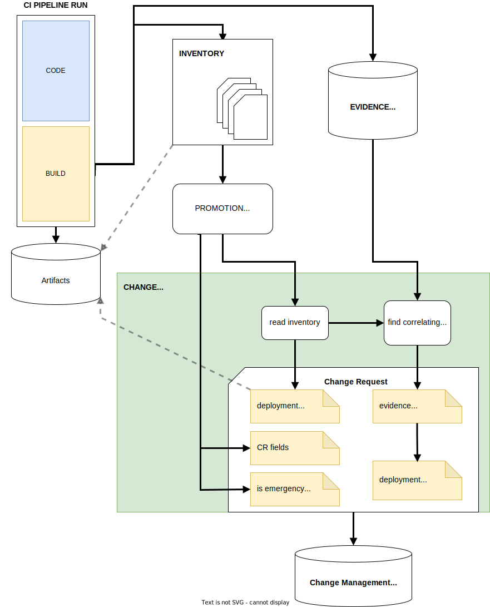
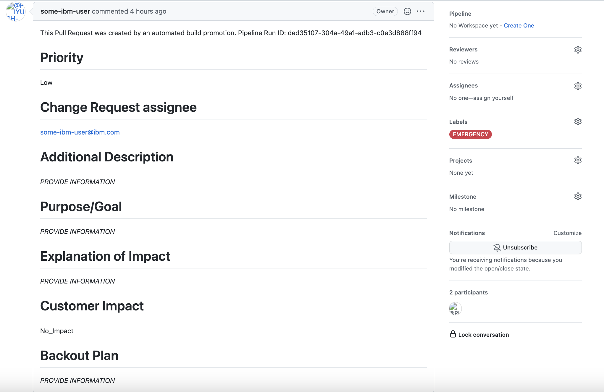

---

copyright:
  years: 2021, 2022
lastupdated: "2022-04-08"

keywords: DevSecOps, automate change management, change management, ibm cloud

subcollection: devsecops

---

{{site.data.keyword.attribute-definition-list}}

# Automating change management
{: #cd-devsecops-automate-changemgmt}

Change management automation is one of the crucial parts of the DevSecOps pipeline reference implementation. With {{site.data.keyword.contdelivery_full}}, developers, approvers, and auditors can monitor the compliance aspects of deployments. Every deployment must follow an organization's change management policy.
{: shortdesc}

The pipelines collect [evidence](/docs/devsecops?topic=devsecops-cd-devsecops-evidence) from every part of the build and deployment lifecycle. Every piece of evidence correlates to a certain build and deployment of the artifacts. So, for each deployed artifact, we should be able to tell, if its build or test deployment had incidents or not. This correlation is implemented through the [inventory model](/docs/devsecops?topic=devsecops-cd-devsecops-inventory).

In this document, you can find answers to the following questions regarding change management automation:

* How are evidence, inventory, and change management connected?
* What are the change request fields in a promotion pull request?
* How does automatic change request approval happen?
* What is deployment readiness?
* What data is included in a change request?
* How can I use an existing change request ID in the CD pipeline?
* What is the change management command order?

## Connection between evidence, inventory, and change management
{: #connection-evidence-inventory-change}

Figure 1 shows the data flow and connection between evidence, inventory, and change management.

{: caption="Figure 1. Connection between evidence, inventory, and change management" caption-side="bottom"}

1. CI runs build artifacts and leave evidence behind about what happened during the creation of those artifacts.
2. CI runs create entries about the created artifacts in the inventory.
3. Built artifacts in the Inventory are [promoted](/docs/devsecops?topic=devsecops-cd-devsecops-inventory) to deployment environments, like staging or pre-production.
4. Change management automation uses data from the inventory, the evidence locker, and the promotion PR to create the change request deployments, also leaving evidence behind about acceptance tests for example. Successfully deployed and tested artifacts are further promoted to production environments, like production.

Every deployment to every environment and region needs to file a change request to the Change Management System. Change management automation helps you to create these change requests based on all the evidence and information that is collected from the pipelines.

For more information, see [Automating change management](/docs/devsecops?topic=devsecops-cd-devsecops-automate-changemgmt).

## Change the request fields in promotion pull requests
{: #cd-devsecops-change-fields}

You can use the pull request template that is provided in the inventory for promotion pull requests to populate the change request fields. Because you cannot automatically populate these fields, you must manually populate them to promote changes. By manually populating these fields, you trigger the deployment and continue automatic data collection for the rest of the change request.

 {: caption="Figure 2. Promotion pull request" caption-side="bottom"}
 
The promotion pull request template contains the following fields:

* **Priority**: Required. The priority of the change. Valid values are: `critical`, `high`, `moderate`, `low`, `planning`.
* **Change Request assignee**: Required. The email address of the person that the change request is assigned to.
* **Additional Description**: Explains the change process. Extra content from the automation process is appended here.
* **Purpose/Goal**: Explains the purpose of the change.
* **Explanation of Impact**: Describes the possible impact of the change.
* **Backout Plan**: Explains a rollback or backout plan.

### Types of change
{: #cd-devsecops-change-type}

Change Request Management supports two types of change: Emergency or Regular.

If the current change is an Emergency change, add the Emergency label to the promotion pull request.

## Automatic change request approval and deployment readiness
{: #cd-devsecops-cr-approve}

The continuous delivery pipeline automatically approves change requests based on the following conditions:

* Implementing the change does not cause any downtime (outage duration is zero).
* Deployment Readiness is true.

The Change Management automation in the DevSecOps reference implementation assumes that all changes are implemented without planned downtime. If your changes require planned downtime, you must create the change request manually and send it for approval. After it is approved, you can start deployment by providing the change request ID. The pipeline moves ahead to check its approval, and then runs the deployment. For more information, see [Manually approving change requests](/docs/devsecops?topic=devsecops-cd-devsecops-approve-cr).

Deployment Readiness is calculated from the evidence that is collected in the continuous integration and continuous delivery stages. If any of the collected evidence suggests a deviation, or a non-successful check, scan, or test that is related to the deployed set of artifacts, the Deployment Readiness is set to false, and the Change Request is not auto-approved. The deployment stops, and prevents further steps until the change request is approved.

You can read the created change request ID from the pipeline logs, wait for approval, and then start the deployment again by using the same change request ID. The pipeline moves ahead to check its approval, and then continues the deployment.

If the change is a type of Emergency, the change request must be retroactively reviewed and approved.

## Data included in change requests
{: #cd-devsecops-cr-data}

The reference implementation standardizes how a change request is populated in the following sections:

* Description & Plan
* Change Tasks
* Rollback

The change request is populated with content to simplify a compliance audit. It points to the key evidence that is generated by the continuous integration and continuous delivery process. It discloses the minimum set of information that is required; more details can be retrieved from durable storage when needed. For example, the change request contains references to scan logs, but not the actual logs. It also contains the reference to the build BOM, but not the build BOM itself. 
{: important}

### Description and plan section
{: #cd-devsecops-cr-desc}

The content of the Description and Plan section is organized in the following way:

* **CI INVENTORY COMMIT URL**: The pointer to the git commit ID that represents your continuous integration inventory. The continuous integration inventory contains information about the code level to be deployed and the artifacts with their signature and checksums to be deployed with this change request.
    
* **CHANGE LOG**: The list of all of the commit IDs and the description that is included in the code level to be deployed.

   ```text
   Git changelog for mymicroservice:
   
   Git changelog of artifact '"uk.icr.io/mycontainerregistrynamespace/   mymicroservice:devsecops-pipeline4@sha256:733e74a13ad26d77a741204bcdc9c5f8f77023b26620ddaa7842d29b600014a0"'  
   
   COMMITS:
   94de4256c346c00fee9fd5f7bbfb114ed4da7c81 - implemented myfunction
   ```
   {: screen}

* **PULL REQUESTS**:

   ```text
   mymicroservicerepo: <PR #> - (Merge pull request #15 implemented myfunction)
   ```
   {: screen}

* **TEST AND SCANS RESULTS**: No issues are found if no failures are reported in the evidence summary or the list of failed IDs. For example,: `com.ibm.cloud.image_vulnerability_scan: failed; com.ibm.unit_tests: failed)`, with the abstract of the issues opened so that the approver can view details about what is failing.

### Additional attachments
{: #cd-devsecops-cr-tasks}

The change requests include attachments for the evidence summary, the deployment BOM, and the closing summary.

* EVIDENCE SUMMARY: Contains the key information about test and scan results, and the issues that were created while you were running them. The entries in the evidence summary are a reformatted version of the `summary.json file`.
    
* DEPLOYMENT BOM: A list of all of the artifacts, together with their digital signature or checksum that is transferred into the target environment to successfully run the deployment.

* CLOSING SUMMARY: The summary of all of the evidence that relates to the current deployment when the change request is closed.

### Rollback
{: #cd-devsecops-cr-rollback}

The rollback section provides the following information:

* The version to roll back to.
* The steps to follow in case the rollback includes more than just the deployment of the previous version.

## Using an existing change request ID
{: #cd-devsecops-cr-existing}

In specific scenarios, you do not want to use automated change management, and can provide a previously created and approved change request instead.

* The latest automatically created change request is not ready for deployment and the change request was not auto-approved. You obtained approval for the change request and must start deployment again by using the change request again.
* The deployment requires downtime. You created the change request, it was approved, and you followed the required steps in your organization's Change Management Policy.
* No code or configuration changed. You created the change request, explained what changed (if the change was not in your app code), received approval, and started a deployment by using the approved change request.

You can start the DevSecOps reference continuous delivery pipeline by using a pre-approved change request and entering the change request ID for the **change-request-id** property.

 {: caption="Figure 3. Pre-approved change request" caption-side="bottom"}

If the **change-request-id** property is set, the pipeline skips data collection for the change request and moves ahead to check the approval state of the change request. If the **change-request-id** is set to `notAvailable` by default, a change request is automatically created by the continuous delivery pipeline.

## Change management command order
{: #devsecops-change-mgmt-order}

### Create change request
{: #create-change-request}

Everything that changes the baseline must be tracked by using a change request. The changes include, for example, updates to the existing code level, changes to the configuration, and updates of the worker nodes. Collecting peer review compliance data is based on the data that is accessible in the inventory, the evidence locker, and the incident issue repository.

Finally, this step creates the change request that is based on the Promotion PR fields, and attaches available compliance data. Deployment readiness is calculated by the collected compliance status, based on the available evidence.

### Request for approval
{: #change-mgmt-request-approval}

If the created change request deployment state is not ready, this step requests it for approval.

### Check for approval
{: #change-mgmt-check-approval}

If every compliance check (for example, unit test, CRA tasks, branch protection, detect secrets) is successful, the change request is approved automatically, and the task runs successfully.

If a compliance check fails, the change request state is not approved.

You can approve the change request manually and add the change-request-id to the environment properties to use the already created change request in the next run.

Another solution is using the **emergency** label in the promotion pull requests. For more information, see [Add emergency label](/docs/devsecops?topic=devsecops-cd-devsecops-approve-cr).

### Set to implement
{: #change-mgmt-set-implement}

This step sets the status of the change request to `implement` depending on the `success` or `failure` status of the change.

### Close change request
{: #change-mgmt-request-close}

Details about the deployment are uploaded to the closing summary change task, and the change request is closed. In the close change request task, the close_category is added with these values:

* successful
* successful with issues (if the summary has issues)

