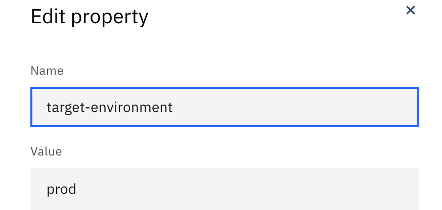

---

copyright:
  years: 2021, 2024
lastupdated: "2024-12-12"

keywords: DevSecOps, IBM Cloud, deployment delta

subcollection: devsecops

---

{{site.data.keyword.attribute-definition-list}}

# Continuous deployment pipeline
{: #cd-devsecops-cd-pipeline}

The continuous deployment pipeline generates all of the evidence and change request summary content. The pipeline deploys the build artifacts to an environment, such as staging or production, and then collects, creates, and uploads all existing log files, evidence, and artifacts to the evidence locker.
{: shortdesc}

## Stages and tasks
{: #cd-devsecops-pipeline-stages}

The table below lists the tasks run in a CD Pipeline. In addition the table also provides an overview of each of these stages:

- **Task or Stage**: This refers to the name of the stage as defined within the `.pipeline-config.yaml` configuration file.

- **Short description**: This provides a concise explanation of the actions performed during the execution of the stage.

- **Customisation permissible**: This indicates whether users have the flexibility to modify or replace the default behavior of the stage by inserting a custom script in the `.pipeline-config.yaml` file.

- **Default Reference Implementation**: This indicates whether the DevSecOps pipelines come with a pre-defined or default implementation for the stage. Notably, for certain stages like `unit-tests` or `setup`, the DevSecOps pipeline doesn't offer any out-of-the-box implementation. Instead, users are required to provide custom scripts or code tailored to their application's requirements.

- **Evidence Collection**: This indicates whether the stage performs the collection of standard evidence. When DevSecOps **Pipeline** provide a reference implementation for a stage, evidence collection is performed out-of-the-box. However, if **User** choose to modify or replace these predefined stages, they must ensure that their custom implementations include appropriate evidence collection. The same responsibility falls on users for stages where the DevSecOps pipeline doesn't provide an out-of-the-box implementation, necessitating them to perform evidence collection. The column indicates the entity (**User/Pipeline**) responsible for carrying out the evidence collection.

- **Skip permissible (applicable to version >= v10)**: This indicates whether users can opt out of running this stage by setting the skip property to true in the `.pipeline-config.yaml`. However, caution is advised when using this feature, especially for stages designed to collect evidence. Skipping such stages might lead to missing essential evidences for the build.

|Task or stage |Short description	|Customisation permissible in `.pipeline-config.yaml` | Default Reference Implementation |Evidence Collection |Skip permissible |
|:----------|:------------------------------|:------------------|:------------------|:------------------|:------------------|
|`start` 		|Set up the pipeline environment. 		|No		| Yes | NA | No |
|`setup`		|Set up your build and test environment.		|Yes			| No | NA | No |
|`verify-peer-review`		|Ensure that the pull requests intended for the current deployment have been approved. This stage will generate a list of pull requests linked to the ongoing deployment. If any pull requests remain unapproved, the deployment will be halted.	|Yes			| Yes | Pipeline | Yes |
|`verify-artifact`		|Validate the correct signing of the image scheduled for deployment. If the image lacks proper signature, the deployment will be obstructed, and the corresponding evidence collection process will be initiated.		|Yes			| Yes | Pipeline | Yes |
|`change-request`		|Generate the change request and create the evidence summary. 		|No		| Yes | Pipeline | No |
|`deployment`		|Deploy the build artifacts to the environment, such as staging or production.		|Yes		| No | NA | No |
|`acceptance-test` 		|Run acceptance and integration tests on the deployment.   	|Yes			| No | **User** | Yes |
|`finish` 		|Collect and upload log files, artifact, and evidence to the evidence locker. 		|Yes			| Yes | Pipeline | Yes |
|`rollback` |This is a step inside `prod-finish`, which gets executed whenever a rollback scenario is encountered | Yes | Yes | NA | No |
{: caption="Pipeline stages and tasks" caption-side="top"}

For more information about how to customize stages by using the `.pipeline-config.yaml` file, see [Custom scripts](/docs/devsecops?topic=devsecops-cd-devsecops-pipelines-custom-customize) and [Pipeline parameters](/docs/devsecops?topic=devsecops-cd-devsecops-pipeline-parm) lists.

## Deployment delta
{: #cd-devsecops-pipeline-delta}

When the inventory promotion is ready, the continuous deployment pipeline can start. The deployment delta is the difference between the contents of the last concluded deployment and the current deployment. The deployment delta lists the inventory items that are being deployed.

To access the deployment delta in your deployment scripts, you can use the following commands:

```bash
# return a JSON file path with an array of inventory entries that were changed
get_env DEPLOYMENT_DELTA_PATH

# return a JSON file path with an array of inventory entries that were deleted
get_env DEPLOYMENT_DELTA_DELETIONS_PATH

# returns a JSON file path with an array of all inventory entries
get_env INVENTORY_ENTRIES_PATH

```

## Calculate deployment BOM
{: #cd-devsecops-pipeline-bom}

The deployment Bill of Material (BOM) represents all of the artifacts that are deployed as part of a single change request. After the deployment delta is calculated, the pipeline creates the deployment BOM based on these items.

## Collect evidence summary
{: #cd-devsecops-pipeline-collect}

An evidence summary is created from all of the evidence that was created during the relevant build that led to a deployment. Evidence that is created during the deployment itself is also added to the summary. The evidence summary is added to the change request's description.
By default, the evidence summary comprises build-time evidence gathered in the CI pipeline along with evidences gathered during the current CD pipeline execution.

The following instructions apply exclusively to CD Pipelines targeting production environments. Use the target-environment-purpose flag to determine whether the environment is designated as either `pre_prod` or `production`.
{: important}


**Prerequisite**: In the CD pipeline targeting the pre_prod environment, set the pre-prod-evidence-collection flag to 1. This enables the collection and storage of build-time evidence in the evidence locker for all the assets deployed by the CD Pipeline, performing deployment on the pre-prod environment. By default, for environments designated as pre_prod, the pre-prod-evidence-collection flag is set to 1.

In the CD pipeline targeting the production environment, set the pre-`prod-evidence-collection` flag to `1`. This enables the CD Pipeline targeting the production environment to retrieve evidence gathered during the deployment to the pre-prod environment. By default, for environments designated as production, the `pre-prod-evidence-collection` flag is set to `0`.

Once the `pre-prod-evidence-collection` flag is set to `1`, Change Requests generated by the CD Pipeline targeted at production environment will include references to the Change Request IDs from pre-production environments within the **Validation Record** field.

For more information, see [Evidence summary](/docs/devsecops?topic=devsecops-devsecops-evidence-summary#evidence-v2-summary).

## Prepare and create change request
{: #cd-devsecops-pipeline-prepcr}

Everything that changes the [baseline](/docs/devsecops?topic=devsecops-cd-devsecops-inventory) must be traced by way of a change request. These changes include updates to the existing code level, changes to the configuration, and updates of the worker nodes. Collection of [peer review compliance](/docs/devsecops?topic=devsecops-cd-devsecops-peer-review) data is based on the data that is accessible in the inventory, the evidence locker, and the incident issue repo.

Use`get_env CHANGE_REQUEST_ID` to leverage the value of Change Request ID in the subsequent stages.

 Do not change the value of the variable that uses `set_env` as this is intended for internal implementation only.
 {: important}

This step creates the change request by attaching the available compliance data based on the [promotion pull request](/docs/devsecops?topic=devsecops-cd-devsecops-promotion-pipeline#cd-devsecops-promotion-pipelinepr) fields. [Deployment readiness](/docs/devsecops?topic=devsecops-cd-devsecops-automate-changemgmt#cd-devsecops-cr-approve) is calculated based on the available evidence in the collected compliance status.

If the pre-prod evidences are captured in the production deployment, pre-prod change requests are linked to the production change request. For more information, see [Data included in change requests](/docs/devsecops?topic=devsecops-cd-devsecops-cr-data).

## Check change request approval
{: #cd-devsecops-pipeline-checkcr}

If every compliance check is successful, such as unit tests, Code Risk Analyzer tasks, branch protection, and detect secrets, the change request is approved automatically and the task runs successfully. For more information, see [Automating change management](/docs/devsecops?topic=devsecops-cd-devsecops-automate-changemgmt).

If a compliance check fails, the change request state is not approved. You can [approve the change request manually](/docs/devsecops?topic=devsecops-cd-devsecops-approve-cr) and add the `change-request-id` to the environment properties to use the previously created change request in the next run. You can also approve the change request manually and add an emergency label.

## Deployment
{: #cd-devsecops-pipeline-deployment}

In the deployment stage, the pipeline deploys the built artifacts into an environment, such as staging or prod. The variables and credentials for these stages can be found in the following sources:

* Variables from the pipeline UI (`get_env`)

 {: caption="Edit property" caption-side="bottom"}

* [Pipeline trigger webhook](/docs/devsecops?topic=devsecops-cd-devsecops-webhook-payloads)

For more information about how to access these variables, see [Custom scripts](/docs/devsecops?topic=devsecops-cd-devsecops-pipelines-custom-customize).

## Acceptance test
{: #cd-devsecops-pipeline-acctest}

You can run a set of automated tests to validate that the deployment was successful and is working as expected. For traceability purposes, make sure that the test log contains a reference to the code level or image that is being tested.

## Change request close
{: #cd-devsecops-pipeline-closecr}

The details for the deployment are uploaded to the closing summary change task and then the task closes the change request. The `close_category` is added to the close change request task, with the following values:

* Successful (if was deployed ready, and CD deployment succeeded)
* Successful with issues (if the summary has issues, it was not deploy ready and CD deployment happened with emergency)

## Inventory conclude
{: #cd-devsecops-pipeline-inventory}

For more information about inventory conclude, see [Inventory](/docs/devsecops?topic=devsecops-cd-devsecops-inventory).

## Inline Rollback
{: #cd-devsecops-inline-rollback}

To run Inline rollback successfully, ensure that the `rollback-enabled` environment property is set to `1` and there is a **failure** in the Deployment or Acceptance test. If a rollback scenario is detected, CD Pipeline runs the segment that is defined against `rollback` inside the `.pipeline-config.yaml` provided by the user. If a `rollback` segment is not inside the `.pipeline-config.yaml` file from the user, a default implementation is provided which prompts the user to supply a rollback script before converting this step to amber state.

### Properties that get set in the inline rollback scenario
{: #cd-devsecops-inline-rollback-properties}

- `rollback-status` says the status of the rollback step execution. Possible values `[notRun, success, failure]`
- `rollback-exit-code` is the exit code of the rollback step. This is kept empty if rollback wasn't even run.
- `default-rollback-executed` is run when the property is set to `true` if the default implementation that prompts user to supply a rollback script. The value of this property is set to empty by default.
- `pipeline-execution-status` sets the status of the overall pipeline run. Possible values `[successful_deployment, failed_deployment_failed_rollback, failed_deployment_successful_rollback]`
