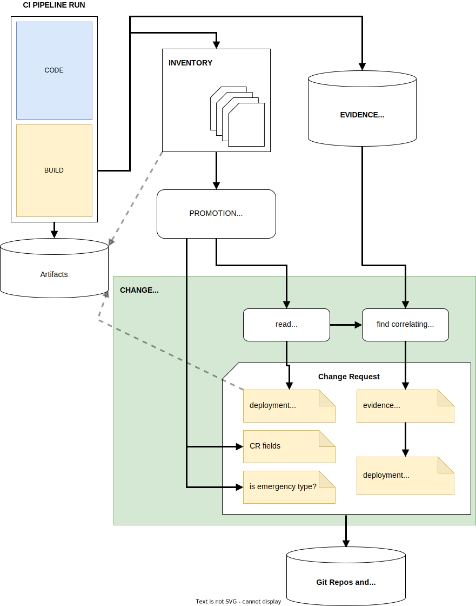

---

copyright:
  years: 2021, 2022
lastupdated: "2022-03-01"

keywords: DevSecOps

subcollection: devsecops

---

{:shortdesc: .shortdesc}
{:table: .aria-labeledby="caption"}
{:external: target="_blank" .external}
{:codeblock: .codeblock}
{:pre: .pre}
{:screen: .screen}
{:tip: .tip}
{:note: .note}
{:important: .important}
{:download: .download}
{:help: data-hd-content-type='help'}
{:support: data-reuse='support'}

# Automated change management
{: #cd-devsecops-change-mgmt}

Change management automation helps developers, approvers, and auditors to monitor the compliance aspects of deployments. Every deployment must follow an organization's change management policy.
{: shortdesc}

The pipelines collect evidence from each part of the build and deployment lifecycle. Because each piece of evidence correlates to a specific build and deployment of the artifacts, you can determine whether the build or test deployment for a deployed artifact contained any incidents. This correlation between evidence and build and deployment artifacts is implemented through the Inventory Model.

## Connection between evidence, inventory, and change management
{: #cd-devsecops-change-connect}

The following diagram shows the data flow and connection between evidence, inventory, and change management.

 {: caption="Data flow" caption-side="bottom"}
 
 1. Continuous integration runs build artifacts and leaves behind evidence about what happened during the creation of those artifacts.

 2. Continuous integration creates entries in the inventory about the artifacts that are created.
 
 3. Built artifacts in the inventory are promoted to deployment environments such as staging or pre-prod.
 
 4. Change management automation uses data from the inventory, the evidence locker, and the promotion pull request to create the change request.

Deployments also leave evidence behind such as acceptance tests. Successfully deployed and tested artifacts are further promoted to production environments, such as `prod`.

Every deployment to every environment and region must file a separate change request to the Change Management repo. Change management automation helps you to create these change requests based on all of the evidence and information that is collected from the pipelines.

For more information, see [Automating change management](/docs/devsecops?topic=devsecops-cd-devsecops-automate-changemgmt).
