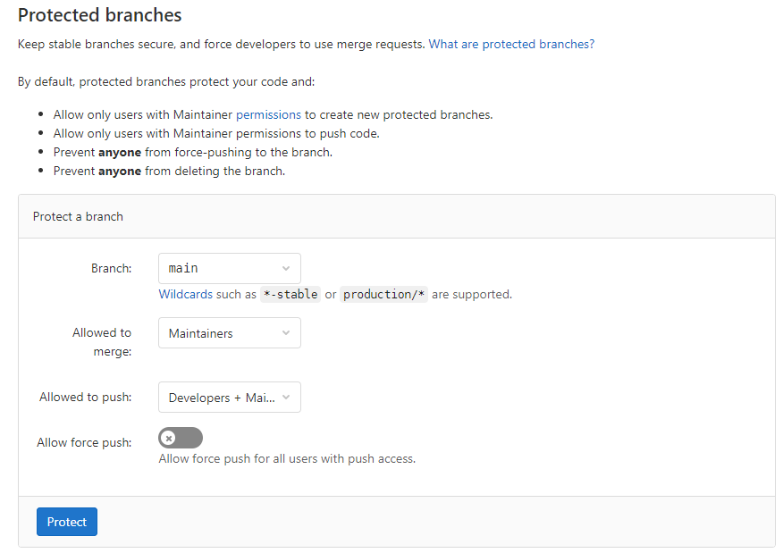

---

copyright: 
  years: 2021, 2023
lastupdated: "2023-02-28"

keywords: DevSecOps

subcollection: devsecops

---

{:shortdesc: .shortdesc}
{:table: .aria-labeledby="caption"}
{:external: target="_blank" .external}
{:codeblock: .codeblock}
{:pre: .pre}
{:screen: .screen}
{:tip: .tip}
{:note: .note}
{:important: .important}
{:download: .download}
{:help: data-hd-content-type='help'}
{:support: data-reuse='support'}

# Configuring your {{site.data.keyword.gitrepos}} repository
{: #cd-devsecops-config-github}

[DevSecOps](/docs/devsecops?topic=devsecops-cd-devsecops-arch) requires you to configure the [branch protection rules](https://us-south.git.cloud.ibm.com/help/user/project/protected_branches) of your {{site.data.keyword.gitrepos}} repository (repo).
{: shortdesc}

Add the required branch protection rules:

1. On the {{site.data.keyword.gitrepos}} repo Settings page, in the **Protected branches** section, select the branch to protect.
1. Select **Maintainers** to specify who is allowed to merge to the selected branch.
1. Select **Developers + Maintainers** to specify who is allowed to push to the selected branch.
1. Toggle **Allow force push** so that this option is unavailable.
1. Click **Protect**.

 {: caption="Figure 1. Branch protection rules" caption-side="bottom"}
