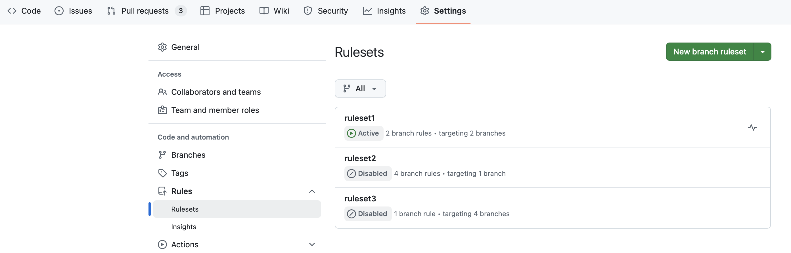
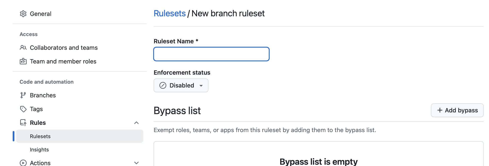
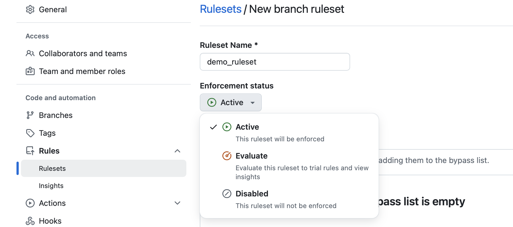
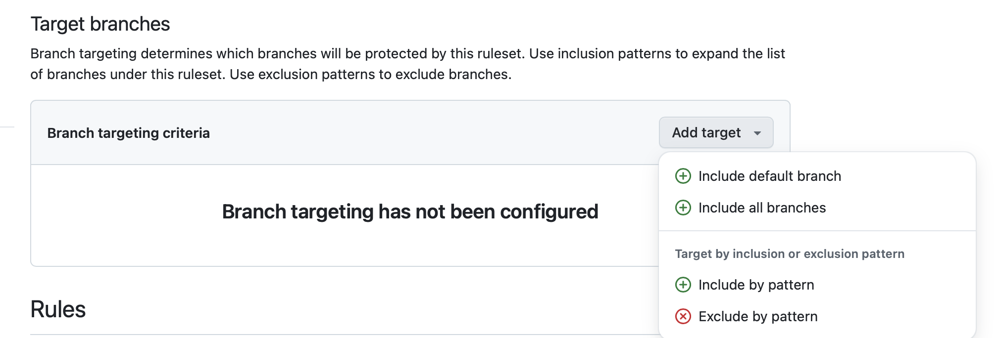
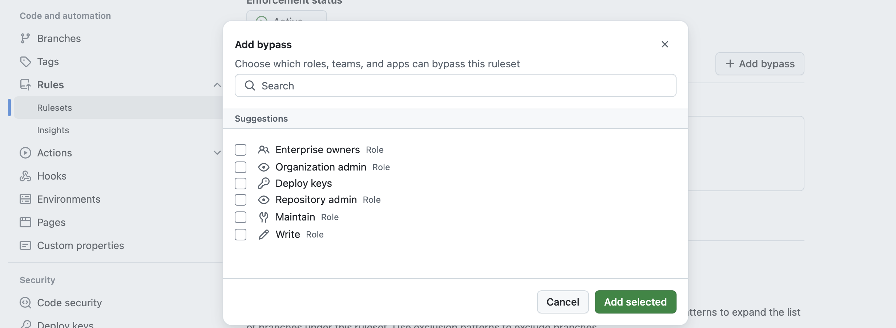
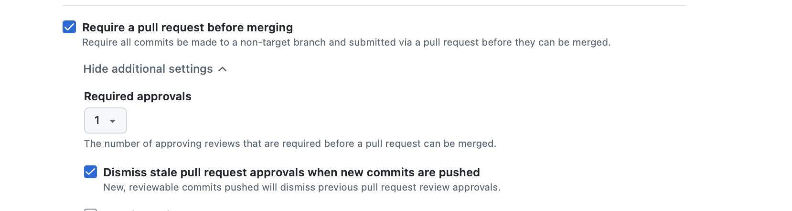
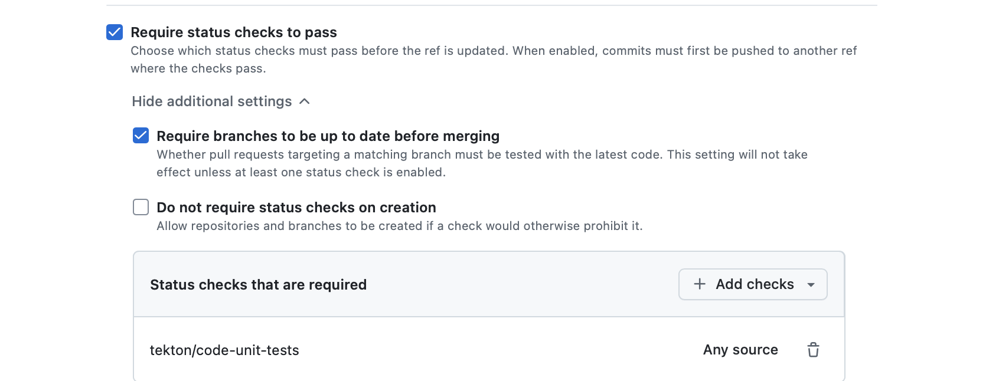
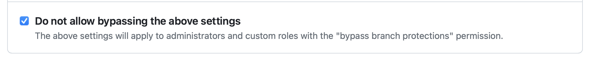
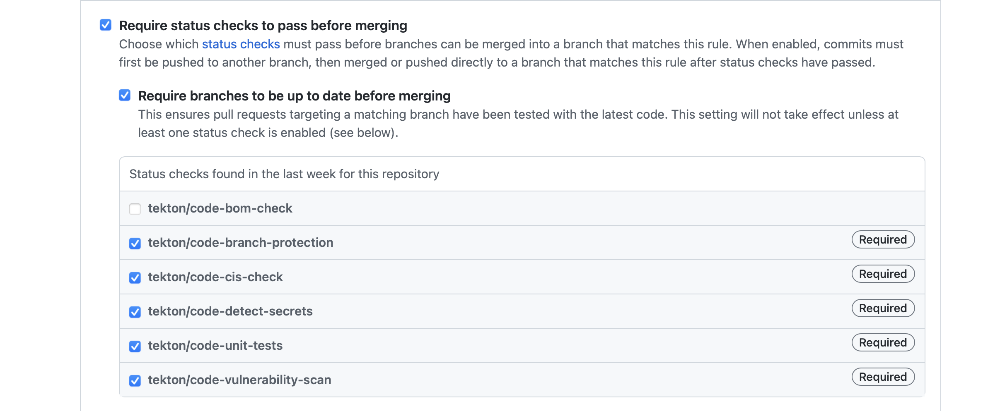

---

copyright:
  years: 2021, 2024
lastupdated: "2024-06-06"

keywords: DevSecOps

subcollection: devsecops

---

{{site.data.keyword.attribute-definition-list}}


# Configuring your GitHub repository
{: #cd-devsecops-config-github}


The {{site.data.keyword.gitrepos}} tool integration is based on Github, which is a web-based hosting service for Git repositories (repos). You can have both local and remote copies of your repos. To learn more, see {{site.data.keyword.gitrepos}}{: external}.
{: shortdesc}

Branch protection policies enforce security, collaboration, and helps ensure that your team adheres to code quality and change management standards. This topic helps you set and manage branch policies. [DevSecOps](/docs/devsecops?topic=devsecops-cd-devsecops-arch) requires you to configure the branch protection rules of your GitHub repository.

GitHub now supports defining **Rulesets for branch protection** - a more granular and flexible mechanism to define protections and policies at repository level. For more information, see [About Rulesets](https://docs.github.com/en/repositories/configuring-branches-and-merges-in-your-repository/managing-rulesets/about-rulesets){: external}


## Benefits of Branch Protection
{: #devsecops-config-github-protection}

- **Improved Code Quality and Collaboration**: Requiring pull requests and approvals through branch protection enhances code quality and collaboration. This ensures code consistency and adherence to the team's coding standards. Changes undergo review and helps catch bugs and errors early on, resulting in more reliable and maintainable code.

- **Increased Visibility of Changes**: Requiring pull requests provides increased visibility into code changes. This step simplifies tracking modifications and identifying potential issues.

- **Ensuring Code Integrity**: Pull request status-checks validate the code by running automated tests against predefined standards and linters before a pull request can be merged. This step maintains code integrity by catching bugs and other issues early in the development cycle.


## Benefits of Rulesets
{: #devsecops-config-github-ruleset}

- **Granular Targeting**: Apply rules to branches and tags using powerful fnmatch patterns (e.g., release/**, refs/tags/v*)

- **Centralized Management**: Configure and manage all branch and tag protection from a single interface. GitHub UI and [API](https://docs.github.com/en/rest/repos/rules?apiVersion=2022-11-28){: external} provide clear rule associations and enforcement details for better transparency.

- **Higher Flexibility**: Unlike traditional branch protection (which allows only one rule per branch), rulesets enable defining multiple, layered rulesets that can apply to multiple branches using patterns. A single branch can have multiple applicable rulesets, allowing fine-grained control, reusable policies across branches, and better alignment with complex workflows.

## Configuring Rulesets in GitHub
{: #devsecops-config-github-rulesets}

To configure Rulesets in GitHub for your repository, follow these steps:

### Accessing Ruleset Settings
{: #devsecops-config-github-ruleset-settings}

1. Navigate to the **Settings** tab of your repository on GitHub.
2. In the left sidebar,under **Rules** click **Rulesets** to access the Ruleset settings page.
3. Click on the green button **New Branch RuleSet**
5. Add the required information to define the Ruleset and click on **Create**.

{: caption="GitHub repository Ruleset" caption-side="bottom"}

### Adding protection rules in Rulesets
{: #devsecops-config-github-addrulesets}

On clicking the green button **New Branch RuleSet**, a page to fill in the Ruleset details is prompted.

{: caption="Create Ruleset" caption-side="bottom"}

1. Name your RuleSet and Enable/Disable/Evaluate the ruleset by selecting from the **Enablement status** dropdown

{: caption="Name and Enable Ruleset" caption-side="bottom"}

2. Configure the **Target branches** by clicking on **Add target**. Select **Include**,**Exclude**,**Default** or **All** to configure the Branch targeting criteria. GitHub supports **fnmatch** syntax for pattern-based targeting.

{: caption="Select Target branches" caption-side="bottom"}

3. Configure Bypass permissions under **Bypass list** by clicking on **Add bypass**. You can add the required roles who can bypass the checks. You can leave the list empty (this is equivalent to enabling **Do not allow bypassing the above settings** in traditional Branch protection settings).

{: caption="Add bypass actors" caption-side="bottom"}

4. Enable the **Require a pull request before merging** option under **Branch rules**.

5. Enable the **Require approvals** option and set the **Required number of approvals before merging** set to atleast `1` or the number of required approvals in your team.

6. Enable the option **Dismiss stale pull request approvals when new commits are pushed** to review all the latest changes before it can be merged onto another branch.

{: caption="Add Branch Rules" caption-side="bottom"}

### Configuring Status Checks for Ruleset
{: #devsecops-config-github-status}

1. Enable the `Require status checks to pass before merging` option.

In order to be able to set them as required status checks, first you need to trigger a PR/CI pipeline beforehand (only existing status checks are listed on the UI).

After enabling the `Require status checks to pass before merging` option, you need to configure the specific status checks that must pass before merging a pull request.

2. In the list of available status checks, enable the following options for checks:

- `tekton/code-branch-protection`
- `tekton/code-cis-check`
- `tekton/code-detect-secrets`
- `tekton/code-unit-tests`
- `tekton/code-vulnerability-scan`

The above checks are the default expected pull request status checks in pipeline.

{: caption="Status checks" caption-side="bottom"}

### Adding All default Ruleset(Complete Configuration)

This CURL command sets up both the default required status checks and pull request review settings.

``` bash
curl -H "Authorization: Bearer $(cat ${APP_TOKEN_PATH})" "${APP_API_URL}/repos/${APP_REPO_OWNER}/${APP_REPO_NAME}/rulesets" \
    -XPUT -d '{
  "name": "Branch Protection Equivalent Ruleset",
  "target": "branch",
  "enforcement": "active",
  "bypass_actors": [], // as the list is empty no one can bypass which is equivalent to enforce_admins: true with no restriction
  "conditions": {
    "ref_name": {
      "include": ["refs/heads/master"],
      "exclude": []
    }
  },
  "rules": [
    {
      "type": "required_status_checks",
      "parameters": {
        "strict_required_status_checks_policy": true,
        "required_status_checks": [
          {
            "context": "tekton/code-unit-tests"
          },
          {
            "context": "tekton/code-branch-protection"
          },
          {
            "context": "tekton/code-cis-check"
          },
          {
            "context": "tekton/code-vulnerability-scan"
          },
          {
            "context": "tekton/code-detect-secrets"
          }
        ]
      }
    },
    {
      "type": "pull_request",
      "parameters": {
        "required_approving_review_count": 1,
        "dismiss_stale_reviews_on_push": true,
      }
    }
  ]
}'
```

## Configuring Branch Protection Rules in GitHub
{: #devsecops-config-github-rules}

To configure branch protection rules in GitHub for your repository, follow these steps:

### Accessing Branch Protection Settings
{: #devsecops-config-github-settings}

1. Navigate to the **Settings** tab of your repository on GitHub.
2. In the left sidebar, click **Branches** to access the branch settings page.
3. Scroll down to the **Branch protection rules** section.
4. Locate the branch that you want to configure (typically the "main" branch).
5. Select the **Edit** button next to the branch name to modify its protection rules.

{: caption="GitHub repository settings" caption-side="bottom"}

### Adding Branch Protection Rules
{: #devsecops-config-github-addrules}

If no existing rules are set up, click on the **Add rule** button and enter the corresponding branch name in the `**Branch name pattern**` field. Then, proceed with the following steps:

1. Enable the **Require a pull request before merging** option.
2. Enable the **Require approvals** option and set the **Required number of approvals before merging** set to atleast `1` or the number of required approvals in your team.
3. Enable the option **Dismiss stale pull request approvals when new commits are pushed** to review all the latest changes before it can be merged onto another branch.

{: caption="Branch protection rules" caption-side="bottom"}

4. Enable the option **Do not allow bypassing the above settings** to **prevent** administrators and custom roles with the "bypass branch protections" permission to bypass the required branch protection checks.

{: caption="Do not allow bypassing the above settings" caption-side="bottom"}

Currently, warnings are floated in logs if the `Do not allow bypassing the above settings` check is not enabled. It will not fail the branch protection check till the check is made mandatory by mid March. Please enable the check by mid March to prevent failure of pipeline.
{: note}


Pull Requests **must** be approved before merging them into the master branch. This rule ensures that changes undergo review and scrutiny by team members, promotes collaboration, code quality, and adherence to project standards.
{: #note}


### Configuring Status Checks
{: #devsecops-config-github-status}

Status checks are required in DevSecOps to enforce a comprehensive set of quality and security measures on the code. This ensures that code changes are safe and reliable before they are merged into a protected branch. By requiring status checks to pass before merging, you can prevent broken or untested code from being deployed to production.

When a pull request is submitted, the PR/CI pipeline automatically triggers a series of tests, validations, and other checks to verify the proposed changes.

Only when all the required status checks pass successfully will the pull request be considered eligible for merging into the protected branch.

By leveraging status checks within DevSecOps, you can maintain code quality, adhere to coding standards, and ensure the absence of vulnerabilities or critical flaws before incorporating changes into your project's protected branch.

For more information on configuring status checks, refer to the [Configuring Status Checks Only (Status Checks Configuration)](#devsecops-config-github-checks-only) section for a reference implementation.

1. Enable the `Require status checks to pass before merging` option.

In order to be able to set them as required status checks, first you need to trigger a PR/CI pipeline beforehand (only existing status checks are listed on the UI).

After enabling the `Require status checks to pass before merging` option, you need to configure the specific status checks that must pass before merging a pull request.

2. In the list of available status checks, enable the following options for checks:

- `tekton/code-branch-protection`
- `tekton/code-cis-check`
- `tekton/code-detect-secrets`
- `tekton/code-unit-tests`
- `tekton/code-vulnerability-scan`

{: caption="Status checks" caption-side="bottom"}

The status checks shown must pass before merging a pull request.

The above checks are the default expected pull request status checks in pipeline.

#### Setting customized list of compliance checks
{: #devsecops-config-customized-list}

You may also bring in your own list of status checks to be validated against by the pipeline. To achieve this, first set your list of required status checks in the repo, and also set the `branch-protection-rules-path` value setting it's path to a JSON file containing the same list status checks, that is relative to your app repository.

|`branch-protection-rules-path`		|text		|Set the path to a JSON file containing the customized list of the required compliance checks, relative to the integrated app repository.	|Optional			|
{: caption="Customized prefix environment property and its other information" caption-side="bottom"}

The JSON file is of this format

```bash
[{
  "type": "branch-protection",
  "name": "code-review",
  "params": {
    "checks": [
      "tekton/code-branch-protection",
      "tekton/code-unit-tests",
      "tekton/code-cis-check",
      "tekton/code-vulnerability-scan",
      "tekton/code-detect-secrets"
    ]
  }
}]
```

Note :  DevSecOps by default will base the outcome of branch protection checks depending on the results of status checks that have the `tekton/` prefix.

#### Setting Customized Prefix for Compliance Checks
{: #devsecops-config-customized-prefix}

If you wish to change the `tekton` prefix to something else in GitHub, you should set a value for `branch-protection-status-check-prefix` environment property in your pipeline.

|`branch-protection-status-check-prefix`		|text		|The prefix text for branch protection status check (Defaults to `tekton`)	|Optional			|
{: caption="Customized prefix environment property and its other information" caption-side="bottom"}

Once you have configured branch protection settings, any attempt to merge a pull request to the protected branch will be rejected unless the required conditions are met.

### Optional Settings
{: #devsecops-config-github-settings-more}

In addition to the above settings, you have the option to configure the following additional settings for branch protection rules. Please note that the status checks provided by  DevSecOps will not validate or enforce these settings.

- **Require signed commits:** This setting requires that all commits to the protected branch be signed, preventing malicious changes from being made to the code.

- **Require linear history:** This setting requires that all commits to the protected branch have a linear history. This means that any pull requests merged into the protected branch must use a squash merge or a rebase merge. A strictly linear commit history can help teams reverse changes more easily.

These additional settings are optional and can be customized based on your specific requirements and preferences.

## Setting Branch Protection Rules via CURL Command
{: #devsecops-config-github-rules-curl}

### Adding All Branch Protection Rules (Complete Configuration)
{: #devsecops-config-github-add-all-rules}

Branch protection rules could also be set by the following curl command, after replacing the `$GH_TOKEN`, `$OWNER`, `$APP_API_URL` `$REPO`, `$BRANCH` variables.

``` bash
curl -u ":$GH_TOKEN" $APP_API_URL/repos/$OWNER/$REPO/branches/$BRANCH/protection -XPUT -d '{"required_pull_request_reviews":{"dismiss_stale_reviews":true},"required_status_checks":{"strict":true,"contexts":["tekton/code-branch-protection","tekton/code-unit-tests","tekton/code-cis-check","tekton/code-vulnerability-scan","tekton/code-detect-secrets"]},"enforce_admins":null,"restrictions":null}'
```

This CURL command sets up both the required status checks and pull request review settings.

Once these settings have been configured, any attempt to merge a pull request to the `$BRANCH` will be rejected unless the pull request has been approved by at least one other user.

### Configuring Status Checks Only (Status Checks Configuration)
{: #devsecops-config-github-checks-only}

If you only want to configure the required status checks, you can use the following CURL command as a reference:

``` bash
curl -H "Authorization: Bearer $(cat ${APP_TOKEN_PATH})" "${APP_API_URL}/repos/${APP_REPO_OWNER}/${APP_REPO_NAME}/branches/master/protection" \
    -XPUT -d '{"required_pull_request_reviews":{"dismiss_stale_reviews":true},"required_status_checks":{"strict":true,"contexts":["tekton/code-branch-protection","tekton/code-unit-tests","tekton/code-cis-check","tekton/code-vulnerability-scan","tekton/code-detect-secrets"]},"enforce_admins":null,"restrictions":null}'
```

In our reference implementation, we have already provided a sample configuration for the [hello-compliance-app](https://us-south.git.cloud.ibm.com/open-toolchain/hello-compliance-app/-/blob/master/scripts/code_setup.sh?ref_type=heads#L23) repository, so you can use it as a starting point and customize it according to your needs.

Follow the earlier example to ensure code quality and adherence to security measures for your repository. To ensure this happens, configure the necessary branch protection rules and status checks.
