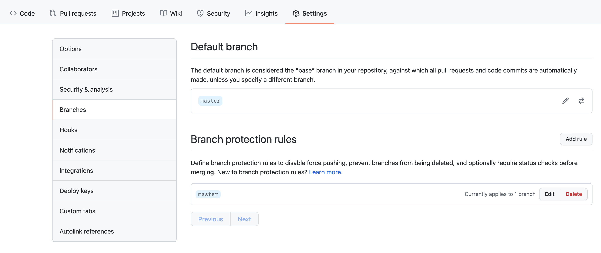

---

copyright:
  years: 2021, 2024
lastupdated: "2024-06-06"

keywords: DevSecOps

subcollection: devsecops-working

---

{{site.data.keyword.attribute-definition-list}}

# Configuring your GitHub repository
{: #devsecops-config-github}

The {{site.data.keyword.gitrepos}} tool integration is based on GitLab Community Edition, which is a web-based hosting service for Git repositories (repos). You can have both local and remote copies of your repos. To learn more, see {{site.data.keyword.gitrepos}}{: external}.
{: shortdesc}

Branch protection policies enforce security, collaboration, and helps ensure that your team adheres to code quality and change management standards. This topic helps you set and manage branch policies. [DevSecOps](/docs/devsecops?topic=devsecops-cd-devsecops-arch) requires you to configure the branch protection rules of your GitHub repository.

## Benefits of Branch Protection
{: #devsecops-config-github-protection}

- **Improved Code Quality and Collaboration**: Requiring pull requests and approvals through branch protection enhances code quality and collaboration. This ensures code consistency and adherence to the team's coding standards. Changes undergo review and helps catch bugs and errors early on, resulting in more reliable and maintainable code.

- **Increased Visibility of Changes**: Requiring pull requests provides increased visibility into code changes. This step simplifies tracking modifications and identifying potential issues.

- **Ensuring Code Integrity**: Pull request status-checks validate the code by running automated tests against predefined standards and linters before a pull request can be merged. This step maintains code integrity by catching bugs and other issues early in the development cycle.

## Configuring Branch Protection Rules in GitHub
{: #devsecops-config-github-rules}

To configure branch protection rules in GitHub for your repository, follow these steps:

### Accessing Branch Protection Settings
{: #devsecops-config-github-settings}

1. Navigate to the **Settings** tab of your repository on GitHub.
2. In the left sidebar, click **Branches** to access the branch settings page.
3. Scroll down to the **Branch protection rules** section.
4. Locate the branch that you want to configure (typically the "main" branch).
5. Select the **Edit** button next to the branch name to modify its protection rules.

{: caption="Figure 1. GitHub repository settings" caption-side="bottom"}

### Adding Branch Protection Rules
{: #devsecops-config-github-addrules}

If no existing rules are set up, click on the **Add rule** button and enter the corresponding branch name in the `**Branch name pattern**` field. Then, proceed with the following steps:

1. Enable the **Require a pull request before merging** option.
2. Enable the **Require approvals** option and set the **Required number of approvals before merging** set to atleast `1` or the number of required approvals in your team.
3. Enable the option **Dismiss stale pull request approvals when new commits are pushed** to review all the latest changes before it can be merged onto another branch.

{: caption="Figure 2. Branch protection rules" caption-side="bottom"}

Pull Requests **must** be approved before merging them into the master branch. This rule ensures that changes undergo review and scrutiny by team members, promotes collaboration, code quality, and adherence to project standards.
{: #note}

