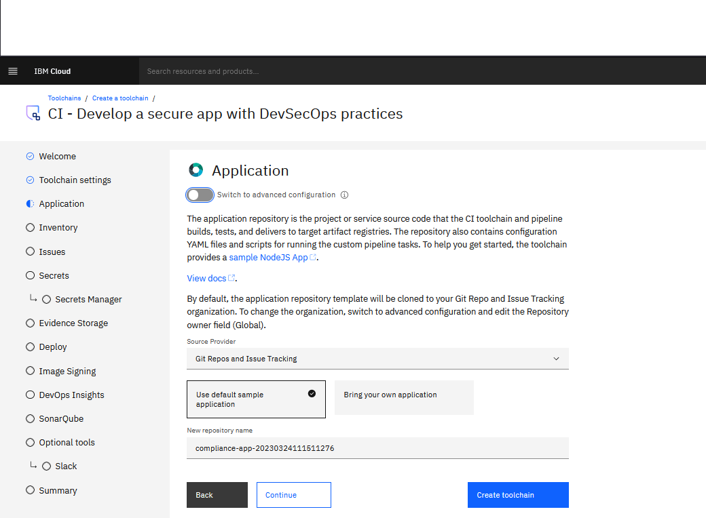
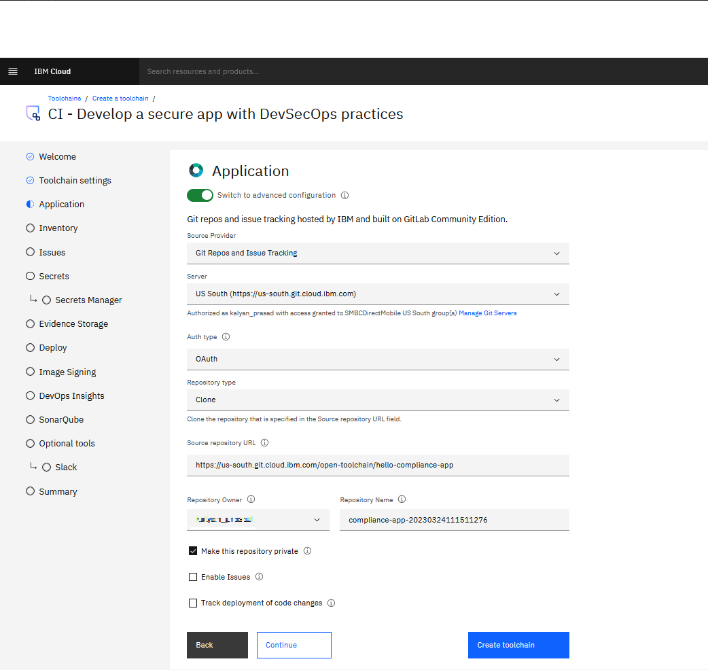
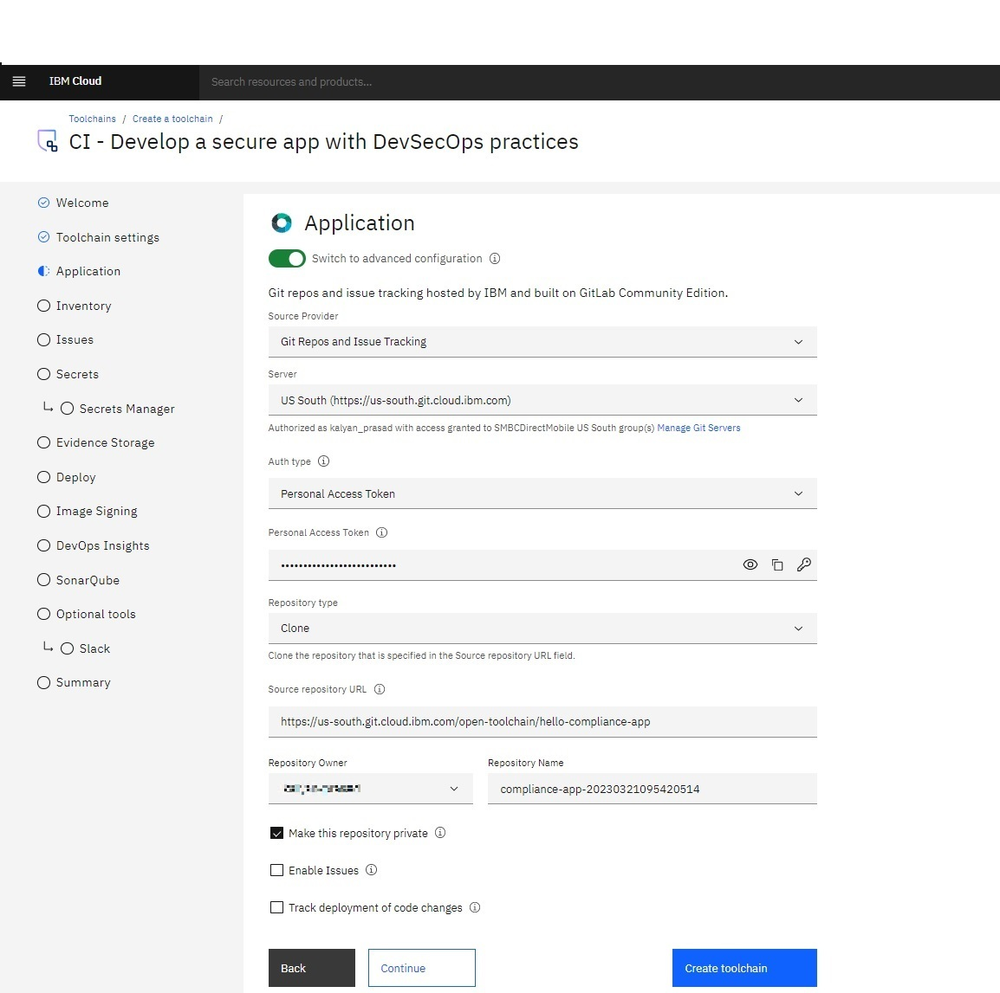

---

copyright: 
  years: 2023, 2023
lastupdated: "2023-03-27"

keywords: DevSecOps, toolchain, git

subcollection: devsecops

---

{{site.data.keyword.attribute-definition-list}}

# Configuring toolchain Git integration
{: #cd-devsecops-config-tc-git-integ}

You can configure toolchain Git integration in the following ways:

* Default: by using `OAuth`.
* Advanced: by using `Personal Access Token`.
{: shortdesc}

## Configure toolchain Git integration using OAuth
{: #devsecops-git-oauth}

The default method of Git integration is `OAuth`.

{: caption="Figure 1. DevSecOps Git integration default" caption-side="bottom"}

To see the default value, select **Switch to advanced configuration**. The default value of `Auth Type` is **OAuth** as shown in figure 2.

{: caption="Figure 2. DevSecOps Git integration with OAuth" caption-side="bottom"}

## Configure toolchain Git integration using Personal Access Token)
{: #devsecops-git-pat}

You can also implement Git integration by using `Personal Access Token`.

To use `Personal Access Token`, select **Switch to advanced configuration** and select the `Auth Type` as **Personal Access Token** as shown in figure 3.

{: caption="Figure 3. DevSecOps Git integration with personal access token" caption-side="bottom"}

If the `Auth Type` is selected as **Personal Access Token**, then you must provide a personal access token value for the field `Personal Access Token`, which has appropriate permissions for the repository.
