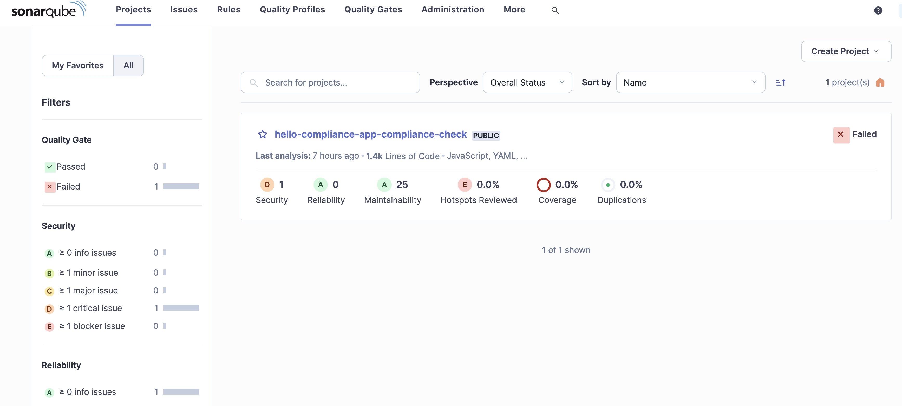
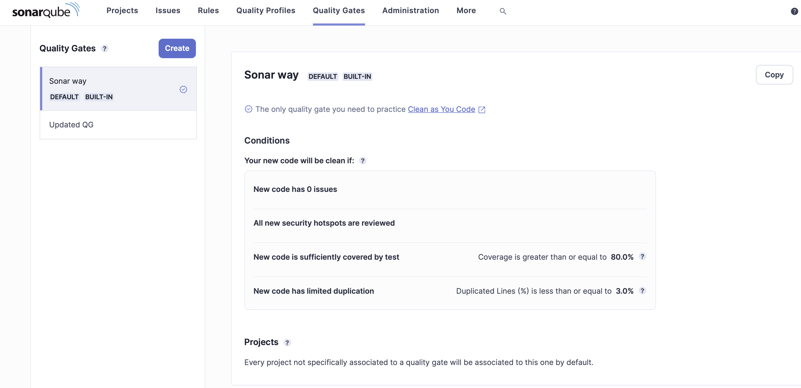
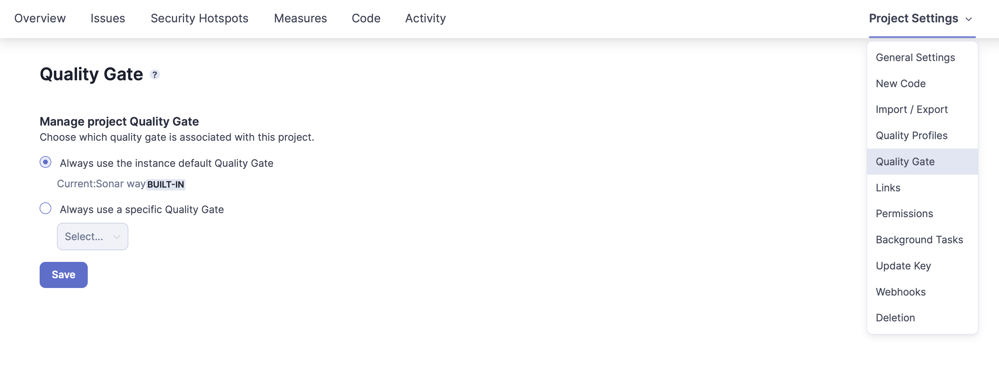
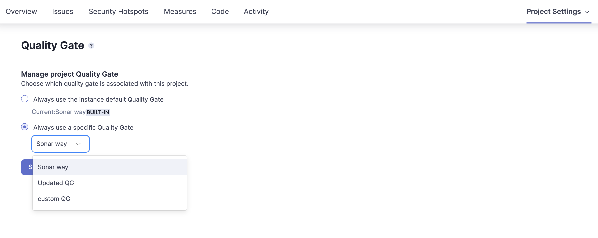
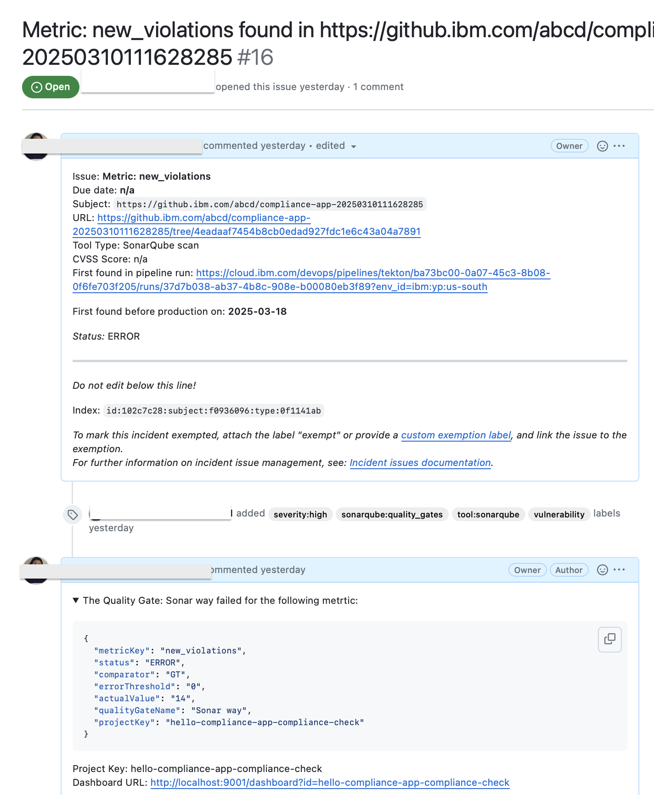
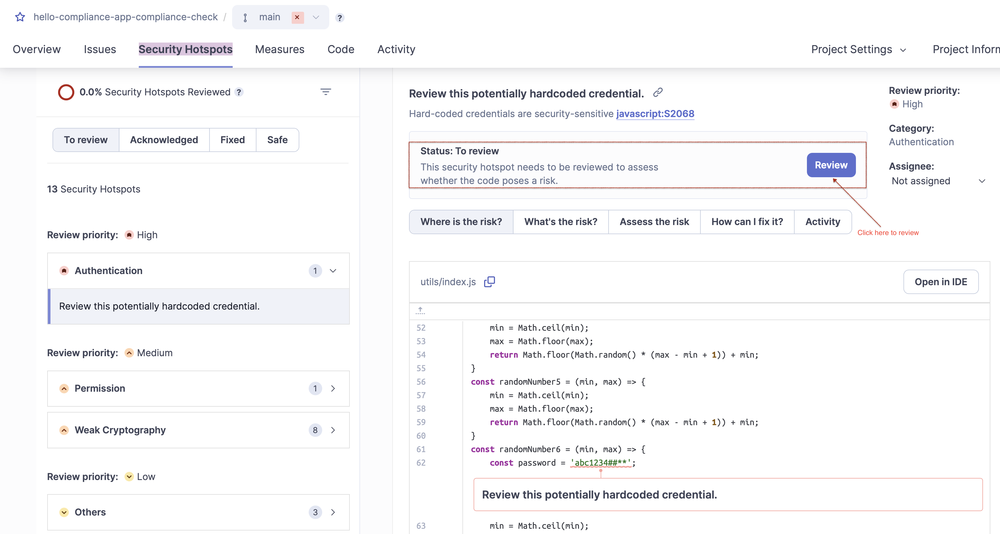
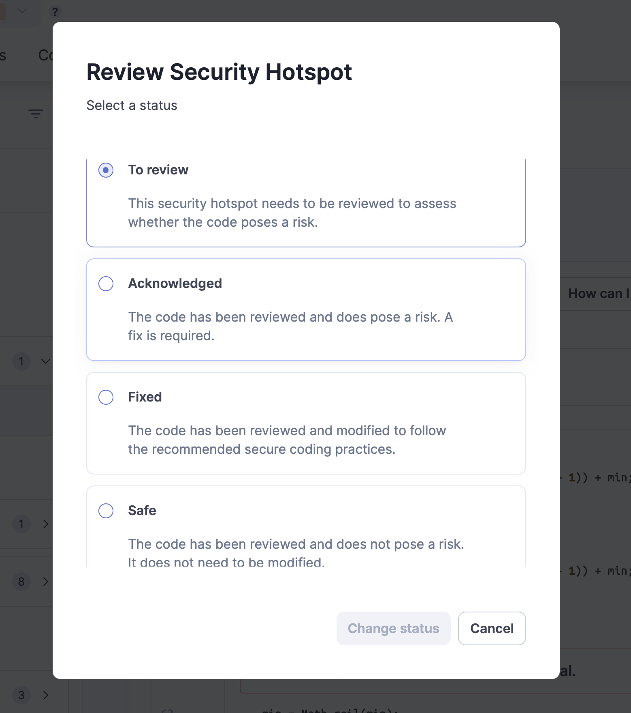
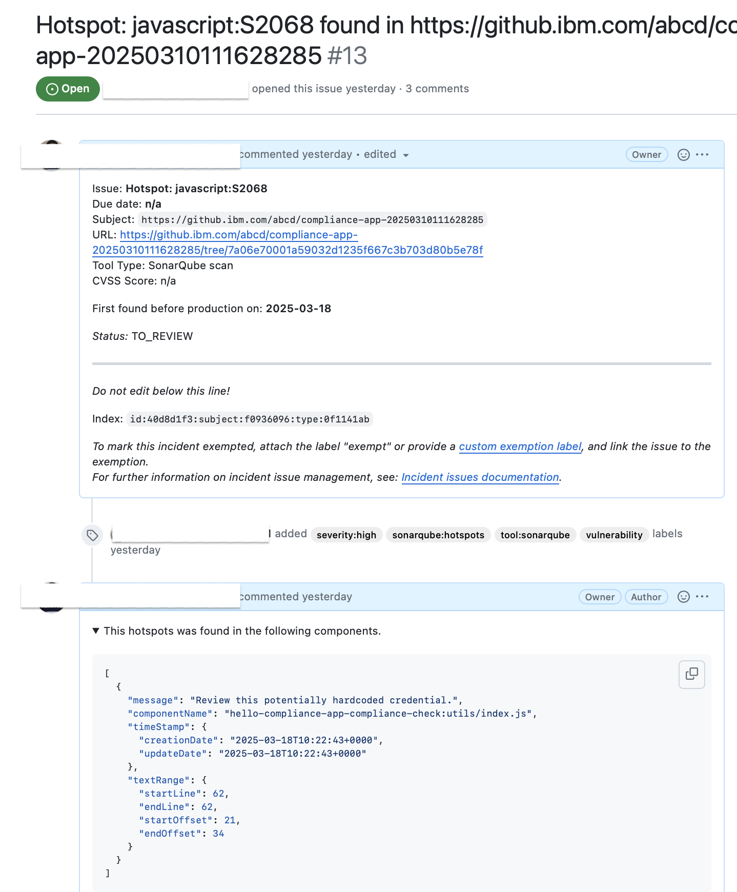
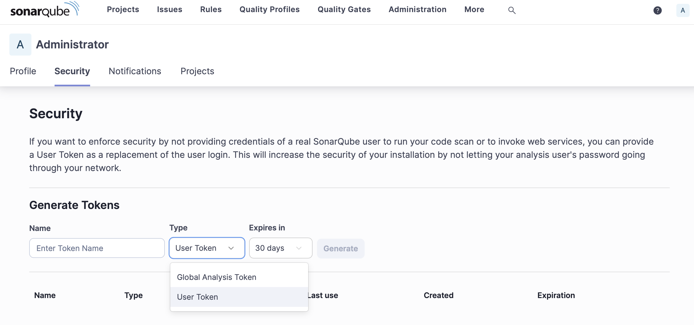

---

copyright:
  years: 2015, 2024
lastupdated: "2026-02-03"

keywords: tool integrations, Sonarqube

subcollection: devsecops

---

{{site.data.keyword.attribute-definition-list}}

# Configuring SonarQube scans
{: #sonarqube}

SonarQube provides an overview of the overall health and quality of your source code and highlights issues that are found in new code. The code analyzers detect tricky bugs, such as null-pointer dereferences, logic errors, and resource leaks, for more than 20 coding languages.
{: shortdesc}

Configure SonarQube to continuously analyze and measure the quality of your source code:

1. In the {{site.data.keyword.cloud_notm}} console, click the menu icon  > **Platform Automation** > **Toolchains**. On the Toolchains page, click the toolchain to open its Overview page. Alternatively, on your app's Overview page, on the Continuous delivery card, click **View toolchain**. Then, click **Overview**.

   a. Click **Add a Tool**.

   b. In the Tool Integrations section, click **SonarQube**.

1. Type a name for this instance of the SonarQube tool integration.
1. Type the URL for the SonarQube instance that you want to open when you click the SonarQube card from your toolchain.
1. Optional: Type the username that you use to connect to the SonarQube server.

   You need to specify a username only if you use a password to connect to the SonarQube server. If you use an authentication token to connect, leave this field empty.
   {: tip}

1. Type the password or authentication token that you use to connect to the SonarQube server.
1. If the server cannot be on the public internet, select **Advanced**. {{site.data.keyword.cloud_notm}} cannot validate the connection details that you provide and certain functions that require API access to this server are disabled. The delivery pipeline works only by using a private worker that has network access to this server.
1. Click **Create Integration**.
1. On your Toolchain's Overview page, on the **Third-Party tools** card, click **SonarQube** to view the dashboard for the SonarQube instance that you connected to.

## Adding SonarQube to the continuous integration pipeline
{: #sonarqube-ci-pipeline}

### Default SonarQube instance
{: #sonarqube-ci-pipeline-default}

- If `sonarqube-config` is set to `default`, then SonarQube is used by default to scan.  This scan runs as Docker-in-Docker.

The instance used is available only during the run. Therefore,  you can't access the dashboard. {: important}

- By default, the pipeline uses SonarQube community edition which has only limited checks.Many vulnerability rules and hostspot issues are not covered under Community Edition.

- To verify if a vulnerability is checked in community edition, refer to [thread in Sonarqube community question](https://community.sonarsource.com/t/sonarqube-community-edition/39879)

- The default implementation which is the SonarQube community Edition instance registered with CISO is not an ITSS-approved edition.SonarQube Enterprise Edition is the only ITSS-approved edition.

To download SonarQube, refer [SonarQube Downloads](https://www.sonarsource.com/products/sonarqube/downloads/)

### SonarQube instance on the dev cluster
{: #sonarqube-ci-pipeline-cluster}

If `sonarqube-config` is set to `cluster`, the pipeline creates a SonarQube instance during the pipeline run in the dev cluster. You can access this instance after the static-scan stage successfully runs.You can access the SonarQube dashboard locally by port forwarding.

### Existing SonarQube instance
{: #sonarqube-ci-pipeline-existing}

Set `sonarqube-config` to `custom`, to add your own SonarQube instance to your existing pipeline, add the tool integration to your toolchain, and then add the SonarQube tool integration parameter to the pipeline. For more information, see [Configuring SonarQube](/docs/devsecops?topic=devsecops-sonarqube).


### Sonarqube server with self signed certificate

If `sonarqube-config` is set to `custom` to use [an existing sonarqube server](/docs/devsecops?topic=devsecops-sonarqube#sonarqube-ci-pipeline-existing) and the server has a self-signed certificate, then in order for the sonar scanner to connect successfully to the sonarqube server, the self-signed certificate needs to be [added to the trusted CA certificates](https://docs.sonarsource.com/sonarqube-server/latest/analyzing-source-code/scanners/scanner-environment/manage-tls-certificates/#adding-the-selfsigned-server-certificate-to-the-trusted-ca-certificates).

By providing the certificate in a PEM format (either base64 encoded secret value or PEM formatted plain text) as the value of the pipeline/trigger property `sonarqube-root-certificate`, configuration will be added according to the usage of the SonarScanner for maven, SonarScanner for gradle sonar or SonarScanner invoked with Docker.

### Parameters
{: #sonarqube-cipipeline-parm}

To run the SonarQube scan, the pipeline needs the following continuous integration parameters:

|Name |Type	|Description |Required or Optional |
|:----------|:------------------------------|:------------------|:----------|
|cluster-name 		|Text 		|The name of the Docker build cluster.			|Required			|
|dev-region		|Text		|The {{site.data.keyword.cloud_notm}} region that hosts the cluster.			|Required			|
|opt-in-sonar		|Text 		|The option to enable the SonarQube scan.		|Required			|
|sonarqube		|Tool integration		|The SonarQube tool integration.	|Optional			|
|sonarqube-config		|Text		|Runs a SonarQube scan in an isolated Docker-in-Docker container (default configuration) or in an existing development Kubernetes cluster (cluster configuration). Alternatively, you can bring your own SonarQube instance and configure the SonarQube tool integration (custom configuration). Options: `default`, `cluster`, or `custom`. Default is `default`. For more information, see ([Adding SonarQube to the continuous integration pipeline](/docs/devsecops?topic=devsecops-sonarqube#sonarqube-ci-pipeline)). |Required			|
|opt-in-sonar-hotspots		|Text		|The Sonarqube scan for detecting hotspots.	|Optional			|
|opt-in-sonar-quality-gates		|Text		|Allowing Sonarqube scan to detect quality gate failures.	|Optional			|
|opt-in-sonar-pr-analysis		|Text		|Allowing Sonarqube scan to do the pull request analysis (This option will work only if the PR is not contributed from a forked repository). This parameter is only valid for `App-preview PR pipeline`.|Optional			|
|sonarqube-user-token		|Secret		|Pass the User token used for API access in case of `sonarqube-config` set to `custom`	|Optional			|
|sonarqube-root-certificate		|Text or Secert		|In case of `sonarqube-config` set to `custom`, pass the self signed certificate as a PEM formatted text or base64 encoded secret|Optional			|

{: caption="Continuous integration pipeline parameters}

For more information about pipelines parameters, see [Pipeline parameters](/docs/devsecops?topic=devsecops-cd-devsecops-pipeline-parm).

If you add multiple SonarQube tool integrations to your pipeline, you can switch between them by changing the value of the SonarQube pipeline parameter, which is a tool integration parameter.
{: tip}

### Plug-ins installed in SonarQube
{: #sonarqube-cipipeline-plugins-installed}

DevSecOps Pipelines uses SonarQube Version 10.0 by default.

To know more about the list of preinstalled plug-ins, refer to [plug-ins](https://docs.sonarsource.com/sonarqube-server/latest/server-installation/plugins/plugin-version-matrix/)

### Issues reported from SonarQube
{: #sonarqube-cipipeline-issues-reported}

DevSecOps Pipelines filters out the problems that reported during SonarQube scan. The pipelines exclusively create Compliance Incidences for problems that are not of type `CODE_SMELL` or `BUG`. The pipeline also skips problems for which the status is `CLOSED`.

### Enabling Pull Request analysis in the App Preview PR pipeline
{: #sonarqube-pr-analysis}

PR analysis option is provided in the `App Preview PR pipeline` if the PR is coming from the same repo as the target repository (and not a fork). The Sonarqube instance should also support the PR analysis.
The default sonarqube instances used in `cluster` and `dind` mode do not support this feature as pull request analysis is available starting in sonarqube Developer Edition.
The environment variable `opt-in-sonar-pr-analysis` has to be added to the pipeline and its value should not be empty.

### Enabling Quality Gate result processing for a SonarQube project
{: #sonarqube-cipipeline-gate}

A **Quality Gate** in SonarQube is a set of conditions that determine whether a project meets the required code quality standards. To learn more about Quality Gates , see [SonarQube Documentation](https://docs.sonarsource.com/sonarqube-server/latest/quality-standards-administration/managing-quality-gates/introduction-to-quality-gates/){: external}. 

SonarQube issue parser supports processing the SonarQube Quality Gate results and create issues if a failure occurs due to it. In order to enable processing of Quality Gates result, set the environment property `opt-in-sonar-quality-gates` as `1`.

If `opt-in-sonar-quality-gates` is set as `1`, and you are using your [own SonarQube Instance](/docs/devsecops?topic=devsecops-sonarqube#sonarqube-ci-pipeline-existing) as an integration (with `sonarqube-config` set as `custom`), in order to fetch the Quality Gate name you can generate a **SonarQube User Token** with required permission to access SonarQube Web API  and set pipeline environment property `sonarqube-user-token` with the token as a secret value. For details about required token permission, please refer [SonarQube token permission](/docs/devsecops?topic=devsecops-sonarqube#sonarqube-ci-pipeline-user-token).

If you use the SonarQube instance that the pipeline created or a custom SonarQube tool integration, follow these steps to navigate through the SonarQube dashboard:

1. Go to the SonarQube dashboard that was created by the URL from the pipeline logs in the `static-scan` task.

   {: caption="SonarQube dashboards" caption-side="bottom"}

2. By Default, the `Sonar way` quality gate is associated with any project which is not explicitly associated with a specific quality gate. New Quality  gates with custom metric conditions can also be created.

   - To look for the list of Quality Gates in the dashboard, click on **Quality Gate** from the top Nav bar.

      {: caption="SonarQube default Quality Gate" caption-side="bottom"}

   - To create a new Quality Gate, click on **Quality Gate** from the top Nav bar and then click on **Create**. You can add a name to the Quality Gate and add/delete/update the condition metrics.

   - To look for the Quality Gate associated with the project, select the project and then click **Project Settings** > **Quality Gate**.

      {: caption="SonarQube Quality Gate associated with project" caption-side="bottom"}
   
   - To associate a Quality Gate (other than the default one) to a particular project, select the project and then click **Project Settings** > **Quality Gate** > **Always use a specific Quality Gate** > Select the required Quality Gate from the dropdown > **Save**

      {: caption="Associate quality gate with project" caption-side="bottom"}

3. New scans are evaluated by this quality gate and evidence is created by the quality gate's results. Issues are created based on the conditions which caused Quality Gate failure.

   An example of the quality gate status result format which is the reponse of Sonarqube API: `${SONAR_HOST_URL}/api/qualitygates/project_status?projectKey=${SONAR_PROJECT_KEY}`:

   ```sh
   {
      "projectStatus": {
         "status": "ERROR",
         "conditions": [
            {
            "status": "ERROR",
            "metricKey": "new_coverage",
            "comparator": "LT",
            "errorThreshold": "80",
            "actualValue": "0.0"
            },
            {
            "status": "OK",
            "metricKey": "new_duplicated_lines_density",
            "comparator": "GT",
            "errorThreshold": "3",
            "actualValue": "0.0"
            },
            {
            "status": "ERROR",
            "metricKey": "new_security_hotspots_reviewed",
            "comparator": "LT",
            "errorThreshold": "100",
            "actualValue": "0.0"
            },
            {
            "status": "ERROR",
            "metricKey": "new_violations",
            "comparator": "GT",
            "errorThreshold": "0",
            "actualValue": "14"
            }
         ],
         "ignoredConditions": false,
         "period": {
            "mode": "PREVIOUS_VERSION",
            "date": "2025-03-18T09:43:25+0000"
         },
         "caycStatus": "compliant",
         "additional": {
            "qualityGateName": "Sonar way",
            "projectKey": "hello-compliance-app-compliance-check",
            "dashboardUrl": "http://localhost:9001/dashboard?id=hello-compliance-app-compliance-check"
         }
      }
   }

   ```
   {: codeblock}

   To learn more about the SonarQube APIs, please refer to [Sonarqube WebAPI documentation](https://next.sonarqube.com/sonarqube/web_api/api/qualitygates){: external}


   An issue is created for each **Metric Key** that has status as **ERROR**, ensuring that every failing metric is individually tracked and addressed.

   Example issue:

   {: caption="Sonarqube issue for a failed metric" caption-side="bottom"}

   Example SonarQube failed evidence due to Quality Gate failure:

   ```sh
   {
      "id": "abc",
      "evidence_type_id": "com.ibm.static_scan",
      "evidence_type_version": "1.0.0",
      "date": "2025-03-18T11:22:35.086Z",
      "origin": {
      },
      "details": {
         "result": "failure",
         "tool": "sonarqube",
         "failure_reason": "tool_detected_vulnerabilities"
      },
      "issues": [
         "https://github.com/<org-name>/compliance-issues-20250310111628285/issues/14",
         "https://github.com/<org-name>/compliance-issues-20250310111628285/issues/15"
      ],
      "findings": [
         {
            "id": "Metric: new_coverage",
            "due_date": "n/a",
            "severity": "high",
            "first_found": "2025-03-18",
            "url": "https://github.com/<org-name>/compliance-issues-repo/issues/14",
            "found_status": "existing",
            "has_exempt": false,
            "cvss": "n/a",
            "package": []
         },
         {
            "id": "Metric: new_security_hotspots_reviewed",
            "due_date": "n/a",
            "severity": "high",
            "first_found": "2025-03-18",
            "url": "https://github.com/<org-name>/compliance-issues-repo/issues/15",
            "found_status": "existing",
            "has_exempt": false,
            "cvss": "n/a",
            "package": []
         }
      ],
      "attachments": [
         {
            "hash": "d10a1e5d727b4f778a1d70c2ebaa2060251d56dd79",
            "url": "https://s3.us-south.cloud-object-storage.appdomain.cloud/attachments/d10a1e5d727b4f778a1d70c2e/content",
            "label": "app_issues"
         },
         {
            "hash": "d76d356cc4da1afc942a6259c1222a7b079607ea7e0d64",
            "url": "https://s3.us-south.cloud-object-storage.appdomain.cloud/attachments/d76d356cc4da1afc942a6259c1222a7b0/content",
            "label": "app_hotspots"
         },
         {
            "hash": "f0f84a2c2210a9c65c8430d577dafdd71bee6df5da",
            "url": "https://s3.us-south.cloud-object-storage.appdomain.cloud/attachments/f0f84a2c2210a9c65c8430d577dafdd71bee6e/content",
            "label": "app_quality_status_updated"
         }
      ],
      "assets": [
         {
            "hash": "1812f77dfc646c93320794810460acd3e53",
            "uri": "https://github.com/<org-name>/abcd/compliance-app-20250310111628285.git#7a06e70001a59032d1",
            "url": "https://s3.us-south.cloud-object-storage.appdomain.cloud/assets/1812f77dfc646c93320794810460acd3e/index.json"
         }
      ]
   }

   ```
   {: codeblock}

Please ensure to enable `opt-in-sonar-quality-gates` in CC in case it is enabled in CI pipeline. Otherwise, the quality Gate issues found by CC will be autoclosed. Currently we are surfacing warning message in logs concerning this inconsistency.
{: tip}

To learn more about SonarQube, see [SonarQube Documentation](https://docs.sonarsource.com/sonarqube-server/latest/){: external}.

### Enabling SonarQube Hotspot processing
{: #sonarqube-cipipeline-hotspot}

A SonarQube hotspot highlights security-sensitive code that requires manual review to determine whether it poses a real risk. It helps developers focus on potential vulnerabilities without generating false positives. To learn more about managing Hotspots , see [SonarQube Documentation](https://docs.sonarsource.com/sonarqube-server/latest/user-guide/security-hotspots/){: external}.

In order to enable processing of SonarQube Hotspots, set the environment property `opt-in-sonar-hotspots` as `1`.

If `opt-in-sonar-hotspots` is set as `1`, and you are using your [own SonarQube Instance](/docs/devsecops?topic=devsecops-sonarqube#sonarqube-ci-pipeline-existing) as an integration (with `sonarqube-config` set as `custom`), in order to fetch Sonarqube detected Hotspots using the Web API,you can generate a **SonarQube User Token** with required permission to access SonarQube Web API  and set pipeline environment property `sonarqube-user-token` with the token as a secret value. For details about required token permission, please refer [SonarQube token permission](/docs/devsecops?topic=devsecops-sonarqube#sonarqube-ci-pipeline-user-token).

- To look at the security hotspots detected by SonarQube for a project, select the project and then click **Security Hotspots**.

   {: caption="Hotspots detected by SonarQube" caption-side="bottom"}

- To review the detected hotspots, select the hotspot and then click on **Review**. A modal will appear, allowing you to set the Review Status as one of the following: `To Review`, `Acknowledged`, `Fixed` and `Safe`.

   {: caption="Review SonarQube hotspots" caption-side="bottom"}

On enabling the `opt-in-sonar-hotspots` flag, issues will be created when a Hotspot is detected by SonarQube where review status is not set to: `Acknowledged`, `Fixed` and `Safe`.

{: caption="SonarQube hotspots issue" caption-side="bottom"}

An example of the hotspots result format which is the reponse of SonarQube API:`${SONAR_HOST_URL}/api/hotspots/search?projectKey=${SONAR_PROJECT_KEY}&p=$page&status=TO_REVIEW"`

```sh
{
   "hotspots": [
      {
         "key": "AYLD_a1_Hqacjdg4wbDR",
         "component": "hello-compliance-app-compliance-check:index.js",
         "project": "hello-compliance-app-compliance-check",
         "securityCategory": "others",
         "vulnerabilityProbability": "LOW",
         "status": "TO_REVIEW",
         "line": 74,
         "message": "Make sure disabling content security policy frame-ancestors directive is safe here.",
         "author": "abc@1.com",
         "creationDate": "2022-04-01T06:29:13+0000",
         "updateDate": "2022-08-22T05:18:31+0000",
         "textRange": {
         "startLine": 74,
         "endLine": 84,
         "startOffset": 0,
         "endOffset": 1
         },
         "flows": [
         {
            "locations": [
               {
               "component": "hello-compliance-app-compliance-check:app.js",
               "textRange": {
                  "startLine": 76,
                  "endLine": 82,
                  "startOffset": 4,
                  "endOffset": 5
               }
               }
            ]
         }
         ],
         "rule": {
         "key": "javascript:S5732"
         }
      }
   ]
}

```
{: codeblock}


In case a `To Review` status hotspot is encountered in the result of the preceding API, a failure evidence is collected including hotspot information in the `findings` section.

Example SonarQube failed evidence due to Hotspot detection:

```sh
{
  "id": "62fc60140b2a761a969c6ad4f64d93d9c0f8f2301b1",
  "evidence_type_id": "com.ibm.static_scan",
  "evidence_type_version": "1.0.0",
  "date": "2025-03-18T10:29:00.896Z",
  "origin": {
  },
  "details": {
    "result": "failure",
    "tool": "sonarqube",
    "failure_reason": "tool_detected_vulnerabilities"
  },
  "issues": [
    "https://github.com/<org-name>/compliance-issues-20250310111628285/issues/13"
  ],
  "findings": [
    {
      "id": "javascript:S4426",
      "due_date": "n/a",
      "severity": "high",
      "first_found": "2025-03-18",
      "url": "https://github.com/<org-name>/compliance-issues-20250310111628285/issues/12",
      "found_status": "new",
      "has_exempt": false,
      "cvss": "n/a",
      "package": []
    },
    {
      "id": "Hotspot: javascript:S2068",
      "due_date": "n/a",
      "severity": "high",
      "first_found": "2025-03-18",
      "url": "https://github.com/<org-name>/compliance-issues-20250310111628285/issues/13",
      "found_status": "new",
      "has_exempt": false,
      "cvss": "n/a",
      "package": []
    },
  ],
  "attachments": [
    {
      "hash": "e579a1ab8025d280d5870eb8d4464d6d6a41a22",
      "url": "https://s3.us-south.cloud-object-storage.appdomain.cloud/attachments/e579a1ab8025d280d5870eb8d4464d6d6a41a/content",
      "label": "app_issues"
    },
    {
      "hash": "6defa891c320ae2b80ae76d03e168edc2379",
      "url": "https://s3.us-south.cloud-object-storage.appdomain.cloud/attachments/6defa891c320ae2b80ae76d03e168edc2379748d9/content",
      "label": "app_hotspots"
    },
    {
      "hash": "060a60e2d693427cde6064f72743ebb9e1d6",
      "url": "https://s3.us-south.cloud-object-storage.appdomain.cloud/attachments/060a60e2d693427cde6064f72743ebb9e1d/content",
      "label": "app_quality_status_updated"
    }
  ],
  "assets": [
    {
      "hash": "d7391b3273e5e52852f293031d62b9",
      "uri": "https://github.com/<org-name>/compliance-app-20250310111628285.git#4eadaaf7454b8cb0edad927",
      "url": "https://s3.us-south.cloud-object-storage.appdomain.cloud/assets/d7391b3273e5e52852f293031d62b9bf0/index.json"
    }
  ]
}
```
{: codeblock}

Please ensure to enable `opt-in-sonar-hotspots` in CC in case it is enabled in CI pipeline. Otherwise, the hotspot issues found by CC will be autoclosed. Currently we are surfacing warning message in logs concerning this inconsistency.
{: tip}

### Permissions for SonarQube Token
{: #sonarqube-ci-pipeline-user-token}

In case of using existing SonarQube instance and to successfully publish the testrecord to Devops Insights and fetch the Quality Gate name for a project, we need to create a **User token** with required permissions and set it as a secret value in env property `sonarqube-user-token` in order to provide permission to access the required Sonarqube enpoints.

To create **User Token**, open SonarQube Dashboard > click on your Profile picture > select **My Account** > select **Security** > from the **Type** dropdown select **User Token** > click **Generate**

{: caption="SonarQube User Token Generation" caption-side="bottom"}

1. The Devops Insights plugin makes the following API calls to Sonarqube server:
   - [GET api/qualitygates/project_status](https://next.sonarqube.com/sonarqube/web_api/api/qualitygates/project_status){: external}

      Requires one of the following permissions:
      - ‘Administer System’
      - ‘Administer’ rights on the specified project
      - ‘Browse’ on the specified project
      - ‘Execute Analysis’ on the specified project

   - [GET api/measures/component](https://next.sonarqube.com/sonarqube/web_api/api/measures/component){: external}

      Requires the 'Browse' permission on the specified project(s). component.

   - [GET api/issues/search](https://next.sonarqube.com/sonarqube/web_api/api/issues/search){: external}

      Requires the 'Browse' permission on the specified project(s).

   - [GET api/ce/task](https://next.sonarqube.com/sonarqube/web_api/api/ce/task){: external}

      Requires one of the following permissions:
      - 'Administer' at global or project level
      - 'Execute Analysis' at global or project level

2. To fetch the Quality Gate name, the following SonarQube Endpoint is used:
   - [GET api/qualitygates/get_by_project](https://next.sonarqube.com/sonarqube/web_api/api/qualitygates/get_by_project){: external}

      Requires one of the following permissions:
      - 'Administer System'
      - 'Administer' rights on the specified project
      - 'Browse' on the specified project

3. To fetch the SonarQube detected Hotspots, the following SonarQube Endpoint is used:
   - [GET api/hotspots/search](https://next.sonarqube.com/sonarqube/web_api/api/hotspots/search){: external}

      Requires the 'Browse' permission on the specified project(s).

For more information about the permissions to access the SonarQube Web API, please refer [SonarQube Web API documentation](https://next.sonarqube.com/sonarqube/web_api/){: external}

### Using your own configuration file
{: #sonarqube-config-file}

You can modify the default configuration without using your own SonarQube instance. Create a `sonar-project.properties` file in the repo that you want to create the configuration file in. If our script detects an existing `configuration sonar-project.properties` file in the repo, it uses that file instead of the default file. For more information about possible analysis parameters in the configuration file, see [Analysis Parameters](https://docs.sonarsource.com/sonarqube-server/latest/analyzing-source-code/analysis-parameters/){: external} here.

If `sonar.branch.name` is added in the `sonarqube-project.properties` file, then it is set to `sonar-branch-name` env property as default value, otherwise the branch name available from `load_repo <app-name> branch` is taken into consideration. For more information, refer [Branch Analysis](https://docs.sonarsource.com/sonarqube-server/latest/analyzing-source-code/branch-analysis/setting-up-the-branch-analysis/){: external} documentation.

Make sure that you add the correct login credentials and host URL to the configuration file.
{: important}

### Using another static scan implementation
{: #sonarqube-static-scan}

You can modify your `.pipeline-config.yaml` file to add your own custom script to the `static-scan` stage to use your own static scan implementation.

## Learn more about SonarQube
{: #sonarqube-learn-more}

To learn more about SonarQube, see [SonarQube Documentation](https://docs.sonarsource.com/sonarqube/latest/){: external}.
