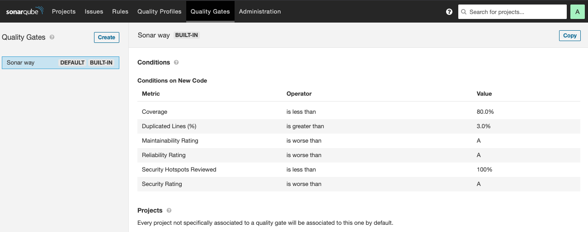

---

copyright:
  years: 2015, 2023
lastupdated: "2023-05-19"

keywords: tool integrations, IBM Cloud Public, Sonarqube

subcollection: devsecops

---

{{site.data.keyword.attribute-definition-list}}

# Configuring SonarQube scans
{: #sonarqube}

SonarQube provides an overview of the overall health and quality of your source code and highlights issues that are found in new code. The code analyzers detect tricky bugs, such as null-pointer dereferences, logic errors, and resource leaks, for more than 20 coding languages.
{: shortdesc}

Configure SonarQube to continuously analyze and measure the quality of your source code:

1. In the {{site.data.keyword.cloud_notm}} console, click the menu icon  and select **DevOps**. On the Toolchains page, click the toolchain to open its Overview page. Alternatively, on your app's Overview page, on the Continuous delivery card, click **View toolchain**. Then, click **Overview**.

   a. Click **Add a Tool**.

   b. In the Tool Integrations section, click **SonarQube**.

1. Type a name for this instance of the SonarQube tool integration.
1. Type the URL for the SonarQube instance that you want to open when you click the SonarQube card from your toolchain.
1. Optional: Type the username that you use to connect to the SonarQube server.

   You need to specify a username only if you use a password to connect to the SonarQube server. If you use an authentication token to connect, leave this field empty.
   {: tip}

1. Type the password or authentication token that you use to connect to the SonarQube server.
1. If the server cannot be on the public internet, select **Advanced**. {{site.data.keyword.cloud_notm}} cannot validate the connection details that you provide and certain functions that require API access to this server are disabled. The delivery pipeline works only by using a private worker that has network access to this server.
1. Click **Create Integration**.
1. On your Toolchain's Overview page, on the **Third-Party tools** card, click **SonarQube** to view the dashboard for the SonarQube instance that you connected to.

## Adding SonarQube to the continuous integration pipeline
{: #sonarqube-ci-pipeline}

### Default SonarQube instance
{: #sonarqube-ci-pipeline-default}

- If `sonarqube-config` is set to `default`, then SonarQube is used by default to scan.  This scan runs as Docker-in-Docker.

The instance used is available only during the run. Therefore,  you can't access the dashboard. {: important}

- By default, the pipeline uses SonarQube community edition which has only limited checks.Many vulnerability rules and hostspot issues are not covered under Community Edition.

- To verify if a vulnerability is checked in community edition, refer to [thread in Sonarqube community question](https://community.sonarsource.com/t/sonarqube-community-edition/39879)

- The default implementation which is the SonarQube community Edition instance registered with CISO is not an ITSS-approved edition.SonarQube Enterprise Edition is the only ITSS-approved edition.

To download SonarQube, refer [SonarQube Downloads](https://www.sonarsource.com/products/sonarqube/downloads/)

### SonarQube instance on the dev cluster
{: #sonarqube-ci-pipeline-cluster}

If `sonarqube-config` is set to `cluster`, the pipeline creates a SonarQube instance during the pipeline run in the dev cluster. You can access this instance after the static-scan stage successfully runs.You can access the SonarQube dashboard locally by port forwarding.

### Existing SonarQube instance
{: #sonarqube-ci-pipeline-existing}

Set `sonarqube-config` to `custom`, to add your own SonarQube instance to your existing pipeline, add the tool integration to your toolchain, and then add the SonarQube tool integration parameter to the pipeline. For more information, see [Configuring SonarQube](/docs/devsecops?topic=devsecops-sonarqube).

### Parameters
{: #sonarqube-cipipeline-parm}

To run the SonarQube scan, the pipeline needs the following continuous integration parameters:

|Name |Type	|Description |Required or Optional |
|:----------|:------------------------------|:------------------|:----------|
|cluster-name 		|Text 		|The name of the Docker build cluster.			|Required			|
|dev-region		|Text		|The {{site.data.keyword.cloud_notm}} region that hosts the cluster.			|Required			|
|opt-in-sonar		|Text 		|The option to enable the SonarQube scan.		|Required			|
|sonarqube		|Tool integration		|The SonarQube tool integration.	|Optional			|
|sonarqube-config		|Text		|Runs a SonarQube scan in an isolated Docker-in-Docker container (default configuration) or in an existing development Kubernetes cluster (cluster configuration). Alternatively, you can bring your own SonarQube instance and configure the SonarQube tool integration (custom configuration). Options: `default`, `cluster`, or `custom`. Default is `default`. For more information, see ([Adding SonarQube to the continuous integration pipeline](/docs/devsecops?topic=devsecops-sonarqube#sonarqube-ci-pipeline)). |Required			|
|opt-in-sonar-hotspots		|Text		|The Sonarqube scan for detecting hotspots.	|Optional			|
{: caption="Table 1. Continuous integration pipeline parameters}

For more information about pipelines parameters, see [Pipeline parameters](/docs/devsecops?topic=devsecops-cd-devsecops-pipeline-parm).

If you add multiple SonarQube tool integrations to your pipeline, you can switch between them by changing the value of the SonarQube pipeline parameter, which is a tool integration parameter.
{: tip}

### Plug-ins installed in SonarQube
{: #sonarqube-cipipeline-plugins-installed}

DevSecOps Pipelines uses SonarQube Version 10.0 by default.

To know more about the list of preinstalled plug-ins, refer to [plug-ins](https://docs.sonarsource.com/sonarqube/latest/instance-administration/plugin-version-matrix/)

### Issues reported from SonarQube
{: #sonarqube-cipipeline-issues-reported}

DevSecOps Pipelines filters out the problems that reported during SonarQube scan. The pipelines exclusively create Compliance Incidences for problems that are not of type `CODE_SMELL` or `BUG`. The pipeline also skips problems for which the status is `CLOSED`.

### Updating the quality gate
{: #sonarqube-cipipeline-gate}

If you use the SonarQube instance that the pipeline created, you can update the default quality gate.

1. Go to the SonarQube dashboard that was created by the URL from the pipeline logs in the `static-scan` task.

   {: caption="Figure 1. SonarQube dashboards" caption-side="bottom"}

1. Click **Quality Gates** > **Create**.
1. Set your Quality Gate by using one of the following options:

   * Click  **Set as Default** to set the newly created quality gate as the default.
   * From the dashboard, select the project and then click **Project Settings** > **Quality Gate** to use the newly created quality gate for the project.

1. Specify which quality gate that you want to associate with the project. New scans are evaluated by this quality gate and evidence is created by the quality gate's results.

To learn more about SonarQube, see [SonarQube Documentation](https://docs.sonarqube.org/latest/){: external}.

### Using your own configuration file
{: #sonarqube-config-file}

You can modify the default configuration without using your own SonarQube instance. Create a `sonar-project.properties` file in the repo that you want to create the configuration file in. If our script detects an existing `configuration sonar-project.properties` file in the repo, it uses that file instead of the default file. For more information about possible analysis parameters in the configuration file, see [Analysis Parameters](https://docs.sonarqube.org/latest/analysis/analysis-parameters/){: external} here.

Make sure that you add the correct login credentials and host URL to the configuration file.
{: important}

### Using another static scan implementation
{: #sonarqube-static-scan}

You can modify your `.pipeline-config.yaml` file to add your own custom script to the `static-scan` stage to use your own static scan implementation.

## Learn more about SonarQube
{: #sonarqube-learn-more}

To learn more about SonarQube, see [Integrate your SonarQube analysis into your toolchain](https://www.ibm.com/blogs/cloud-archive/2017/06/integrate-sonarqube-analysis-into-your-toolchain/){: external}.
