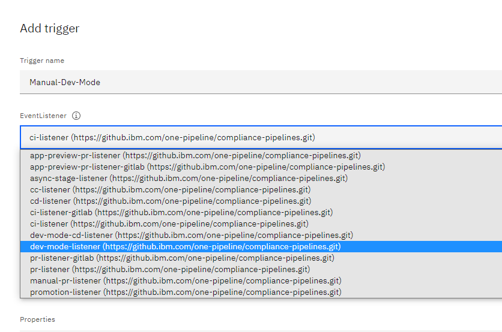

---

copyright: 
  years: 2023, 2023
lastupdated: "2023-03-02"

keywords: DevSecOps, development mode, IBM Cloud, pipelines

subcollection: devsecops

---

{{site.data.keyword.attribute-definition-list}}

# Running pipelines in `development mode`
{: #devsecops-devmode}

`development mode` for CI and CD pipelines tests the implementation of your DevSecOps configuration (yaml) file, without running any security or compliance-related task. `development mode` also reduces pipeline execution time.
{: shortdesc}

Use `development mode` for development purposes only. `development mode` is not a replacement for the official DevSecOps CI and CD pipelines, which remain the reference implementations.
{: attention}

Develop, implement, and test changes made to the `.pipeline-config.yaml` file by using a simplified pipeline. This pipeline has the following characteristics:

- Runs the various stages of the `.pipeline-config.yaml` file only.
- Skips the compliance and security-related tasks to optimize the time to run your code.

## Prerequisites
{: #devsecops-devmode-preq}

- An existing DevSecOps CI or CD toolchain.
- A `.pipeline-config.yaml` and the corresponding build, test, and deploy scripts.

## Setting up `development mode`
{: #devsecops-devmode-setup}

Take the following steps to set up `development mode` pipeline:

1. Go to the **Triggers** page of your CI or CD pipeline.
1. Duplicate the **Manual Trigger**. Click  > **Duplicate**.

   {: caption="Figure 1. Duplicate manual trigger" caption-side="bottom"}

1. Name the Trigger. For example, `Manual-Dev-Mode`.
1. Change the `EventListener` to `dev-mode-listener` (for CI) or `dev-mode-cd-listener` (for CD).

   {: caption="Figure 2. Change event listener" caption-side="bottom"}

1. Save your changes.

## Run the `development-mode` pipeline
{: #devsecops-devmode-run}

Take the following steps to run the `development mode` pipeline:

1. Go to the **PipelineRuns** page. 
1. Click **Run Pipeline** and select the `Manual-Dev-Mode` trigger that you created.
1. Click **Run**.

The `development-mode` pipeline runs the code that is in the `.pipeline-config.yaml` file only.
{: note}

All other security and compliance tasks do not run, reducing the pipeline execution time.

{: caption="Figure 2. Standard and development modes compared" caption-side="bottom"}

## Returning to standard mode
{: #devsecops-devmode-standard}

When you are satisfied with the implementation of the `.pipeline-config.yaml` file and its associated scripts, either disable or delete the `Manual-Dev-Mode` trigger, and instead use the `standard` trigger that you use to run security and compliance checks.
