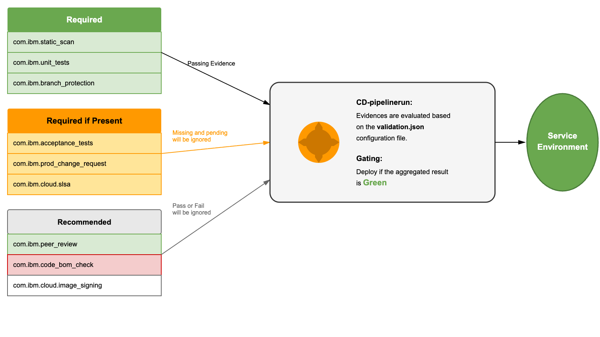
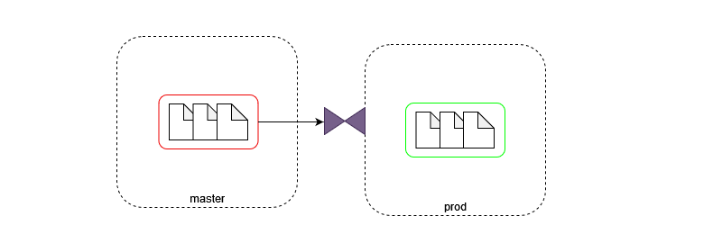
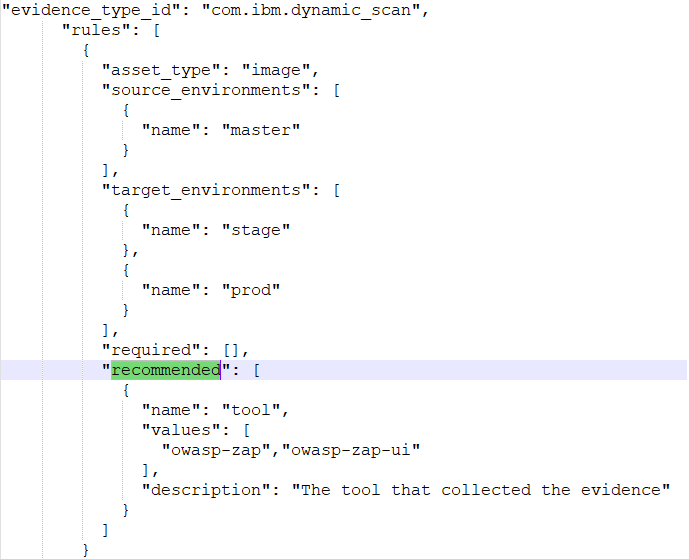
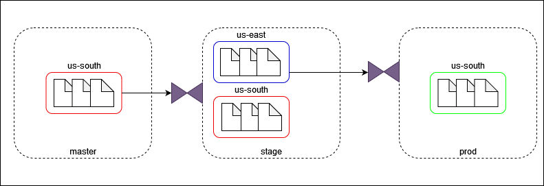

---

copyright:
  years: 2022, 2026
lastupdated: "2026-02-18"

keywords: DevSecOps, compliance evidence, evidence checks, IBM Cloud

subcollection: devsecops

---

{{site.data.keyword.attribute-definition-list}}

# Validating evidence
{: #evidence-checks-validation}

In the DevSecOps architecture, evidence collected during the CI pipeline must be validated before deployment to ensure assets meet compliance requirements. This validation process acts as a quality gate, preventing non-compliant assets from being deployed to stage or production environments.
{: shortdesc}

Collecting evidence is an essential aspect of the DevSecOps reference architecture:
- The **CI pipeline** collects evidence for all scans or steps performed on the assets
- The **CD pipeline** deploys the assets produced by the CI pipeline
- The **CC pipeline** scans the assets deployed by the CD pipeline

## Evidence validation modes
{: #evidence-validation-modes}

Evidence validation supports two modes of operation:
1. Using default gating mode
2. Using a config file.

### Default gating mode
{: #default-gating-mode}

In default mode, deployment is blocked if evidence is in any of the following states:
- **Pending** - Evidence collection is in progress
- **Failure** - Evidence collection failed or compliance check did not pass

This mode provides strict gating to ensure all evidence collected are in success state before deployment proceeds.

### Config file mode
{: #config-file-gating-mode}

Config file mode provides flexible, customizable evidence validation using a configuration file. This mode allows you to:
- Define specific evidence requirements per environment (dev, stage, prod)
- Set evidence declaration levels (required, required_if_present, recommended)
- Customize which evidence types are mandatory vs. optional
- Configure different rules for different asset types


## Using a config file
{: #evidence-checks-config-file}

Validating evidence by using a config file works as follows:

### How it works

**Pre-deployment checks:**
- Validate evidence produced by the CI pipeline
- Gate deployment based on these checks
- Auto-approve change request if all checks pass
- Block deployment if checks fail (except for `emergency` change requests)
- Config file is part of the change request

**Post-deployment checks:**
- Validate evidence produced by the CD pipeline
- Evaluate the pipeline based on these checks

**Finishing step:**
- Validates post-deployment evidence checks
- Evaluates the CD pipeline
- Stores checks in the evidence locker beside the `summary.json` file

For each asset type, different evidence types might need to be collected. In the checks, you can define the asset type and based on that asset, the evidence is collected for the corresponding tool.

### Enable evidence validation and evaluation using config file
{: #enable-evidence-checks-config-file}

To enable the `validation of evidence` in your toolchain, set the environment variable `opt-in-evidence-checks` to `1` in the CD and CC toolchain.

### Configure config file
{: #configure-evidence-checks-config-file}

To define the config file path, set `evidence-checks-config-path` to the file path present in the `pipeline-config-repo`, otherwise the default config file is used. Different deployment environments might have different config files. For example, `stage` might have evidence checks that differ from the production evidence checks. If `evidence-checks-config-path` is not defined, the config file searches for the file with the name `<region>.<target>.validation.json`, `<target>.validation.JSON`, or `validation.json` in the `pipeline-config-repo`.

### Config file Version 2
{: #evidence-checks-config-filev2}

During CI/CD/CC pipeline runs, various pieces of evidence are collected by different tools for different service environments.

**Service environments:**
- `dev` - Development
- `stage` - Pre-production (recently supported)
- `prod` - Production

**Evidence aggregation:**
- Results are aggregated to determine overall application-level compliance for each service environment
- Users can configure rules to control how result aggregation is performed
- Config file version 2 allows users to customize evidence evaluation per service environment

**Evidence declaration levels:**
- `recommended` (default) - Pipeline logs warnings if evidence is missing/pending/failed, but does not block deployment
- `required` - Evidence must be present in `success` state; deployment is blocked if evidence is missing, pending, or failed
- `required_if_present` - Evidence must be in `success` state if it exists; fails only if evidence status is `failure`; passes if evidence is `success`, `pending`, or `missing`

The following diagram shows how evidence aggregation works:


{: caption="Evidence aggregation" caption-side="bottom"}

### Evidence evaluation and gating
{: #evidence-evaluation-gating}

When the required application compliance level is not achieved, deployment is gated in the CD pipeline run.

**Supported evidence types for gating:**
- `pre-deployment` - Evidence list checked before deployment
- `post-deployment` - Evidence list checked after deployment


### Various deployment topologies
{: #various-deployment-topology}

#### Promotion from `master` to `prod`
{: #various-deployment-topology-step1}

 {: caption="Use case 1. Promotion from `master` to `prod`" caption-side="bottom"}


{: caption="Properties for `Manual Promotion Trigger` and `Manual CD Trigger`"}


#### Promotion from `master` to `stage` and then to `prod`
{: #various-deployment-topology-step2}

 {: caption="Use case 2. Promotion from `master` to `stage` to `prod`" caption-side="bottom"}


{: caption="Properties for `Manual Promotion Trigger` and `Manual CD Trigger` environment `stage`"}

{: caption="Properties for `Manual Promotion Trigger` and `Manual CD Trigger` environment `prod`"}

{: caption="Config file version 2"}

#### Promotion from `master` to `stage(us-east)` to `stage(us-south)` and then to `prod(us-south)`
{: #various-deployment-topology-step3}

 {: caption="Use case 3. Promotion from `master` to `stage(us-east)` to `stage(us-south)` and then to `prod(us-south)`" caption-side="bottom"}

{: caption="Properties for `Manual Promotion Trigger` and `Manual CD Trigger` environment `stage(us-east)`"}

{: caption="Properties for `Manual Promotion Trigger` and `Manual CD Trigger` environment `stage(us-south)`"}

{: caption="Properties for `Manual Promotion Trigger` and `Manual CD Trigger` environment `prod(us-south)`"}

### Result table for version 2 `cocoa locker evidence check`
{: #result-table-v2}


{: caption="cocoa locker evidence check version 2 command output"}

### Pre-deployment checks
{: #evidence-checks-predep}

Checks that are done before the change request is auto-approved.

**Structure:**
- **Asset type** - Examples: `image`, `commit`
  - **Evidence**
    - **Evidence type ID** - Example: `com.ibm.static-scan`
      - **Required** - Evidence must be present in `success` state; blocks deployment if missing, pending, or failed
        - **Tool** - Tool type for evidence collection (e.g., `SonarQube`, `owasp-zap`, `*`)
      - **Required_if_present** - Evidence must be in `success` state if it exists; fails only on `failure` status; passes if `success`, `pending`, or `missing`
        - **Tool** - Tool type for evidence collection (e.g., `SonarQube`, `owasp-zap`, `*`)
      - **Recommended** - Pipeline logs warnings if evidence is missing/pending/failed; does not block deployment
        - **Tool** - Tool type for evidence collection (e.g., `SonarQube`, `owasp-zap`, `*`)

### Post-deployment checks
{: #evidence-checks-postdep}

Checks that evaluate the CD pipeline after deployment.

**Structure:**
- **Asset type** - Examples: `image`, `commit`
  - **Evidence**
    - **Evidence type ID** - Example: `com.ibm.acceptance_tests`
      - **Required** - Evidence must be present in `success` state; blocks deployment if missing, pending, or failed
        - **Tool** - Tool type (e.g., `jest`, `*`)
      - **Required_if_present** - Evidence must be in `success` state if it exists; fails only on `failure` status; passes if `success`, `pending`, or `missing`
        - **Tool** - Tool type for evidence collection (e.g., `jest`, `*`)
      - **Recommended** - Pipeline logs warnings if evidence is missing/pending/failed; does not block deployment
        - **Tool** - Tool type for evidence collection (e.g., `SonarQube`, `owasp-zap`, `*`)


**Note:** Pipeline evaluation will also occur when the check is enabled in both the CD and CC pipelines, utilizing the configuration file.

Evidence originating from the CI pipeline should have its origin set as `ci-pipeline` in the config file.
{: tip}

### Sample config file version 2
{: #evidence-checks-samp-config-file}

```cmd
{
  "version": "2.0",
  "pre-deployment": [
    {
      "evidence_type_id": "com.ibm.prod_change_request",
      "rules": [
        {
          "asset_type": "image",
          "source_environments": [
            {
              "name": "stage"
            }
          ],
          "target_environments": [
            {
              "name": "stage"
            },
            {
              "name": "prod"
            }
          ],
          "required": [],
          "recommended": [
            {
              "name": "tool",
              "values": [
                "*"
              ],
              "description": "The tool that collected the evidence"
            }
          ]
        }
      ]
    },
    {
      "evidence_type_id": "com.ibm.acceptance_tests",
      "rules": [
        {
          "asset_type": "commit",
          "source_environments": [
            {
              "name": "ci-pipeline"
            },
            {
              "name": "stage"
            },
            {
              "name": "prod"
            }
          ],
          "target_environments": [
            {
              "name": "stage"
            },
            {
              "name": "prod"
            }
          ],
          "required": [],
          "recommended": [
            {
              "name": "tool",
              "values": [
                "*"
              ],
              "description": "The tool that collected the evidence"
            }
          ]
        },
        {
          "asset_type": "image",
          "source_environments": [
            {
              "name": "ci-pipeline"
            }
          ],
          "target_environments": [
            {
              "name": "stage"
            },
            {
              "name": "prod"
            }
          ],
          "required": [],
          "recommended": [
            {
              "name": "tool",
              "values": [
                "*"
              ],
              "description": "The tool that collected the evidence"
            }
          ]
        }
      ]
    },
    {
      "evidence_type_id": "com.ibm.branch_protection",
      "rules": [
        {
          "asset_type": "commit",
          "source_environments": [
            {
              "name": "ci-pipeline"
            }
          ],
          "target_environments": [
            {
              "name": "stage"
            },
            {
              "name": "prod"
            }
          ],
          "required": [],
          "recommended": [
            {
              "name": "tool",
              "values": [
                "*"
              ],
              "description": "The tool that collected the evidence"
            }
          ]
        }
      ]
    },
    {
      "evidence_type_id": "com.ibm.cloud.slsa",
      "rules": [
        {
          "asset_type": "image",
          "source_environments": [
            {
              "name": "ci-pipeline"
            }
          ],
          "target_environments": [
            {
              "name": "stage"
            },
            {
              "name": "prod"
            }
          ],
          "required": [],
          "recommended": [
            {
              "name": "tool",
              "values": [
                "*"
              ],
              "description": "The tool that collected the evidence"
            }
          ]
        }
      ]
    },
    {
      "evidence_type_id": "com.ibm.dynamic_scan",
      "rules": [
        {
          "asset_type": "image",
          "source_environments": [
            {
              "name": "ci-pipeline"
            }
          ],
          "target_environments": [
            {
              "name": "stage"
            },
            {
              "name": "prod"
            }
          ],
          "required": [],
          "recommended": [
            {
              "name": "tool",
              "values": [
                "*"
              ],
              "description": "The tool that collected the evidence"
            }
          ]
        }
      ]
    },
    {
      "evidence_type_id": "com.ibm.cloud.verify_signature",
      "rules": [
        {
          "asset_type": "image",
          "source_environments": [
            {
              "name": "stage"
            },
            {
              "name": "prod"
            }
          ],
          "target_environments": [
            {
              "name": "stage"
            },
            {
              "name": "prod"
            }
          ],
          "required": [],
          "recommended": [
            {
              "name": "tool",
              "values": [
                "*"
              ],
              "description": "The tool that collected the evidence"
            }
          ]
        }
      ]
    },
    {
      "evidence_type_id": "com.ibm.cloud.image_vulnerability_scan",
      "rules": [
        {
          "asset_type": "image",
          "source_environments": [
            {
              "name": "ci-pipeline"
            }
          ],
          "target_environments": [
            {
              "name": "stage"
            },
            {
              "name": "prod"
            }
          ],
          "required": [],
          "recommended": [
            {
              "name": "tool",
              "values": [
                "*"
              ],
              "description": "The tool that collected the evidence"
            }
          ]
        }
      ]
    },
    {
      "evidence_type_id": "com.ibm.peer_review",
      "rules": [
        {
          "asset_type": "commit",
          "source_environments": [
            {
              "name": "stage"
            },
            {
              "name": "prod"
            }
          ],
          "target_environments": [
            {
              "name": "stage"
            },
            {
              "name": "prod"
            }
          ],
          "required": [],
          "recommended": [
            {
              "name": "tool",
              "values": [
                "*"
              ],
              "description": "The tool that collected the evidence"
            }
          ]
        }
      ]
    },
    {
      "evidence_type_id": "com.ibm.unit_tests",
      "rules": [
        {
          "asset_type": "commit",
          "source_environments": [
            {
              "name": "ci-pipeline"
            }
          ],
          "target_environments": [
            {
              "name": "stage"
            },
            {
              "name": "prod"
            }
          ],
          "required": [],
          "recommended": [
            {
              "name": "tool",
              "values": [
                "*"
              ],
              "description": "The tool that collected the evidence"
            }
          ]
        }
      ]
    },
    {
      "evidence_type_id": "com.ibm.static_scan",
      "rules": [
        {
          "asset_type": "commit",
          "source_environments": [
            {
              "name": "ci-pipeline"
            }
          ],
          "target_environments": [
            {
              "name": "stage"
            },
            {
              "name": "prod"
            }
          ],
          "required": [],
          "recommended": [
            {
              "name": "tool",
              "values": [
                "*"
              ],
              "description": "The tool that collected the evidence"
            }
          ]
        }
      ]
    },
    {
      "evidence_type_id": "com.ibm.detect_secrets",
      "rules": [
        {
          "asset_type": "commit",
          "source_environments": [
            {
              "name": "ci-pipeline"
            }
          ],
          "target_environments": [
            {
              "name": "stage"
            },
            {
              "name": "prod"
            }
          ],
          "required": [],
          "recommended": [
            {
              "name": "tool",
              "values": [
                "*"
              ],
              "description": "The tool that collected the evidence"
            }
          ]
        }
      ]
    },
    {
      "evidence_type_id": "com.ibm.code_vulnerability_scan",
      "rules": [
        {
          "asset_type": "commit",
          "source_environments": [
            {
              "name": "ci-pipeline"
            }
          ],
          "target_environments": [
            {
              "name": "stage"
            },
            {
              "name": "prod"
            }
          ],
          "required": [],
          "recommended": [
            {
              "name": "tool",
              "values": [
                "*"
              ],
              "description": "The tool that collected the evidence"
            }
          ]
        }
      ]
    },
    {
      "evidence_type_id": "com.ibm.code_cis_check",
      "rules": [
        {
          "asset_type": "commit",
          "source_environments": [
            {
              "name": "ci-pipeline"
            }
          ],
          "target_environments": [
            {
              "name": "stage"
            },
            {
              "name": "prod"
            }
          ],
          "required": [],
          "recommended": [
            {
              "name": "tool",
              "values": [
                "*"
              ],
              "description": "The tool that collected the evidence"
            }
          ]
        }
      ]
    },
    {
      "evidence_type_id": "com.ibm.code_bom_check",
      "rules": [
        {
          "asset_type": "commit",
          "source_environments": [
            {
              "name": "ci-pipeline"
            }
          ],
          "target_environments": [
            {
              "name": "stage"
            },
            {
              "name": "prod"
            }
          ],
          "required": [],
          "recommended": [
            {
              "name": "tool",
              "values": [
                "*"
              ],
              "description": "The tool that collected the evidence"
            }
          ]
        }
      ]
    },
    {
      "evidence_type_id": "com.ibm.network_compliance",
      "rules": [
        {
          "asset_type": "commit",
          "source_environments": [
            {
              "name": "ci-pipeline"
            }
          ],
          "target_environments": [
            {
              "name": "stage"
            },
            {
              "name": "prod"
            }
          ],
          "required": [],
          "recommended": [
            {
              "name": "tool",
              "values": [
                "*"
              ],
              "description": "The tool that collected the evidence"
            }
          ]
        }
      ]
    },
    {
      "evidence_type_id": "com.ibm.pipeline_run_data",
      "rules": [
        {
          "asset_type": "generic",
          "source_environments": [
            {
              "name": "ci-pipeline"
            }
          ],
          "target_environments": [
            {
              "name": "stage"
            },
            {
              "name": "prod"
            }
          ],
          "required": [],
          "recommended": [
            {
              "name": "tool",
              "values": [
                "*"
              ],
              "description": "The tool that collected the evidence"
            }
          ]
        }
      ]
    },
    {
      "evidence_type_id": "com.ibm.pipeline_logs",
      "rules": [
        {
          "asset_type": "generic",
          "source_environments": [
            {
              "name": "ci-pipeline"
            }
          ],
          "target_environments": [
            {
              "name": "stage"
            },
            {
              "name": "prod"
            }
          ],
          "required": [],
          "recommended": [
            {
              "name": "tool",
              "values": [
                "*"
              ],
              "description": "The tool that collected the evidence"
            }
          ]
        }
      ]
    }
  ],
  "post-deployment": [
    {
      "evidence_type_id": "com.ibm.prod_change_request",
      "rules": [
        {
          "asset_type": "image",
          "source_environments": [
            {
              "name": "stage"
            }
          ],
          "target_environments": [
            {
              "name": "stage"
            },
            {
              "name": "prod"
            }
          ],
          "required": [],
          "recommended": [
            {
              "name": "tool",
              "values": [
                "*"
              ],
              "description": "The tool that collected the evidence"
            }
          ]
        }
      ]
    },
    {
      "evidence_type_id": "com.ibm.acceptance_tests",
      "rules": [
        {
          "asset_type": "commit",
          "source_environments": [
            {
              "name": "stage"
            },
            {
              "name": "prod"
            }
          ],
          "target_environments": [
            {
              "name": "stage"
            },
            {
              "name": "prod"
            }
          ],
          "required": [],
          "recommended": [
            {
              "name": "tool",
              "values": [
                "*"
              ],
              "description": "The tool that collected the evidence"
            }
          ]
        },
        {
          "asset_type": "image",
          "source_environments": [
            {
              "name": "stage"
            },
            {
              "name": "prod"
            }
          ],
          "target_environments": [
            {
              "name": "stage"
            },
            {
              "name": "prod"
            }
          ],
          "required": [],
          "recommended": [
            {
              "name": "tool",
              "values": [
                "*"
              ],
              "description": "The tool that collected the evidence"
            }
          ]
        }
      ]
    },
    {
      "evidence_type_id": "com.ibm.pipeline_run_data",
      "rules": [
        {
          "asset_type": "generic",
          "source_environments": [
            {
              "name": "stage"
            },
            {
              "name": "prod"
            }
          ],
          "target_environments": [
            {
              "name": "stage"
            },
            {
              "name": "prod"
            }
          ],
          "required": [],
          "recommended": [
            {
              "name": "tool",
              "values": [
                "*"
              ],
              "description": "The tool that collected the evidence"
            }
          ]
        }
      ]
    },
    {
      "evidence_type_id": "com.ibm.pipeline_logs",
      "rules": [
        {
          "asset_type": "generic",
          "source_environments": [
            {
              "name": "stage"
            },
            {
              "name": "prod"
            }
          ],
          "target_environments": [
            {
              "name": "stage"
            },
            {
              "name": "prod"
            }
          ],
          "required": [],
          "recommended": [
            {
              "name": "tool",
              "values": [
                "*"
              ],
              "description": "The tool that collected the evidence"
            }
          ]
        }
      ]
    }
  ]
}

```

### Default tool values for DevSecOps stages
{: #default-supported-tool-in-evidence-checks-config-file}

| Evidence type ID | Default supported tool |
|:-----------------|:-----------------------|
| `com.ibm.branch_protection` | `cocoa-branch-protection` |
| `com.ibm.unit_tests` | `jest` |
| `com.ibm.detect_secrets` | `detect-secrets` |
| `com.ibm.code_vulnerability_scan` | **For apps:** `cra-tf`, `cra`, `mend`<br>**For IaC:** `tfsec`, `checkov` |
| `com.ibm.code_bom_check` | `cra-bom`, `sbom-utility` |
| `com.ibm.code_cis_check` | `cra-cis` |
| `com.ibm.peer_review` | `peer-review` |
| `com.ibm.static_scan` | **For apps:** `sonarqube`, `gosec`<br>**For IaC:** `terraform-fmt`, `terraform-validate`, `tflint` |
| `com.ibm.cloud.image_signing` | `artifact-signing` |
| `com.ibm.acceptance_tests` | `jest` |
| `com.ibm.dynamic_scan` | `owasp-zap`, `owasp-zap-ui` |
| `com.ibm.cloud.image_vulnerability_scan` | `va`, `sysdig`, `xray` |
| `com.ibm.prod_change_request` | `gitlab` |
| `com.ibm.close_change_request` | `gitlab` |

| `com.ibm.cloud.slsa` | `tekton-chains` |
{: caption="Supported tools for evidence collection" caption-side="top"}

### FAQ: Compliance checks in CD pipelines
{: #evidence-checks-config-file-faq}
{: faq}
{: support}

#### What does "all checks are set to recommended" mean?
{: #faq-recommended-checks}

When compliance checks are marked as "recommended," they serve as warnings rather than blockers. This means:
- The pipeline execution continues even when checks fail
- The pipeline provides visibility into compliance status but doesn't enforce automatic failure
- You are responsible for investigating and resolving all flagged issues
- All failing or missing compliance checks must be addressed and fixed during your CI process

This approach emphasizes a **shared responsibility model**: the pipeline provides compliance visibility and recommendations, but teams must actively ensure their CI processes generate required evidence and address any gaps before production deployment.

#### How to check if all the compliance checks are met?
{: #faq-check-compliance}

Follow these steps to verify compliance status:

1. **Access Pipeline** - Navigate to the specific CD pipeline run associated with your change
2. **Locate Task** - Find the task labeled `prod-change-request` and select the `change-request` step
3. **Review Tables** - Locate two critical tables by searching for these keywords:
   - **Asset Scope Table**: Search for `Current pipeline scope` (first table)
   - **Pre-Deployment Evidence Table**: Search for `PRE-DEPLOYMENT` (second table)

#### Understanding the tables
{: #faq-understanding-tables}

**Asset Table Structure:**
- **ID Column**: Primary key identifying each asset
- **URI Column**: The actual asset (image, artifact, etc.) being validated
- **Relationship**: Asset ID serves as the foreign key (`AssetId`) in the Evidence Check table

**Evidence Check Table Structure:**
- **EvidenceTypeId**: Specifies which compliance evidence is required (e.g., vulnerability scan, unit tests, peer review)
- **Evidence Origin**: Indicates where evidence should come from (typically `ci-pipeline`)
- **Status**: Shows whether evidence is present, missing, or failed for each asset

#### What to do when you see entries in the Evidence Check Table as missing or failed?
{: #faq-missing-failed-evidence}

Use this decision tree to troubleshoot missing or failed evidence:

**Question: "Have I collected this type of evidence for this asset within my CI pipeline?"**

**If NO (you haven't collected it):**
- Ask: "Is this a valid compliance requirement for my service?"
  - **YES, it's valid**: Implement evidence collection in your CI pipeline
    - Add necessary scanning tools or scripts
    - Configure proper evidence reporting mechanisms
    - Ensure evidence is linked to the correct asset
    - See the [Asset Evidence Collection Guide](/docs/devsecops?topic=devsecops-devsecops-asset-evidence-collection) for implementation details
  - **NO, it's not applicable**: Document justification and escalate
    - Contact your security focal point
    - Explain why this check doesn't apply to your service
    - Provide clear justification
    - Remove the check from your config file after approval

**If YES (you have collected this evidence previously):**
- Investigate why it's showing as missing in the Evidence Check table
- Potential issues to check:
  - Is evidence being generated correctly in your CI pipeline?
  - Is it being reported to the correct location?
  - Is the asset ID properly linked to the evidence?
  - Are there timing or synchronization issues between CI and CD pipelines?
  - Is the evidence format compatible with the validation requirements?
