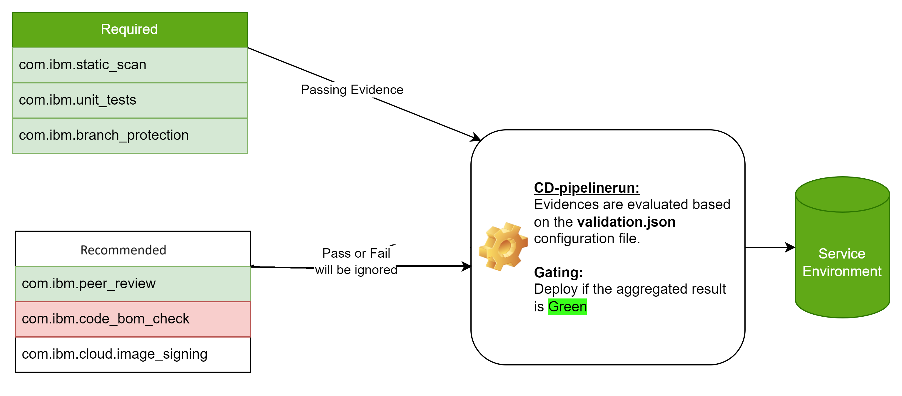

---

copyright:
  years: 2022, 2026
lastupdated: "2026-02-12"

keywords: DevSecOps, compliance evidence, evidence checks, IBM Cloud

subcollection: devsecops

---

{{site.data.keyword.attribute-definition-list}}

# Validating evidence
{: #evidence-checks-validation}

In the DevSecOps architecture, before deploying the assets, all the pieces of evidence that were collected in the CI pipeline must be validated so that the assets meet compliance requirements.
{: shortdesc}

Collecting evidence is an essential aspect of the DevSecOps reference architecture. The CI pipeline collects the pieces of evidence for all the scans or steps for the assets that are performed by the CI pipeline. The Continuous Deployment (CD) pipeline deploys the assets that are produced by the CI pipeline and Continuous Compliance (CC) pipeline scans the asset deployed by the CD pipeline.

You can validate the evidence in one of the following ways:


1. Using a config file.


## Using a config file
{: #evidence-checks-config-file}

Validating evidence by using a config file works as follows as follows:

- Pre-deployment checks validate the evidence that is produced by the CI pipeline and gates the deployment based on these checks. If all the checks are validated successfully, the change request is auto-approved. If any of the checks fail, the change request is not auto-approved and deployment is blocked. In the case of an `emergency` change request, the deployment is not blocked. The config file is part of the change request.
- Post-deployment checks validate the evidence that is produced by the CD pipeline and evaluates the pipeline based on these checks.
- The finishing step validates the post-deployment evidence checks and evaluates the CD pipeline. The checks are stored in the evidence locker beside the `summary.json` file.

For each asset type, different evidence types might need to be collected. So, in the checks you can define the asset type and based on that asset, the evidence that is collected for a tool is as follows:

### Enable evidence validation and evaluation using config file
{: #enable-evidence-checks-config-file}

To enable the `validation of evidence` in your toolchain, set the environment variable `opt-in-evidence-checks` to `1` in the CD and CC toolchain.

### Configure config file
{: #configure-evidence-checks-config-file}

To define the config file path, set `evidence-checks-config-path` to the file path present in the `pipeline-config-repo`, otherwise the default config file is used. Different deployment environments might have different config files. For example, `stage` might have evidence checks that differ from the production evidence checks. If `evidence-checks-config-path` is not defined, the config file searches for the file with the name `<region>.<target>.validation.json`, `<target>.validation.JSON`, or `validation.json` in the `pipeline-config-repo`.

There are two versions of this config file:


### Config file Version 2
{: #evidence-checks-config-filev2}


During CI/CD/CC pipeline runs we collect various evidences against various tools against various service environment
In simple terms service environment can be dev, prod and recently supported pre-prod(or stage)
Results of these evidences are aggregated to determine the overall application level compliance for a particular service environment
User can configure rules to determine how the result aggregation is performed.
Using a config file version2, user tweak on how to evaluate any particular evidence per service environment basis.
Evidence can be declared as:
*  recommended(default)
*  required

Below diagram shows how the evidence aggregation works:

 
 {: caption="Evidence aggregation" caption-side="bottom"}

### Evidence evaluation and Gating
{: #evidence-evaluation-gating}

When the required application compliance level is not achieved we gate the deployment in CD pipeline run.
Supported evidences for gating:

    pre-deployment[evidences list]
    post-deployment[evidences list]


### Various deployment topologies:
{: #various-deployment-topology}

#### 1. Promotion from `master` to `prod`
{: #various-deployment-topology-step1}

 {: caption="Usecase 1. Promotion from `master` to `prod`" caption-side="bottom"}


{: caption="Properties for `Manual Promotion Trigger` and `Manual CD Trigger`"}


#### 2. Promotion from `master` to `stage` and then to `prod`
{: #various-deployment-topology-step2}

 {: caption="Usecase 2. Promotion from `master` to `stage` to `prod`" caption-side="bottom"}


{: caption="Properties for `Manual Promotion Trigger` and `Manual CD Trigger` environment `stage`"}

{: caption="Properties for `Manual Promotion Trigger` and `Manual CD Trigger` environment `prod`"}

{: caption="Config file version2"}

#### 3. Promotion from `master` to `stage(us-east)` to `stage(us-south)` and then to `prod(us-south)`
{: #various-deployment-topology-step3}

 {: caption="Usecase 3. Promotion from `master` to `stage(us-east)` to `stage(us-south)` and then to `prod(us-south)`" caption-side="bottom"}

{: caption="Properties for `Manual Promotion Trigger` and `Manual CD Trigger` environment `stage(us-east)`"}

{: caption="Properties for `Manual Promotion Trigger` and `Manual CD Trigger` environment `stage(us-south)`"}

{: caption="Properties for `Manual Promotion Trigger` and `Manual CD Trigger` environment `prod(us-south)`"}

### Result Table for version2 `cocoa locker evidence check`:
{: #result-table-v2}


 
 {: caption="Properties for `Manual Promotion Trigger` and `Manual CD Trigger` environment `prod(us-south)`"}

### Pre-deployment (checks that are done before the change request is auto-approved)
{: #evidence-checks-predep}

- Asset type (for example `image`, `commit`, `*`, or any asset)
   - Evidence
     - Evidence type id (for example `com.ibm.static-scan`)
       - Required (The evidence presents in the `success` state)
         - Tool (Tool type for which evidence is collected. For example, `SonarQube`, `owasp-zap`, `*`, or any tool)
       - Recommended (if the evidence is missing/pending/failure, then pipeline will log warning messages)
         - Tool (Tool type for which evidence is collected. For example, `SonarQube`, `owasp-zap`, `*`, or any tool)

### Post-deployment (checks that evaluate the CD pipeline)
{: #evidence-checks-postdep}

- Asset type (for example `image`, `commit`, `*`, or any asset)
   - Evidence
     - Evidence type id (for example `com.ibm.acceptance_tests`)
       - Required (evidence must be present in the `success` state)
         - Tool (tool type, for example `jest`, `*`, or any tool)
       - Recommended (if the evidence is missing/pending/failure, then pipeline will log warning messages)
         - Tool (Tool type for which evidence is collected. For example, `SonarQube`, `owasp-zap`, `*`, or any tool)


Pipeline evaluation will also occur when the check is enabled in both the CD and CC, utilizing the configuration file.

Evidence originating from the CI pipeline should have origin as `ci-pipeline` in the config file.
{: tip}

### Sample config file version 2
{: #evidence-checks-samp-config-file}

```cmd
{
  "version": "2.0",
  "pre-deployment": [
    {
      "evidence_type_id": "com.ibm.prod_change_request",
      "rules": [
        {
          "asset_type": "image",
          "source_environments": [
            {
              "name": "stage"
            }
          ],
          "target_environments": [
            {
              "name": "stage"
            },
            {
              "name": "prod"
            }
          ],
          "required": [],
          "recommended": [
            {
              "name": "tool",
              "values": [
                "*"
              ],
              "description": "The tool that collected the evidence"
            }
          ]
        },
        {
          "asset_type": "*",
          "source_environments": [
            {
              "name": "stage"
            }
          ],
          "target_environments": [
            {
              "name": "stage"
            },
            {
              "name": "prod"
            }
          ],
          "required": [],
          "recommended": [
            {
              "name": "tool",
              "values": [
                "*"
              ],
              "description": "The tool that collected the evidence"
            }
          ]
        }
      ]
    },
    {
      "evidence_type_id": "com.ibm.acceptance_tests",
      "rules": [
        {
          "asset_type": "commit",
          "source_environments": [
            {
              "name": "ci-pipeline"
            },
            {
              "name": "stage"
            },
            {
              "name": "prod"
            }
          ],
          "target_environments": [
            {
              "name": "stage"
            },
            {
              "name": "prod"
            }
          ],
          "required": [],
          "recommended": [
            {
              "name": "tool",
              "values": [
                "*"
              ],
              "description": "The tool that collected the evidence"
            }
          ]
        },
        {
          "asset_type": "image",
          "source_environments": [
            {
              "name": "ci-pipeline"
            }
          ],
          "target_environments": [
            {
              "name": "stage"
            },
            {
              "name": "prod"
            }
          ],
          "required": [],
          "recommended": [
            {
              "name": "tool",
              "values": [
                "*"
              ],
              "description": "The tool that collected the evidence"
            }
          ]
        },
        {
          "asset_type": "*",
          "source_environments": [
            {
              "name": "ci-pipeline"
            }
          ],
          "target_environments": [
            {
              "name": "stage"
            },
            {
              "name": "prod"
            }
          ],
          "required": [],
          "recommended": [
            {
              "name": "tool",
              "values": [
                "*"
              ],
              "description": "The tool that collected the evidence"
            }
          ]
        }
      ]
    },
    {
      "evidence_type_id": "com.ibm.branch_protection",
      "rules": [
        {
          "asset_type": "commit",
          "source_environments": [
            {
              "name": "ci-pipeline"
            }
          ],
          "target_environments": [
            {
              "name": "stage"
            },
            {
              "name": "prod"
            }
          ],
          "required": [],
          "recommended": [
            {
              "name": "tool",
              "values": [
                "*"
              ],
              "description": "The tool that collected the evidence"
            }
          ]
        }
      ]
    },
    {
      "evidence_type_id": "com.ibm.cloud.slsa",
      "rules": [
        {
          "asset_type": "image",
          "source_environments": [
            {
              "name": "ci-pipeline"
            }
          ],
          "target_environments": [
            {
              "name": "stage"
            },
            {
              "name": "prod"
            }
          ],
          "required": [],
          "recommended": [
            {
              "name": "tool",
              "values": [
                "*"
              ],
              "description": "The tool that collected the evidence"
            }
          ]
        }
      ]
    },
    {
      "evidence_type_id": "com.ibm.dynamic_scan",
      "rules": [
        {
          "asset_type": "image",
          "source_environments": [
            {
              "name": "ci-pipeline"
            }
          ],
          "target_environments": [
            {
              "name": "stage"
            },
            {
              "name": "prod"
            }
          ],
          "required": [],
          "recommended": [
            {
              "name": "tool",
              "values": [
                "*"
              ],
              "description": "The tool that collected the evidence"
            }
          ]
        },
        {
          "asset_type": "*",
          "source_environments": [
            {
              "name": "ci-pipeline"
            }
          ],
          "target_environments": [
            {
              "name": "stage"
            },
            {
              "name": "prod"
            }
          ],
          "required": [],
          "recommended": [
            {
              "name": "tool",
              "values": [
                "*"
              ],
              "description": "The tool that collected the evidence"
            }
          ]
        }
      ]
    },
    {
      "evidence_type_id": "com.ibm.cloud.verify_signature",
      "rules": [
        {
          "asset_type": "image",
          "source_environments": [
            {
              "name": "stage"
            },
            {
              "name": "prod"
            }
          ],
          "target_environments": [
            {
              "name": "stage"
            },
            {
              "name": "prod"
            }
          ],
          "required": [],
          "recommended": [
            {
              "name": "tool",
              "values": [
                "*"
              ],
              "description": "The tool that collected the evidence"
            }
          ]
        },
        {
          "asset_type": "*",
          "source_environments": [
            {
              "name": "ci-pipeline"
            }
          ],
          "target_environments": [
            {
              "name": "stage"
            },
            {
              "name": "prod"
            }
          ],
          "required": [],
          "recommended": [
            {
              "name": "tool",
              "values": [
                "*"
              ],
              "description": "The tool that collected the evidence"
            }
          ]
        }
      ]
    },
    {
      "evidence_type_id": "com.ibm.cloud.image_vulnerability_scan",
      "rules": [
        {
          "asset_type": "image",
          "source_environments": [
            {
              "name": "ci-pipeline"
            }
          ],
          "target_environments": [
            {
              "name": "stage"
            },
            {
              "name": "prod"
            }
          ],
          "required": [],
          "recommended": [
            {
              "name": "tool",
              "values": [
                "*"
              ],
              "description": "The tool that collected the evidence"
            }
          ]
        },
        {
          "asset_type": "*",
          "source_environments": [
            {
              "name": "ci-pipeline"
            }
          ],
          "target_environments": [
            {
              "name": "stage"
            },
            {
              "name": "prod"
            }
          ],
          "required": [],
          "recommended": [
            {
              "name": "tool",
              "values": [
                "*"
              ],
              "description": "The tool that collected the evidence"
            }
          ]
        }
      ]
    },
    {
      "evidence_type_id": "com.ibm.peer_review",
      "rules": [
        {
          "asset_type": "commit",
          "source_environments": [
            {
              "name": "stage"
            },
            {
              "name": "prod"
            }
          ],
          "target_environments": [
            {
              "name": "stage"
            },
            {
              "name": "prod"
            }
          ],
          "required": [],
          "recommended": [
            {
              "name": "tool",
              "values": [
                "*"
              ],
              "description": "The tool that collected the evidence"
            }
          ]
        },
        {
          "asset_type": "*",
          "source_environments": [
            {
              "name": "ci-pipeline"
            }
          ],
          "target_environments": [
            {
              "name": "stage"
            },
            {
              "name": "prod"
            }
          ],
          "required": [],
          "recommended": [
            {
              "name": "tool",
              "values": [
                "*"
              ],
              "description": "The tool that collected the evidence"
            }
          ]
        }
      ]
    },
    {
      "evidence_type_id": "com.ibm.unit_tests",
      "rules": [
        {
          "asset_type": "commit",
          "source_environments": [
            {
              "name": "ci-pipeline"
            }
          ],
          "target_environments": [
            {
              "name": "stage"
            },
            {
              "name": "prod"
            }
          ],
          "required": [],
          "recommended": [
            {
              "name": "tool",
              "values": [
                "*"
              ],
              "description": "The tool that collected the evidence"
            }
          ]
        },
        {
          "asset_type": "*",
          "source_environments": [
            {
              "name": "ci-pipeline"
            }
          ],
          "target_environments": [
            {
              "name": "stage"
            },
            {
              "name": "prod"
            }
          ],
          "required": [],
          "recommended": [
            {
              "name": "tool",
              "values": [
                "*"
              ],
              "description": "The tool that collected the evidence"
            }
          ]
        }
      ]
    },
    {
      "evidence_type_id": "com.ibm.static_scan",
      "rules": [
        {
          "asset_type": "commit",
          "source_environments": [
            {
              "name": "ci-pipeline"
            }
          ],
          "target_environments": [
            {
              "name": "stage"
            },
            {
              "name": "prod"
            }
          ],
          "required": [],
          "recommended": [
            {
              "name": "tool",
              "values": [
                "*"
              ],
              "description": "The tool that collected the evidence"
            }
          ]
        },
        {
          "asset_type": "*",
          "source_environments": [
            {
              "name": "ci-pipeline"
            }
          ],
          "target_environments": [
            {
              "name": "stage"
            },
            {
              "name": "prod"
            }
          ],
          "required": [],
          "recommended": [
            {
              "name": "tool",
              "values": [
                "*"
              ],
              "description": "The tool that collected the evidence"
            }
          ]
        }
      ]
    },
    {
      "evidence_type_id": "com.ibm.detect_secrets",
      "rules": [
        {
          "asset_type": "commit",
          "source_environments": [
            {
              "name": "ci-pipeline"
            }
          ],
          "target_environments": [
            {
              "name": "stage"
            },
            {
              "name": "prod"
            }
          ],
          "required": [],
          "recommended": [
            {
              "name": "tool",
              "values": [
                "*"
              ],
              "description": "The tool that collected the evidence"
            }
          ]
        },
        {
          "asset_type": "*",
          "source_environments": [
            {
              "name": "ci-pipeline"
            }
          ],
          "target_environments": [
            {
              "name": "stage"
            },
            {
              "name": "prod"
            }
          ],
          "required": [],
          "recommended": [
            {
              "name": "tool",
              "values": [
                "*"
              ],
              "description": "The tool that collected the evidence"
            }
          ]
        }
      ]
    },
    {
      "evidence_type_id": "com.ibm.code_vulnerability_scan",
      "rules": [
        {
          "asset_type": "commit",
          "source_environments": [
            {
              "name": "ci-pipeline"
            }
          ],
          "target_environments": [
            {
              "name": "stage"
            },
            {
              "name": "prod"
            }
          ],
          "required": [],
          "recommended": [
            {
              "name": "tool",
              "values": [
                "*"
              ],
              "description": "The tool that collected the evidence"
            }
          ]
        },
        {
          "asset_type": "*",
          "source_environments": [
            {
              "name": "ci-pipeline"
            }
          ],
          "target_environments": [
            {
              "name": "stage"
            },
            {
              "name": "prod"
            }
          ],
          "required": [],
          "recommended": [
            {
              "name": "tool",
              "values": [
                "*"
              ],
              "description": "The tool that collected the evidence"
            }
          ]
        }
      ]
    },
    {
      "evidence_type_id": "com.ibm.code_cis_check",
      "rules": [
        {
          "asset_type": "commit",
          "source_environments": [
            {
              "name": "ci-pipeline"
            }
          ],
          "target_environments": [
            {
              "name": "stage"
            },
            {
              "name": "prod"
            }
          ],
          "required": [],
          "recommended": [
            {
              "name": "tool",
              "values": [
                "*"
              ],
              "description": "The tool that collected the evidence"
            }
          ]
        },
        {
          "asset_type": "*",
          "source_environments": [
            {
              "name": "ci-pipeline"
            }
          ],
          "target_environments": [
            {
              "name": "stage"
            },
            {
              "name": "prod"
            }
          ],
          "required": [],
          "recommended": [
            {
              "name": "tool",
              "values": [
                "*"
              ],
              "description": "The tool that collected the evidence"
            }
          ]
        }
      ]
    },
    {
      "evidence_type_id": "com.ibm.code_bom_check",
      "rules": [
        {
          "asset_type": "commit",
          "source_environments": [
            {
              "name": "ci-pipeline"
            }
          ],
          "target_environments": [
            {
              "name": "stage"
            },
            {
              "name": "prod"
            }
          ],
          "required": [],
          "recommended": [
            {
              "name": "tool",
              "values": [
                "*"
              ],
              "description": "The tool that collected the evidence"
            }
          ]
        },
        {
          "asset_type": "*",
          "source_environments": [
            {
              "name": "ci-pipeline"
            }
          ],
          "target_environments": [
            {
              "name": "stage"
            },
            {
              "name": "prod"
            }
          ],
          "required": [],
          "recommended": [
            {
              "name": "tool",
              "values": [
                "*"
              ],
              "description": "The tool that collected the evidence"
            }
          ]
        }
      ]
    },
    {
      "evidence_type_id": "com.ibm.network_compliance",
      "rules": [
        {
          "asset_type": "commit",
          "source_environments": [
            {
              "name": "ci-pipeline"
            }
          ],
          "target_environments": [
            {
              "name": "stage"
            },
            {
              "name": "prod"
            }
          ],
          "required": [],
          "recommended": [
            {
              "name": "tool",
              "values": [
                "*"
              ],
              "description": "The tool that collected the evidence"
            }
          ]
        },
        {
          "asset_type": "*",
          "source_environments": [
            {
              "name": "ci-pipeline"
            }
          ],
          "target_environments": [
            {
              "name": "stage"
            },
            {
              "name": "prod"
            }
          ],
          "required": [],
          "recommended": [
            {
              "name": "tool",
              "values": [
                "*"
              ],
              "description": "The tool that collected the evidence"
            }
          ]
        }
      ]
    },
    {
      "evidence_type_id": "com.ibm.pipeline_run_data",
      "rules": [
        {
          "asset_type": "generic",
          "source_environments": [
            {
              "name": "ci-pipeline"
            }
          ],
          "target_environments": [
            {
              "name": "stage"
            },
            {
              "name": "prod"
            }
          ],
          "required": [],
          "recommended": [
            {
              "name": "tool",
              "values": [
                "*"
              ],
              "description": "The tool that collected the evidence"
            }
          ]
        }
      ]
    },
    {
      "evidence_type_id": "com.ibm.pipeline_logs",
      "rules": [
        {
          "asset_type": "generic",
          "source_environments": [
            {
              "name": "ci-pipeline"
            }
          ],
          "target_environments": [
            {
              "name": "stage"
            },
            {
              "name": "prod"
            }
          ],
          "required": [],
          "recommended": [
            {
              "name": "tool",
              "values": [
                "*"
              ],
              "description": "The tool that collected the evidence"
            }
          ]
        }
      ]
    },
    {
      "evidence_type_id": "com.ibm.code-branch-protection",
      "rules": [
        {
          "asset_type": "*",
          "source_environments": [
            {
              "name": "ci-pipeline"
            }
          ],
          "target_environments": [
            {
              "name": "stage"
            },
            {
              "name": "prod"
            }
          ],
          "required": [],
          "recommended": [
            {
              "name": "tool",
              "values": [
                "*"
              ],
              "description": "The tool that collected the evidence"
            }
          ]
        }
      ]
    },
    {
      "evidence_type_id": "com.ibm.cloud.image_signing",
      "rules": [
        {
          "asset_type": "*",
          "source_environments": [
            {
              "name": "ci-pipeline"
            }
          ],
          "target_environments": [
            {
              "name": "stage"
            },
            {
              "name": "prod"
            }
          ],
          "required": [],
          "recommended": [
            {
              "name": "tool",
              "values": [
                "*"
              ],
              "description": "The tool that collected the evidence"
            }
          ]
        }
      ]
    }
  ],
  "post-deployment": [
    {
      "evidence_type_id": "com.ibm.prod_change_request",
      "rules": [
        {
          "asset_type": "image",
          "source_environments": [
            {
              "name": "stage"
            }
          ],
          "target_environments": [
            {
              "name": "stage"
            },
            {
              "name": "prod"
            }
          ],
          "required": [],
          "recommended": [
            {
              "name": "tool",
              "values": [
                "*"
              ],
              "description": "The tool that collected the evidence"
            }
          ]
        },
        {
          "asset_type": "*",
          "source_environments": [
            {
              "name": "stage"
            }
          ],
          "target_environments": [
            {
              "name": "stage"
            },
            {
              "name": "prod"
            }
          ],
          "required": [],
          "recommended": [
            {
              "name": "tool",
              "values": [
                "*"
              ],
              "description": "The tool that collected the evidence"
            }
          ]
        }
      ]
    },
    {
      "evidence_type_id": "com.ibm.acceptance_tests",
      "rules": [
        {
          "asset_type": "commit",
          "source_environments": [
            {
              "name": "stage"
            },
            {
              "name": "prod"
            }
          ],
          "target_environments": [
            {
              "name": "stage"
            },
            {
              "name": "prod"
            }
          ],
          "required": [],
          "recommended": [
            {
              "name": "tool",
              "values": [
                "*"
              ],
              "description": "The tool that collected the evidence"
            }
          ]
        },
        {
          "asset_type": "image",
          "source_environments": [
            {
              "name": "stage"
            },
            {
              "name": "prod"
            }
          ],
          "target_environments": [
            {
              "name": "stage"
            },
            {
              "name": "prod"
            }
          ],
          "required": [],
          "recommended": [
            {
              "name": "tool",
              "values": [
                "*"
              ],
              "description": "The tool that collected the evidence"
            }
          ]
        },
        {
          "asset_type": "*",
          "source_environments": [
            {
              "name": "stage"
            },
            {
              "name": "prod"
            }
          ],
          "target_environments": [
            {
              "name": "stage"
            },
            {
              "name": "prod"
            }
          ],
          "required": [],
          "recommended": [
            {
              "name": "tool",
              "values": [
                "*"
              ],
              "description": "The tool that collected the evidence"
            }
          ]
        }
      ]
    },
    {
      "evidence_type_id": "com.ibm.pipeline_run_data",
      "rules": [
        {
          "asset_type": "generic",
          "source_environments": [
            {
              "name": "stage"
            },
            {
              "name": "prod"
            }
          ],
          "target_environments": [
            {
              "name": "stage"
            },
            {
              "name": "prod"
            }
          ],
          "required": [],
          "recommended": [
            {
              "name": "tool",
              "values": [
                "*"
              ],
              "description": "The tool that collected the evidence"
            }
          ]
        }
      ]
    },
    {
      "evidence_type_id": "com.ibm.pipeline_logs",
      "rules": [
        {
          "asset_type": "generic",
          "source_environments": [
            {
              "name": "stage"
            },
            {
              "name": "prod"
            }
          ],
          "target_environments": [
            {
              "name": "stage"
            },
            {
              "name": "prod"
            }
          ],
          "required": [],
          "recommended": [
            {
              "name": "tool",
              "values": [
                "*"
              ],
              "description": "The tool that collected the evidence"
            }
          ]
        }
      ]
    }
  ]
}

```


### Config file Version 1
### Pre-deployment (checks that are done before the change request is auto-approved)
{: #evidence-checks-predep-version1}

- Asset type (for example `image`, `commit`, `*`, or any asset)
   - Evidence
     - Evidence type id (for example `com.ibm.static-scan`)
       - Required (The evidence presents in the `success` state)
         - Tool (Tool type for which evidence is collected. For example, `SonarQube`, `owasp-zap`, `*`, or any tool)
       - Optional (if the evidence is present, then it must be in the `success` state)
         - Tool (Tool type for which evidence is collected. For example, `SonarQube`, `owasp-zap`, `*`, or any tool)
       - Ignore (evidence is not validated)

### Post-deployment (checks that evaluate the CD pipeline)
{: #evidence-checks-postdep-version1}

- Asset type (for example `image`, `commit`, `*`, or any asset)
   - Evidence
     - Evidence type id (for example `com.ibm.acceptance_tests`)
       - Required (evidence must be present in the `success` state)
         - Tool (tool type, for example `jest`, `*`, or any tool)
       - Optional (if the evidence is present, then it must be in the `success` state)
         - Tool (tool type, for example `servicenow-v3`, `*`, or any tool)
       - Ignore (evidence is not validated)


Pipeline evaluation will also occur when the check is enabled in both the CD and CC, utilizing the configuration file.

### Sample config file version 1
{: #evidence-checks-samp-config-file-version1}

```cmd
{
  "pre-deployment": [
    {
      "asset_type": "commit",
      "evidences": [
        {
          "evidence_type_id": "com.ibm.branch_protection",
          "rules": {
            "required": [],
            "optional": [
              {
                "tool": "*"
              }
            ],
            "ignore": []
          }
        },
        {
          "evidence_type_id": "com.ibm.peer_review",
          "rules": {
            "required": [],
            "optional": [
              {
                "tool": "*"
              }
            ],
            "ignore": []
          }
        },
        {
          "evidence_type_id": "com.ibm.unit_tests",
          "rules": {
            "required": [],
            "optional": [
              {
                "tool": "*"
              }
            ],
            "ignore": []
          }
        },
        {
          "evidence_type_id": "com.ibm.static_scan",
          "rules": {
            "required": [],
            "optional": [
              {
                "tool": "*"
              }
            ],
            "ignore": []
          }
        },
        {
          "evidence_type_id": "com.ibm.detect_secrets",
          "rules": {
            "required": [],
            "optional": [
              {
                "tool": "*"
              }
            ],
            "ignore": []
          }
        },
        {
          "evidence_type_id": "com.ibm.code_vulnerability_scan",
          "rules": {
            "required": [],
            "optional": [
              {
                "tool": "*"
              }
            ],
            "ignore": []
          }
        },
        {
          "evidence_type_id": "com.ibm.code_cis_check",
          "rules": {
            "required": [],
            "optional": [
              {
                "tool": "*"
              }
            ],
            "ignore": []
          }
        },
        {
          "evidence_type_id": "com.ibm.code_bom_check",
          "rules": {
            "required": [],
            "optional": [
              {
                "tool": "*"
              }
            ],
            "ignore": []
          }
        },
        {
          "evidence_type_id": "com.ibm.acceptance_tests",
          "rules": {
            "required": [],
            "optional": [
              {
                "tool": "*"
              }
            ],
            "ignore": []
          }
        }
      ]
    },
    {
      "asset_type": "image",
      "evidences": [
        {
          "evidence_type_id": "com.ibm.cloud.slsa",
          "rules": {
            "required": [],
            "optional": [
              {
                "tool": "*"
              }
            ],
            "ignore": []
          }
        },
        {
          "evidence_type_id": "com.ibm.cloud.image_signing",
          "rules": {
            "required": [],
            "optional": [
              {
                "tool": "*"
              }
            ],
            "ignore": []
          }
        },
        {
          "evidence_type_id": "com.ibm.cloud.image_vulnerability_scan",
          "rules": {
            "required": [],
            "optional": [
              {
                "tool": "*"
              }
            ],
            "ignore": []
          }
        },
        {
          "evidence_type_id": "com.ibm.dynamic_scan",
          "rules": {
            "required": [],
            "optional": [
              {
                "tool": "*"
              }
            ],
            "ignore": []
          }
        },
        {
          "evidence_type_id": "com.ibm.cloud.verify_signature",
          "rules": {
            "required": [],
            "optional": [
              {
                "tool": "*"
              }
            ],
            "ignore": []
          }
        }
      ]
    },
    {
      "asset_type": "generic",
      "evidences": [
        {
          "evidence_type_id": "com.ibm.pipeline_run_data",
          "rules": {
            "required": [],
            "optional": [
              {
                "tool": "*"
              }
            ],
            "ignore": []
          }
        },
        {
          "evidence_type_id": "com.ibm.pipeline_logs",
          "rules": {
            "required": [],
            "optional": [
              {
                "tool": "*"
              }
            ],
            "ignore": []
          }
        }
      ]
    },
    {
      "asset_type": "*",
      "evidences": [
        {
          "evidence_type_id": "com.ibm.code-branch-protection",
          "rules": {
            "required": [],
            "optional": [
              {
                "tool": "*"
              }
            ],
            "ignore": []
          }
        },
        {
          "evidence_type_id": "com.ibm.peer_review",
          "rules": {
            "required": [],
            "optional": [
              {
                "tool": "*"
              }
            ],
            "ignore": []
          }
        },
        {
          "evidence_type_id": "com.ibm.unit_tests",
          "rules": {
            "required": [],
            "optional": [
              {
                "tool": "*"
              }
            ],
            "ignore": []
          }
        },
        {
          "evidence_type_id": "com.ibm.static_scan",
          "rules": {
            "required": [],
            "optional": [
              {
                "tool": "*"
              }
            ],
            "ignore": []
          }
        },
        {
          "evidence_type_id": "com.ibm.detect_secrets",
          "rules": {
            "required": [],
            "optional": [
              {
                "tool": "*"
              }
            ],
            "ignore": []
          }
        },
        {
          "evidence_type_id": "com.ibm.code_vulnerability_scan",
          "rules": {
            "required": [],
            "optional": [
              {
                "tool": "*"
              }
            ],
            "ignore": []
          }
        },
        {
          "evidence_type_id": "com.ibm.code_cis_check",
          "rules": {
            "required": [],
            "optional": [
              {
                "tool": "*"
              }
            ],
            "ignore": []
          }
        },
        {
          "evidence_type_id": "com.ibm.code_bom_check",
          "rules": {
            "required": [],
            "optional": [
              {
                "tool": "*"
              }
            ],
            "ignore": []
          }
        },
        {
          "evidence_type_id": "com.ibm.cloud.image_signing",
          "rules": {
            "required": [],
            "optional": [
              {
                "tool": "*"
              }
            ],
            "ignore": []
          }
        },
        {
          "evidence_type_id": "com.ibm.acceptance_tests",
          "rules": {
            "required": [],
            "optional": [
              {
                "tool": "*"
              }
            ],
            "ignore": []
          }
        },
        {
          "evidence_type_id": "com.ibm.cloud.image_vulnerability_scan",
          "rules": {
            "required": [],
            "optional": [
              {
                "tool": "*"
              }
            ],
            "ignore": []
          }
        },
        {
          "evidence_type_id": "com.ibm.dynamic_scan",
          "rules": {
            "required": [],
            "optional": [
              {
                "tool": "*"
              }
            ],
            "ignore": []
          }
        },
        {
          "evidence_type_id": "com.ibm.cloud.verify_signature",
          "rules": {
            "required": [],
            "optional": [
              {
                "tool": "*"
              }
            ],
            "ignore": []
          }
        }
      ]
    }
  ],
  "post-deployment": [
    {
      "asset_type": "image",
      "evidences": [
        {
          "evidence_type_id": "com.ibm.prod_change_request",
          "rules": {
            "required": [],
            "optional": [
              {
                "tool": "*"
              }
            ],
            "ignore": []
          }
        },
        {
          "evidence_type_id": "com.ibm.acceptance_tests",
          "rules": {
            "required": [],
            "optional": [
              {
                "tool": "*"
              }
            ],
            "ignore": []
          }
        }
      ]
    },
    {
      "asset_type": "generic",
      "evidences": [
        {
          "evidence_type_id": "com.ibm.pipeline_run_data",
          "rules": {
            "required": [],
            "optional": [
              {
                "tool": "*"
              }
            ],
            "ignore": []
          }
        },
        {
          "evidence_type_id": "com.ibm.pipeline_logs",
          "rules": {
            "required": [],
            "optional": [
              {
                "tool": "*"
              }
            ],
            "ignore": []
          }
        }
      ]
    },
    {
      "asset_type": "commit",
      "evidences": [
        {
          "evidence_type_id": "com.ibm.acceptance_tests",
          "rules": {
            "required": [],
            "optional": [
              {
                "tool": "*"
              }
            ],
            "ignore": []
          }
        }
      ]
    },
    {
      "asset_type": "*",
      "evidences": [
        {
          "evidence_type_id": "com.ibm.prod_change_request",
          "rules": {
            "required": [],
            "optional": [
              {
                "tool": "*"
              }
            ],
            "ignore": []
          }
        },
        {
          "evidence_type_id": "com.ibm.acceptance_tests",
          "rules": {
            "required": [],
            "optional": [
              {
                "tool": "*"
              }
            ],
            "ignore": []
          }
        }
      ]
    }
  ]
}

```

### Default tool value for the verious stages in the DevSecOps
{: #default-supported-tool-in-evidence-checks-config-file}

| Evidence type ID  | Default supported tool |
|:----------|:------------------------------|
|`com.ibm.branch_protection` | `cocoa-branch-protection` |
|`com.ibm.unit_tests` | `jest` |
|`com.ibm.detect_secrets` | `detect-secrets` |
|`com.ibm.code_vulnerability_scan` | For apps: `cra-tf`, `cra`, `mend` </br>For infrastructure as code: `tfsec`, `checkov`|
|`com.ibm.code_bom_check` | `cra-bom`, `sbom-utility` |
|`com.ibm.code_cis_check` | `cra-cis` |
|`com.ibm.peer_review` | `peer-review` |
|`com.ibm.static_scan` | For apps: `sonarqube`, `gosec` </br> For infrastructure as code: `terraform-fmt`, `terraform-validate`, `tflint` |
|`com.ibm.cloud.image_signing` | `artifact-signing` |
|`com.ibm.acceptance_tests` | `jest` |
|`com.ibm.dynamic_scan` | `owasp-zap`, `owasp-zap-ui` |
|`com.ibm.cloud.image_vulnerability_scan` | `va`, `sysdig`, `xray` |
|`com.ibm.prod_change_request` |  `gitlab`, |
|`com.ibm.close_change_request` |  `gitlab`|

|`com.ibm.cloud.slsa` | `tekton-chains` |
{: caption="Supported tool for evidence" caption-side="top"}

### FAQ: Compliance Checks in CD Pipelines 
 {: #evidence-checks-config-file-faq}
 {: faq}
 {: support}


 #### What does **all checks are set to recommended** mean?

 It means that while the pipeline recommends passing all compliance checks, it doesn't automatically fail if they aren't. You, as the user, are responsible for ensuring all failing or missing compliance checks are addressed and fixed during your CI process. The pipeline is flagging these issues for you to investigate and resolve.

 #### How to check if all the compliance checks are met?

 - Navigate to the CD Pipeline: Go to the specific CD pipeline associated with your change.
 - Locate the Pre-Change-Request Task: Within the pipeline, find the task labeled "pre-change-request" and then select the "change-request" step.
 - Find the PRE-DEPLOYMENT Tables: Look for a table section with the keyword **PRE-DEPLOYMENT:**. You'll see two tables within this section.

 #### Understanding the Tables
 1)	Asset table

     a.	Asset table contains the ID which is the primary key of this table and foreign key AssetId of the evidence check table

     b.	Uri contains your actual asset against which all the evidence are collected or supposed to be collected

 2)	Evidence check table

     a.	EvidenceTypeId specifies which evidence type its looking for.

     b.	Evidence Origin specifies the origin of the evidence. If it says ci-pipeline then it expects that the evidence should be collected for that evidenceTypeId for that AssetId.

 #### What to do when you see entries in the Evidence Check Table as missing or failed? 

 For each entry in the Evidence Check table, ask yourself these questions:
 Have I ever collected this type of evidence for this asset within my CI pipeline?

  1.	If NO:
      Is this a valid compliance requirement for my service?

          a. YES: You need to implement the necessary steps in your CI pipeline to collect and provide this evidence. This might involve adding new tools, scripts, or configurations. [Help Guide](/docs/devsecops?topic=devsecops-devsecops-asset-evidence-collection) 
          
          b. NO: Reach out to your security focal explain why you believe this check is not relevant or valid for your service. Provide a clear justification and remove that check from the config file.

  2.	If YES: (You have collected this evidence previously)

        Why is it still showing as missing in the Evidence Check table? There might be an issue with how the evidence is being reported, processed, or linked to the asset.
