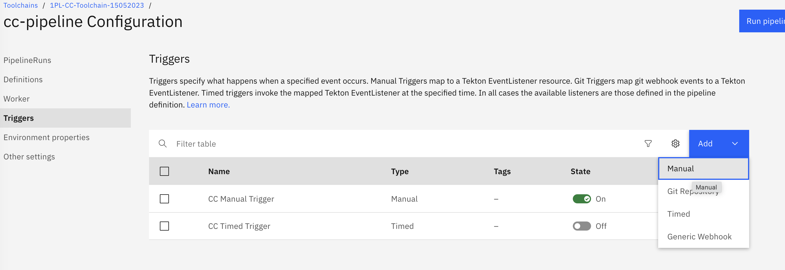
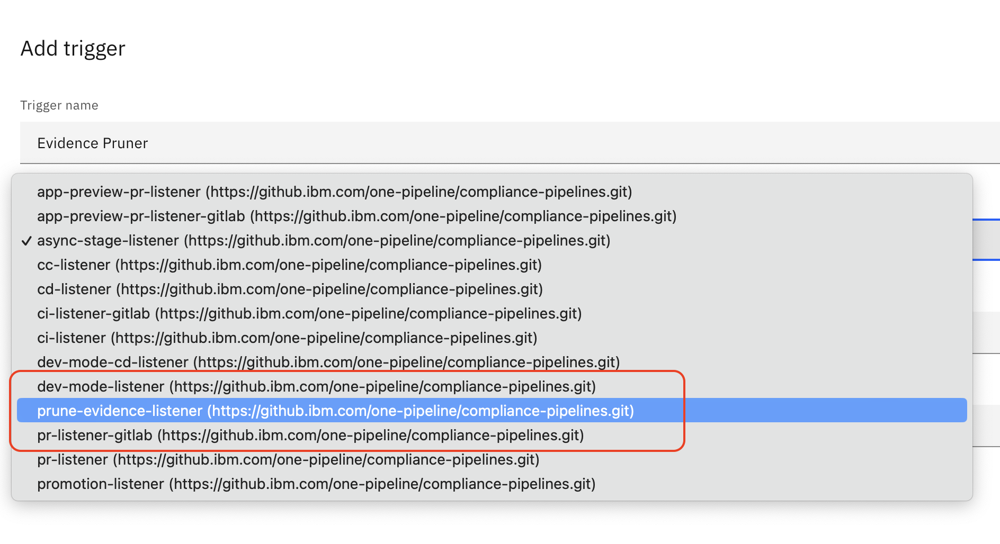
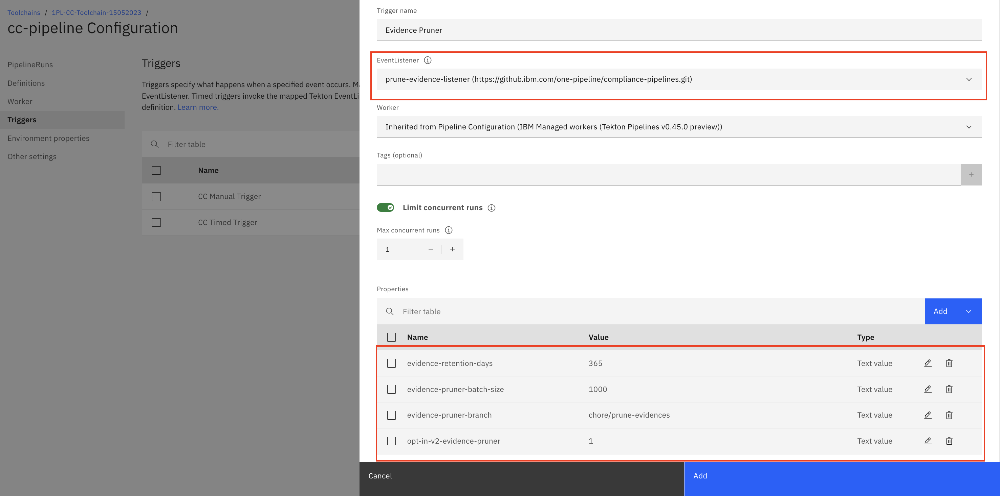
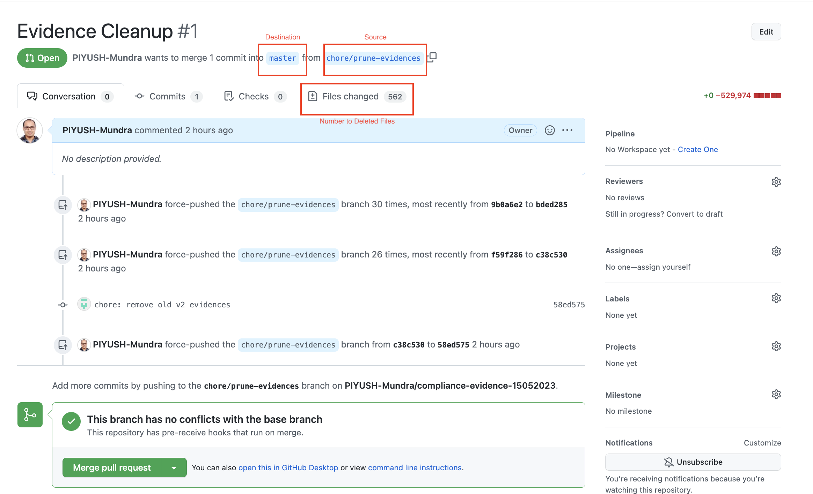
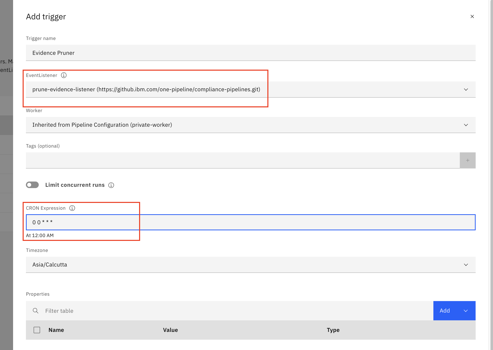

---

copyright: 
  years: 2023, 2023
lastupdated: "2023-05-30"

keywords: DevSecOps, compliance evidence, IBM Cloud, evidence pruner

subcollection: devsecops

---

{{site.data.keyword.attribute-definition-list}}

# Removing compliance evidence generated before a designated time
{: #devsecops-prune-evidence}

Because of the substantial volume of evidence generated by DevSecOps pipelines, the Git repository continuously expands causing performance degradation and failure during pipeline runs. Therefore, you must remove older evidence by using the evidence pruning tool. 
{: shortdesc}

Collecting evidence an essential aspect of the DevSecOps reference architecture. Compliance evidence establishes an audit trail that auditors seek during compliance audits. One of the objectives of DevSecOps is to automate the generation and storage of evidence in auditable evidence lockers. The primary locker for housing evidence is the Git repository.

The Cloud Object Storage bucket functions as a secondary evidence repository and automatically prunes evidence based on a retention policy of 365 days. However, the Git Evidence Repository, serving as the primary evidence repository, requires explicit cleanup of evidence that surpasses the 365-day threshold. The evidence pruning tool eliminates any evidence that is generated before a designated time for the Git Evidence Repository.
{: attention}

## Running the evidence pruning tool
{: #devsecops-prune-evidence-run}

The evidence pruning trigger is preconfigured for DevSecOps pipelines that are created after the v9.16.0 release of compliance pipelines. However, the following take the following steps if you have existing DevSecOps Toolchains.

1. Add a manual trigger  

   While there are no definitive guidelines on the choice of pipelines (CI, CD, or CC) for configuring the evidence pruning tool, you must set it up within the CC Pipeline. Based on your choice of pipeline, go to **Pipeline Configuration" > Triggers > Add** and select **Manual**.

   {: caption="Figure 1. Manual trigger for Pruning Evidence" caption-side="bottom"}

1. Select the prune evidence listener for the trigger

   In the context of one pipeline, the evidence pruning tool appears as a new Tekton listener for the pipeline. Select **prune-evidence-listener**. 

   {: caption="Figure 2. One pipeline Tekton listener for pruning evidence" caption-side="bottom"}

1. Configure the following environment properties for the trigger:

   |Name |Type	|Description |Required or Optional |
   |:----------|:------------------------------|:------------------|:----------|
   | `evidence-retention-days` 		|Text 		| The duration days, for which evidence is retained. Default is `365`. | Required			|
   | `evidence-pruner-batch-size`	|Text		| The count of evidence files that undergo cleanup before the pull request is updated. Default is `1000`.	| Optional			|
   | `evidence-pruner-branch`	|Text 		| The branch within the evidence locker Git repository that is created to facilitate the cleanup and promotion of evidence within the default branch. Default is `chore/prune-evidences`. | Optional			|
   | `opt-in-v1-evidence-pruner`		|Text		| When set to `1`, all the v1 evidence files are removed.	Default is `0`.| Optional			|
   | `opt-in-v2-evidence-pruner`		|Text		| When set to `1`, all the v2 evidence files that are generated before `evidence-retention-days` days are removed. Default is `0`.|Optional			|
   {: caption="Table 1. Prune evidence trigger parameters}

   {: caption="Figure 3. Configure environment properties" caption-side="bottom"}

1. Run the manual trigger

   When the evidence pruner trigger is configured with the appropriate environment properties, you can trigger the evidence pruner pipeline similarly to other pipelines. The trigger performs the following steps:

   1. Clones the evidence repository.
   1. Generates a list of all files created a specified number of `evidence-retention-days` before the current date.
   1. Deletes an initial batch of files, where the batch size is determined by `evidence-pruner-batch-size`.
   1. Creates a pull request for the evidence repository by using the `evidence-pruner-branch` as the source branch and the default configured branch as the destination.
   1. Iterates through the list that is generated in Step 2 to remove the corresponding files from the repository in Step 3, and updates the Pull Request from Step 4.
   1. Generates a summary of the activities, including a link to the pull request.

1. Review and merge the pull request

   When the pull request is generated for the evidence repository, you can review and merge it. The following is an example of how a sample pull request after the completion of the evidence pruner pipeline.

   {: caption="Figure 4. Merge Pull Request" caption-side="bottom"}

### Customizing the trigger
{: #devsecops-prune-evidence-custom}

The evidence pruning tool is implemented by using [Custom tasks](/docs/devsecops?topic=devsecops-custom-scripts) in DevSecOps pipelines. You must use the default implementation. However, you can also extend or replace the default implementation with a custom implementation. Customize the default by introducing a stage definition in `.pipeline-config.yaml`, which instructs the pipeline to override the default stage definition. 

The following code snippet starts the default implementation of the evidence pruning script that is located at `/opt/commons/prune-evidence/run.sh` within the `compliance-baseimage` Docker image. If you want to customize the default implementation, substitute this snippet with your own implementations.

```yaml

  prune-evidence:
    image: icr.io/continuous-delivery/pipeline/pipeline-base-ubi:3.18
    dind: false
    abort_on_failure: stopAndFail
    image_pull_policy: IfNotPresent
    script: |
      #!/bin/sh

      "/opt/commons/prune-evidence/run.sh"
```
{: codeblock}

### Configuring the listener for the timed trigger
{: #devsecops-prune-evidence-automate}

Automate the evidence pruning activity to be started at periodic intervals by configuring a timed trigger as follows:

1. Go to **Pipeline Configuration > Triggers > Add > Timed**.
1. Select **prune-evidence-listener** in the **EventListener** field.
1. Set a trigger time in the **CRON Expression** field.

{: caption="Figure 5. Timed trigger" caption-side="bottom"}
