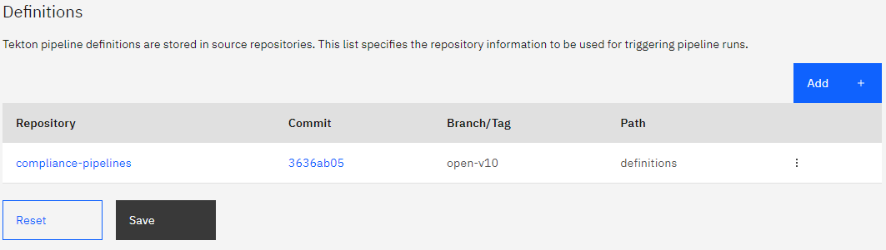

---

copyright: 
  years: 2023, 2023
lastupdated: "2023-05-22"

keywords: DevSecOps, compliance evidence, IBM Cloud, evidence pruner

subcollection: devsecops

---

{{site.data.keyword.attribute-definition-list}}

# Pruning evidence
{: #devsecops-prune-evidence}

Use the evidence pruner to clean up all the evidence that is generated before a specific time.
{: shortdesc}

Collecting evidence an essential aspect of the DevSecOps reference architecture. Compliance evidence creates the audit trail that auditors look for during a compliance audit. One of the goals of DevSecOps is to automate evidence generation and storage in auditable evidence lockers. The primary locker for the evidence is the Git repository. Because DevSecOps generates a large volume of evidence, the repository keeps growing. Old evidence must be cleaned up. The evidence pruner cleans up all the evidence that is generated before a specific time. Cloud Object Storage buckets that store evidence have a retention policy of 365 days. Similiarly, you must clean up the evidence in the Git repository that is older than 365 days.

You can roll back up to the point in time that evidence is retained in the evidence locker. If you clean the evidence and then later you try to roll back to a specified version, the rollback does not work. You might need to rebuild the app on the commit on which you want to roll back.
{: attention}

## Parameters
{: #evidence-prune-parm}

To run the Evidence pruner scan, the trigger must have the following parameters:

|Name |Type	|Description |Required or Optional |
|:----------|:------------------------------|:------------------|:----------|
| `evidence-retention-days` 		|Text 		| The number of days up to which evidence is retained.	You must set this parameter to `365`. | Required			|
| `evidence-pruner-batch-size`	|Text		|The number of evidence files that are cleaned up before updating the pull request. Default is `1000`.	| Optional			|
| `evidence-pruner-branch`	|Text 		|The branch that is created to clean up and promote evidence in the default branch.	Default is `chore/prune-evidences`|Optional			|
| `opt-in-v1-evidence-pruner`		|Text		|If set to `1`, all the v1 evidence files are cleaned up.	Default is `0`.|Optional			|
|opt-in-v2-evidence-pruner		|Text		| If set to `1`, all the v2 evidence files that were generated before `evidence-retention-days` days are cleaned up. Default is `0`.|Optional			|
{: caption="Table 1. Prune evidence trigger parameters}

## Trigger and listener
{: #evidence-prune-trigger}

To enable evidence pruner in one pipeline, take the following steps:
  
1. Go to the **Defintions** page of your CI, CD, or CC pipeline.
1. Click the **Actions** icon  on the repository entry and click **Edit**.
1. Update the branch to `v10` or `v10-master` and click **Update**.

{: caption="Figure 1. Pipeline definitions" caption-side="bottom"}

If the toolchain is already created, then you can create a new trigger by using the following steps. Alternatively you can find these triggers in the **Trigger** section:

1. Go to the **Triggers** page of your CI, CD, CC pipeline and click **ADD**.
1. Provide a name to the trigger, select the evidence listener as `prune-evidence-listener`, and provide the required proerty `evidence-retention-days` as the number of days to retain the evidence.
1. Click **Save**.

For more information about Tekton pipeline triggers, see [Working with Tekton pipelines](/docs/ContinuousDelivery?topic=ContinuousDelivery-tekton-pipelines).
