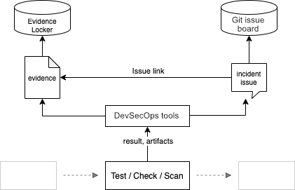
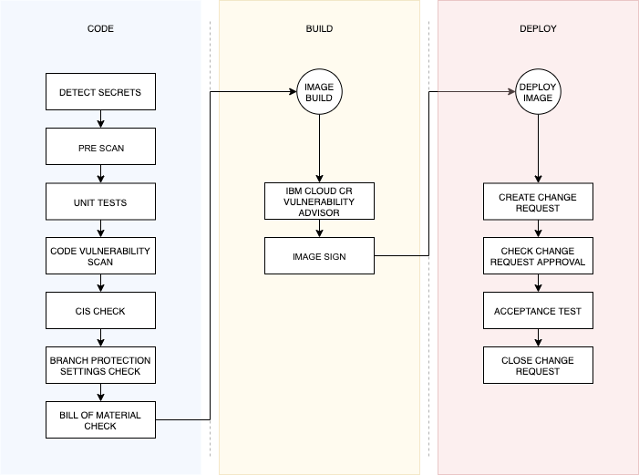
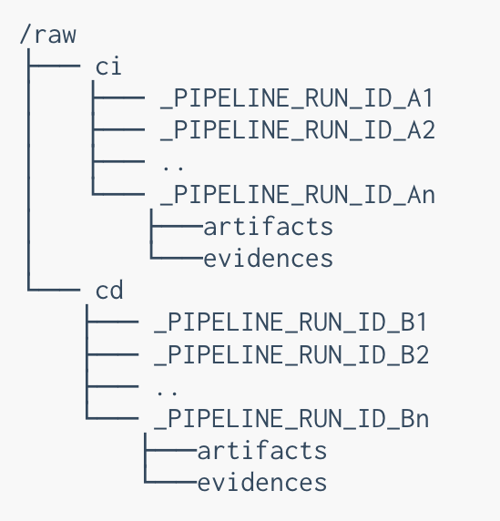
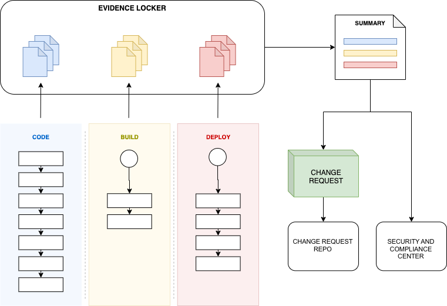

---

copyright:
  years: 2021
lastupdated: "2021-12-08"

keywords: DevSecOps, compliance evidence

subcollection: devsecops

---

{:shortdesc: .shortdesc}
{:table: .aria-labeledby="caption"}
{:external: target="_blank" .external}
{:codeblock: .codeblock}
{:pre: .pre}
{:screen: .screen}
{:tip: .tip}
{:note: .note}
{:important: .important}
{:download: .download}
{:help: data-hd-content-type='help'}
{:support: data-reuse='support'}

# Evidence
{: #cd-devsecops-evidence}

Collecting evidence is one of the essential aspects of the DevSecOps reference architecture. Compliance evidence creates the audit trail that auditors look for during a compliance audit. One of the goals of DevSecOps is automated evidence generation and storage in auditable evidence lockers.
{: shortdesc}

## Evidence format
{: #cd-devsecops-evidence-format}

The `Evidence` type represents the schema of the evidence. Although the schema uses typescript syntax, you can convert it to use JSON schema.


```bash
interface Evidence {
  evidence_type_id: string;      // name of the evidence
  evidence_type_version: string; // version of the evidence schema
  date: string;                  // ISO-8601, UTC
  toolchain_crn: string;
  pipeline_id: string;
  pipeline_run_id: string;
  result: 'success' | 'failure';
  issues: string[];              // list of issues that were opened to track 'failed' state
  log: Artifact;                 // logs related to the evidence
  subject: string                // the repo url or artifact url
  artifacts: Artifact[];         // additional artifacts related to the evidence

  [origin]: {
    url: string; // origin of the evidence, e.g. path github where the task resides;
    version: string; // version of the task, e.g. git commit representing the code level used for that task
  }

  [key: string]: any;            // additional fields, described by `evidence_type_id` and `evidence_type_version`
}

interface Artifact {
  url: string;
  hash: string;
}
 ```

Some of the fields in the schema are specific to toolchains and Tekton pipelines:

```bash
toolchain_crn: string;
  pipeline_id: string;
  pipeline_run_id: string;
 ```
 
These fields identify the specific continuous integration or continuous delivery job that produced the evidence. They can also contain information from any continuous integration or continuous delivery job if they serve the same purpose. These fields identify scope size from the widest to the narrowest in the following order: `toolchain_crn` -> `pipeline_id` -> `pipeline_run_id`.

This schema is saved to the evidence locker by using JSON format. The evidence format that is collected in different pipeline stages does not differ. Currently, their saved path indicates the pipeline stage, such as continuous integration or continuous delivery.

### Example
{: #cd-devsecops-format-example}

```bash
{
  "evidence_type_id": "com.ibm.unit_tests",
  "evidence_type_version": "1.0.0",
  "date": "2021-01-11T21:07:29.919Z",
  "result": "success",
  "pipeline_id": "15bdbfb9-8d07-426c-86f4-b5cab80e8b79",
  "pipeline_run_id": "fa26687f-7048-4ea6-b101-9211d3f77234",
  "issues": [],
  "artifacts": [],
  "toolchain_crn": "crn:v1:bluemix:public:toolchain:us-south:a/40111714589c4f7099032529b26a7a63:32bfb168-29c8-4f0a-bc51-c51df93c8b87::",
  "log": [
    {
      "url": "https://cloud.ibm.com/devops/pipelines/tekton/15bdbfb9-8d07-426c-86f4-b5cab80e8b79/runs/fa26687f-7048-4ea6-b101-9211d3f77234/code-unit-tests/run-script?env_id=ibm:yp:us-south",
      "hash": null
    },
    {
      "url": "https://s3.us-south.cloud-object-storage.appdomain.cloud/cos-bucket-name/ci/fa26687f-7048-4ea6-b101-9211d3f77234/artifacts/code-unit-tests/prepare.log_d4356d5a1077c4f9d61b570949d6ee2b",
      "hash": "d4356d5a1077c4f9d61b570949d6ee2b"
    },
    {
      "url": "https://s3.us-south.cloud-object-storage.appdomain.cloud/cos-bucket-name/ci/fa26687f-7048-4ea6-b101-9211d3f77234/artifacts/code-unit-tests/run-stage.log_1a083814ef86fb68a7c4b47abae76070",
      "hash": "1a083814ef86fb68a7c4b47abae76070"
    }
  ],
  "subject": "<evidence_collection_subject>”
}
```

Where *evidence_collection_subject* is the `repository_url` for a repo scan and the `artifactory_url` for an image scan.

## Evidence summary
{: #cd-devsecops-evidence-summary}

The DevSecOps pipeline creates an evidence summary document. This document is based on evidence that is created during each of the continuous integration builds that deploy an image, and the evidence that is created during the deployment itself. The summary is created for the Change Request that is required to deploy any stage; it is also used by the Security and Compliance Center integration. 

The format and fields of the evidence summary document are specified by using the typescript syntax:

```bash
interface Summary {
  version: '1.0';                // schema version
  date: string;                  // ISO-8601, UTC, ie. YYYY-MM-DDThh:mm:ssZ
  toolchain_crn: string;         // CRN of the toolchain that generated the summary
  pipeline_id: string;           // ID of the pipeline that generated the summary
  pipeline_run_id: string;       // ID of the pipeline run that generated the summary
  evidences: Evidence[];
}
```

### Example
{: #cd-devsecops-summary-example}

```bash
{
  "date": "23-43-2020 UTC",
  "version": "1.0",
  "pipeline_run_id": 12345, // this is the id of the CD pipeline that deploys in prod, not all data below may come from this pipeline
  "toolchain_crn": "crn:v1:bluemix:public:toolchain:us-south:a/190e0b4ce4cd013159917665213ddc51:7467a214-f404-4e23-acab-2e57e935d138::" // CRN of the toolchain
  // In each subsection result and evidence_type_id are MANDATORY
  "evidences": [{
    // com.ibm is needed to identify evidences collected with ibm code and not by somebody's else;
    // Partial: CM-3(6)     CONFIGURATION CHANGE CONTROL | CRYPTOGRAPHY MANAGEMENT
    // The organization ensures that cryptographic mechanisms used to provide [Assignment: organization-defined security safeguards]
    // are under configuration management.
    // Control result is "passed" if:
    // 1- the script is one of the blessed ones AND
    // 2- the status is enabled OR
    // 3- the status is disabled
    // if status is not the expected one, then it's a FAIL no matter what. Later on, lack of issues may prevent CR approval though.
    "evidence_type_id": "com.ibm.detect_secret",
    "version": "1.0.0",
    "date": "2020-05-06T12:00:00Z", // date of task run
    "origin": {
       "url":"https://us-south.git.cloud.ibm.com/open-toolchain/compliance-pipelines/-/blob/master/definitions/mytask.yaml", // where the task is taken from
       "version": "423792" // commit id representing the task version used to produce the evidence
    }
    "toolchain_crn": "crn:v1:bluemix:public:toolchain:us-south:a/190e0b4ce4cd013159917665213ddc51:7467a214-f404-4e23-acab-2e57e935d138::" // CRN of the toolchain
    "pipeline_id": "b1cfb6a4-813d-4fec-bbf7-ce662e8ce4e0", // the id of the pipeline that generated this piece of evidence
    "pipeline_run_id": 12345, // this is the id of the pipeline run run that generated this piece of evidence
    "result": ["passed" | "failed"], // status of the check
    "status": ["enabled"|"disabled"], // status of the configuration
    "issues": [ // link(s) to the issue(s) created to fix the github configuration (should be populated if result is failed)
      "https://acme.org/foo/123",
      "https://acme.org/foo/124",
      "https://acme.org/foo/125",
    ],
    "log": {
      "url": "https://acme.org/log.txt", // the link to where the actual log of the test is
      "hash": "abc123", // the hash of the log file
    },
    "repository_url": "https://git.acme.org/acme-repo",
    "repository_revision": "asz33dkejkkjdkkl34",
    "repository_branch": master,"
    "required": [ "yes" | "no" ] // yes: this is an auditable step; no: this is a non auditable step
  }, { // there could be multiple repos
    "evidence_type_id": "com.ibm.detect_secret",
    "version": "1.0.0",
    "date": "2020-05-06T12:00:00Z", // date of task run
    "origin": {
       "url":"https://us-south.git.cloud.ibm.com/open-toolchain/compliance-pipelines/-/blob/master/definitions/mytask.yaml", // where the task is taken from
       "version": "423792" // commit id representing the task version used to produce the evidence
    }
    "toolchain_crn": "crn:v1:bluemix:public:toolchain:us-south:a/190e0b4ce4cd013159917665213ddc51:7467a214-f404-4e23-acab-2e57e935d138::" // CRN of the toolchain
    "pipeline_id": "b1cfb6a4-813d-4fec-bbf7-ce662e8ce4e0", // the id of the pipeline that generated this piece of evidence
    "pipeline_run_id": 12345, // this is the id of the pipeline run that generated this piece of evidence
    "result": ["passed" | "failed"], // status of the check
    "status": ["enabled"|"disabled"], // status of the configuration
    "issues": [ // link(s) to the issue(s) created to fix the github configuration (should be populated only if result is failed)
      "https://acme.org/foo/123",
      "https://acme.org/foo/124",
      "https://acme.org/foo/125",
    ],
    "required": [ "yes" | "no" ] // yes: this is an auditable step; no: this is a non auditable step
  }, {
    // SA-11(4)     DEVELOPER SECURITY TESTING AND EVALUATION | MANUAL CODE REVIEWS
    // The organization requires the developer of the information system, system component, or information system service to perform a
    // manual code review of [Assignment: organization-defined specific code] using [Assignment: organization-defined processes, procedures, and/or techniques].
    // Partial: CM-3(b) Reviews proposed configuration-controlled changes to the information system and approves or disapproves such changes with explicit consideration
    // for security impact analyses;
    // Control passed if:
    // 1- the script is one of the blessed ones AND
    // 2- the status is enabled OR
    // 3- the status is disabled AND issues have been opened AND prod CR approved manually
    "evidence_type_id": "com.ibm.code_review",
    "version": "1.0.0",
    "date": "2020-05-06T12:00:00Z", // date of task run
    "origin": {
       "url":"https://us-south.git.cloud.ibm.com/open-toolchain/compliance-pipelines/-/blob/master/definitions/mytask.yaml", // where the task is taken from
       "version": "423792" // commit id representing the task version used to produce the evidence
    }
    "toolchain_crn": "crn:v1:bluemix:public:toolchain:us-south:a/190e0b4ce4cd013159917665213ddc51:7467a214-f404-4e23-acab-2e57e935d138::" // CRN of the toolchain
    "pipeline_id": "b1cfb6a4-813d-4fec-bbf7-ce662e8ce4e0", // the id of the pipeline that generated this piece of evidence
    "pipeline_run_id": 12345, // this is the id of the pipeline run that generated this piece of evidence
    "result": ["passed" | "failed"], // status of the check
    "status": ["enabled"|"disabled"], // status of the configuration
    "issue": [ // link(s) to the issue(s) created to fix the github configuration (should be populated only if result is failed)
      "https://acme.org/foo/123",
      "https://acme.org/foo/124",
      "https://acme.org/foo/125",
    ],
    "required": [ "yes" | "no" ] // yes: this is an auditable step; no: this is a non auditable step
  }, { // multiple repos
    "evidence_type_id": "com.ibm.code_review",
    "version": "1.0.0",
    "date": "2020-05-06T12:00:00Z", // date of task run
    "origin": {
       "url":"https://us-south.git.cloud.ibm.com/open-toolchain/compliance-pipelines/-/blob/master/definitions/mytask.yaml", // where the task is taken from
       "version": "423792" // commit id representing the task version used to produce the evidence
    }
    "toolchain_crn": "crn:v1:bluemix:public:toolchain:us-south:a/190e0b4ce4cd013159917665213ddc51:7467a214-f404-4e23-acab-2e57e935d138::" // CRN of the toolchain
    "pipeline_id": "b1cfb6a4-813d-4fec-bbf7-ce662e8ce4e0", // the id of the pipeline that generated this piece of evidence
    "pipeline_run_id": 12345, // this is the id of the pipeline run that generated this piece of evidence
    "result": ["passed" | "failed"], // status of the check
    "status": ["enabled"|"disabled"], // status of the configuration
    "issues": [ // link(s) to the issue(s) created to fix the github configuration (should be populated only if result is failed)
      "https://acme.org/foo/123",
      "https://acme.org/foo/124",
      "https://acme.org/foo/125",
    ],
    "required": [ "yes" | "no" ] // yes: this is an auditable step; no: this is a non auditable step
  }, {
    // Partial: CM-10(1)     SOFTWARE USAGE RESTRICTIONS | OPEN SOURCE SOFTWARE
    //The organization establishes the following restrictions on the use of open source software:
    // [Assignment: organization-defined restrictions].
    // Control passed if:
    // 1- the script is one of the blessed ones AND
    // 2- the status is enabled OR
    // 3- the status is disabled AND issues have been opened and there are no issues expired AND prod CR approved manually
    "evidence_type_id": "com.ibm.ossc_scan",
    "version": "1.0.0",
    "date": "2020-05-06T12:00:00Z", // date of task run
    "origin": {
       "url":"https://us-south.git.cloud.ibm.com/open-toolchain/compliance-pipelines/-/blob/master/definitions/mytask.yaml", // where the task is taken from
       "version": "423792" // commit id representing the task version used to produce the evidence
    }
    "toolchain_crn": "crn:v1:bluemix:public:toolchain:us-south:a/190e0b4ce4cd013159917665213ddc51:7467a214-f404-4e23-acab-2e57e935d138::" // CRN of the toolchain
    "pipeline_id": "b1cfb6a4-813d-4fec-bbf7-ce662e8ce4e0", // the id of the pipeline that generated this piece of evidence
    "pipeline_run_id": 12345, // this is the id of the pipeline run that generated this piece of evidence
    "result": ["passed" | "failed"], // status of the check
    "status": ["enabled"|"disabled"], // status of the configuration
    "issues": [ // link(s) to the issue(s) created to fix the github configuration (should be populated only if result is failed)
      "https://acme.org/foo/123",
      "https://acme.org/foo/124",
      "https://acme.org/foo/125",
    ],
    "required": [ "yes" | "no" ] // yes: this is an auditable step; no: this is a non auditable step
  }, { // multiple repos
    "evidence_type_id": "com.ibm.ossc_scan",
    "version": "1.0.0",
    "date": "2020-05-06T12:00:00Z", // date of task run
    "origin": {
       "url":"https://us-south.git.cloud.ibm.com/open-toolchain/compliance-pipelines/-/blob/master/definitions/mytask.yaml", // where the task is taken from
       "version": "423792" // commit id representing the task version used to produce the evidence
    }
    "toolchain_crn": "crn:v1:bluemix:public:toolchain:us-south:a/190e0b4ce4cd013159917665213ddc51:7467a214-f404-4e23-acab-2e57e935d138::" // CRN of the toolchain
    "pipeline_id": "b1cfb6a4-813d-4fec-bbf7-ce662e8ce4e0", // the id of the pipeline that generated this piece of evidence
    "pipeline_run_id": 12345, // this is the id of the pipeline run that generated this piece of evidence
    "result": ["passed" | "failed"], // status of the check
    "status": ["enabled"|"disabled"], // status of the configuration
    "issues": [ // link(s) to the issue(s) created to fix the github configuration (should be populated only if result is failed)
      "https://acme.org/foo/123",
      "https://acme.org/foo/124",
      "https://acme.org/foo/125",
    ],
    "expired_issues": [134,132,342], // link(s) to the issues for which the grace period expired
    "required": [ "yes" | "no" ] // yes: this is an auditable step; no: this is a non auditable step
  }, {
    // Partial: CM-3(2)     CONFIGURATION CHANGE CONTROL | TEST / VALIDATE / DOCUMENT CHANGES
    // The organization tests, validates, and documents changes to the information system
    // before implementing the changes on the operational system.
    // Partial: SA-11(b). Perform [Selection (one or more): unit; integration; system; regression]
    // testing/evaluation at [Assignment: organization-defined depth and coverage];
    // Control passed if:
    // 1- the script is one of the blessed ones AND
    // 2- the status is enabled OR
    // 3- the status is disabled AND issues have been opened AND prod CR approved manually
    "evidence_type_id": "com.ibm.unit_test_config",
    "version": "1.0.0",
    "date": "2020-05-06T12:00:00Z", // date of task run
    "origin": {
       "url":"https://us-south.git.cloud.ibm.com/open-toolchain/compliance-pipelines/-/blob/master/definitions/mytask.yaml", // where the task is taken from
       "version": "423792" // commit id representing the task version used to produce the evidence
    }nce
    "script_control_hash": "jhfkdusd", // this is the hash of the script used to run the control
    "toolchain_crn": "crn:v1:bluemix:public:toolchain:us-south:a/190e0b4ce4cd013159917665213ddc51:7467a214-f404-4e23-acab-2e57e935d138::" // CRN of the toolchain
    "pipeline_id": "b1cfb6a4-813d-4fec-bbf7-ce662e8ce4e0", // the id of the pipeline that generated this piece of evidence
    "pipeline_run_id": 12345, // this is the id of the pipeline run that generated this piece of evidence
    "result": ["passed" | "failed"], // status of the check
    "status": ["enabled"|"disabled"], // status of the configuration
    "issues": [ // link(s) to the issue(s) created to fix the github configuration (should be populated only if result is failed)
      "https://acme.org/foo/123",
      "https://acme.org/foo/124",
      "https://acme.org/foo/125",
    ],
    "required": [ "yes" | "no" ] // yes: this is an auditable step; no: this is a non auditable step
  }, { // multiple repos
    "evidence_type_id": "com.ibm.unit_test_config",
    "version": "1.0.0",
    "date": "2020-05-06T12:00:00Z", // date of task run
    "origin": {
       "url":"https://us-south.git.cloud.ibm.com/open-toolchain/compliance-pipelines/-/blob/master/definitions/mytask.yaml", // where the task is taken from
       "version": "423792" // commit id representing the task version used to produce the evidence
    }
    "toolchain_crn": "crn:v1:bluemix:public:toolchain:us-south:a/190e0b4ce4cd013159917665213ddc51:7467a214-f404-4e23-acab-2e57e935d138::" // CRN of the toolchain
    "pipeline_id": "b1cfb6a4-813d-4fec-bbf7-ce662e8ce4e0", // the id of the pipeline that generated this piece of evidence
    "pipeline_run_id": 12345, // this is the id of the pipeline run that generated this piece of evidence
    "result": ["passed" | "failed"], // status of the check
    "status": ["enabled"|"disabled"], // status of the configuration
    "issues": [ // link(s) to the issue(s) created to fix the github configuration (should be populated only if result is failed)
      "https://acme.org/foo/123",
      "https://acme.org/foo/124",
      "https://acme.org/foo/125",
    ],
    "required": [ "yes" | "no" ] // yes: this is an auditable step; no: this is a non auditable step
  }, {
    // Partial: CM-3(2)     CONFIGURATION CHANGE CONTROL | TEST / VALIDATE / DOCUMENT CHANGES
    // The organization tests, validates, and documents changes to the information system
    // before implementing the changes on the operational system.
    // Partial: SA-11(b). Perform [Selection (one or more): unit; integration; system; regression]
    // testing/evaluation at [Assignment: organization-defined depth and coverage];
    // SI-7(9)     SOFTWARE, FIRMWARE, AND INFORMATION INTEGRITY | VERIFY BOOT PROCESS
    // The information system verifies the integrity of the boot process of [Assignment: organization-defined devices].
    // Control passed if:
    // 1- the script is one of the blessed ones AND
    // 2- the status is passed OR
    // 3- the status is failed AND issues have been opened AND prod CR approved manually
    "evidence_type_id": "com.ibm.unit_test",
    "version": "1.0.0",
    "date": "2020-05-06T12:00:00Z", // date of task run
    "origin": {
       "url":"https://us-south.git.cloud.ibm.com/open-toolchain/compliance-pipelines/-/blob/master/definitions/mytask.yaml", // where the task is taken from
       "version": "423792" // commit id representing the task version used to produce the evidence
    }
    "toolchain_crn": "crn:v1:bluemix:public:toolchain:us-south:a/190e0b4ce4cd013159917665213ddc51:7467a214-f404-4e23-acab-2e57e935d138::" // CRN of the toolchain
    "pipeline_id": "b1cfb6a4-813d-4fec-bbf7-ce662e8ce4e0", // the id of the pipeline that generated this piece of evidence
    "pipeline_run_id": 12345, // this is the id of the pipeline run that generated this piece of evidence
    "result": ["passed"|"failed"], // the result of the test
    "log": {
      "url": "https://acme.org/log.txt", // the link to where the actual log of the test is
      "hash": "abc123", // the hash of the log file
    },
    "issues": [134,132,342], // link(s) to the issue(s) created to track the bugs found during the test run. Should be populated only if the test failed
    "required": [ "yes" | "no" ] // yes: this is an auditable step; no: this is a non auditable step
  }, {
    "evidence_type_id": "com.ibm.unit_test",
    "version": "1.0.0",
    "date": "2020-05-06T12:00:00Z", // date of task run
    "origin": {
       "url":"https://us-south.git.cloud.ibm.com/open-toolchain/compliance-pipelines/-/blob/master/definitions/mytask.yaml", // where the task is taken from
       "version": "423792" // commit id representing the task version used to produce the evidence
    }
    "toolchain_crn": "crn:v1:bluemix:public:toolchain:us-south:a/190e0b4ce4cd013159917665213ddc51:7467a214-f404-4e23-acab-2e57e935d138::" // CRN of the toolchain
    "pipeline_id": "b1cfb6a4-813d-4fec-bbf7-ce662e8ce4e0", // the id of the pipeline that generated this piece of evidence
    "pipeline_run_id": 12345, // this is the id of the pipeline run that generated this piece of evidence
    "result": ["passed"|"failed"], // the result of the test
    "log": {
      "url": "https://acme.org/log.txt", // the link to where the actual log of the test is
      "hash": "abc123", // the hash of the log file
    },
    "issues": [334,152,542], // link(s) to the issue(s) created to track the bugs found during the test run. Should be populated only if the test failed
    "required": [ "yes" | "no" ] // yes: this is an auditable step; no: this is a non auditable step
  }, {
    "evidence_type_id": "com.ibm.functional_test",
    "version": "1.0.0",
    "date": "2020-05-06T12:00:00Z", // date of task run
    "origin": {
       "url":"https://us-south.git.cloud.ibm.com/open-toolchain/compliance-pipelines/-/blob/master/definitions/mytask.yaml", // where the task is taken from
       "version": "423792" // commit id representing the task version used to produce the evidence
    }
    "toolchain_crn": "crn:v1:bluemix:public:toolchain:us-south:a/190e0b4ce4cd013159917665213ddc51:7467a214-f404-4e23-acab-2e57e935d138::" // CRN of the toolchain
    "pipeline_id": "b1cfb6a4-813d-4fec-bbf7-ce662e8ce4e0", // the id of the pipeline that generated this piece of evidence
    "pipeline_run_id": 12345, // this is the id of the pipeline run that generated this piece of evidence
    "result": ["passed"|"failed"], // the result of the test
    "log": {
      "url": "https://acme.org/log.txt", // the link to where the actual log of the test is
      "hash": "abc123", // the hash of the log file
    },
    "issues": [134,132,342], // link(s) to the issue(s) created to track the bugs found during the test run. Should be populated only if the test failed
    "required": [ "yes" | "no" ] // yes: this is an auditable step; no: this is a non auditable step
  }, {
    "evidence_type_id": "com.ibm.functional_test",
    "version": "1.0.0",
    "date": "2020-05-06T12:00:00Z", // date of task run
    "origin": {
       "url":"https://us-south.git.cloud.ibm.com/open-toolchain/compliance-pipelines/-/blob/master/definitions/mytask.yaml", // where the task is taken from
       "version": "423792" // commit id representing the task version used to produce the evidence
    }
    "toolchain_crn": "crn:v1:bluemix:public:toolchain:us-south:a/190e0b4ce4cd013159917665213ddc51:7467a214-f404-4e23-acab-2e57e935d138::" // CRN of the toolchain
    "pipeline_id": "b1cfb6a4-813d-4fec-bbf7-ce662e8ce4e0", // the id of the pipeline that generated this piece of evidence
    "pipeline_run_id": 12345, // this is the id of the pipeline run that generated this piece of evidence
    "result": ["passed"|"failed"], // the result of the test
    "log": {
      "url": "https://acme.org/log.txt", // the link to where the actual log of the test is
      "hash": "abc123", // the hash of the log file
    },
    "issues": [134,132,342], // link(s) to the issue(s) created to track the bugs found during the test run. Should be populated only if the test failed
    "required": [ "yes" | "no" ] // yes: this is an auditable step; no: this is a non auditable step
  }, {
    "evidence_type_id": "com.ibm.integration_tests",
    "version": "1.0.0",
    "date": "2020-05-06T12:00:00Z", // date of task run
    "origin": {
       "url":"https://us-south.git.cloud.ibm.com/open-toolchain/compliance-pipelines/-/blob/master/definitions/mytask.yaml", // where the task is taken from
       "version": "423792" // commit id representing the task version used to produce the evidence
    }
    "toolchain_crn": "crn:v1:bluemix:public:toolchain:us-south:a/190e0b4ce4cd013159917665213ddc51:7467a214-f404-4e23-acab-2e57e935d138::" // CRN of the toolchain
    "pipeline_id": "b1cfb6a4-813d-4fec-bbf7-ce662e8ce4e0", // the id of the pipeline that generated this piece of evidence
    "pipeline_run_id": 12345, // this is the id of the pipeline run that generated this piece of evidence
    "result": ["passed"|"failed"], // the result of the test
    "log": {
      "url": "https://acme.org/log.txt", // the link to where the actual log of the test is
      "hash": "abc123", // the hash of the log file
    },
    "issues": [134,132,342], // link(s) to the issue(s) created to track the bugs found during the test run. Should be populated only if the test failed
    "required": [ "yes" | "no" ] // yes: this is an auditable step; no: this is a non auditable step
  }, {
    "evidence_type_id": "com.ibm.integration_tests",
    "version": "1.0.0",
    "date": "2020-05-06T12:00:00Z", // date of task run
    "origin": {
       "url":"https://us-south.git.cloud.ibm.com/open-toolchain/compliance-pipelines/-/blob/master/definitions/mytask.yaml", // where the task is taken from
       "version": "423792" // commit id representing the task version used to produce the evidence
    }
    "toolchain_crn": "crn:v1:bluemix:public:toolchain:us-south:a/190e0b4ce4cd013159917665213ddc51:7467a214-f404-4e23-acab-2e57e935d138::" // CRN of the toolchain
    "pipeline_id": "b1cfb6a4-813d-4fec-bbf7-ce662e8ce4e0", // the id of the pipeline that generated this piece of evidence
    "pipeline_run_id": 12345, // this is the id of the pipeline run that generated this piece of evidence
    "result": ["passed"|"failed"], // the result of the test
    "log": {
      "url": "https://acme.org/log.txt", // the link to where the actual log of the test is
      "hash": "abc123", // the hash of the log file
    },
    "issues": [134,132,342], // link(s) to the issue(s) created to track the bugs found during the test run. Should be populated only if the test failed
    "required": [ "yes" | "no" ] // yes: this is an auditable step; no: this is a non auditable step
  }, {
    "evidence_type_id": "com.ibm.acceptance_tests",
    "version": "1.0.0",
    "date": "2020-05-06T12:00:00Z", // date of task run
    "origin": {
       "url":"https://us-south.git.cloud.ibm.com/open-toolchain/compliance-pipelines/-/blob/master/definitions/mytask.yaml", // where the task is taken from
       "version": "423792" // commit id representing the task version used to produce the evidence
    }
    "toolchain_crn": "crn:v1:bluemix:public:toolchain:us-south:a/190e0b4ce4cd013159917665213ddc51:7467a214-f404-4e23-acab-2e57e935d138::" // CRN of the toolchain
    "pipeline_id": "b1cfb6a4-813d-4fec-bbf7-ce662e8ce4e0", // the id of the pipeline that generated this piece of evidence
    "pipeline_run_id": 12345, // this is the id of the pipeline run that generated this piece of evidence
    "result": ["passed"|"failed"], // the result of the test
    "log": {
      "url": "https://acme.org/log.txt", // the link to where the actual log of the test is
      "hash": "abc123", // the hash of the log file
    },
    "issues": [134,132,342],// link(s) to the issue(s) created to track the bugs found during the test run. Should be populated only if the test failed
    "required": [ "yes" | "no" ] // yes: this is an auditable step; no: this is a non auditable step
  }, {
    "evidence_type_id": "com.ibm.acceptance_tests",
    "version": "1.0.0",
    "date": "2020-05-06T12:00:00Z", // date of task run
    "origin": {
       "url":"https://us-south.git.cloud.ibm.com/open-toolchain/compliance-pipelines/-/blob/master/definitions/mytask.yaml", // where the task is taken from
       "version": "423792" // commit id representing the task version used to produce the evidence
    }
    "toolchain_crn": "crn:v1:bluemix:public:toolchain:us-south:a/190e0b4ce4cd013159917665213ddc51:7467a214-f404-4e23-acab-2e57e935d138::" // CRN of the toolchain
    "pipeline_id": "b1cfb6a4-813d-4fec-bbf7-ce662e8ce4e0", // the id of the pipeline that generated this piece of evidence
    "pipeline_run_id": 12345, // this is the id of the pipeline run that generated this piece of evidence
    "result": ["passed"|"failed"], // the result of the test
    "log": {
      "url": "https://acme.org/log.txt", // the link to where the actual log of the test is
      "hash": "abc123", // the hash of the log file
    },
    "issues": [134,132,342],// link(s) to the issue(s) created to track the bugs found during the test run. Should be populated only if the test failed
    "required": [ "yes" | "no" ] // yes: this is an auditable step; no: this is a non auditable step
  }, {
    // Partial: CM-10(1)     SOFTWARE USAGE RESTRICTIONS | OPEN SOURCE SOFTWARE
    // The organization establishes the following restrictions on the use of open source software:
    // [Assignment: organization-defined restrictions].
    // Control passed if:
    // 1- the script is one of the blessed ones AND
    // 2- the status is passed OR
    // 3- the status is failed AND issues have been opened and there are no issues expired AND prod CR approved manually
    "evidence_type_id": "com.ibm.ossc",
    "version": "1.0.0",
    "date": "2020-05-06T12:00:00Z", // date of task run
    "origin": {
       "url":"https://us-south.git.cloud.ibm.com/open-toolchain/compliance-pipelines/-/blob/master/definitions/mytask.yaml", // where the task is taken from
       "version": "423792" // commit id representing the task version used to produce the evidence
    }
    "toolchain_crn": "crn:v1:bluemix:public:toolchain:us-south:a/190e0b4ce4cd013159917665213ddc51:7467a214-f404-4e23-acab-2e57e935d138::" // CRN of the toolchain
    "pipeline_id": "b1cfb6a4-813d-4fec-bbf7-ce662e8ce4e0", // the id of the pipeline that generated this piece of evidence
    "pipeline_run_id": 12345, // this is the id of the pipeline run that generated this piece of evidence
    "last_scan_date": "24-03-2020 UTC", // the last time the scan was run
    "result": ["passed"|"failed"], // the result of the scan
    "log": {
      "url": "https://acme.org/log.txt", // the link to where the actual log of the test is
      "hash": "abc123", // the hash of the log file
    },
    "expired_issues": [134,132,342], // link(s) to the issues for which the grace period expired
    "issues": [234,343,342], // link(s) to the issue(s) created to track the bugs found during the test run. Should be populated only if the scan failed
    "required": [ "yes" | "no" ] // yes: this is an auditable step; no: this is a non auditable step
  }, {
    "evidence_type_id": "com.ibm.ossc",
    "version": "1.0.0",
    "date": "2020-05-06T12:00:00Z", // date of task run
    "origin": {
       "url":"https://us-south.git.cloud.ibm.com/open-toolchain/compliance-pipelines/-/blob/master/definitions/mytask.yaml", // where the task is taken from
       "version": "423792" // commit id representing the task version used to produce the evidence
    }
    "toolchain_crn": "crn:v1:bluemix:public:toolchain:us-south:a/190e0b4ce4cd013159917665213ddc51:7467a214-f404-4e23-acab-2e57e935d138::" // CRN of the toolchain
    "pipeline_id": "b1cfb6a4-813d-4fec-bbf7-ce662e8ce4e0", // the id of the pipeline that generated this piece of evidence
    "pipeline_run_id": 12345, // this is the id of the pipeline run that generated this piece of evidence
    "last_scan_date": "24-03-2020 UTC", // the last time the scan was run
    "result": ["passed"|"failed"], // the result of the scan
    "log": {
      "url": "https://acme.org/log.txt", // the link to where the actual log of the test is
      "hash": "abc123", // the hash of the log file
    },
    "expired_issues": [134,132,342], // link(s) to the issues for which the grace period expired
    "issues": [234,343,342], // link(s) to the issue(s) created to track the bugs found during the test run. Should be populated only if the scan failed
    "required": [ "yes" | "no" ] // yes: this is an auditable step; no: this is a non auditable step
  }, {
    // Partial: RA-5(a) Scans for vulnerabilities in the information system and hosted applications [Assignment: organization-defined
    // frequency and/or randomly in accordance with organization-defined process] and when new vulnerabilities potentially affecting
    // the system/applications are identified and reported;
    // Partial: RA-5(b). Employs vulnerability scanning tools and techniques that facilitate interoperability among tools and automate parts
    // of the vulnerability management process by using standards for:..*
    // SA-11(1) DEVELOPER SECURITY TESTING AND EVALUATION | STATIC CODE ANALYSIS
    // The organization requires the developer of the information system, system component, or information system service to employ static code
    // analysis tools to identify common flaws and document the results of the analysis.
    // Control passed if:
    // 1- the script is one of the blessed ones AND
    // 2- the status is passed OR
    // 3- the status is failed AND issues have been opened AND there are no expired issues AND prod CR approved manually
    "evidence_type_id": "com.ibm.static_scan",
    "version": "1.0.0",
    "date": "2020-05-06T12:00:00Z", // date of task run
    "origin": {
       "url":"https://us-south.git.cloud.ibm.com/open-toolchain/compliance-pipelines/-/blob/master/definitions/mytask.yaml", // where the task is taken from
       "version": "423792" // commit id representing the task version used to produce the evidence
    }
    "toolchain_crn": "crn:v1:bluemix:public:toolchain:us-south:a/190e0b4ce4cd013159917665213ddc51:7467a214-f404-4e23-acab-2e57e935d138::" // CRN of the toolchain
    "pipeline_id": "b1cfb6a4-813d-4fec-bbf7-ce662e8ce4e0", // the id of the pipeline that generated this piece of evidence
    "pipeline_run_id": 12345, // this is the id of the pipeline run that generated this piece of evidence
    "last_scan_date": "24-03-2020 UTC", // the last time the scan was run
    "result": ["passed"|"failed"], // the result of the scan
    "log": {
      "url": "https://acme.org/log.txt", // the link to where the actual log of the test is
      "hash": "abc123", // the hash of the log file
    },
    "expired_issues": [134,132,342], // link(s) to the issues for which the grace period expired
    "issues": [234,343,342], // link(s) to the issue(s) created to track the bugs found during the test run. Should be populated only if the scan failed
    "required": [ "yes" | "no" ] // yes: this is an auditable step; no: this is a non auditable step
  }, {
    "evidence_type_id": "com.ibm.static_scan",
    "version": "1.0.0",
    "date": "2020-05-06T12:00:00Z", // date of task run
    "origin": {
       "url":"https://us-south.git.cloud.ibm.com/open-toolchain/compliance-pipelines/-/blob/master/definitions/mytask.yaml", // where the task is taken from
       "version": "423792" // commit id representing the task version used to produce the evidence
    }
    "toolchain_crn": "crn:v1:bluemix:public:toolchain:us-south:a/190e0b4ce4cd013159917665213ddc51:7467a214-f404-4e23-acab-2e57e935d138::" // CRN of the toolchain
    "pipeline_id": "b1cfb6a4-813d-4fec-bbf7-ce662e8ce4e0", // the id of the pipeline that generated this piece of evidence
    "pipeline_run_id": 12345, // this is the id of the pipeline run that generated this piece of evidence
    "last_scan_date": "24-03-2020 UTC", // the last time the scan was run
    "result": ["passed"|"failed"], // the result of the scan
    "log": {
      "url": "https://acme.org/log.txt", // the link to where the actual log of the test is
      "hash": "abc123", // the hash of the log file
    },
    "expired_issues": [134,132,342], // link(s) to the issues for which the grace period expired
    "issues": [234,343,342], // link(s) to the issue(s) created to track the bugs found during the test run. Should be populated only if the scan failed
    "required": [ "yes" | "no" ] // yes: this is an auditable step; no: this is a non auditable step
  }, {
    // Partial CM-4(1)     SECURITY IMPACT ANALYSIS | SEPARATE TEST ENVIRONMENTS
    // The organization analyzes changes to the information system in a separate test environment before implementation in an operational
    // environment, looking for security impacts due to flaws, weaknesses, incompatibility, or intentional malice.
    // Partial: RA-5(a) Scans for vulnerabilities in the information system and hosted applications [Assignment: organization-defined
    // frequency and/or randomly in accordance with organization-defined process] and when new vulnerabilities potentially affecting
    // the system/applications are identified and reported;
    // Partial: RA-5(b). Employs vulnerability scanning tools and techniques that facilitate interoperability among tools and automate parts
    // of the vulnerability management process by using standards for:..*
    // SA-11 DEVELOPER SECURITY TESTING AND EVALUATION | DYNAMIC CODE ANALYSIS
    // The organization requires the developer of the information system, system component, or information system service to employ dynamic code
    // analysis tools to identify common flaws and document the results of the analysis.
    // Control passed if:
    // 1- the script is one of the blessed ones AND
    // 2- the status is passed OR
    // 3- the status is failed AND issues have been opened AND there are no expired issues AND prod CR approved manually
    "evidence_type_id": "com.ibm.dynamic",
    "version": "1.0.0",
    "date": "2020-05-06T12:00:00Z", // date of task run
    "origin": {
       "url":"https://us-south.git.cloud.ibm.com/open-toolchain/compliance-pipelines/-/blob/master/definitions/mytask.yaml", // where the task is taken from
       "version": "423792" // commit id representing the task version used to produce the evidence
    }
    "toolchain_crn": "crn:v1:bluemix:public:toolchain:us-south:a/190e0b4ce4cd013159917665213ddc51:7467a214-f404-4e23-acab-2e57e935d138::" // CRN of the toolchain
    "pipeline_id": "b1cfb6a4-813d-4fec-bbf7-ce662e8ce4e0", // the id of the pipeline that generated this piece of evidence
    "pipeline_run_id": 12345, // this is the id of the pipeline run that generated this piece of evidence
    "last_scan_date": "24-03-2020 UTC", // the last time the scan was run
    "result": ["passed"|"failed"], // the result of the scan
    "log": {
      "url": "https://acme.org/log.txt", // the link to where the actual log of the test is
      "hash": "abc123", // the hash of the log file
    },
    "expired_issues": [134,132,342], // link(s) to the issues for which the grace period expired
    "issues": [234,343,342], // link(s) to the issue(s) created to track the bugs found during the test run. Should be populated only if the scan failed
    "required": [ "yes" | "no" ] // yes: this is an auditable step; no: this is a non auditable step
  }, {
    "evidence_type_id": "com.ibm.dynamic",
    "version": "1.0.0",
    "date": "2020-05-06T12:00:00Z", // date of task run
    "origin": {
       "url":"https://us-south.git.cloud.ibm.com/open-toolchain/compliance-pipelines/-/blob/master/definitions/mytask.yaml", // where the task is taken from
       "version": "423792" // commit id representing the task version used to produce the evidence
    }
    "toolchain_crn": "crn:v1:bluemix:public:toolchain:us-south:a/190e0b4ce4cd013159917665213ddc51:7467a214-f404-4e23-acab-2e57e935d138::" // CRN of the toolchain
    "pipeline_id": "b1cfb6a4-813d-4fec-bbf7-ce662e8ce4e0", // the id of the pipeline that generated this piece of evidence
    "pipeline_run_id": 12345, // this is the id of the pipeline run that generated this piece of evidence
    "last_scan_date": "24-03-2020 UTC", // the last time the scan was run
    "result": ["passed"|"failed"], // the result of the scan
    "log": {
      "url": "https://acme.org/log.txt", // the link to where the actual log of the test is
      "hash": "abc123", // the hash of the log file
    },
    "expired_issues": [134,132,342], // link(s) to the issues for which the grace period expired
    "issues": [234,343,342], // link(s) to the issue(s) created to track the bugs found during the test run. Should be populated only if the scan failed
    "required": [ "yes" | "no" ] // yes: this is an auditable step; no: this is a non auditable step
  }, {
    // Partial: RA-5(a) Scans for vulnerabilities in the information system and hosted applications [Assignment: organization-defined
    // frequency and/or randomly in accordance with organization-defined process] and when new vulnerabilities potentially affecting
    // the system/applications are identified and reported;
    // Partial: RA-5(b). Employs vulnerability scanning tools and techniques that facilitate interoperability among tools and automate parts
    // of the vulnerability management process by using standards for:..*
    // Control passed if:
    // 1- the script is one of the blessed ones AND
    // 2- the status is passed OR
    // 3- the status is failed AND issues have been opened AND there are no expired issues AND prod CR approved manually
    "evidence_type_id": "com.ibm.vulnerability_scan",
    "version": "1.0.0",
    "date": "2020-05-06T12:00:00Z", // date of task run
    "origin": {
       "url":"https://us-south.git.cloud.ibm.com/open-toolchain/compliance-pipelines/-/blob/master/definitions/mytask.yaml", // where the task is taken from
       "version": "423792" // commit id representing the task version used to produce the evidence
    }
    "toolchain_crn": "crn:v1:bluemix:public:toolchain:us-south:a/190e0b4ce4cd013159917665213ddc51:7467a214-f404-4e23-acab-2e57e935d138::" // CRN of the toolchain
    "pipeline_id": "b1cfb6a4-813d-4fec-bbf7-ce662e8ce4e0", // the id of the pipeline that generated this piece of evidence
    "pipeline_run_id": 12345, // this is the id of the pipeline run that generated this piece of evidence
    "result": ["passed"|"failed"],/ the result of the scan
    "log": {
      "url": "https://acme.org/log.txt", // the link to where the actual log of the test is
      "hash": "abc123", // the hash of the log file
    },
    "expired_issues": [134,132,342], // link(s) to the issues for which the grace period expired
    "issues": [234,343,342], // link(s) to the issue(s) created to track the bugs found during the test run. Should be populated only if the scan failed
    "required": [ "yes" | "no" ] // yes: this is an auditable step; no: this is a non auditable step
  }, {
    "evidence_type_id": "com.ibm.vulnerability_scan",
    "version": "1.0.0",
    "date": "2020-05-06T12:00:00Z", // date of task run
    "origin": {
       "url":"https://us-south.git.cloud.ibm.com/open-toolchain/compliance-pipelines/-/blob/master/definitions/mytask.yaml", // where the task is taken from
       "version": "423792" // commit id representing the task version used to produce the evidence
    }
    "toolchain_crn": "crn:v1:bluemix:public:toolchain:us-south:a/190e0b4ce4cd013159917665213ddc51:7467a214-f404-4e23-acab-2e57e935d138::" // CRN of the toolchain
    "pipeline_id": "b1cfb6a4-813d-4fec-bbf7-ce662e8ce4e0", // the id of the pipeline that generated this piece of evidence
    "pipeline_run_id": 12345, // this is the id of the pipeline run that generated this piece of evidence
    "result": ["passed"|"failed"],/ the result of the scan
    "log": {
      "url": "https://acme.org/log.txt", // the link to where the actual log of the test is
      "hash": "abc123", // the hash of the log file
    },
    "expired_issues": [134,132,342], // link(s) to the issues for which the grace period expired
    "issues": [234,343,342], // link(s) to the issue(s) created to track the bugs found during the test run. Should be populated only if the scan failed
    "required": [ "yes" | "no" ] // yes: this is an auditable step; no: this is a non auditable step
  }, {
    // build input
    // Partial: SI-7(12)     SOFTWARE, FIRMWARE, AND INFORMATION INTEGRITY | INTEGRITY VERIFICATION
    // The organization requires that the integrity of [Assignment: organization-defined user-installed software] be verified prior
    // to execution.
    // Control passed if:
    // 1- the script is one of the blessed ones AND
    // 2- the checksum is verified OR
    // 3- the cheksum is not verified AND issues have been opened AND prod CR approved manually)
    // Partial: RA-5(a) Scans for vulnerabilities in the information system and hosted applications [Assignment: organization-defined
    // frequency and/or randomly in accordance with organization-defined process] and when new vulnerabilities potentially affecting
    // the system/applications are identified and reported;
    // Partial: RA-5(b). Employs vulnerability scanning tools and techniques that facilitate interoperability among tools and automate parts
    // of the vulnerability management process by using standards for:..*
    // Partial:   SI-7(12)     SOFTWARE, FIRMWARE, AND INFORMATION INTEGRITY | INTEGRITY VERIFICATION
    // The organization requires that the integrity of [Assignment: organization-defined user-installed software] be verified prior
    // to execution.
    // Control passed if:
    // 1- the script is one of the blessed ones AND
    // 2- the status is passed OR
    // 3- the status is failed AND issues have been opened AND there are no expired issues AND prod CR approved manually
    "evidence_type_id": "com.ibm.container_images",
    "version": "1.0.0",
    "date": "2020-05-06T12:00:00Z", // date of task run
    "origin": {
       "url":"https://us-south.git.cloud.ibm.com/open-toolchain/compliance-pipelines/-/blob/master/definitions/mytask.yaml", // where the task is taken from
       "version": "423792" // commit id representing the task version used to produce the evidence
    }
    "toolchain_crn": "crn:v1:bluemix:public:toolchain:us-south:a/190e0b4ce4cd013159917665213ddc51:7467a214-f404-4e23-acab-2e57e935d138::" // CRN of the toolchain
    "pipeline_id": "b1cfb6a4-813d-4fec-bbf7-ce662e8ce4e0", // the id of the pipeline that generated this piece of evidence
    "pipeline_run_id": 12345, // this is the id of the pipeline run that generated this piece of evidence
    "artifact_name": "mybaseimage", //name of the dependent artifact
    "checksum": "324334", // checksum or digital isgnature
    "verified": ["yes"|"no"], // checksum verified or not
    "scan_status": ["passed"|"failed"], // the scan of the status
    "log": {
      "url": "https://acme.org/log.txt", // the link to where the actual log of the test is
      "hash": "abc123", // the hash of the log file
    },
    "checksum_issues": [134, 132, 342 ], // link(s) to the issues representing missing or not matching checksums
    "scan_issues": [123, 342, 453], // link(s) to the issues found by the scan (X-Ray)
    "expired_issues": [134, 132, 342], // link(s) to the issues for which the grace period expired
    "required": [ "yes"|"no"] // yes: this is an auditable step; no: this is a non auditable step
  }, {
    "evidence_type_id": "com.ibm.container_images",
    "version": "1.0.0",
    "date": "2020-05-06T12:00:00Z", // date of the scan
    "origin": {
       "url":"https://us-south.git.cloud.ibm.com/open-toolchain/compliance-pipelines/-/blob/master/definitions/mytask.yaml", // where the task is taken from
       "version": "423792" // commit id representing the task version used to produce the evidence
    }
    "toolchain_crn": "crn:v1:bluemix:public:toolchain:us-south:a/190e0b4ce4cd013159917665213ddc51:7467a214-f404-4e23-acab-2e57e935d138::" // CRN of the toolchain
    "pipeline_id": "b1cfb6a4-813d-4fec-bbf7-ce662e8ce4e0", // the id of the pipeline that generated this piece of evidence
    "pipeline_run_id": 12345, // this is the id of the pipeline run that generated this piece of evidence
    "artifact_name": "mybaseimage", //name of the dependent artifact
    "checksum": "324334", // checksum or digital isgnature
    "verified": ["yes"|"no"], // checksum verified or not
    "scan_status": ["passed"|"failed"], // the scan of the status
    "log": {
      "url": "https://acme.org/log.txt", // the link to where the actual log of the test is
      "hash": "abc123", // the hash of the log file
    },
    "checksum_issues": [134, 132, 342 ], // link(s) to the issues representing missing or not matching checksums
    "scan_issues": [123, 342, 453], // link(s) to the issues found by the scan (X-Ray)
    "expired_issues": [134, 132, 342], // link(s) to the issues for which the grace period expired
    "required": [ "yes"|"no"] // yes: this is an auditable step; no: this is a non auditable step
  }, {
    "evidence_type_id": "com.ibm.packages",
    "version": "1.0.0",
    "date": "2020-05-06T12:00:00Z", // date of task run
    "origin": {
       "url":"https://us-south.git.cloud.ibm.com/open-toolchain/compliance-pipelines/-/blob/master/definitions/mytask.yaml", // where the task is taken from
       "version": "423792" // commit id representing the task version used to produce the evidence
    }
    "toolchain_crn": "crn:v1:bluemix:public:toolchain:us-south:a/190e0b4ce4cd013159917665213ddc51:7467a214-f404-4e23-acab-2e57e935d138::" // CRN of the toolchain
    "pipeline_id": "b1cfb6a4-813d-4fec-bbf7-ce662e8ce4e0", // the id of the pipeline that generated this piece of evidence
    "pipeline_run_id": 12345, // this is the id of the pipeline run that generated this piece of evidence
    "artifact_name": "mydependentpackage", //name of the dependent artifact
    "checksum": "324334", // checksum or digital isgnature
    "verified": ["yes"|"no"], // checksum verified or not
    "scan_status": ["passed"|"failed"], // the scan of the status
    "log": {
      "url": "https://acme.org/log.txt", // the link to where the actual log of the test is
      "hash": "abc123", // the hash of the log file
    },
    "checksum_issues": [134, 132, 342], // link(s) to the issues representing missing or not matching checksums
    "scan_issues": [123, 342, 453], // link(s) to the issues found by the scan (X-Ray)
    "expired_issues": [134, 132, 342], // link(s) to the issues for which the grace period expired
    "required": ["yes"|"no"]// yes: this is an auditable step; no: this is a non auditable step
  }, {
    "evidence_type_id": "com.ibm.packages",
    "version": "1.0.0",
    "origin": {
       "url":"https://us-south.git.cloud.ibm.com/open-toolchain/compliance-pipelines/-/blob/master/definitions/mytask.yaml", // where the task is taken from
       "version": "423792" // commit id representing the task version used to produce the evidence
    }
    "toolchain_crn": "crn:v1:bluemix:public:toolchain:us-south:a/190e0b4ce4cd013159917665213ddc51:7467a214-f404-4e23-acab-2e57e935d138::" // CRN of the toolchain
    "pipeline_id": "b1cfb6a4-813d-4fec-bbf7-ce662e8ce4e0", // the id of the pipeline that generated this piece of evidence
    "pipeline_run_id": 12345, // this is the id of the pipeline run that generated this piece of evidence
    "artifact_name": "mydependentpackage", //name of the dependent artifact
    "checksum": "324334", // checksum or digital isgnature
    "verified": ["yes"|"no"], // checksum verified or not
    "scan_status": ["passed"|"failed"], // the scan of the status
    "log": {
      "url": "https://acme.org/log.txt", // the link to where the actual log of the test is
      "hash": "abc123", // the hash of the log file
    },
    "checksum_issues": [134, 132, 342], // link(s) to the issues representing missing or not matching checksums
    "scan_issues": [123, 342, 453], // link(s) to the issues found by the scan (X-Ray)
    "expired_issues": [134, 132, 342], // link(s) to the issues for which the grace period expired
    "required": ["yes"|"no"]// yes: this is an auditable step; no: this is a non auditable step
    // there could be other artifacts that serve as build input
  }, {
    // build output: images or config files, calico policies...
    // Partial: CM-5(3)     ACCESS RESTRICTIONS FOR CHANGE | SIGNED COMPONENTS
    // The information system prevents the installation of [Assignment: organization-defined software and firmware components]
    // without verification that the component has been digitally signed using a certificate that is recognized and approved by
    // the organization.
    // Partial: SI-7(6)     SOFTWARE, FIRMWARE, AND INFORMATION INTEGRITY | CRYPTOGRAPHIC PROTECTION
    // The information system implements cryptographic mechanisms to detect unauthorized changes to software, firmware, and information.
    // Partial: SI-7(15)     SOFTWARE, FIRMWARE, AND INFORMATION INTEGRITY | CODE AUTHENTICATION
    // The information system implements cryptographic mechanisms to authenticate [Assignment: organization-defined software or firmware components] prior to installation.
    // Control passed if:
    // 1- the script is one of the blessed ones AND
    // 2- the signature is verified OR
    // 3- the signatures is not verified AND issues have been opened AND prod CR approved manually
    "evidence_type_id": "com.ibm.images_signature",
    "version": "1.0.0",
    "date": "2020-05-06T12:00:00Z", // date of task run
    "origin": {
       "url":"https://us-south.git.cloud.ibm.com/open-toolchain/compliance-pipelines/-/blob/master/definitions/mytask.yaml", // where the task is taken from
       "version": "423792" // commit id representing the task version used to produce the evidence
    }
    "toolchain_crn": "crn:v1:bluemix:public:toolchain:us-south:a/190e0b4ce4cd013159917665213ddc51:7467a214-f404-4e23-acab-2e57e935d138::" // CRN of the toolchain
    "pipeline_id": "b1cfb6a4-813d-4fec-bbf7-ce662e8ce4e0", // the id of the pipeline that generated this piece of evidence
    "pipeline_run_id": 12345, // this is the id of the pipeline run that generated this piece of evidence
    "name": "dhksd", // the name of the image
    "checksum": "2342342", // the digital signature of the image
    "verified": ["yes"|"no"], // checksum verified or not
    "issues": [134, 132, 343], // link(s) to the issues representing missing or not matching checksums
    "required": ["yes"|"no"] // yes: this is an auditable step; no: this is a non auditable step
  }, {
    "evidence_type_id": "com.ibm.images_signature",
    "version": "1.0.0",
    "date": "2020-05-06T12:00:00Z", // date of task run
    "origin": {
       "url":"https://us-south.git.cloud.ibm.com/open-toolchain/compliance-pipelines/-/blob/master/definitions/mytask.yaml", // where the task is taken from
       "version": "423792" // commit id representing the task version used to produce the evidence
    }
    "toolchain_crn": "crn:v1:bluemix:public:toolchain:us-south:a/190e0b4ce4cd013159917665213ddc51:7467a214-f404-4e23-acab-2e57e935d138::" // CRN of the toolchain
    "pipeline_id": "b1cfb6a4-813d-4fec-bbf7-ce662e8ce4e0", // the id of the pipeline that generated this piece of evidence
    "pipeline_run_id": 12345, // this is the id of the pipeline run that generated this piece of evidence
    "name": "dhksd", // the name of the image
    "checksum": "2342342", // the digital signature of the image
    "verified": ["yes"|"no"], // checksum verified or not
    "issues": [134, 132, 343], // link(s) to the issues representing missing or not matching checksums
    "required": ["yes"|"no"] // yes: this is an auditable step; no: this is a non auditable step
  }, {
    "evidence_type_id": "com.ibm.files_signature",
    "version": "1.0.0",
    "date": "2020-05-06T12:00:00Z", // date of task run
    "origin": {
       "url":"https://us-south.git.cloud.ibm.com/open-toolchain/compliance-pipelines/-/blob/master/definitions/mytask.yaml", // where the task is taken from
       "version": "423792" // commit id representing the task version used to produce the evidence
    }
    "toolchain_crn": "crn:v1:bluemix:public:toolchain:us-south:a/190e0b4ce4cd013159917665213ddc51:7467a214-f404-4e23-acab-2e57e935d138::" // CRN of the toolchain
    "pipeline_id": "b1cfb6a4-813d-4fec-bbf7-ce662e8ce4e0", // the id of the pipeline that generated this piece of evidence
    "pipeline_run_id": 12345, // this is the id of the pipeline run that generated this piece of evidence
    "name": "dhksd", // the name of the image
    "checksum": "2342342", // the digital signature of the file
    "verified": ["yes"|"no"], // checksum verified or not
    "issues": [134, 132, 343], // link(s) to the issues representing missing or not matching checksums
    "required": ["yes"|"no"] // yes: this is an auditable step; no: this is a non auditable step
  }, {
    "evidence_type_id": "com.ibm.files_signature",
    "version": "1.0.0",
    "date": "2020-05-06T12:00:00Z", // date of task run
    "origin": {
       "url":"https://us-south.git.cloud.ibm.com/open-toolchain/compliance-pipelines/-/blob/master/definitions/mytask.yaml", // where the task is taken from
       "version": "423792" // commit id representing the task version used to produce the evidence
    }
    "name": "dhksd", // the name of the image
    "checksum": "2342342", // the digital signature of the file
    "verified": ["yes"|"no"], // checksum verified or not
    "issues": [134, 132, 343], // link(s) to the issues representing missing or not matching checksums
    "required": ["yes"|"no"] // yes: this is an auditable step; no: this is a non auditable step
  }, {
    // Partial: CM-2(1)(c)     BASELINE CONFIGURATION | REVIEWS AND UPDATES
    // As an integral part of information system component installations and upgrades.
    // Partial: CM-2(2)     BASELINE CONFIGURATION | AUTOMATION SUPPORT FOR ACCURACY / CURRENCY
    // The organization employs automated mechanisms to maintain an up-to-date, complete, accurate, and readily available baseline
    // configuration of the information system.
    // CM-2(6)     BASELINE CONFIGURATION | DEVELOPMENT AND TEST ENVIRONMENTS
    // The organization maintains a baseline configuration for information system development and test environments that is managed
    // separately from the operational baseline configuration.
    // CM-3(1)(a)     CONFIGURATION CHANGE CONTROL | AUTOMATED DOCUMENT / NOTIFICATION / PROHIBITION OF CHANGES
    // The organization employs automated mechanisms to: Document proposed changes to the information system;
    // CM-3(1)(e)     CONFIGURATION CHANGE CONTROL | AUTOMATED DOCUMENT / NOTIFICATION / PROHIBITION OF CHANGES
    // The organization employs automated mechanisms to: Document all changes to the information system;
    // Control passed if:
    // 1- CR contains baselines changes in the change log
    // 2- contains a link to the to-be-baseline
    // CM-3(2)     CONFIGURATION CHANGE CONTROL | TEST / VALIDATE / DOCUMENT CHANGES
    // The organization tests, validates, and documents changes to the information system before implementing the changes on
    // the operational system.
    // Control passed if:
    // 1- CR contains baselines changes in the change log
    // 2- contains test results and issues opened while testing
    "evidence_type_id": "com.ibm.preprod_change_request",
    "version": "1.0.0",
    "result": ["passed" | "failed"], // passed auto-approved or approved, failed otherwise.
    "date": "2020-05-06T12:00:00Z", // date of task run
    "origin": {
       "url":"https://us-south.git.cloud.ibm.com/open-toolchain/compliance-pipelines/-/blob/master/definitions/mytask.yaml", // where the task is taken from
       "version": "423792" // commit id representing the task version used to produce the evidence
    }
    "toolchain_crn": "crn:v1:bluemix:public:toolchain:us-south:a/190e0b4ce4cd013159917665213ddc51:7467a214-f404-4e23-acab-2e57e935d138::" // CRN of the toolchain
    "pipeline_id": "b1cfb6a4-813d-4fec-bbf7-ce662e8ce4e0", // the id of the pipeline that generated this piece of evidence
    "pipeline_run_id": 12345, // this is the id of the pipeline run that generated this piece of evidence
    "id": "https://change_tool/1213", // link to the preproduction change request on the same baseline of the production one
    "status": ["auto-approved", "approved", "rejected"], // status of the change request
    "approvers": ["name1","name2", ..., "nameN"], // name of the approvers
    "required": [ "yes" | "no" ] // yes: this is an auditable step; no: this is a non auditable step
  }, {
    // Partial: CM-2(1)(c)     BASELINE CONFIGURATION | REVIEWS AND UPDATES
    // As an integral part of information system component installations and upgrades.
    // Partial: CM-2(2)     BASELINE CONFIGURATION | AUTOMATION SUPPORT FOR ACCURACY / CURRENCY
    // The organization employs automated mechanisms to maintain an up-to-date, complete, accurate, and readily available baseline
    // configuration of the information system.
    // CM-2(6)     BASELINE CONFIGURATION | DEVELOPMENT AND TEST ENVIRONMENTS
    // The organization maintains a baseline configuration for information system development and test environments that is managed
    // separately from the operational baseline configuration.
    // CM-3(1)(a)     CONFIGURATION CHANGE CONTROL | AUTOMATED DOCUMENT / NOTIFICATION / PROHIBITION OF CHANGES
    // The organization employs automated mechanisms to: Document proposed changes to the information system;
    // CM-3(1)(e)     CONFIGURATION CHANGE CONTROL | AUTOMATED DOCUMENT / NOTIFICATION / PROHIBITION OF CHANGES
    // The organization employs automated mechanisms to: Document all changes to the information system;
    // Control passed if:
    // 1- CR contains baselines changes in the change log
    // 2- contains a link to the to-be-baseline
    // CM-3(2)     CONFIGURATION CHANGE CONTROL | TEST / VALIDATE / DOCUMENT CHANGES
    // The organization tests, validates, and documents changes to the information system before implementing the changes on
    // the operational system.
    // Control passed if:
    // 1- CR contains baselines changes in the change log
    // 2- contains test results and issues opened while testing
    // CM-3(b) b. Reviews proposed configuration-controlled changes to the information system and approves or disapproves
    // CM-3(c) Documents configuration change decisions associated with the information system;
    // such changes with explicit consideration for security impact analyses;
    // CM-3(d) d. Implements approved configuration-controlled changes to the information system;
    // CM-3 (1)(d) Prohibit changes to the information system until designated approvals are received;
    // Control passed if:
    // 1- CR contains links to the approval records
    // CM-3(1)(c) Highlight proposed changes to the information system that have not been approved or disapproved by [
    // Assignment: organization-defined time period];
    // Control passed if:
    // 1- If rejected, CR contains links to the denial records
    // CM-3(4)     CONFIGURATION CHANGE CONTROL | SECURITY REPRESENTATIVE
    // The organization requires an information security representative to be a member of the [Assignment: organization-defined
    // configuration change control element].
    // Control passed if:
    // 1- One of the security scan failed AND
    // 2- manual approval has been requested AND
    // 3- there are at least two approvers AND
    // 4- One of the approvers is the security focal
    // CM-3 (1)(d) Prohibit changes to the information system until designated approvals are received;
    "evidence_type_id": "com.ibm.prod_change_request",
    "version": "1.0.0",
    "result": ["passed" | "failed"], // passed auto-approved or approved, failed otherwise.
    "date": "2020-05-06T12:00:00Z", // date of task run
    "origin": {
       "url":"https://us-south.git.cloud.ibm.com/open-toolchain/compliance-pipelines/-/blob/master/definitions/mytask.yaml", // where the task is taken from
       "version": "423792" // commit id representing the task version used to produce the evidence
    }
    "toolchain_crn": "crn:v1:bluemix:public:toolchain:us-south:a/190e0b4ce4cd013159917665213ddc51:7467a214-f404-4e23-acab-2e57e935d138::" // CRN of the toolchain
    "pipeline_id": "b1cfb6a4-813d-4fec-bbf7-ce662e8ce4e0", // the id of the pipeline that generated this piece of evidence
    "pipeline_run_id": 12345, // this is the id of the pipeline run generated this piece of evidence
    "id": "https://change_tool/1213", // link to the production change request
    "status": ["auto-approved", "approved", "rejected"], // status of the change request
    "approvers": ["name1","name2", ..., "nameN"], // name of the approvers
    "required": [ "yes" | "no" ] // yes: this is an auditable step; no: this is a non auditable step
  }]
}
```

## Evidence creation
{: #cd-devsecops-evidence-creation}

Evidence differs from artifacts that are created by pipeline stage steps, such as unit test results, or XML or JSON files. Each task must report to several tools that handle Evidence such as creating, formatting, and storing evidence.

Any generic test, check, or scan can produce evidence within a pipeline stage by using the steps within DevSecOps tools or pipelines that are shown in the following image. The DevSecOps tools must be able to receive the result of the task, to create the evidence, and then store it in the evidence locker.

 {: caption="Evidence creation" caption-side="bottom"}
 
The evidence format contains the result of the task (passing or failing), links to the created artifacts, and links to any incident issue that is created based on the Task result.

These tools focus only on evidence collection and do not change the behavior of your build process. The DevSecOps reference pipeline does not break due to failed Task results. An image can be built and deployed with failing tests and vulnerabilities if evidence of the checks and failures exists, the team is notified, a change request that is created during the deployment shows evidence of these issues, and the change request is manually approved.
{:important: .important}

## Evidence collection
{: #cd-devsecops-evidence-collection}

According to the [DevOps lifecycle](https://www.ibm.com/cloud/learn/devops-a-complete-guide#toc-how-devops-u5vApdai){: external}, the continuous integration and continuous delivery flows can be divided into three stages: code, build, and deploy.

The DevOps architecture divides these flows into four stages by distinguishing between pre-production and production deployment. The DevSecOps reference architecture currently includes the pre-production and production deployment within the same stage.
{:tip: .tip}

Evidence is collected from the steps in each stage by using the same process that is used to [create evidence](/docs/devsecops?topic=devsecops-cd-devsecops-evidence). The following image shows the current steps in the reference pipelines that produce evidence.

 {: caption="Evidence collection" caption-side="bottom"}

### Code stage
{: #cd-devsecops-collection-code}

In the Code stage, evidence is collected for the following steps:

* Detect secrets
* Unit test results
* Code Vulnerability scan, CIS check, and Bill of Material check by way of Code Risk Analyzer

### Build stage
{: #cd-devsecops-collection-build}

In the Build stage, evidence is collected for the following steps:

* Vulnerability Advisor scan
* Image signing

### Deploy stage
{: #cd-devsecops-collection-deploy}

In the Deploy stage, evidence is collected for the following steps:

* Create change request
* Approval of change request
* Service specific tests
* Acceptance tests
* Closing the change request

## Evidence lockers
{: #cd-devsecops-evidence-lockers}

Evidence and related artifacts, such as logs and test results are stored in evidence lockers. Because pipeline runs can easily be deleted, pipelines are considered non-durable. To create a retention policy and audit log, evidence data that is related to compliance is stored in lockers.

### Git Repos and Issue Tracking
{: #cd-devsecops-lockers-git}

Although it does not contain the data retention capabilities of Cloud Object Storage, Git is a simple implementation for an evidence locker.

The folder and file structure of the Git evidence locker is similar to the Cloud Object Storage implementation:

 {: caption="Git evidence locker structure" caption-side="bottom"}

### {{site.data.keyword.cos_full_notm}}
{: #cd-devsecops-lockers-cos}

For more information about {{site.data.keyword.cos_short}} buckets, see [{{site.data.keyword.cos_full_notm}} buckets as evidence locker](/docs/devsecops?topic=devsecops-cd-devsecops-cos-bucket-evidence).

## Evidence flow
{: #cd-devsecops-evidence-flow}

The following diagram shows how the evidence is handled and flows through the stages of continuous integration and continuous delivery.

 {: caption="Evidence flow" caption-side="bottom"}
 
 Each piece of evidence that is collected in the various stages of the DevOps Architecture is stored in auditable evidence lockers. During deployment, this evidence is collected to create an evidence summary that is saved to the evidence locker at the end of the deployment run.

The evidence summary is attached to the change request, which is posted to the Change Request store. During a manual change request approval, the approver is aware of any issues that are found during the build. Additionally, the summary is submitted to the Security and Compliance Center.
