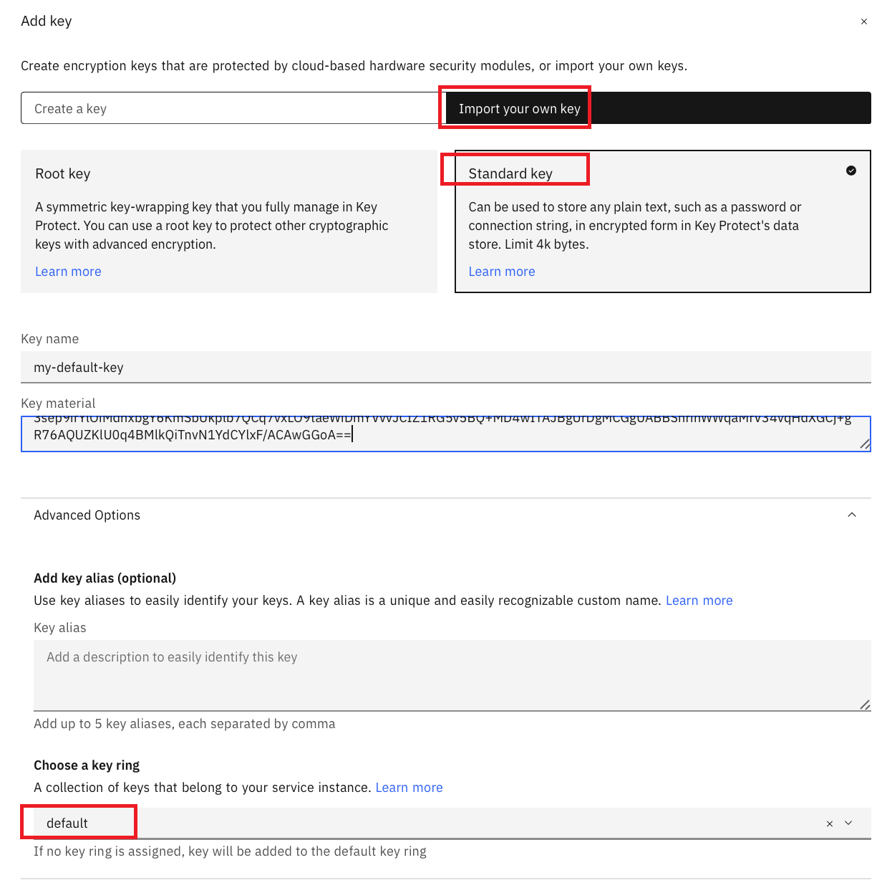
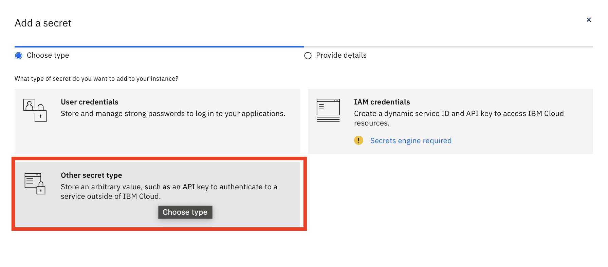
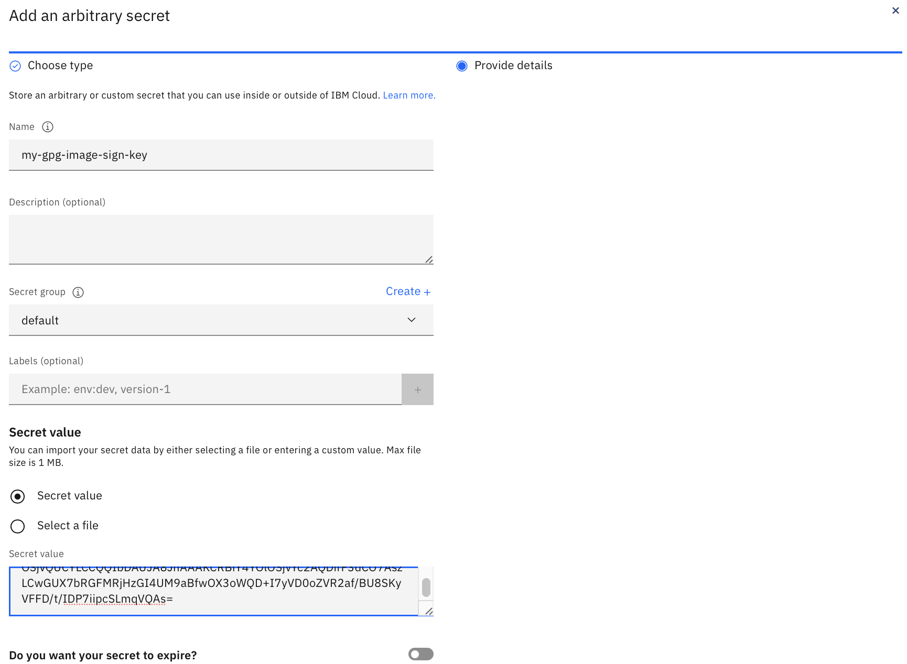

---

copyright: 
  years: 2023, 2025
lastupdated: "2025-08-21"

keywords: DevSecOps, IBM Cloud, public key, private key, GPG

subcollection: devsecops

---

{{site.data.keyword.attribute-definition-list}}

# Getting a public key for signature verification
{: #devsecops-publickey}

Use a GPG public key to verify the signature of signed images in a Continuous Deployment (CD) pipeline. 
{: shortdesc}

You can get a GPG public key as follows:

* Using the continuous integration (CI) pipeline.
* Using your local computer.

## Getting a GPG public key by using the continuous integration (CI) pipeline
{: #devsecops-publickey-ci}

1. To get a public key, add the environment variable `print-code-signing-public-key` with a value of 1 in your CI pipeline. After you run the CI pipeline, the GPG public key is printed on the console in the `build-sign-artifact` stage. You can then copy the public key into a file and encode it in base64 format by running the following command:

    ```bash
    cat copied_key.txt | base64 
    ```

1. Copy the encoded key into your continuous deployment (CD) pipeline.

## Getting a GPG public key by using your local computer
{: #devsecops-publickey-local}

If you have the GPG private key in your key ring, you can export the public key directly.
   
1. Check whether your machine has a GPG key ring. Key rings are groupings of keys that allow those groupings to be managed independently. For more information, see [Grouping keys together using key rings](/docs/key-protect?topic=key-protect-grouping-keys&interface=ui). Run the following command:

    ```bash
     gpg --list-keys

    /home/user/.gnupg/pubring.kbx
    -------------------------------
    pub   rsa3072 2021-04-15 [SC] [expires: 2023-04-15]
          88DC11E8FDDF028F02E4184719D6C4C5990F144F
    uid           [ unknown] user name <user.name@email.com>
    sub   rsa3072 2021-04-15 [E] [expires: 2023-04-15]
    ```

1. If the GPG key exists on your computer, export the GPG public key by running the following command:

    ```bash
    gpg --armor --export  <Email Address>


        -----BEGIN PGP PUBLIC KEY BLOCK-----
        xsBNBGQICw0BCADS5GwuET5rkH6n1e6bM8sYod5Apbf06yQqhAFz5hkAWCu50Nw0
        GEyxRQCAxp+9xERSr43W0StSaL9KGHBaB3oS9evkcIrlOkTwncvAZODAsaorcRtW
        1IkICPhztRHyN+wR2TWadatHz/RvOlEDVAg51XLfFIQibTStgweB3rV2c5jTsCUc
        C6N6sNoHx4OhLZ7BNJSSZBByyt4qf3d2yErOULjjUCYsvcTaOM4gtXx4Cbsk7F/y
        kZnCCqFimPOJKjsXjc+6hyAKgG0xRIGtv/zzU+nwew2fDblWTwZjDx4V9KZl1o07
        XBHfNu0hKgvQhJURxY7gCtYtIHoDF5xI2/OfABEBAAHNGmV0c3QgPHVzZXIubmFt
        ZUBlbWFpbC5jb20+wsBtBBMBCgAXBQJkCAsNAhsvAwsJBwMVCggCHgECF4AACgkQ
        8aKO5nwRdmhECwf9Flyfu2VBMQabeU4IIZESgDjPxl4m7yiIpOdLNcWPxTS9S3th
        3x84/wQE9ZwX8vpBv/1KN8cZROJDnVAmZhVGVa3CBOI4dhFfMAU9mwzAWH0owjmt
        QtHOoQ+cajcQEvvkl4UTnScoEXwVVqKHNWAAq/myDRtZr1yCMokmbc0PjCftIfHr
        a+50dYZEVL9D8Cq1dQKFsmPCPPZvUmHQKXQTUr4usY72zf9IUPH6n5D2tkpNo253
        lWEVptVKHH21XhNpp+ROY7DTB0xLFzIirXh5Rwx5OkGO7n1gfUM4B1i1z3A6uXhX
        sP7wf45OaFscPMVGmVFOgP1VRdNsBfPodT1NG87ATQRkCAsNAQgAoMcJTSrAPMrj
        u0kMHGlE2/D+7TkKnJ5Gtw38EMxDX/kKBiKhI7WoT3OKjT/GrpXSIn1TfMWHh2oQ
        mBP9g0dXnr9dNB7eQMtq8dVU9cVg63U05tSbckoCiLqnVU5nG7NdUGd8n1QPFPw5
        wRdT/BWZ/NsruWZ9DLIoCqSE73Ez4p7KVu0Nfm62D4Z87ejOfsObcLRZuLkjK9Mn
        0te5LMZ4xTTTzSSia3mxNwVtKE8r7ihf+f6vCvDzCD23OnqeSeQnOoxlvdBLOyWT
        QkFWP/OdYIPBLAVG12aUAPq79TW4B04LWIw7LjbXenszI6M1LqUQgP+PHegMTs2O
        EQtLJHJJNQARAQABwsGEBBgBCgAPBQJkCAsNBQkPCZwAAhsuASkJEPGijuZ8EXZo
        wF0gBBkBCgAGBQJkCAsNAAoJEKLCBxPVXHfTJPQH/3mUPJGxlsdRFsFW3xvNEfRX
        EGdV9sQOhgcV+/ZLmnrWTpjBFfzWXJDetyM3awKmrMbggnPmavJyXjCB+Skrsqjf
        qO7mlc4oi9MGdSnsZ8UBjKQhNJYGSQWN7AmfFs+FOLopvlpDh5nmfxEiS+4DAxu2
        3Ur0GN93QJ7FbIpKGhtH20XtVl1Gfj6ZA7jwY50kY3rhw7qzw22e4a+URAi52ReN
        ZlElL7qQCiYGk2FYwhPYj4WCGmrx7mAGAdI/Xsqtgpwon1YkFuo3psZP9IXrskls
        XP2Y9NDnYZM/nV0RCBRoJKvJL2daJyQ9iHmfeF0Hh7AxmboQWZo2tnnOqprOwAVU
        dAgArROMqK7Ng+j3yAAY9xuHmI2GVHSqK/UPiO+XGvuGWDLzlrgT7ehpCSIeg/sF
        0ZfE5fYV3758kAQEclpejV71mL2pedBwzigD3IH6Mlit5slwqlmsBWCN64DwGJLp
        aKsdbBcglUixuO5q0dLEHHXYVgUUqrV7rEdW5s+4LiROcHgQCLIDzZOYjCqGYex4
        YhWPFPmReFd48qDQAFDtU0teUeeMTMWHQCGQq2eZLJtHpG0axrqKi3kl5K5TbFR6
        FpwkW3HhQn8p48PWS78MJVZZvFD+GDOa8xLQR3ylkzdI3ODO9Cuzfo+sWJIQk/gB
        bGCnEBJJosoJebVF8ZpXI+Qbg87ATQRkCAsNAQgAwPpK+5OCM0OuNoErYCTNHama
        5VrlHjc3glUQUIIGYhZtfQiINPIB0gjPURkOmJHZdFWQccE+JLlX0hVLHVaisr7q
        izSI8VZ4/YUYfTJHltTLiu9PoYw922UQo7fRLglUmvv4nctBkT+T2YWzJNNQaffR
        Ac1wLhFSklDPxAvY+xJ1vCYABYF5gml6lLNEy0BD3+w8rGIfmXi92P6CtxSi6Msx
        zD+p8jib4rKuWICj79+DtDvzglmeoSCzFjINQ2UkbULRAOZWDwoJlt247SPWSKpi
        0fabbaAwHIeoCPYoOWlpx/3jdXDmBB9HEGUUk2q8eHaHUkQdyfm5uxU188VUfwAR
        AQABwsGEBBgBCgAPBQJkCAsNBQkPCZwAAhsuASkJEPGijuZ8EXZowF0gBBkBCgAG
        BQJkCAsNAAoJEFIxvQO1BHFkFNUIAKNXypvVxFXm7w97+6teXRUWlL8N+qlCaJlO
        dVmAeLXZTE7k/r+IeYR53Xf4oS9kAqVkB9VzyBSvBjNmpKHv84UMbPMm44M8ESsc
        Cf9drVrW9Cuw3qwkuVYXnlnhukxLm/1ivSl2Tw/ywwpShGdhQc9KnPPSYtGEMAhM
        /dqXUtZs/akOScoyaU9cNNEEQVlzGmKh0T1Qb4xuFd9dqNC9wJ2aGDXcGFnDvAoq
        YSZZl5KWY/11AqBR9smeMyZrK8SAAw8dFPpVNsLWGdTKrywfSjcBUqasoI2QvFJB
        Nbmu7JILvEsMXtA2vjJ3SQtOVZs744mo9fi8Jpu/V7P7v+88u8EYWwf+OgQUJT/e
        WzslyV2/ST9+ozxfsGwpl9hlzmPQ4B+a7wNPTqRwCrJgaVIz3Q3LzV06wv7b0YmU
        Vz1j3Zv2SrQntYGR6F4Whi/j4vLl19eI0LhnxcOw4/Ry4pQ8NnypF63Vz7XpNEaf
        vF/P82FwXHR0OvOhEt3UgGdxvC69VF8tHlqaXjMLvmoBMrk1oi2ZDONo/3v9xwzO
        EnxlN5I7ah3n9aBt+D0NZ8EU2qfclMNEEI4viGzB++BEUMbflmbnFdt2Nmbqk1pe
        bknJV8p6m/r56kBPDvk5uqd/L2+j50MrAu4RFNIy4qx+ub1MxqU+MZGjFa3O46Al
        ftfswLBW+es4fQ==
        =0FYC
        -----END PGP PUBLIC KEY BLOCK-----
    ```

1. After you export the GPG public key, encode it in `base64` format before you copy it to the `code-signing-certificate` field.

## Store the key
{: #devsecops-publickey-store}

Provide the GPG key to the CD pipeline in one of the following ways:

* Store the key in {{site.data.keyword.keymanagementservicefull}}.
* Store the key in {{site.data.keyword.secrets-manager_full}}.
* Store the key directly in the CI toolchain.

Make sure that the key is copied in the correct format to prevent a CI pipeline signing error. Use `pbcopy` (OS X) or `clip` (Windows Git bash) in the commands specified in the following sections to copy the key content to the clipboard.
{: note}

### Store the key in {{site.data.keyword.keymanagementserviceshort}}
{: #devsecops-publickey-keyprotect}

You must double `base64` encode the GPG key before you store it in your {{site.data.keyword.keymanagementserviceshort}} instance.
{: note}

Export and copy the GPG key to the clipboard as follows:

* OS X 

   ```bash
   gpg --armor --export <Email Address> | base64 | base64 | pbcopy
   ```

* Windows

   ```bash
   gpg --armor --export <Email Address> | base64 -w0 | base64 -w0 | clip
   ```

* Linux

   ```bash
   gpg --armor --export <Email Address> | base64 | base64
   ```

1. In your {{site.data.keyword.cloud_notm}} console, select the {{site.data.keyword.keymanagementserviceshort}} instance where you want to store the GPG key that you generated.
1. Click the **Add** icon  to add new key to the instance.
1. Select **Import your own key** option.
1. Select key type as **Standard Key**.
1. Give an appropriate name in the **Key name** field. The stored GPG key can be retrieved later by using this name.
1. Copy the key that you exported in the **Key material** field.

      Ensure that there is no extra line at the end of the key when you copy the key and paste it in the **Key material** field.
      {: note}

1. Expand the **Advanced Options** section and select the **Choose a key ring** option as default. 
1. Add the key to your key protect by clicking **Add key**.

   {: caption="Add the key to key protect" caption-side="bottom"}

For more information on {{site.data.keyword.keymanagementserviceshort}}, see [About Key Protect](/docs/key-protect?topic=key-protect-about).

### Store the key in {{site.data.keyword.secrets-manager_short}}
{: #devsecops-publickey-secrets}

You must single `base64` encode the GPG key before you store it in your {{site.data.keyword.secrets-manager_short}} instance.
{: note}

1. Export and copy the GPG key to the clipboard.

   * OS X

       ```bash
       gpg --armor --export <Email Address> | base64 | pbcopy
       ```

   * Windows

       ```bash
       gpg --armor --export <Email Address> | base64 -w0 | clip
       ```

   * Linux

       ```bash
       gpg --armor --export <Email Address> | base64
       ```

1. In your {{site.data.keyword.cloud_notm}} console, select the {{site.data.keyword.secrets-manager_short}} instance where you want to store the GPG Key that you generated in the previous steps.
1. Click the **Add** icon  to add new key to the instance.
1. Select the **Other secret type** option.

   {: caption="Other secret type" caption-side="bottom"}

1. Select key type as **Standard Key**.
1. Give an appropriate name in the **Name** field. The stored GPG key can be retrieved later by using this name.
1. Choose the option as **Secret value** and paste the key as exported earlier in the **Secret value** field.

    Ensure that there is no extra line at the end of the key when you copy the key and paste it in **Secret value** field.
    {: note}

1. Add the key to your {{site.data.keyword.keymanagementserviceshort}} instance by clicking **Add**.

   {: caption="Add the key" caption-side="bottom"}

For more information on {{site.data.keyword.secrets-manager_short}}, see [Getting started with {{site.data.keyword.secrets-manager_short}}](/docs/secrets-manager?topic=secrets-manager-getting-started).

### Export the private key and store it directly in the CI pipeline
{: #devsecops-privatekey-export}

Use this method for testing only. Use `keyprotect` or `secrets manager` for storing keys.
{: important}

You must single `base64` encode the GPG key before storing it as a secured pipeline property.

Securely store the GPG key in a {{site.data.keyword.keymanagementserviceshort}} or {{site.data.keyword.secrets-manager_short}} instance as follows:

* OS X or Linux

   ```bash
   gpg --armor --export <Email Address> | base64
   ```

* Windows

   ```bash
   gpg --armor --export <Email Address> | base64 -w0
   ```
