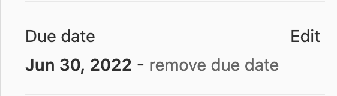

---

copyright:
  years: 2022
lastupdated: "2022-08-10"

keywords: DevSecOps, IBM Cloud, expiration date, expiry date, PCE

subcollection: devsecops

---

{{site.data.keyword.attribute-definition-list}}

# Postponing the due date of an incident issue
{: #due-date-postpone}

If you want to postpone the due date of an incident issue, you can ask for a review from a security focal. Depending on the review, you can postpone the due date by modifying the `Due date` field in the {{site.data.keyword.gitrepos}} incident issues meta fields. 
{: shortdesc}

{: caption="Setting and updating due date on {{site.data.keyword.gitrepos}}" caption-side="bottom"}

Be sure to reference the security-focal review in the issue, such as providing a link to it in a comment.
{: important}

## Postponing the due date of an issue that has a PCE
{: #due-date-change-pce}

If you have an issue that has a Public Cloud Security Exception (PCE), you can change its due date to be the same as the expiration date of the PCE so that evidence collection continues up to the PCE expiration date.
