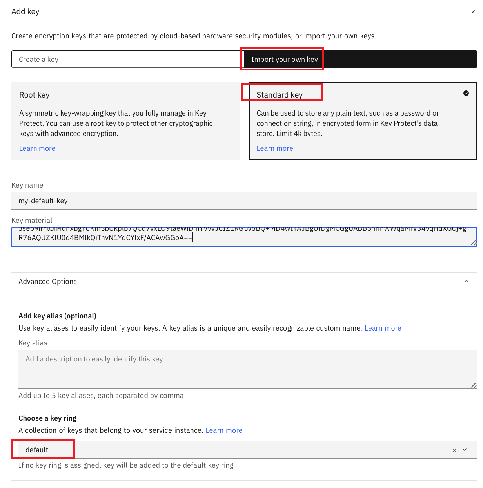

---

copyright:
  years: 2024
lastupdated: "2024-05-24"

keywords: DevSecOps, inventory model, inventory, IBM Cloud

subcollection: devsecops

---

{{site.data.keyword.attribute-definition-list}}


# Generating a GPG key
{: #devsecops-image-signing}

Artifacts that are built by the {{site.data.keyword.cloud_notm}} DevSecOps continuous integration toolchain and recorded in the inventory must be signed before they are deployed to production. The continuous integration pipeline uses [Skopeo](https://github.com/containers/skopeo){: external} as the default tool to provide artifact signing capability.


Create and store a GPG key that is used by the DevSecOps continuous integration pipeline either automatically or manually.

## Automatically generate a GPG key
{: #devsecops-image-signing-auto}

Using this method, the template generates the GPG key for you. Enter the **name** and **email** for the key generation by completing these steps:

1. Go to the **Artifact signing** and click **New**.


   {: caption="Figure 1. Artifact signing" caption-side="bottom"}


1. In the window, the **name** and **email** fields are prepopulated with the toolchain name and the email ID. Change the name and email ID to reflect your GPG key requirements. You can also store the keys in your secrets provider by selecting the box.

   {: caption="Figure 2. Change name and email" caption-side="bottom"}

1. After the key is generated, you can copy it for your reference.

   {: caption="Figure 3 Artifact signing certificate" caption-side="bottom"}

The copied key is in `base64` format. [Decode] (/docs-draft/devsecops-workingtopic=devsecops-working-devsecops-async-stagesdevsecops-decoding-gpg-key.md) the key before you import it to your [key ring](/docs/key-protect?topic=key-protect-grouping-keys&interface=ui).
```echo <encoded_gpg_key> | base64 --decode```
{: note}

## Manually generate a GPG key
{: #devsecops-image-signing-manual}

### Download and install GPG command-line tools
{: #cd-devsecops-gpg-download}

Download and install the [GPG command-line tools](https://www.gnupg.org/download/){: external} for your operating system. Go to the **GnuPG binary releases** section to download the tools for your operating system.

#### Mac OS X
{: #devsecops-gpg-download-osx}

* Download and install [Mac GPG](https://gpgtools.org/){: external}.
* Verify the version of the installed GPG. From the command line, run the following command:

```bash
$ gpg --version
gpg (GnuPG) 2.3.1
libgcrypt 1.9.3
Copyright (C) 2021 Free Software Foundation, Inc.
```
* For versions of GPG before 2.3.1, it might not be possible to use the **--passphrase=''** option. In this case, you can omit the password in the following dialog by pressing **Enter** when prompted.

#### Windows™
{: #devsecops-gpg-download-windows}

* Download and install [GitBash](https://gitforwindows.org/){: external} (required for `base64` encoding).
* Verify the version of the installed GPG. Run the following command in the **Git bash** command prompt:

```bash
$ gpg --version
gpg (GnuPG) 2.2.27
libgcrypt 1.8.7
Copyright (C) 2021 g10 Code GmbH
```

## Generate a GPG key
{: #cd-devsecops-gpg-generate}


Leave the passphrase and the field empty if the generate-key command opens a dialog that asks for a passphrase. This is a limitation with the [(skopeo)](https://github.com/containers/skopeo/issues/1261){: external} utility of the image signing where the pipeline cannot accept a private key that is protected with a passphrase. If you provide the passphrase during creation, then your pipeline fails to decode the certificate, and your pipeline fails at the image signing step.

### Mac OS X and Linux™
{: #cd-devsecops-gpg-linux}

From your shell prompt, run the following command:

```bash
gpg --pinentry-mode loopback --passphrase='' --generate-key
```

* Enter your name and email address.
* Enter **O** to initiate key creation.
* After the key is generated, select option **O**.

### Windows™
{: #cd-devsecops-gpg-windows}

#### GPG Version > 1.4
{: #cd-devsecops-gpg-version}

From the Git bash command prompt, run the following command:

```bash
gpg --pinentry-mode loopback --passphrase='' --generate-key
```

* Enter your name in the **Real name** field.
* Enter your email address in the **Email address**.
* Enter **O** to initiate the key creation.
* After the key is generated, select option **O**.

#### GPG Version < 1.4 (or any failure with previous command)
{: #cd-devsecops-gpg-version2}

From the Git bash command prompt, run the following command:

```bash
gpg --gen-key
```

* **kind of key**: select Default option **(1) RSA and RSA (default)**
* **keysize**: keep default (2048)
* **key validity**: keep the default value as 0. This is because the value key 0 does not expire.
* Confirm your choice: enter **y**.
* Enter your your name in the **Real name** field.
* Enter your email address in the **Email address**.
* Enter **O** to initiate key creation.
* After the key is generated, select option **O**.

## Verify the key creation
{: #cd-devsecops-gpg-verify}

Verify that the GPG key was created. From the command prompt, run the following command:

```bash
gpg --list-keys
```

Ensure that your key is listed. Example output on Windows:

```bash
$ gpg --list-keys
/c/Users/FredSmith/.gnupg/pubring.gpg
-------------------------------------
pub   2048R/1BB354B5 2021-06-08
uid   Fred Smith <fred@company.com>
sub   2048R/F91C39A6 2021-06-08
```
{: screen}

## Export the key
{: #cd-devsecops-gpg-export}

This step is optional. Run this command to ensure that the GPG key can be exported.

```bash
gpg --export-secret-key <Email Address>
```

The raw key that is exported must not be copied directly. It is recommended to securely store the key that is generated in this step in your {{site.data.keyword.keymanagementserviceshort}} instance or {{site.data.keyword.secrets-manager_short}} instance. See the next sections for more details.
{: important}

## Store the key
{: #cd-devsecops-gpg-store}

The GPG key must be provided to the CI pipeline in one of the following ways:
* Stored in {{site.data.keyword.keymanagementservicefull}}
* Stored in {{site.data.keyword.secrets-manager_full}}
* Stored directly in the CI toolchain

Make sure that the key is copied in the correct format to prevent a CI pipeline signing error due to import failure. Use `pbcopy` (Mac OS X) or `clip` (Windows Git bash) in the following command to copy the key content to the clipboard.
{: note}

### Store the key in {{site.data.keyword.keymanagementserviceshort}}
{: #cd-devsecops-gpg-store-keyprotect}

Export and copy the GPG key to the clipboard.

Double `base64` encoding of the GPG key is required before you store it in your {{site.data.keyword.keymanagementserviceshort}} instance.
{: note}

#### OS X
{: #cd-devsecops-gpg-copy-osx}

```bash
gpg --export-secret-key <Email Address> | base64 | base64 | pbcopy
```

#### Windows™
{: #cd-devsecops-gpg-copy-windows}

```bash
gpg --export-secret-key <Email Address> | base64 -w0 | base64 -w0 | clip
```

#### Linux™
{: #cd-devsecops-gpg-copy-linux}

```bash
gpg --export-secret-key <Email Address> | base64 | base64
```

1. In your {{site.data.keyword.cloud_notm}} console, select the {{site.data.keyword.keymanagementserviceshort}} instance where you want to store the GPG key generated from the previous steps.
2. Click the **Add +** icon to add new key to the instance.
3. Select **Import your own key** option.
4. Select **Select a key type** as **Standard Key**.
5. Give the appropriate name in the **Key name** field. The stored GPG key can be retrieved later by this  key name.
6. Copy the key as exported earlier in the **Key material** field.

      Ensure that when you copy the key and paste it in **Key material** field, there is no extra line at the end of the key.
      {: note}

7. Select the **Choose a key ring** option as default.
8. Click **Add key** to add the key to your **key protect**.

   {: caption="Figure 4. Add the key to key protect" caption-side="bottom"}

For more information about {{site.data.keyword.keymanagementserviceshort}}, see the [{{site.data.keyword.keymanagementserviceshort}} docs](/docs/key-protect?topic=key-protect-about).


### Store the key in {{site.data.keyword.secrets-manager_short}}
{: #cd-devsecops-gpg-store-secretsmgr}

Single `base64` encoding of the GPG key is required before storing it in your {{site.data.keyword.secrets-manager_short}} instance.
{: note}

Export and copy the GPG key to the clipboard.

#### OS X
{: #cd-devsecops-gpg-export-osx}

```bash
gpg --export-secret-key <Email Address> | base64 | pbcopy
```

#### Windows™
{: #cd-devsecops-gpg-export-windows}

```bash
gpg --export-secret-key <Email Address> | base64 -w0 | clip
```

#### Linux™
{: #cd-devsecops-gpg-export-linux}

```bash
gpg --export-secret-key <Email Address> | base64
```

1. In your {{site.data.keyword.cloud_notm}} console, select the {{site.data.keyword.secrets-manager_short}} instance where you want to store GPG Key generated from the previous steps.
1. Click the **Add +** icon to add new key to the instance.
1. Select **Other secret type** option.

   {: caption="Figure 5. Other secret type" caption-side="bottom"}

1. Select **Standard Key** type for the option **Select a key type**.
1. Give an appropriate name in the **Name** field. The stored GPG key can be retrieved later by this name.
1. Choose the option as **Secret value** and paste the key as exported earlier in the **Secret Value** field.

    Ensure that when you copy the key and paste it in the **Secret value** field, there is no extra line at the end of the key.
    {: note}

1. Add the key to your {{site.data.keyword.keymanagementserviceshort}} instance by clicking the **Add** icon.

   {: caption="Figure 6. Add the key" caption-side="bottom"}

For more information about {{site.data.keyword.secrets-manager_short}}, see [Getting started with {{site.data.keyword.secrets-manager_short}}](/docs/secrets-manager?topic=secrets-manager-getting-started).

### Export the private key and store it directly in the CI pipeline
{: #cd-devsecops-gpg-private-key}

This approach is not recommended and should be used only for experimentation. Use `Key Protect` or `Secrets Manager` for storing the keys.
For more information, see [Configuring the secrets stores](/docs/devsecops?topic=devsecops-cd-devsecops-toolchains-secrets#configure-secret-stores)

Single `base64` encoding of the GPG key is required before storing it as a secured pipeline property.
{: note}

Securely store the GPG key in a {{site.data.keyword.keymanagementserviceshort}} or {{site.data.keyword.secrets-manager_short}} instance.
{: important}

#### Mac OS X / Linux™
{: #cd-devsecops-gpg-store-osx}

```bash
gpg --export-secret-key <Email Address> | base64
```

#### Windows™
{: #cd-devsecops-gpg-store-windows}

```bash
gpg --export-secret-key <Email Address> | base64 -w0
```
