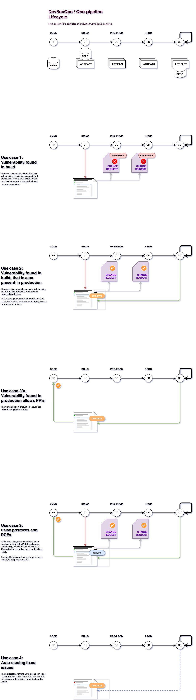

---

copyright:
  years: 2022
lastupdated: "2022-05-18"

keywords: DevSecOps, IBM Cloud

subcollection: devsecops

---

{{site.data.keyword.attribute-definition-list}}

# Incident issues
{: #incident-issues}

From a compliance perspective, creating, storing, and updating incident issues (vulnerability, CVE) as part of the [Continuous Integration](/docs/devsecops?topic=devsecops-cd-devsecops-ci-pipeline) and [Continuous Compliance](/docs/devsecops?topic=devsecops-devsecops-cc-pipeline) pipelines are essential for evidence collection.
{: shortdesc}

During the execution of the CI and CC pipelines, the [`collect-evidence` script](/docs/devsecops?topic=devsecops-devsecops-collect-evidence) creates incident issues, attaches them to the collected evidence, and stores them in the [incident issues repository](/docs/devsecops?topic=devsecops-tutorial-cd-devsecops#devsecops-ci-tool-integration-issues).

The `collect-evidence` script uses the functions of the [`cocoa incident process`](/docs/devsecops?topic=devsecops-cd-devsecops-cli#incident-process) command of the DevSecOps CLI tool, which processes the provided scan results and either creates new incident issues in the provided repository per vulnerability or updates the existing incident issues based on the subject-incident pairs. 
Therefore, the incident issues are bound to assets and created according to the [results of specific tools](/docs/devsecops?topic=devsecops-devsecops-issues-due-date#processing-results-issues).

## Incident issue processing
{: #incident-issue-processing-ci-cc}

Even though the CI and CC pipelines have many common steps, the issue processing of these pipelines has some [significant differences](/docs/devsecops?topic=devsecops-devsecops-issues-due-date#due-date-ci-cc):
* Incident issues that are created during the CI pipeline do not carry a due date, while incident issues that are created during the CC pipeline do.
* Incident issues that are created during the CI pipeline are found during the build, while incident issues that are created during the CC pipeline are found in the production environment.

The following diagram shows the possible use cases based on the distinctions:

{: caption="Vulnerability use cases flow" caption-side="bottom"}

## Managing incident issues
{: #incident-issue-managing}

### Setting the due date for incident issues
{: #incident-issue-due-date-setting}

If the incident issues are found in production, the "Due Date" property might be added to the issue to specify the grace period in which it must be fixed. The [duration of the grace period](/docs/devsecops?topic=devsecops-devsecops-issues-due-date#grace-period-duration) is determined by the severity of the found vulnerability.

For more information about customizing the grace periods, see [Configuring custom grace periods on the CC pipeline](/docs/devsecops?topic=devsecops-configure-custom-grace-period).

For more information about manually setting the due date, see [Postponing the due date of an incident issue](/docs/devsecops?topic=devsecops-due-date-postpone)

### Adding default assignees for incident issues
{: #incident-issue-assignee}

You can define multiple default assignees for the incident issue by using the `incident-assignees` pipeline parameter. The `incident-assignees` parameter can be used only with GitHub accounts and GitLab Premium accounts. For more information about the usage of the `incident-assignees` parameter, see [Assigning incident issues to users](/docs/devsecops?topic=devsecops-assign-incident-issues).

You can also set a default incident issue assignee for the pipeline with the `incident-assignee` pipeline parameter, but note that this parameter is deprecated and will be removed with the v1 evidence (legacy) collection.

### Filtering incident issues
{: #incident-issue-filtering}

You can easily filter and search for incident issues by using default and custom labels. The following default labels are assigned to the incident issues upon creation or update:
- The [scan type](/docs/devsecops?topic=devsecops-devsecops-issues-due-date#due-date-supported-tools) that is used for the issue processing is added to the incident issue as a tool label (for example, `tool:cra`, `tool:va`, `tool:sonarqube`).
- A severity label is also assigned to the incident issues by default. The severity categories are defined based on the scan results and can be one of the following: `severity:critical`, `severity:high`, `severity:medium`, `severity:low`, `severity:informational`.
- The `has-excempt` is a VA tool-specific label that is assigned to the incident issue if it is exempted based on the scan result. If the `exempt` status is not included in the scan result, the incident issue can be [exempted manually](/docs/devsecops?topic=devsecops-devsecops-issues-due-date#due-date-issue-options-exempt) by assigning the `exempt` label and adding a link to the source of the exempt issue ticket in a comment. If an issue is marked with the `exempt` label, the CI pipeline needs to be rerun. Otherwise, it does not produce new evidence.

You can also add a default label for incident issues with the `incident-labels` pipeline parameter. For more information about this topic, see [Labeling incident issues](/docs/devsecops?topic=devsecops-label-incident-issues).

### Searching on GRIT
{: #devsecops-search-in-issues}

When you use GRIT, you can search for issues in various ways in the UI. For example, you can filter by texts in the title or the body, even in comments, or you can filter by any label.

For more information, see the following documentation:
- How to [search on GitLab](https://docs.gitlab.com/ee/user/search/#search-issues-and-merge-requests){: external}.
- How to [search on GitHub](https://docs.github.com/en/search-github/searching-on-github/searching-issues-and-pull-requests){: external}.
