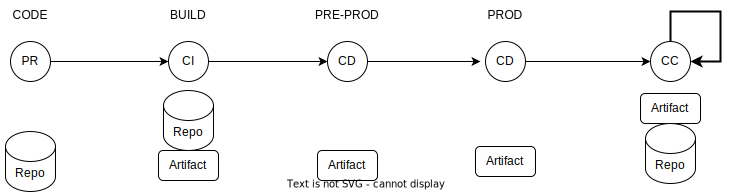
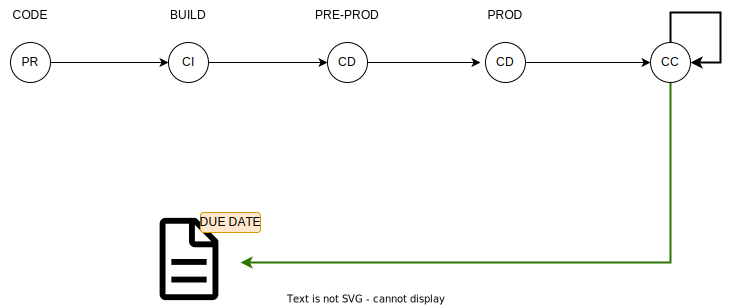

---

copyright: 
  years: 2022, 2023
lastupdated: "2023-05-29"
keywords: DevSecOps, IBM Cloud

subcollection: devsecops

---

{{site.data.keyword.attribute-definition-list}}

# Managing incident issues
{: #incident-issues}

From a compliance perspective, creating, storing, and updating incident issues (vulnerability, CVE) as part of the [Continuous Integration](/docs/devsecops?topic=devsecops-cd-devsecops-ci-pipeline) and [Continuous Compliance](/docs/devsecops?topic=devsecops-devsecops-cc-pipeline) pipelines are essential for evidence collection.
{: shortdesc}

During the execution of the CI and CC pipelines, the [`collect-evidence` script](/docs/devsecops?topic=devsecops-devsecops-collect-evidence) creates incident issues, attaches them to the collected evidence, and stores them in the incident issue repository.

The `collect-evidence` script uses the functions of the [cocoa incident process](/docs/devsecops?topic=devsecops-cd-devsecops-cli#incident-process) command, which processes the provided scan results and either creates new incident issues in the provided repository per vulnerability or updates the existing incident issues based on the subject-incident pairs. 
Therefore, the incident issues are bound to assets and created according to the results of specific tools. For more information, see [Difference between issue processing in CI and CC pipelines](#processing-results-issues).

## Incident issue processing
{: #incident-issue-processing-ci-cc}

Even though the CI and CC pipelines have common steps, the issue processing of these pipelines has some differences:

* Incident issues that are created during the CI pipeline do not carry a due date, while incident issues that are created during the CC pipeline do.
* Incident issues that are created during the CI pipeline are found during the build, while incident issues that are created during the CC pipeline are found in the production environment.

Figures 1 - 6 show the possible use cases that are based on these differences.

### DevSecOps/one pipeline lifecycle
{: #incident-issue-lifecycle}

The DevSecOps/one pipeline lifecycle extends from code PRs to production scans.

{: caption="Figure 1. DevSecOps/one pipeline lifecycle" caption-side="bottom"}

### Use case 1: vulnerability found in the build
{: #incident-issue-uc1}

The new build introduces a vulnerability, which is not accepted. Deployment is blocked unless the change request is an emergency CR that is manually approved.

{: caption="Figure 2. Vulnerability found in the build" caption-side="bottom"}

### Use case 2: vulnerability found in the build that is also in production
{: #incident-issue-uc2}

The new build contains a vulnerability that is also in the currently deployed production. Teams have a timeline to fix the issue, but new features or fixes can still be deployed.

{: caption="Figure 3. Vulnerability found in the build that is also in production" caption-side="bottom"}

### Use case 2A: vulnerability that is found in production allows PRs
{: #incident-issue-uc2a}

The vulnerability in production does not prevent PRs from merging.

{: caption="Figure 4. Vulnerability found in production allows PRs" caption-side="bottom"}

### Use case 3: false positives and PCEs
{: #incident-issue-uc3}

If the team categorizes an issue as false positive, or the team gets a PCE for a vulnerability, the issue can be labeled as **Exempted**. The issue can then be handled as a nonblocking issue. To maintain an audit trail, change requests keep the issues visible.

{: caption="Figure 5. False positives and PCEs" caption-side="bottom"}

### Use case 4: automatically closing fixed issues
{: #incident-issue-uc4}

Periodically running the CC pipeline can close issues that are open and have a due date set. Also, the relevant vulnerability cannot be found in scans.

{: caption="Figure 6. Automatically closing fixed issues" caption-side="bottom"}

## Setting the due date for incident issues
{: #incident-issue-due-date-setting}

If the incident issues are found in production, the `Due Date` property might be added to the issue to specify the grace period in which it must be fixed. The duration of the grace period is determined by the severity of the found vulnerability.

For more information about customizing the grace periods, see [Configuring custom grace periods on the CC pipeline](/docs/devsecops?topic=devsecops-incident-issues#configure-custom-grace-period).

## Labeling incident issues
{: #label-incident-issues}

Incident issues that are created by the continuous integration (CI) or continuous compliance (CC) pipelines can have default labels.

### Labels for incident issues discovered by Code Risk Analyzer
{: #label-incident-issues-cra}

Code Risk Analyzer (CRA) detects multiple types of vulnerabilities, like app dependency and image vulnerability.

The type of vulnerability can be of the following: `name` `os`, `python`, `js`, `golang`, or `java`.

If the type of vulnerability is of type `os`, an `os-vulnerability` label is attached to the issue. For any other type of vulnerability, an `app-vulnerability` label is attached to the issue.

### Labels for incident issues with available fixes
{: #label-incident-issues-fix-available}

For incident issues that are created by the continuous integration (CI) pipeline or continuous compliance (CC) pipeline, the scanner might have remediation information as a part of the scan result. If remediation information is available, a `fix-available` label is added to the incident issue with a link to the fix description inside the issue description.

The absence of the `fix-available` label does not mean that the issue is not actionable because not every scanner includes the fix information in the scan result. The scanner suggests the fix information, and that information comes from wherever the scanner sources this "fix" data. Some scanners might not have up-to-date "fix" dictionaries or do not contain information for a fix.
{: note}

## Incident issues with due date
{: #devsecops-issues-due-date}

When you use the [collect-evidence](/docs/devsecops?topic=devsecops-devsecops-collect-evidence) script, incident issues are created and attached to the collected evidence. If issues are found in production, they can have a specified time period in which they must be fixed so that deployments are not blocked. The time frame that is given to fix the problem in production is called the _**grace period**_. However, for better readability, _**Due Date**_ is now available in incident issues so that users know the date when the fix is due without calculating it from the grace period.

If an issue such as vulnerability or CVE is found in production, and the same problem is also found in a build, the build does not make the situation worse. The feature can be deployed, and the team can focus on fixing the issue in production.

## Configuring custom grace periods on the CC pipeline
{: #configure-custom-grace-period}

The Continuous Compliance (CC) pipeline calculates the due dates of incident issues based on the severity of an issue. You can change the default grace period values and replace them with custom values.

The pipeline calculates the grace period according to the following table:

| Severity      | Grace Period |
| :-----------: | :----------: |
| Informational | 90 days      |
| Low           | 45 days      |
| Medium        | 45 days      |
| High          | 15 days      |
| Critical      | 15 days      |
{: caption="Table 1. Default grace periods" caption-side="bottom"}

To change the default configuration, create a new property in the CC pipeline's environment properties named `grace-period-configuration`. This environment property must be a JSON string and match the following format:

```json
{
  "informational": 50,
  "low": 40,
  "medium": 30,
  "high": 20,
  "critical": 10
}
```
{: codeblock}

If the environment property does not match the expected format or is not a valid JSON string, the pipeline uses the default values.
{: note}

The environment property `grace-period-configuration` sets due dates for issues that do not have a due date set already. For issues that have a due date set, reconfiguring the `grace-period-configuration` does not update those due dates.
{: note}


### Due date calculation
{: #due-date-calculation}

The date of finding is when the continuous compliance (CC) pipeline runs and finds the issue in the production environment. If the issue exists, CC updates it with the _**Due Date**_ that is calculated from that moment.

```text
<due date> = <date of finding the issue in prod> + <grace period in days (determined by severity)>
```

### Due date format
{: #due-date-format}

Due date is in `ISO 8601` format and shows as **YYYY-MM-DD**.

Example: `Due Date: 2022-04-01`

### Use cases
{: #due-date-usecases}

* A vulnerability is found in one of the base images in production by the CC pipeline. The team is notified of an incident issue with a grace period set according to the severity of the vulnerability. The grace period is the number of days that the team have to deploy a fix.

* The team builds a new release with a new feature. The build finds a CVE associated with the base image that is used for the application. The team runs the CC pipeline manually, which scans artifacts already in production. The manual CC run detects the same CVE in the same application in production and adds the Grace Period to the Incident Issue. The team now can build and deploy without being blocked.

### Differences between issue processing in CI and CC pipelines
{: #due-date-ci-cc}

Incident issues are created in both CI and CC pipelines:

* An issue that is created in **CI** means it was found during the build.
* An issue that is created in **CC** means it was found in the production environment.

A Due Date can be added automatically to issues only if they are related to problems found in the production environment. This means that only the CC pipeline is allowed to add the Due Date to an issue. If CI finds the issue and the Due Date is not available, the value of the Due Date is **n/a**.

### Processing results into issues
{: #processing-results-issues}

Issues for problems that are found are created according to the results of specific tools. The `collect-evidence` script attempts to process the result files in the attachments and create a list of issues.

Issues are bound to assets, which can be commits in a repository or a docker image with a digest.

An issue is created for every issue ID - an issue ID is composed of the following components:

- Bound asset
- The tool that found the vulnerability
- The vulnerability identifier (the CVE ID, for example)

For example, if `CVE-2022-001` is found by two separate tools, the process creates two issues today.

#### Supported tools
{: #due-date-supported-tools}

Currently, the following tools are supported for issue processing:

* CRA
* VA
* Detect secrets
* OWASP-ZAP API scanner
* OWASP-ZAP UI scanner
* SonarQube

#### Unsupported tools or result formats
{: #due-date-unsupported-tools-formats}

If the `collect-evidence` script receives an attachment from an unsupported tool, or the result file format is not recognized during processing, the script skips creating issues and uses the result file as a simple attachment to the evidence.

#### Issue contents
{: #due-date-issue-contents}

- **Issue** is the name of the problem or vulnerability.
- **Due Date** shows the date when the fix is due or **n/a** if no Due Date is available.
- **Subject** is the asset that the issue is bound to.
- **URL** is the link to the exact version of the asset.
- **Tool Type** is the tool that produced the contents for the issue

For issues that are created on {{site.data.keyword.gitrepos}}, the due date is set in the GitLab native due date field instead of the issue description.
{: note}

The issue description contains the timestamp when the issue was first discovered. For example, `First found on 2022-04-07.` The date is in `YYYY-MM-DD` format. The locations where the problem occurs are listed in the comments of the issue.

## Postponing the due date of an incident issue
{: #due-date-postpone}

If you want to postpone the due date of an incident issue, you can ask for a review from a security focal. Depending on the review, you can postpone the due date by modifying the `Due date` field in the {{site.data.keyword.gitrepos}} incident issues meta fields. 

{: caption="Figure 2. Setting and updating due date on {{site.data.keyword.gitrepos}}" caption-side="bottom"}

Be sure to reference the security-focal review in the issue, such as providing a link to it in a comment.
{: important}


### Postponing the due date of an issue that has a PCE
{: #due-date-change-pce}

If you have an issue that has a Public Cloud Security Exception (PCE), you can change its due date to be the same as the expiration date of the PCE so that evidence collection continues up to the PCE expiration date.

## Slack alerts for pending and overdue issues for CC pipeline
{: #devsecops-cc-pipeline-slack-alerts}

The Continuous Compliance (CC) pipeline can set due dates for the incident issues. The pipeline can also notify users about issues that have approaching due dates and overdue due dates by using Slack, if Slack integration is enabled.

For more information, see [Set up a Continuous Integration (CI) toolchain](/docs/devsecops?topic=devsecops-tutorial-ci-toolchain#tutorial-ci-toolchain-slack). For more information about due dates, see [Incident issues with due date](/docs/devsecops?topic=devsecops-incident-issues#devsecops-devsecops-issues-due-date.

The issues that are notified are classified as follows:

* Issues having pending due dates within a specific timeframe: issues that are open, have due dates, and are due within a timeframe.
* Issues having past due dates: issues that are open, have due dates, and the date is passed.

The timeframe durations are `overdue`, `due in 1 day`, `due in 2 days`, `due in 5 days`, and `due in 10 days`.

An example of this capability is as follows:

```text
Overdue issues:
- <issue url#1>
- <issue url#2>
- <issue url#3>

Issues due in 1 day:
- <issue url#4>

Issues due in 2 days:
- <issue url#5>

Issues due in 5 days:
- <issue url#6>
- <issue url#7>

Issues due in 10 days
- <issue url#8>
- <issue url#9>
- <issue url#10>
- <issue url#11>
- <issue url#12>
```

The aggregated list is ordered with the issues that are overdue first, and the issues with nearest due dates are listed before those with a later due date.

The `cc-finish` stage in the CC pipeline queries for the issues based on the criteria and triggers a Slack alert.
