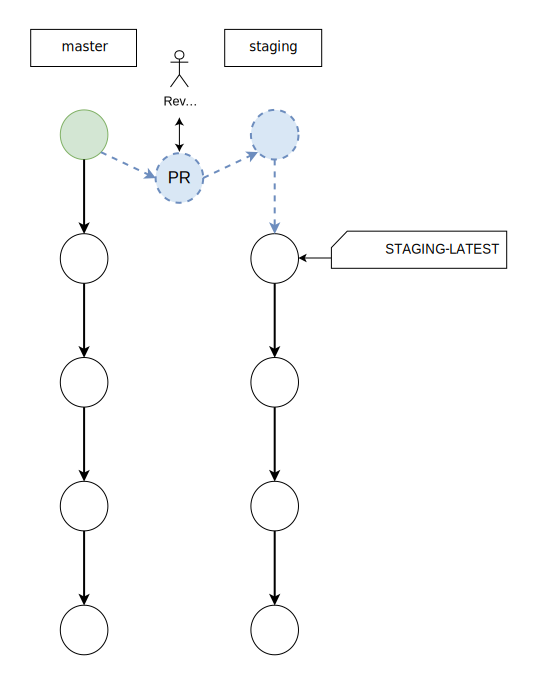

---

copyright: 
  years: 2021, 2023
lastupdated: "2023-11-13"

keywords: DevSecOps, inventory model, inventory

subcollection: devsecops

---

{{site.data.keyword.attribute-definition-list}}

# Inventory
{: #cd-devsecops-inventory}

Learn about the inventory concepts such as inventory structure, content model, role, and purpose.
{: shortdesc}

## Inventory structure and content
{: #inventory-structure}

The Inventory model tracks the following items:

* What artifact is deployed to which environment or region
* Where was an artifact that is built (pipeline run, commit sha)
* What is the signature of the built artifact

Based on this data, you can track evidence during artifact builds and deployments and help Change Management and Compliance audits.

### Branches
{: #inventory-branches}

The Inventory is implemented in a Git repository (repo). Git itself helps to track and audit changes.

Branches are used as environments. The main branch (`master`) is written and updated by the continuous integration pipeline. Other environments are updated from the master branch by using promotions. For more information about promotions, see the [Promotion](#inventory-promotion) section.

### Content
{: #inventory-content}

The Inventory contains an Inventory Entry for every artifact that participates in deployment. One Inventory Entry points to a single artifact. Inventory entries are JSON files that can be structured in folders and are named by using the entry name.

Inventory folders are part of the entry name.
{: important}

#### Example
{: #inventory-content-example}

Use the following entry names for a service:

* auth/service
* auth/db
* ui/service
* main_service
* helm-charts/main_service

The content is implemented in the inventory by using the following structure:

```text
/
├── auth
│   ├── service
│   └── db
├── ui
│   └── service
├── helm-charts
│   └── main_service
└ main_service
```
{: screen}


## Inventory entry format
{: #inventory-entry-format}

Although the `Entry` type represents the schema of the Inventory Entry by using typescript syntax, you can convert it to use JSON schema.

```bash
interface Entry {
  repository_url: string;
  artifact: string;
  build_number: number;
  commit_sha: string;
  name: string;
  pipeline_run_id: string;
  version: string;

  app_artifacts: {
    signature: string;
    provenance: string;

    [key: string]: any;
  }

  type: string;
  sha256: string;
  provenance: string;
  signature: string;
}
```
{: codeblock}

### Example
{: #entry-format-example}

```bash
{
  "repository_url": "https://github.com/test-org/compliance-app-20201211",
  "artifact": "us.icr.io/namespace/hello-compliance-app:20201217081811-master-b85e3d472e9cc35b429c39e8c3f9eb282738c20a@sha256:da36831d5154307ac9ca4b8d900df2da0c6c14754977c32479dc62994b5722d0",
  "build_number": 21,
  "commit_sha": "b85e3d472e9cc35b429c39e8c3f9eb282738c20a",
  "name": "hello-compliance-app",
  "pipeline_run_id": "f21321bf-9054-4bf3-80a8-4fb34743b7d9",
  "version": "v1",
  "app_artifacts": {
    "signature": "owFNUX1IE3EY3vwAEy0VyoSJdkVWtu0+d3eTjNIIi0jETCSU3353cz+83V23myi2BlFgYiUFqSmZLciUzCJkRYJp9IEWFWXB0hAyrBQxEjIIuhFSf70vL8/7vM/zPi3JsaYEc+TnbqG8qrnTPDZ8w2WqiqwtacCghnQEgYQ5GzAkiLKO9PpoLyiwRtSsmugWNVGGIubE/D4bgpoNKXag60gCdo8oSYoVKl5VQsDAWIGqOkmcxAmSYHGO4AjC6gU+3eBxcYxICTRLijyEFOOiSR5SvMhBys2LLpIjWYqDJA6wwHYMeUG1+J8GL5CRW/TpVgFVG8VQ4vMAknE4BUA5OIoQGIKhKZwFkIeAdnECj+OCmxQADh2QoFmG5lkWUiTN8gJ0kDxPuxiWJAU8ekyvV6PegK54EcyGiqwDJItatg9Vy0D3a2IUpKg6UuS/T4KaaIC1fzuMDbfhmMGEvIY64FUxJ+Ew3PMU5SADgdNmKs5kTjBlrtsQ99iyY49nns8o6jsXWgkjPiYahClxVcrK5Flngumz2j7YdmD0ecutytsvxxNPHflKlRV2RyqD69NjC6Smji9XuukFyZ+lvM18gUr7F4NXge9YyZPik411tc1n9bKO/hDz7oGaX/ur94OnNHiwOG6n5ZsrsCsvtyvmkH4zOWlrRWuL7fzgj9zlcCTAhtu2LbeGLNfv3Ju0Jc9PZPk7Pm3Ov2CW+2xj8ReX6ooGamZ610yqRM/+8Qo2XnOeyZzbVKgs+f2+9unpJOve4Tmla+PdqftDWkHPm9Vq3nsyZ2DUkmP/nTb7qNw5l2SfWtiSemJx9nLaYOpx6amlOT18aeIwJQhHg1XOjJF9r18NXQvPuL9rH5tSQqbGhyN/AA==",
    "provenance": "us.icr.io/namespace/hello-compliance-app:20201217081811-master-b85e3d472e9cc35b429c39e8c3f9eb282738c20a@sha256:da36831d5154307ac9ca4b8d900df2da0c6c14754977c32479dc62994b5722d0"
  },
  "type": "type",
  "sha256": "da36831d5154307ac9ca4b8d900df2da0c6c14754977c32479dc62994b5722d0",
  "provenance": "us.icr.io/namespace/hello-compliance-app:20201217081811-master-b85e3d472e9cc35b429c39e8c3f9eb282738c20a@sha256:da36831d5154307ac9ca4b8d900df2da0c6c14754977c32479dc62994b5722d0",
  "signature": "signature"
}
```
{: codeblock}

## Inventory workflow
{: #inventory-workflow}

The inventory contains several branches other than the `master` branch. These branches can represent deployment stages, environments or regions, or a mixture of both. The structure of these branches depends on the setup and usage.

### CI writes to inventory 
{: #ci-writes-to-inventory}

The `master` branch is populated from continuous integration builds. The last commit in the target (in this case named `staging`) contains a tag that shows that it was the last concluded deployment.

You can skip writing to inventory by customizing the release script. For more information, see [Release to inventory](/docs/devsecops?topic=devsecops-cd-devsecops-ci-pipeline#devsecops-ci-pipeline-inventoryrel).

{: caption="Figure 1. Continuous integration writes to inventory" caption-side="bottom"}

### Promotion
{: #inventory-promotion}

A pull request is created when you promote to a target branch happens. Pull request contents populate the Change Request fields. After the pull request is reviewed, you can merge it.

{: caption="Figure 2. Promoting a target branch by using a PR" caption-side="bottom"}

### Delta and deployment
{: #inventory-delta-deployment}

After the promotion pull request is merged, the Deployment pipeline can start. The Deployment delta is the difference between the contents of the last concluded deployment and the current deployment. The Deployment delta lists the inventory items that are being deployed.

{: caption="Figure3. Deployment pipeline flow showing deployment delta details" caption-side="bottom"}

### Conclude
{: #inventory-conclude}

When the deployment finishes, you can move the `latest` tag ahead.

{: caption="Figure 4. Deployment completes" caption-side="bottom"}

### Promote to further environments
{: #promote-further-envs}

You can promote and deploy from any branch to another one.

{: caption="Figure 5. Promotion using a PR from staging to prod branch" caption-side="bottom"}

### Inventory landscape
{: #inventory-landscape}

The current deployed state contains the content to deploy to an environment. Every promoted commit in the target branches contains the relevant Pipeline Run ID and Change Request ID as a tag. Some commits can have multiple tags, for example, when you are retrying a failed deployment or deploying again. The Inventory holds every piece of information to replay the deployments.

{: caption="Figure 6. Deployment flow diagram with tags" caption-side="bottom"}

#### Use of tags
{: #inventory-tags}

| Tag | Description | 
|:-----------------|:-----------------|
| `latest` | Tags the current, successfully deployed, and concluded state of the inventory on a branch. |
| `pipeline run id` | Tags the current inventory state in the branch, with the pipeline run ID or build number of the actual deployment. To avoid inventory content overlap when parallel deployments are triggered, use this tag to refer to the actual inventory point hash in the branch history. |
| `change request id [optional]` | Tags the current state of a change request ID to track the change request IDs in the inventory, in a historical representation. |
{: caption="Table 1. Inventory tags" caption-side="top"}

### Setup for a single target with multiple regions
{: #single-target-multi-region}

Multiple `latest` tags are introduced for a single target environment so that multiple continuous deployment pipelines can work on the same target, for different types of use cases. You can use, for example, the same target environment (such as `us-south` or `eu-de`) for multiple regions in the prod target environment and the inventory branch.

You do not need to set up a different branch for each region using the `region` property , such as `us-south-prod` and `eu-de-prod`, and run the promotion redundantly. Instead, specify these additional targets for the same inventory branch, and then use them as Git tags.

In this setup, the prod branch has multiple `latest` tags on the same branch, such as `us-south_prod_latest` and `eu-de_prod_latest`.  Each continuous deployment pipeline that is responsible for each region can use those tags to deploy.

{: caption="Figure 7. Prod branch with multiple latest tags per region" caption-side="bottom"}

For example, a set of changes that you plan to deploy everywhere might be released to a single region first, and then gradually deployed to other regions by using continuous deployment pipelines to target those regions.

## Inventory operations
{: #inventory-operations}

The Inventory contains some basic operations that run by using the CLI or by using pure Git and the GitHub CLI.

### CLI commands
{: #inventory-cli-commands}

1. Create a promotion pull request from master to the target branch in staging. 

   ```bash
   cocoa inventory promote \
     --source="master" \
     --target="staging" \
     --priority="moderate" \
     --assigned-to="assignee@ibm.com" \
     --description="Change description" \
     --purpose="Change purpose" \
     --impact="Change impact" \
     --backout-plan="Details on backout and rollback")
   ```
   {: codeblock}

1. Conclude a deployment by moving the `target_latest` tag to the same commit as the `pipeline-run-id` tag.

   ```bash
   cocoa inventory label move \
     --to-label="${PIPELINE_RUN_ID}" \
     "target_latest"
   ```
   {: codeblock}

### Git and GitHub CLI
{: #inventory-git-gh-cli}

1. Create a promotion pull request from master to the target branch in staging.

   ```bash
   promote() {
   
     if [ -z $1 ] || [ -z $2 ]; then
       echo "Missing source and target"
       exit 1
     fi
   
     local source="$1"
     local target="$2"
   
     if ! git show-ref "refs/remotes/origin/$target"; then
       # Create a new target branch, from the beginning of master
       git checkout master
       git checkout -b "$target" $(git rev-list --max-parents=0 HEAD)
       git_push
     fi
   
     git checkout "$source"
     git pull --rebase
   
     # Create a promotion branch for the PR
     # this can be discarded after the Promotion PR merge
     git checkout -b "promote-$source-to-$target"
     git push --set-upstream origin "promote-$source-to-$target"
   
     # Create PR from promotion branch to target branch
     gh pr create \
       --base "$target" \
       --head "promote-$source-to-$target" \
       --title "Promote $source to $target" \
       --body "" \
       --repo "https://github.com/org/inventory-repository"
   
     # promotion branch can be deleted once the PR was merged
   }
   
   $ promote master staging
   ```
   {: codeblock}

1. Conclude a deployment by moving the `target-latest` tag to the same commit as the `pipeline-run-id` tag.

   ```bash
   conclude () {
     local target="$1"
     local tag="$2"
   
     latest="$1-latest"
   
     # remove the latest tag
     git push origin ":refs/tags/$latest"
     # find the commit hash of the target tag
     sha=$(git rev-list -n 1 $tag)
     
     # add the latest tag to the same commit of the target tag
     git tag -fa "$latest" -m "" $sha
     git push --tags --force
   }
   
   $ conclude staging pipeline-run-fe33b05c
   ```
   {: codeblock}

1. Revert staging to an earlier state by using Git and the GitHub CLI. 

   ```bash
   revert () {
     local branch="$1"
     local commit="$2"
     
     # create a revert branch from the target branch
     git checkout "$branch"
     git pull --rebase
     git checkout -b "$branch-revert"
   
     # revert commits since the target commit, then commit and push
     git revert -n $(git rev-list --no-merges HEAD...$commit)
     git commit -m "revert $branch to $commit"
     git push --set-upstream origin "$branch-revert"
   
     # create PR from revert branch to the target branch
     gh pr create \
       --base "$branch" \
       --head "$branch-revert" \
       --title "Revert $branch to $commit" \
       --body "" \
       --repo "$REPO"
   
     # revert branch can be deleted once the PR was merged
   }
   
   $ revert staging ba3b8e5ed3320e6b4981077e1a1627f08de4f511
   ```
   {: codeblock}

## Common use cases for working with Git repos
{: #common-use-cases}

For more information about working with Git repos, see these example scenarios:

* [Promoting to target branches](/docs/devsecops?topic=devsecops-cd-devsecops-promote-branches)
* [Promoting changes from the master branch](/docs/devsecops?topic=devsecops-cd-devsecops-promote-master)
* [Deploying content to staging again](/docs/devsecops?topic=devsecops-cd-devsecops-redeploy-staging)
* [Rolling back apps from production](/docs/devsecops?topic=devsecops-cd-devsecops-apps-rollback)


## How to Exclude Files and Directories in the Inventory

By default, One-Pipeline excludes `.md` files in the inventory by default. Create a file named `.inventoryignore` in your Inventory Repository to exclude any files or directories. The pipeline searches for the `.inventoryignore` file at the repository's root. However, if you prefer a different name for the inventory exclusion file, you can specify it by setting the `inventory-ignore-file` key as an environment property within your pipeline. Make sure that this file is at the root of the inventory repository.

For example, if your file is named `.custominventoryignore`, add an environment variable `inventory-ignore-file` with the value `custominventoryignore`.

Here is an example content for the `.custominventoryignore` file:

```
.md
sample_file
sample_directory/
```

In the above file:
- `.md`: Excludes all files with the `.md` extension. Ensure you dont add `*` at the start, like `*.md`, as regex is not supported.
- `sample_file`: Excludes the specific file throughout the entire repository.
- `sample_directory/`: Excludes the entire directory. Avoid adding `*` at the end, use `sample_directory/*`, as regex is not supported.