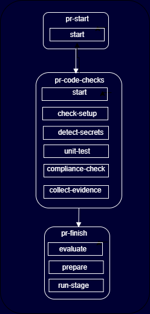
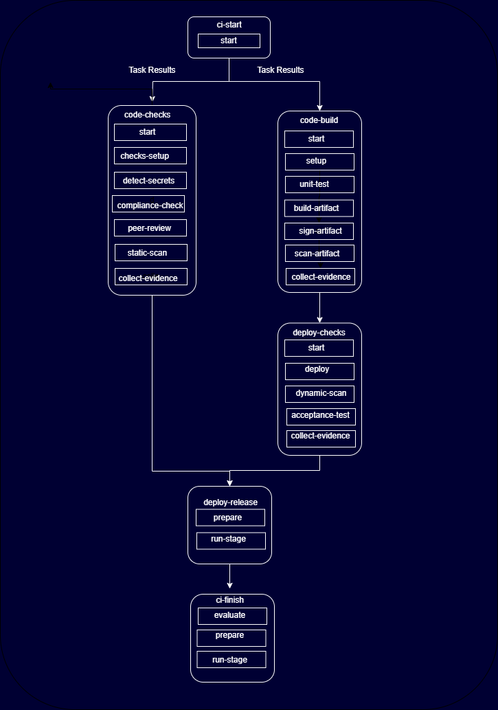
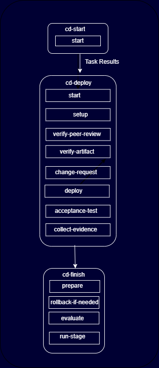
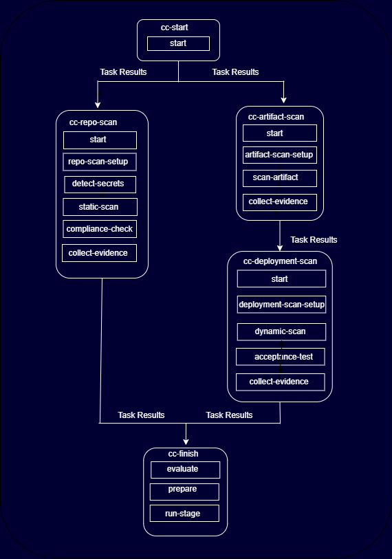

---

copyright:
  years: 2024, 2024
lastupdated: "2024-11-25"

keywords: DevSecOps, IBM Cloud, task parallelization, task specific workspace, true task concurrency

subcollection: devsecops

---

{{site.data.keyword.attribute-definition-list}}


# Improving data consistency and achive true task concurrency in DevSecOps
{: #devsecops-nextgen}

This page describes the features of the next generation devsecops pipeline which will help in solving data consistency problems and have task concurrency without having access to persistent volume

{: shortdesc}

## Problems with v9 and v10 versions of pipeline specifications
{: #devsecops-nextgen-problems}

`v9` uses sequential execution of all the tasks inside the pipeline run. This results in extremely long execution times for the pipeline runs
`v10` was introduced to run pipeline tasks concurrently to reduce overall pipeline runtime. See [Improving compliance pipeline performance in DevSecOps](https://cloud.ibm.com/docs/devsecops?topic=devsecops-devsecops-conc)

Pipelines rely on a persistent volume to store data during execution. This includes user application source code, scan results, and related information. However, the use of persistent volumes has led to several issues.

1. Concurrent access by multiple tasks lead to data inconsistencies.
1. A persistent volume can be attached to only one worker node at a time. If a task is scheduled on a different node where the persistent volume is not connected, it must wait until the volume is released. This limitation forces tasks to execute sequentially, impacting concurrent execution of tasks
1. Accessing the persistent volume incurs significant latency, being three times slower than native disk access. This delay contributes to longer execution times for individual tasks.

## Solution

To address the above issues, it is necessary to eliminate the use of persistent volumes in the pipeline. This approach will resolve problems related to data consistency, latency, and wait times for persistent volume resources.

A new version of the pipeline, v11, was created by restructuring stages into steps within a task. This design allows similar stages to share source code and other artifacts seamlessly. Each task includes two mandatory steps, start and collect-evidence, managed by DevSecOps to facilitate data sharing across stages.

For example ci pipeline is restructed into 6 tasks compared to 15 tasks in previous versions of the pipeline.

The restructured pipeline details are outlined in the following sections.

## Enable nextgen pipeline
{: #devsecops-nextgen-enable}

### Prerequisites
{: #devsecops-nextgen-prereq}

When using IBM managed workers no prerequisites are required.

When using private worker ensure that the following prerequisites are in place:

The worker nodes that are used in the pipelines need to be at Tekton v 0.61 or later and worker agent 0.20.1 or later

* Update the definitions section of the toolchain to include `v11` branch from the [compliance-pipelines](https://github.ibm.com/one-pipeline/compliance-pipelines/tree/v11)
* Update the `.pipeline-config.yaml` to include the following one line specification:

```
preprocessor_version: latest
```
* Rename `test` as `unit-test` and `containerize` as `build-artifact` in `.pipeline-config.yaml`

## v11 pipeline structures
{: #devsecops-nextgen-pipelines}

### PR pipeline structure
{: #devsecops-nextgen-pr-pipeline}

The PR pipeline runs compliance checks on a pull request for a given application repository and acts as a safeguard for merging into the main branch. The PR pipeline is triggered by opening or updating a pull request against the main branch.

For more information, see the [PR pipeline documentation](https://test.cloud.ibm.com/docs/devsecops?topic=devsecops-cd-devsecops-pr-pipeline)

| PR Pipeline Stage | Stage Description |
| ----------------- | ----------------- |
| `pr-start` | Create pipeline assets Pull Request. |
| `pr-code-checks` | Task to verify the Pull Request. |
| `pr-finish` | Consolidates pipeline status. The stage fails if the previous run compliance checks fail. This stage  is the "fail-safe" behavior to ensure that compliance issues are remediated before a PR can be merged and/or a build can be deployed. |
{: caption="Stages of PR pipeline structure and descriptions of each stage" caption-side="bottom"}

{: caption="PR pipeline structure" caption-side="bottom"}

### CI pipeline structure
{: #devsecops-conc-ci-pipeline}

The CI pipeline builds deployable artifacts from application repositories. It scans, tests, and signs built artifacts while also collecting evidence on each stage to be released in the inventory and tracked through the deployment and change management.

For more information, see the [CI pipeline documentation](https://test.cloud.ibm.com/docs/devsecops?topic=devsecops-cd-devsecops-ci-pipeline).


| CI Pipeline Stage | Stage Description |
| ----------------- | ----------------- |
| `ci-start` | Create pipeline assets. |
| `code-checks` | Performs static scans using the source code.  |
| `code-build` | Performs unit tests, creates build and signs the artifacts.  |
| `deploy checks` | Deploy on test cluster and perform dynamic scans and acceptance tests. |
| `deploy-release` | Add the built artifacts to the inventory that will be used by the Continuous Delivery pipeline. |
| `ci-finish` | Collect, create, and upload the logs files, artifacts, and evidence to the evidence locker. If any of the compliance checks. Previously ran in the pipeline fail, this stage fails. This stage is the "fail-safe" behavior to ensure that compliance issues are remediated before a PR can be merged, a build is deployed, or when both. |
{: caption="Stages of CI pipeline structure and descriptions of each stage" caption-side="bottom"}


{: caption="CI pipeline structure" caption-side="bottom"}

### CD pipeline structure
{: #devsecops-conc-cd-pipeline}

The CD pipeline compiles all the content for evidence and the change request summary. It deploys the build to an environment, such as staging or production, while uploading all evidence to the evidence locker.

For more information, see the [CD pipeline documentation](https://test.cloud.ibm.com/docs/devsecops?topic=devsecops-cd-devsecops-cd-pipeline)

| CD Pipeline Stage | Stage Description |
| ----------------- | ----------------- |
| `cd-start` | Create necessary pipeline assets and artifacts |
| `cd-deploy` | Setup build and test environment, perform verifications, deploy the app and run acceptance tests  |
| `cd-finish` | Publish acceptance tests, deploy record, collect CycloneDX SBOM, and close change request.  |
{: caption="Stages of CD pipeline structure and descriptions of each stage" caption-side="bottom"}

{: caption="CD pipeline structure" caption-side="bottom"}

### CC pipeline structure
{: #devsecops-conc-cc-pipeline}

The CC pipeline performs periodic scans on deployed artifacts and their source repositories. It scans the latest deployed state in the inventory and creates or updates incident issues in the incident repository.

For more information, refer to [CC pipeline documentation](https://test.cloud.ibm.com/docs/devsecops?topic=devsecops-devsecops-cc-pipeline)

| CC Pipeline Stage | Stage Description |
| ----------------- | ----------------- |
| `cc-start` | Create necessary pipeline assets and artifacts |
| `cc-repo-scan` | Perform static scans |
| `cc-artifact-scan` | Runs to scan and detect secrets in an application code |
| `cc-static-scan` | Run static scan code on the application code |
| `cc-dynamic-scan` | Runs the OWASP-Zap dynamic scan on the application that is deployed to a cluster |
| `cc-compliance-checks` | Code Risk Analyzer (CRA) and Mend Unified Agent scans for vulnerability detection on open source dependencies and any other compliance checks on application repositories. |
| `cc-scan-artifact` | Scan the container image with Vulnerability Advisor. |
| `cc-finish` | Collect, create, and upload the logs files, artifacts, and evidence to the evidence locker. If any of the compliance checks previously ran in the pipeline fail, this stage fails. This stage has a "fail-safe" behavior to ensure that compliance issues are remediated before a PR can be merged and/or a build can be deployed.  |
{: caption="Stages of CC pipeline structure and descriptions of each stage" caption-side="bottom"}

{: caption="CC pipeline structure" caption-side="bottom"}
