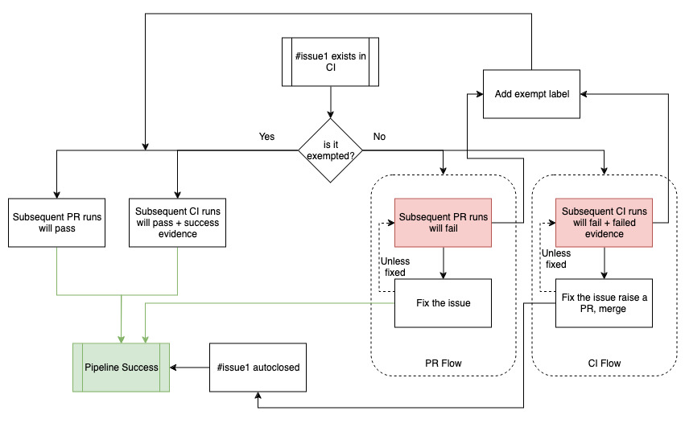
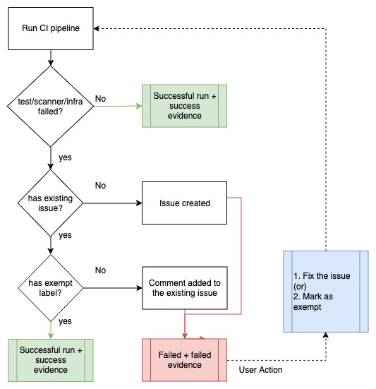
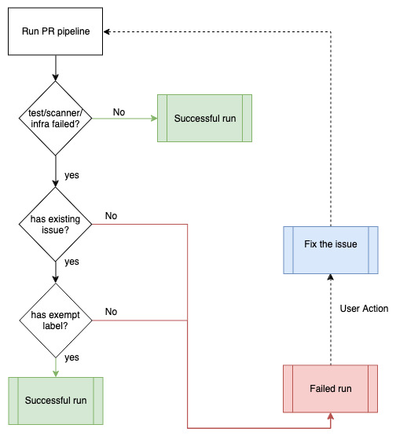
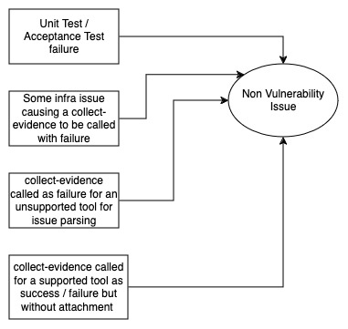

---

copyright:
  years: 2022
lastupdated: "2024-05-23"

keywords: DevSecOps, IBM Cloud

subcollection: devsecops

---

{{site.data.keyword.attribute-definition-list}}

# Managing nonincident issues
{: #non-incident-issues}

Unlike incident issues that can arise due to vulnerabilities or CVEs found inside the code or the deployed artifacts, nonincident issues result from failing unit tests, failing acceptance tests, failing branch protection checks, an image signing failure, or an image not being pulled from the registry because of a bad token or expired credentials. These scenarios are not because of some vulnerabilities but are a deviation from the compliance posture. As a result, nonincident issues are captured whenever the pipelines encounter such scenarios.
{: shortdesc}

The [`collect-evidence` script](/docs/devsecops?topic=devsecops-devsecops-collect-evidence) captures nonincident issues inside the issues repository, and attaches the issue with the collected evidence. The `collect-evidence` script relies on the [`cocoa incident process-legacy`](/docs/devsecops?topic=devsecops-cd-devsecops-cli#incident-process-legacy) command of the DevSecOps CLI tool, which can create issues or close existing issues based on the status of the current run.

## Nonincident issue processing
{: #non-incident-issue-processing}

Nonincident issues do not have a due date assigned to them by default. Any pipeline can open nonincident issues, and in a subsequent run, if the issue is no longer detected for the `incident-tool-subject` combination, the issue is automatically closed. Issues can be found during build, deployment, or during the continuous monitoring phase.

For nonincident issues that are found during a CI run, a combination of the `evidence_type` and the app repo branch is used to construct the issue title so that a unit test failure found on branch `master` is dealt with separately from a unit test failure on branch `dev`. A similar combination is used for such issues that are found from the CC pipeline. Issues coming from CD pipeline have a different grouping criteria, where the combination of the evidence type id, target environment, and the pipeline namespace is used to construct the title of the issue. This different grouping criteria ensure that the issues found on CI and CC are not interfered by the CD run for similar tests like an acceptance test. The different criteria also ensure that issues found for a target environment `prod` is dealt separately from an issue that is found on target environment `staging`.

The [`cocoa incident process-legacy`](/docs/devsecops?topic=devsecops-cd-devsecops-cli#incident-process-legacy) command has two modes of action based on whether the `current-status` of the run was a success or failure:

- If the `current-status` is `failure`, the command looks for an open issue of a similar title coming from the same tool against the same subject. If the command finds such an issue, it updates the issue with an additional comment. However, if an existing issue matching the `title-tool-subject` is not found, the command creates an incident, attaches a default severity of `High`, however no due date is set.
- If the `current-status` is `success`, the command looks for an open issue that matches the `title-tool-subject` combination, and if such an issue is found, it is closed automatically. If such an issue is not found, then the issue is a no-op.

The lifecycle of nonincident issue flow is depicted below.

{: caption="Lifecycle of nonincident issues" caption-side="bottom"}

User journey of encountering a nonincident issue and it's resolution for CI and PR pipelines is depicted below.

{: caption="Nonincident issues lifecycle in CI pipeline" caption-side="bottom"}

{: caption="Nonincident issues lifecycle in PR pipeline" caption-side="bottom"}

{: caption="Causes of creation of nonincident issues" caption-side="bottom"}

Currently, nonincident issue handling handles the following scenarios:

- Failing unit test
- Failing acceptance test
- Failing image signing
- Failing branch protection check
- Any scanning tool failure
- Infrastructure failure and outage
- Any tool which is do not have an incident parser
