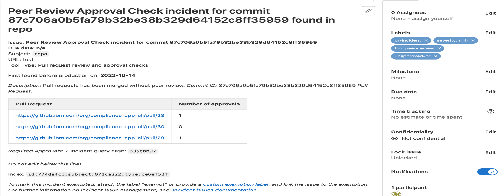
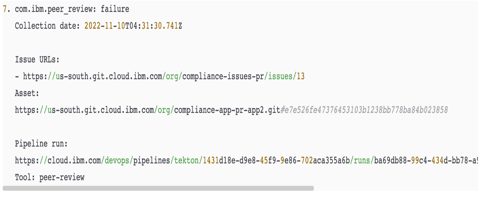

---

copyright: 
  years: 2021, 2023
lastupdated: "2023-05-24"

keywords: DevSecOps, evidence, merge request, pull request, data collection

subcollection: devsecops

---

{{site.data.keyword.attribute-definition-list}}

# Peer review compliance
{: #cd-devsecops-peer-review}

Peer code reviews are a key component of delivering secure and compliant software. The DevSecOps reference implementation helps to enforce the review of code changes before they are merged and promoted to production. 
{: shortdesc}

The `peer-review` check is enabled by default in Continuous Integration (CI) toolchain and optional in Continuous Delivery (CD) toolchain.

* To enable the `peer-review` check in your toolchain, set the environment variable `peer-review-compliance` to `1` in the CD toolchain.
* To disable the `peer-review` check in your toolchain, set the environment variable `peer-review-compliance` to `0` in the CI and CD toolchains.

The reference implementation discovers instances of code that are not peer reviewed, collects [evidence](/docs/devsecops?topic=devsecops-devsecops-collect-evidence), and creates incident issues to track these items.

Before you can merge code in the master (protected) branch, the code must be reviewed by a person who did not upload the modified code.

The code repository (repo) must have at least two members: one member who has admin privileges, and another member who has write privileges. If code is merged into a repo without a review, the action must be visible in the code repo audit trail. Periodically scan the audit trail to identify and analyze these exceptional situations.

The pipeline collects peer review compliance data during builds and deployments to create the audit trail from code pull/merge request merges to change requests.

In this diagram, PR1, PR2 are the pull/merge requests that are approved before merging. Similarly, for PR4, PR5, and PR7. However, PR3 and PR6, highlighted in red, are merged without an approval, which is a peer review compliance violation. This is captured as evidence. 

 {: caption="Figure 1. Data collection" caption-side="bottom"}

By default, the sample application in the CI toolchain attempts to set the minimum number of reviewers to 1. If you want to change the number of reviewers, set the `peer_review_approvers` envronment property as required.  For more information on setting the minimum number of reviewers required for a pull/merge request, see the following GitHub and GitLab resources:

* [GitHub: Require multiple reviewers for pull requests](https://github.blog/2018-03-23-require-multiple-reviewers/)
* [GitLab: Merge request approval rules](https://docs.gitlab.com/ee/user/project/merge_requests/approvals/rules.html)

## Data collected in continuous integration build runs 
{: #cd-devsecops-ci-data}

This data collection contains a list of all of the commits for the pull/merge requests that were merged in app repos since the last build.

Pull request data is collected directly from the app repos. Data for each pull/merge request that is related to commits between the repo commit that triggered the previous build and the currently available commit is collected. 

Commits that do not contain a pull/merge request create a compliance incident issue in the following releases of the pipeline. You cannot commit directly to the master branch.
{: important}

A compliance incident typically holds the following information:

* List of pull/merge request URLs for the associated commit ID.
* Application repository.
* Commit ID.
* Required number of approvals.

 {: caption="Figure 2. Pull Request incident content" caption-side="bottom"}

Collected data is saved as an [evidence](/docs/devsecops?topic=devsecops-devsecops-collect-evidence) artifact, which is uploaded to the evidence locker, and then referred to in the evidence itself. The final evidence result is determined by the approved pull/merge requests. Unapproved, but merged pull/merge requests fail this type of evidence.

## Data that is collected in continuous deployment runs 
{: #cd-devsecops-cd-data}

This data collection contains a list of all of the pull/merge requests that were merged in app repos since the last deployment. 

Pull request data is collected from the evidence locker and the incident issue repo.

* The inventory gathers data from all builds on related artifacts since the last deployment.
* The evidence locker collects stored peer review data from the builds.
* The incident issue repo collects information about open pull/merge request incidents.

The app repos are not accessed during this data collection. Because continuous deployment pipelines are assumed to be located in isolated environments, you cannot cross those boundaries.
{: important}

## Change request content 
{: #cd-devsecops-cr-content}

The following data is included in the automatically generated change request:

* List of pull/merge request incidents that are not remediated. This data includes the asset details and the incident URL.

Non-remediated pull/merge request incidents impact the deployment readiness of the change request. If any pull/merge request incidents are found, they are considered vulnerabilities and the [change request](/docs/devsecops?topic=devsecops-cd-devsecops-approve-cr) must be reviewed and approved manually.
{: important}

{: caption="Figure 3. Change request content" caption-side="bottom"}

## Pull request incident remediation
{: #cd-devsecops-pr-remediate}

Pull request incidents are considered vulnerabilities because they indicate that unchecked code is contained in the released artifacts. To remediate these incidents, complete the following steps:

1. Retroactively review the merged change.
1. Create an issue about how to fix any existing problems with the code.
1. Add the `exempt` label or close the pull/merge request incident issue.

The author of the pull/merge request and the person who closes the pull/merge request incident issue cannot be the same person.
{: important}
