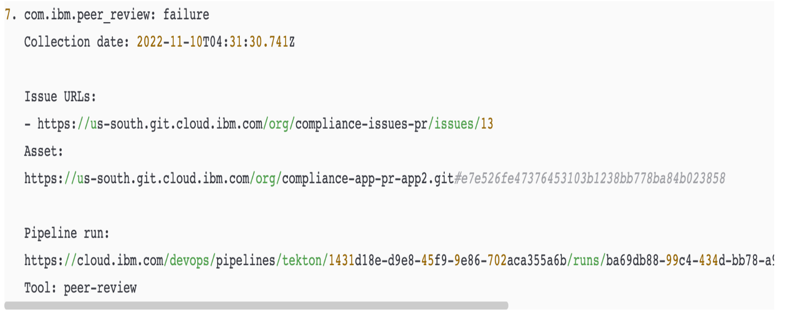

---

copyright:
  years: 2021, 2024
lastupdated: "2024-03-25"

keywords: DevSecOps, evidence, merge request, pull request, data collection

subcollection: devsecops

---

{{site.data.keyword.attribute-definition-list}}

# Best practices for peer review compliance
{: #cd-devsecops-peer-review}

Peer code reviews are a key component of delivering secure and compliant software. The DevSecOps reference implementation helps to enforce the review of code changes before they are merged and promoted to production. This documentation provides instructions for enabling and disabling the peer review check within Continuous Integration (CI) and optionally, within Continuous Delivery (CD) toolchains.
{: shortdesc}

## Continuous Integration (CI) toolchain
{: #devsecops-ci-toolchain}

By default, the peer review check is enabled in the CI toolchain. To modify this setting:

* To enable the peer review check, set the value of the `peer-review-compliance` environment variable to 1.
* To disable the peer review check, set the value of the `peer-review-compliance` environment variable to 0.

## Continuous Delivery (CD) toolchain
{: #devsecops-cd-toolchain}

The following environment variables enable you to manage the peer review check within your CD toolchain:

* To retrieve a list of pull requests and their associated titles for your ongoing deployment, keep the `peer-review-collection` environment variable set to `1`. `peer-review-collection` is enabled by default with the variable set to `1`. To deactivate this listing, set `peer-review-collection` to `0`.
* To enable the peer review validation for all pull requests associated with your current deployment, set the `peer-review-compliance` environment variable to `1`. By default, this variable is set to `0`. To bypass this validation, set `peer-review-compliance` to `0`.

## Important points
{: #devsecops-important-points}

You must conduct peer reviews only on the protected base branch, which is where the inventory is updated. If you are running a CI pipeline on a feature branch, set the environment variable `peer-review-compliance` to `0` for that specific trigger to prevent the peer review check on the feature branch.

The adherence to peer review compliance is contingent upon the completion of a successful CI pipeline run and the subsequent entry to inventory. As a result, the initial run of the CI pipeline skips the peer review compliance check.

To ensure compliance with peer review standards, it is assumed that inventory updates in the `ci-finish` stage occur on the `master` branch. However, if your inventory updates are performed on a different branch other than master, you can set the environment variable `inventory-repo-branch` to indicate the branch where the inventory updates are taking place.

By default, the Continuous Integration (CI) pipeline automatically performs a commit to the inventory repository at the conclusion of the run. It does this by using the application name as the inventory entry. However, if you intend to modify the inventory entry during the release stage, it is recommended to incorporate an environment property named `inventory-entry-name` into your toolchain. This property should contain the modified inventory name for working for peer review process.

The reference implementation discovers instances of code that are not peer reviewed, collects [evidence](/docs/devsecops?topic=devsecops-devsecops-collect-evidence), and creates incident issues to track these items.

Before you can merge code in the master (protected) branch, the code must be reviewed by a person who did not upload the modified code.

The code repository must have at least two members: one member who has admin privileges, and another member who has write privileges. If code is merged into a repository without a review, the action must be visible in the code repository audit trail. Periodically scan the audit trail to identify and analyze these exceptional situations.

The pipeline collects peer review compliance data during builds and deployments to create the audit trail from code pull/merge request merges to change requests.

In this diagram, PR1, PR2 are the pull/merge requests that are approved before merging. Similarly, for PR4, PR5, and PR7. However, PR3 and PR6, highlighted in red, are merged without an approval, which is a peer review compliance violation. This is captured as evidence.

 {: caption="Figure 1. Data collection" caption-side="bottom"}

By default, the sample application in the CI toolchain attempts to set the minimum number of reviewers to 1. If you want to change the number of reviewers, set the `peer_review_approvers` environment property as required. For more information on setting the minimum number of reviewers that are required for a pull/merge request, see the following GitHub and GitLab resources:

* [GitHub: Require multiple reviewers for pull requests](https://github.blog/2018-03-23-require-multiple-reviewers/)
* [GitLab: Merge request approval rules](https://docs.gitlab.com/ee/user/project/merge_requests/approvals/rules.html)


## Collected data in continuous integration build runs
{: #cd-devsecops-ci-data}

This data collection contains a list of all of the commits for the pull/merge requests that were merged in app repositories since the last build.

Pull request data is collected directly from the app repositories. Data for each pull/merge request that is related to commits between the repository commit that triggered the previous build and the currently available commit is collected.

Commits that do not contain a pull/merge request create a compliance incident issue in the following releases of the pipeline. You cannot commit directly to the master branch.
{: important}

A compliance incident typically holds the following information:

* List of pull/merge request URLs for the associated commit ID.
* Application repository.
* Commit ID.
* Required number of approvals.

 {: caption="Figure 2. Pull Request incident content" caption-side="bottom"}

Collected data is saved as an [evidence](/docs/devsecops?topic=devsecops-devsecops-collect-evidence) artifact, which is uploaded to the evidence locker, and then referred to in the evidence itself. The final evidence result is determined by the approved pull/merge requests. Unapproved, but merged pull/merge requests fail this type of evidence.


## Data that is collected in continuous deployment runs
{: #cd-devsecops-cd-data}

This data collection contains a list of all of the pull/merge requests that were merged in app repositories since the last deployment.

Pull request data is collected from the evidence locker and the incident issue repository.

* The inventory gathers data from all builds on related artifacts since the last deployment.
* The evidence locker collects stored peer review data from the builds.
* The incident issue repository collects information about open pull/merge request incidents.

The app repositories are not accessed during this data collection. Because continuous deployment pipelines are assumed to be located in isolated environments, you cannot cross those boundaries.
{: important}


## Change request content
{: #cd-devsecops-cr-content}

The list of pull/merge request incidents that are not remediated are included in the automatically generated change request. This data includes the asset details and the incident URL. Pull/merge request incidents that are not remediated impact the deployment readiness of the change request. If any pull/merge request incidents are found, they are considered vulnerabilities and the [change request](/docs/devsecops?topic=devsecops-cd-devsecops-approve-cr) must be reviewed and approved manually.


{: caption="Figure 3. Change request content" caption-side="bottom"}


## Pull request incident remediation
{: #cd-devsecops-pr-remediate}

Pull request incidents are considered vulnerabilities because they indicate that unchecked code is contained in the released artifacts. To remediate these incidents, complete the following steps:

1. Retroactively review the merged change.
1. Create an issue about how to fix any existing problems with the code.
1. Add the `exempt` label or close the pull/merge request incident issue.

The author of the pull/merge request and the person who closes the pull/merge request incident issue cannot be the same person.
{: important}

## Troubleshooting

Case 1:

##### Problem

Failure in `collect_peer_review_commits` in `prod-start` stage of the CD pipeline results in other stages failing with errors.
When the following error occurs in the `prod_start` stage
```
| ERROR | 2023-12-20T07:00:48.978Z | index.ts:25:14 | The inventory entry has no such property ('pipeline_run_id').
```

##### Solution

Users who possess inventory entries that are not supported by the one-pipeline must add an [ignore file in the inventory](https://cloud.ibm.com/docs/devsecops?topic=devsecops-cd-devsecops-inventory#how-to-exclude-files-and-directories-in-the-inventory). This action ensures that those files are not considered for any computations.


## Known issues
{: #pr-known-issues}

Peer review compliance is reliant on the inclusion of inventory entry in the release step that follows each iteration of the Continuous Integration (CI) pipeline. Skipping to include the inventory entry for any failed CI pipeline run might result in the peer review evidence for that specific CI pipeline run being disregarded in your Continuous Delivery (CD) pipeline.
