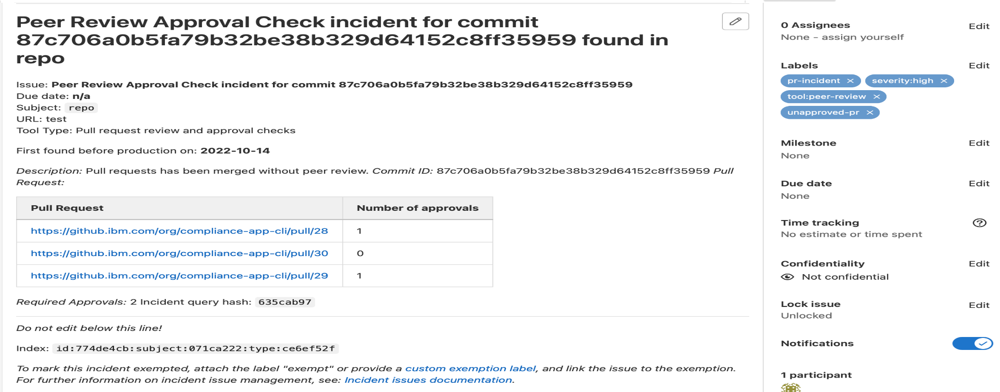

---

copyright:
  years: 2021, 2022
lastupdated: "2022-01-27"

keywords: DevSecOps

subcollection: devsecops

---

{:shortdesc: .shortdesc}
{:table: .aria-labeledby="caption"}
{:external: target="_blank" .external}
{:codeblock: .codeblock}
{:pre: .pre}
{:screen: .screen}
{:tip: .tip}
{:note: .note}
{:important: .important}
{:download: .download}
{:help: data-hd-content-type='help'}
{:support: data-reuse='support'}

# Peer review compliance
{: #cd-devsecops-peer-review}

Peer code reviews are a general best practice in software development and they are also a key component of delivering secure and compliant software.
{: shortdesc}

The DevSecOps reference implementation helps to enforce the review of new code changes before they are merged and promoted to production. The reference implementation discovers instances of code that was not peer reviewed, collects evidence, and creates incident issues to track these items.

Before you can merge code in the main branch, it must be reviewed by a person who did not upload the modified code.

The code repository (repo) must have at least two members, one member that has admin privileges and another member that has write privileges. If code is merged into a repo without a review, the action must be visible in the code repo audit trail. Periodically scan the audit trail to identify and analyze these exceptional situations.

The pipeline collects peer review compliance data during builds and deployments to create the audit trail from code pull / merge request merges to change requests.

In this diagram, PR1, PR2 are the pull / merge requests which have been approved before merging. Similarly for PR4, PR5 and PR7. However, PR3 and PR6, highlighted in red, have been merged without an approval which is a peer-review compliance violation. This will be captured and stored as an evidence. 

 {: caption="Data collection" caption-side="bottom"}
 
## Data that is collected in continuous integration build runs 
{: #cd-devsecops-ci-data}

This data collection contains a list of all of the pull / merge requests that were merged in app repos since the last build.

Pull request data is collected directly from the app repos. Data for each pull / merge request that is related to commits between the repo commit that triggered the previous build and the currently available commit is collected. These commits are stored in the inventory entries.

Commits that do not contain a pull / merge request create a compliance incident issue in the following releases of the pipeline. You cannot commit directly to the main branches.
{: important}

A compliance incident typically holds the following information:
* The pull / merge request URL
* Application repository
* Author of the pull / merge request
* Developer who merged the pull / merge request
* Timestamp of the merge activity

 {: caption="Pull Request incident content" caption-side="bottom"}

Collected data is saved as an evidence artifact, which is uploaded to the evidence locker, and then referred to in the evidence itself. The final evidence result is determined by the approved pull / merge requests. Unapproved, but merged pull / merge requests fail this type of evidence.

## Data that is collected in continuous delivery deployment runs 
{: #cd-devsecops-cd-data}

This data collection contains a list of all of the pull / merge requests that were merged in app repos since the last deployment. 

Pull request data is collected from the inventory, the evidence locker, and the incident issue repo.

* The inventory gathers data from all builds on related artifacts since the last deployment.
* The evidence locker collects stored peer review data from the builds.
* The incident issue repo collects information about open pull / merge request incidents.

The app repos are not accessed during this data collection. Because continuous delivery pipelines are assumed to be located in isolated environments, you cannot cross those boundaries.
{: important}

## Change request content 
{: #cd-devsecops-cr-content}

The following data is included in the automatically generated change request:

* List of pull / merge requests in code repos that are related to this release. This data includes the pull / merge request title and URL.
* List of pull / merge request incidents that are not remediated. This data includes the pull / merge request number and URL, and the incident URL.

Nonremediated pull / merge request incidents impact the deployment readiness of the change request. If any pull / merge request incidents are found, they are considered vulnerabilities and the change request must be reviewed and approved manually.
{: important}

{: caption="Change request content" caption-side="bottom"}

## Opting out of peer review
{: #cd-devsecops-optout}

In some exceptional cases, you might need to merge your changes without a peer review. To enable that option, set the `opt_out_pr_collection` environment variable with any nonzero textual value.

Use this option with caution, and be sure to have your changes reviewed later.
{: important}

## Pull request incident remediation
{: #cd-devsecops-pr-remediate}

Pull request incidents are considered vulnerabilities because they indicate that unchecked code is contained in the released artifacts. To remediate these incidents, complete the following steps:

1. Retroactively review the merged change.
1. Create an issue about how to fix any existing problems with the code.
1. Close the pull / merge request incident issue.

The author of the pull / merge request and the person who closes the pull / merge request incident issue cannot be the same person.
{: important}
