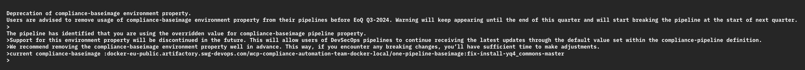

---

copyright:
  years: 2023, 2025
lastupdated: "2025-10-27"

keywords: DevSecOps pipeline definitions, pipeline version, pipeline variant, devsecops templates, devsecops template

subcollection: devsecops

---

{{site.data.keyword.attribute-definition-list}}

# Pipeline definitions provided by DevSecOps
{: #cd-devsecops-pipeline-defs}

Different versions of pipeline definitions are available to use with DevSecOps templates. You might need to use a specific version, depending on your needs.
{: shortdesc}

The following table lists the different versions of pipeline definitions that are used by DevSecOps templates:

|Version |Description |
|:----------|:------------------------------|
|`open-v10`| DevSecOps pipeline version where some pipelines run concurrently. This version will have performance improvement as [tasks run concurrently](/docs/devsecops?topic=devsecops-devsecops-conc). |
{: caption="Continuous compliance pipeline versions" caption-side="top"}

## Deprecating compliance-baseimage environment property
{: #cd-devsecops-pipeline-defs-compliance-baseimage-deprication}

Adopters using `compliance-baseimage` environment property are advised to remove this environment property. 
If you are still utilizing this variable, you will get a warning like the screenshot below.
{: caption="Deprecation of compliance-baseimage" caption-side="bottom"}
 
One-pipeline expects you to use pipeline definitions as mentioned [above.](#cd-devsecops-pipeline-defs)
{: shortdesc}
