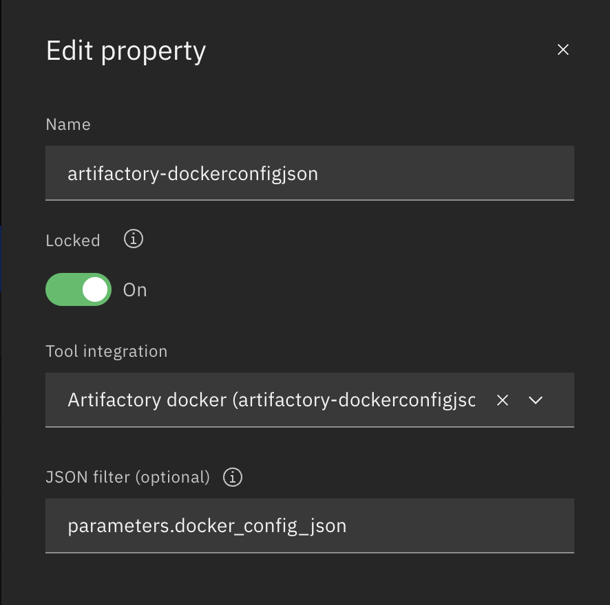
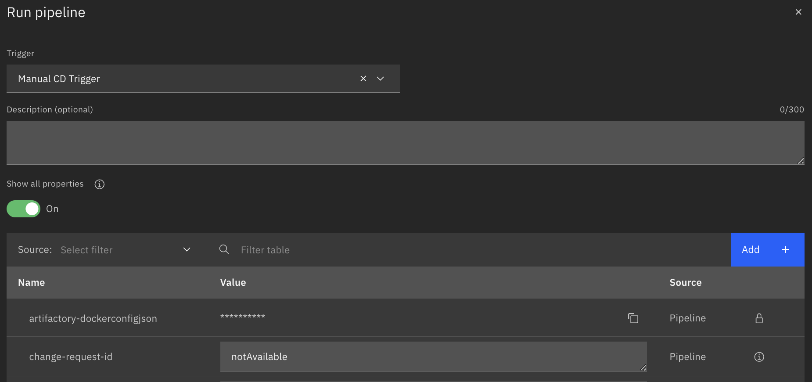
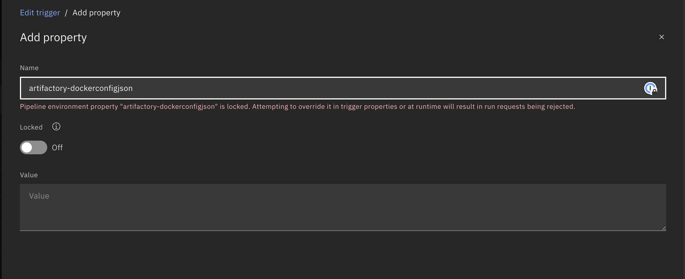

---

copyright:
  years: 2022, 2025
lastupdated: "2025-07-22"

keywords: DevSecOps, IBM Cloud, maximum retry time, scans

subcollection: devsecops

---

{{site.data.keyword.attribute-definition-list}}

# Pipeline parameters
{: #cd-devsecops-pipeline-parm}

Parameters are provided for the pull request, continuous integration, continuous deployment, continuous compliance, and promotion pipelines.
{: shortdesc}

You can add parameters to the pipelines on the pipeline UI and access them from the [custom scripts](/docs/devsecops?topic=devsecops-cd-devsecops-pipelines-custom-customize).
{: note}

Tables 1 to 5 list and describe the pull request, continuous integration, continuous deployment, continuous compliance, and promotion parameters for pipelines.

|Name |Type	|Description |Required or Optional | Locked or Unlocked |
|:----------|:------------------------------|:------------------|:----------|:----------|
|`artifactory-dockerconfigjson` 		|SECRET 		|The base64-encoded Docker `config.json` file that stores credential information for artifactory.	 			|Optional			| Unlocked |
| `base-branch` |text | The target branch where the PR is merged. Typically, `master` is the default base branch. If a PR Git trigger is configured, which is typically the case, this parameter is populated from the trigger.| Required  | Unlocked |
| `base-repo` |text | The URL of the repo where the PR is merged. If a PR Git trigger is configured, which is typically the case, this parameter is populated from the PR trigger.| Required  | Unlocked |
| `base-repo-name` |text | The name of the repo where the PR is merged. If a PR Git trigger is configured, which is typically the case, this parameter is populated from the PR trigger.| Required  | Unlocked |
| `base-repo-owner` |text | The owner of the repo where the PR is merged. If a PR Git trigger is configured, which is typically the case, this parameter is populated from the PR trigger.| Required  | Unlocked |
|`baseimage-auth-email`		|text 		|The email credential for the base image of the application Dockerfile, required by the Code Risk Analyzer scan.		|Optional			| Unlocked |
|`baseimage-auth-host`		|text		|The host credential for the base image of the application Dockerfile, required by the Code Risk Analyzer scan.	|Optional			| Unlocked |
|`baseimage-auth-password`		|SECRET		|The password credential for the base image of the application Dockerfile, required by the Code Risk Analyzer scan. |Optional			| Unlocked |
|`baseimage-auth-user`		|text		|The user credential for the base image of the application Dockerfile, required by the Code Risk Analyzer scan.			|Optional			| Unlocked |
|`branch-protection-rules-path`		|text		|Set the path to a JSON file containing the customized list of the required compliance checks, relative to the integrated app repository.			|Optional			| Unlocked |
|`branch-protection-status-check-prefix`		|text		|The prefix text for branch protection status check (Defaults to `tekton`)	|Optional			| Unlocked |
| `cocoa-config-retry-status-code` | text   | The response status code for an API call that needs to be retried in the cocoa CLI. For example: `500,404`.  Default value: `500` | Optional | Unlocked |
| `cocoa-config-max-retry-attempts`| text   | The number of times that the cocoa CLI can retry the API call. For example: `5`. Default value: `3` | Optional | Unlocked |
| `cocoa-config-git-default-branch (supported in Q4, 2022)` | text   | The default Git branch for the cocoa CLI. For example: `main`. Default value: `master`   | Optional | Unlocked |
|`collect-evidence-in-pr`		|text		|Set this flag to collect the evidences in PR pipeline based on the selected option. Options: `none`, `all`, `success`	|Optional			| Unlocked |
|`cos-api-key`		| SECRET		| The Cloud Object Storage API key.	| Optional			| Locked |
|`cos-access-key-id` | SECRET | The Cloud Object Storage Access Key ID from HMAC credentials. (Provided along with `cos-secret-access-key` instead of `cos-api-key`)| Optional | Unlocked |
|`cos-secret-access-key` | SECRET | The Cloud Object Storage Secret Access Key from HMAC credentials. (Provided along with `cos-access-key-id` instead of `cos-api-key`) | Optional | Unlocked |
|`cos-bucket-name`		| text		| The name of the bucket in your Cloud Object Storage instance that is used as an evidence locker.	|Optional			| Unlocked |
|`cos-endpoint`		| text		| The endpoint that stores the evidence in the Cloud Object Storage instance that is used as an evidence locker. For more information, see [Endpoint Types](/docs/cloud-object-storage?topic=cloud-object-storage-endpoints#advanced-endpoint-types). | Optional			| Locked |
|`backup-cos-api-key`		| SECRET		| The Backup Cloud Object Storage API key.	| Optional			| Locked |
|`backup-cos-access-key-id` | SECRET | The BackupCloud Object Storage Access Key ID from HMAC credentials. (Provided along with `backup-cos-secret-access-key` instead of `backup-cos-api-key`)| Optional | Unlocked |
|`backup--secret-access-key` | SECRET | The BackupCloud Object Storage Secret Access Key from HMAC credentials. (Provided along with `backup-cos-access-key-id` instead of `backup-cos-api-key`) | Optional | Unlocked |
|`backup-cos-bucket-name`		| text		| The name of the backup bucket in your Cloud Object Storage instance that is used as an evidence locker.	|Optional			| Unlocked |
|`backup-cos-endpoint`		| text		| The endpoint that reads the evidence from the backup Cloud Object Storage instance that is used as an evidence locker. For more information, see [Endpoint Types](/docs/cloud-object-storage?topic=cloud-object-storage-endpoints#advanced-endpoint-types). | Optional			| Locked |
|`cra-custom-script-path`  | text   | Path to a custom script to be run before CRA scanning. This script is sourced to provide the option to set ENV variables in the context of the CRA BOM tool. | Optional | Unlocked |
|`cra-cveignore-path`  |text   |File path to the `cveignore`, relative to the application repository root. The default file path is `.cra/.cveignore` if value is not provided.   | Optional    | Unlocked |
|`cra-docker-build-context`     |text   |If this flag is specified, Code Risk Analyzer uses the directory in the path parameter as the Docker build context. The default value is `false`. |Optional | Unlocked |
|`cra-docker-buildflags`  |text  |Customize docker build command for build stage scanning. The parameter is empty by default.    |Optional    | Unlocked |
|`cra-dockerfile-pattern`             | text   | Ability to add Dockerfile with a different naming convention, such as `enterprise-linux.Dockerfile` | Optional | Unlocked |
|`cra-exclude-devdependencies`		| text		| Specifies whether to exclude dev dependencies from scanning (`true` or `false`). The default value is `false`.	| Optional			| Unlocked |
|`cra-gradle-exclude-configs`     | text   | Specifies which Gradle configurations to exclude dependencies in scanning. Example: `runtimeClasspath,testCompileClasspath`. The parameter is empty by default.   | Optional   | Unlocked |
|`cra-maven-exclude-scopes`       | text   | Specifies which maven scopes to exclude dependencies in scanning. Example: `test,compile`. The parameter is empty by default.  | Optional   | Unlocked |
|`cra-nodejs-create-package-lock`		| text		| Enable Code Risk Analyzer discovery to build the `package-lock.json` file for node.js repos. This parameter is set to false by default.	| Optional			| Unlocked |
|`cra-python-create-requirements-txt`		|text		|Deprecated. The new CRA tools don't use this parameter anymore. Enable Code Risk Analyzer discovery to build the `requirements.txt` file for Python repos. This parameter is set to false by default.	|Optional			| Unlocked |
|[`detect-secrets-baseline-filename`](#detect-secrets-baseline-filename) | text | The name of the baseline file in your app repository. | Optional | Unlocked |
|[`detect-secrets-exclusion-list`](#detect-secrets-exclusion-list) | text | A regex list of files to be excluded in the detect-secrets scan. | Optional | Unlocked |
|[`detect-secrets-image`](#detect-secrets-image) | text | Specifies an alternative detect-secrets image, including custom images or specific versions of the official image. | Optional | Unlocked |
|[`detect-secrets-verbose`](#detect-secrets-verbose) | text | Outputs the name of the file that is currently being scanned. | Optional | Unlocked |
|[`dind-image`](#dind-image)		|text		|Base image to run sidecars.	|Optional			| Unlocked |
|`evidence-repo`		|tool integration		|The evidence repo URL.	|Optional			| Locked |
|`evidence-reuse`		|text		|Set this flag to `1` to enable reuse of evidences. |Optional | Unlocked |
|`evidence-reuse-for-failure`		|text		|Set this flag to `1` to enable reuse of failed evidences. |Optional | Unlocked |
|`evidence-validity-period`		|text		|The validity period(in hours) within which evidences can be reused. Default value: 24 hours. Maximum value: 720 hours (30 days) |Optional | Unlocked |
|`git-token`		|SECRET		|The Git repo access token.	|Optional			| Locked |
|`github-token`		|SECRET		|The GitHub repo access token.	|Optional			| Unlocked |
|`grit-token`		|SECRET		|The {{site.data.keyword.gitrepos}} access token.	|Optional			| Unlocked |
| `head-branch` |text | The source branch where the PR is raised. If a PR Git trigger is configured, which is typically the case, this parameter is populated from the PR trigger.| Required  | Unlocked |
| `head-repo` |text | The URL of the repo where the PR is raised. If a PR Git trigger is configured, which is typically the case, this parameter is populated from the PR trigger.| Required  | Unlocked |
| `head-sha` |text | The HEAD commit on the `head-branch`. If a PR Git trigger is configured, which is typically the case, this parameter is populated from the PR trigger.| Required  | Unlocked |
|`iam_retry_count`		|text		|The number of retries to wait for fetching the IAM token.	|Optional			| Unlocked |
|`iam_retry_sleep`		|text		|The amount of wait time for fetching the IAM token.	|Optional			| Unlocked |
|`ibmcloud-api-key`		|SECRET		|The {{site.data.keyword.cloud}} API key that interacts with the `ibmcloud` CLI tool.	|Required			| Locked |
|`incident-repo`  	|tool integration		|The incident issues the repo URL.	|Optional			| Locked |
|`one-pipeline-dockerconfigjson`		|SECRET		|The base64-encoded Docker `config.json` file that pulls images from a private registry.	|Optional			| Unlocked |
|`opt-in-pr-updates` | text | To enable cve information updates in PR. Default `1` | Optional | Unlocked |
|`pipeline-config`		|text		|The configuration file that customizes pipeline behavior.	|Optional			| Locked |
|`pipeline-config-branch`		|text		|The branch of the DevSecOps pipeline configuration.	|Optional			| Locked |
|`pipeline-config-repo`		|text		|The repo URL of the DevSecOps pipeline configuration location.	|Optional			| Locked |
|`pipeline-dockerconfigjson`		|SECRET		|The base64-encoded Docker `config.json` file that pulls images from a private registry.	|Optional			| Unlocked |
|[`pipeline-debug`](#pipeline-parm-pipeline-debug)		|select		|The pipeline debug mode switch.  |Optional			| Unlocked |
|`slack-notifications`		|text		|The switch that turns the Slack integration on or off.	|Optional			| Locked |
|`[slack-notifications]`(#pipeline-parm-slack-notifications)		|text		|The switch that turns the Slack integration on or off |Optional		| Unlocked |
|`opt-in-sonar-pr-analysis`		|Text		|Allowing Sonarqube scan to do the pull request analysis (This option will work only if the PR is not contributed from a forked repository).This parameter is only valid for `App-preview PR pipeline`.|Optional			| Unlocked |
{: caption="Pull request parameters" caption-side="bottom"}
{: #cd-pr-parameters}
{: tab-title="Pull request parameters"}
{: tab-group="IAM-simple"}
{: class="simple-tab-table"}

|Name |Type	|Description |Required or Optional |Locked or Unlocked |
|:----------|:------------------------------|:------------------|:----------|:----------|
|`app-name` 		|text 		|The name of your application that is specified in the toolchain settings.			|Required			| Unlocked |
|`artifactory-dockerconfigjson`		|SECRET		|The base64-encoded Docker `config.json` file that stores credential information for artifactory.			|Optional			|  Unlocked |
|`baseimage-auth-email`		|text		|The credentials for the application Dockerfile base image that is required for the Code Risk Analyzer scan.	|Optional			|  Unlocked |
|`baseimage-auth-host`		|text		|The credentials for the application Dockerfile base image that is required for the Code Risk Analyzer scan. |Optional			| Unlocked |
|`baseimage-auth-password`		|SECRET		|The credentials for the application Dockerfile base image that is required for the Code Risk Analyzer scan.	|Optional			| Unlocked |
|`baseimage-auth-user`		|text		|The user credential for the base image of the application Dockerfile, required for the Code Risk Analyzer scan.			|Optional			| Unlocked |
|`batched-evidence-collection`|text|Set this flag to enable evidence collection in batch mode, which minimizes the network calls. Default `1`|Optional| Unlocked |
|[`branch`](#pipeline-parm-branch)		|text		|The Git repo branch of the repository that contains the source code of your application. Default value:	`master` |Optional			|  Unlocked |
|`branch-protection-rules-path`		|text		|Set the path to a JSON file containing the customized list of the required compliance checks, relative to the integrated app repository.			|Optional			|  Unlocked |
|`branch-protection-status-check-prefix`		|text		|The prefix text for branch protection status check (Defaults to `tekton`)	|Optional			|  Unlocked |
| `ciso-ibmcloud-api-key` | SECRET | Overrides `ibmcloud-api-key` for image signing and signature verification. | Optional |  Unlocked |
| `cocoa-config-retry-status-code` | text   | The response status code for an API call that needs to be retried in the cocoa CLI. For example: `500,404`.  Default value: `500` | Optional |  Unlocked |
| `cocoa-config-max-retry-attempts`| text   | The number of times that the cocoa CLI can retry the API call. For example: `5`. Default value: `3` | Optional |  Unlocked |
| `cocoa-config-git-default-branch (supported in Q4, 2022)` | text   | The default Git branch for the cocoa CLI. For example: `main`. Default value: `master`   | Optional | Unlocked | 
|[`cluster-name`](#pipeline-parm-cluster-name)		|text		|The name of the Docker build cluster.	|Required			| Locked | 
|[`compliance-baseimage`](#pipeline-parm-compliance-baseimage)	|text		|The base image for running the built-in pipeline code.	|Optional Unlocked | 
|`cos-api-key`		| SECRET		| The Cloud Object Storage API key.	| Optional			| Locked | 
|`cos-access-key-id` | SECRET | The Cloud Object Storage Access Key ID from HMAC credentials. (Provided along with `cos-secret-access-key` instead of `cos-api-key`)| Optional | Unlocked | 
|`cos-secret-access-key` | SECRET | The Cloud Object Storage Secret Access Key from HMAC credentials. (Provided along with `cos-access-key-id` instead of `cos-api-key`) | Optional | Unlocked | 
|`cos-bucket-name`		| text		| The name of the bucket in your Cloud Object Storage instance that is used as an evidence locker.	|Optional			| Locked | 
|`cos-endpoint`		| text		| The endpoint that stores the evidence in the Cloud Object Storage instance that is used as an evidence locker. For more information, see [Endpoint Types](/docs/cloud-object-storage?topic=cloud-object-storage-endpoints#advanced-endpoint-types). | Optional			| Locked | 
|`backup-cos-api-key`		| SECRET		| The Backup Cloud Object Storage API key with the Reader permission.	| Optional			| Locked |
|`backup-cos-access-key-id` | SECRET | The BackupCloud Object Storage Access Key ID from HMAC credentials. (Provided along with `backup-cos-secret-access-key` instead of `backup-cos-api-key`)| Optional | Unlocked |
|`backup--secret-access-key` | SECRET | The BackupCloud Object Storage Secret Access Key from HMAC credentials. (Provided along with `backup-cos-access-key-id` instead of `backup-cos-api-key`) | Optional | Unlocked |
|`backup-cos-bucket-name`		| text		| The name of the backup bucket in your Cloud Object Storage instance that is used as an evidence locker.	|Optional			| Unlocked |
|`backup-cos-endpoint`		| text		| The endpoint that reads the evidence from the backup Cloud Object Storage instance that is used as an evidence locker. For more information, see [Endpoint Types](/docs/cloud-object-storage?topic=cloud-object-storage-endpoints#advanced-endpoint-types). | Optional			| Locked |
|`cr-ibmcloud-api-key`		|SECRET		| Overrides `ibmcloud-api-key` if provided, for pulling the image from Container Registry for the Sysdig scan.	|Optional			| Unlocked | 
|`cr-resource-group`		|text		| The resource group that is used to access the Container Registry. |Optional			| Unlocked | 
| `cra-custom-script-path`  | text   | Path to a custom script to be run before CRA scanning. This script is sourced to provide the option to set ENV variables in the context of the CRA BOM tool. | Optional | Unlocked | 
|`cra-cveignore-path`     |text   |File path to the `cveignore`, relative to the application repository root. The default file path is `.cra/.cveignore` if value is not provided.   |Optional    | Unlocked | 
|`cra-docker-build-context`     |text   |If this flag is specified, Code Risk Analyzer uses the directory in the path parameter as the Docker build context. The default value is `false`. |Optional | Unlocked | 
|`cra-docker-buildflags`   |text   |Customize docker build command for build stage scanning. The parameter is empty by default.    |Optional    | Unlocked | 
|`cra-dockerfile-pattern`             | text   | Ability to add Dockerfile with a different naming convention, such as `enterprise-linux.Dockerfile` | Optional | Unlocked | 
|`cra-exclude-devdependencies`		| text		| Specifies whether to exclude dev dependencies from scanning (`true` or `false`). The default value is `false`.	| Optional			| Unlocked | 
|`cra-gradle-exclude-configs`     | text   | Specifies which Gradle configurations to exclude dependencies in scanning. Example: `runtimeClasspath,testCompileClasspath`. The parameter is empty by default.   | Optional   | Unlocked | 
| `cra-ibmcloud-api-key` | SECRET | Overwrites the `ibmcloud-api-key` that is used by the CRA tasks. | Optional | Unlocked | 
|`cra-maven-exclude-scopes`       | text   | Specifies which maven scopes to exclude dependencies in scanning. Example: `test,compile`. The parameter is empty by default.  | Optional   | Unlocked | 
|`cra-nodejs-create-package-lock`		| text		| Enable Code Risk Analyzer discovery to build the `package-lock.json` file for node.js repos. This parameter is set to false by default.	| Optional			| Unlocked | 
|`cra-python-create-requirements-txt`		|text		|Deprecated. The new CRA tools don't use this parameter anymore. Enable Code Risk Analyzer discovery to build the `requirements.txt` file for Python repos. This parameter is set to false by default.	|Optional			| Unlocked | 
|[`custom-exempt-label`](#pipeline-parm-custom-exempt-label)  |text   |Defines the custom label with which the incident issue is marked as exempted.	|Optional			| Unlocked | 
|`custom-image-tag`		|text		|The custom tag for the image in a comma-separated list.	|Optional			| Locked | 
|[`detect-secrets-baseline-filename`](#detect-secrets-baseline-filename) | text | The name of the baseline file in your app repository. | Optional | Unlocked | 
|[`detect-secrets-exclusion-list`](#detect-secrets-exclusion-list) | text | A regex list of files to be excluded in the detect-secrets scan. | Optional | Unlocked | 
|[`detect-secrets-image`](#detect-secrets-image) | text | Specifies an alternative detect-secrets image, including custom images or specific versions of the official image. | Optional | Unlocked | 
|[`detect-secrets-verbose`](#detect-secrets-verbose) | text | Outputs the name of the file that is currently being scanned. | Optional | Unlocked | 
|`dev-cluster-namespace`		|text		|The Kubernetes cluster namespace where the Docker engine is hosted and deployed.	|Required			|  Locked | 
|`dev-region`		|text		|The {{site.data.keyword.cloud_notm}} region that hosts the cluster.	|Required			| Locked | 
|`dev-resource-group`		|text		|The cluster resource group.	|Required			| Locked | 
|`doi-buildnumber`		|text		|The build number value to use as the `--buildnumber` flag in `ibmcloud doi` commands.	|Optional			| Unlocked | 
|`doi-environment`		|text		|The {{site.data.keyword.DRA_short}} target environment.	|Optional			| Locked | 
|`doi-ibmcloud-api-key`  |SECRET  | The {{site.data.keyword.cloud_notm}} API key that interacts with the DevOps Insights instance where DOI records are uploaded. |Optional | Locked | 
|`doi-logicalappname`		|text		|The app name to use as the `--logicalappname` flag in `ibmcloud doi` commands	|Optional			| Unlocked | 
|`doi-tags`		|text		|Comma-separated custom tags.	|Optional			| Unlocked | 
|`doi-toolchain-id`		|text		|The {{site.data.keyword.DRA_short}} instance toolchain ID.	|Optional			| Locked | 
|`evidence-repo`		|tool integration		|The evidence repo URL.	|Optional			| Locked | 
|`evidence-reuse`		|text		|Set this flag to `1` to enable reuse of evidences. |Optional | Unlocked | 
|`evidence-reuse-for-failure`		|text		|Set this flag to `1` to enable reuse of failed evidences. |Optional | Unlocked | 
|`evidence-validity-period`		|text		|The validity period(in hours) within which evidences can be reused. Default value: 24 hours. Maximum value: 720 hours (30 days) |Optional | Unlocked | 
|`git-token`		|SECRET		|The Git repo access token.	|Optional			| Locked | 
|`github-token`		|SECRET		|The GitHub repo access token.	|Optional			| Unlocked | 
|`gosec-additional-flags` | text | Extra flags to be appended to the start of the `gosec` command. |Optional			| Unlocked | 
|`gosec-private-repository-url`   |text   | (deprecated) Your private repository base URL. For example, `https://github.ibm.com`. |Optional | Unlocked | 
| `gosec-private-repository-host`    | text   | Your private repository host. For example, `github.ibm.com` | Optional | Unlocked | 
|`gosec-private-repository-ssh-key`     |secret   |The SSH key for the private repository. |Optional | Unlocked | 
| `gosec-private-repository-user` | text | User for the private repository with https access (default to `x-oauth-basic`) | Optional | Unlocked | 
| `gosec-private-repository-token` | secret | The token that is used for https access to a private repository (default to the token configured for the first Git integration in the toolchain whose repository URL is hosted on `gosec-private-repository-host`'s value) | Optional | Unlocked | 
|`gosec-proxy-virtual-repository-token`     |secret   |The virtual repository token for `gosec` proxy. |Optional | Unlocked | 
|`gosec-proxy-virtual-repository-user`     |text   |The virtual repository user for `gosec` proxy. | Optional | Unlocked | 
|`gosec-proxy-virtual-repository-url`     |text   |The virtual repository url for `gosec` proxy. |Optional | Unlocked | 
|`gosec-scan-image`     |text   |Specifies an alternative `gosec` image, including custom images or specific versions of the official image. |Optional | Unlocked | 
|`grit-token`		|SECRET		|The {{site.data.keyword.gitrepos}} access token.	|Optional			| Unlocked | 
|`iam_retry_count`		|text		|The number of retries to wait for fetching the IAM token.	|Optional			| Unlocked | 
|`iam_retry_sleep`		|text		|The amount of wait time for fetching the IAM token.	|Optional			| Unlocked | 
|`ibmcloud-api-key`		|SECRET		|The {{site.data.keyword.cloud_notm}} API key that interacts with the `ibmcloud` CLI tool.	|Required			| Locked | 
|`ibmcloud-enable-session-keep-alive` | select | Keep the IBM Cloud CLI session alive for long-running jobs in Code Risk Analyzer scan, if this value is set to 1. |Optional			| Unlocked | 
|`icr-dockerconfigjson`		|SECRET		|The base64-encoded Docker `config.json` file that stores credential information for IBM Container Registry. This parameter is used by SLSA attestation.			|Optional			| Unlocked | 
|`incident-assignee`		|text		|The assignee for the incident issues (GitHub or GitLab username). |Optional			| Unlocked | 
|`incident-assignees`		|text		|The assignees for the incident issues (one or more usernames that are separated by a comma). This parameter can be used only with GitHub and GitLab Premium accounts. |Optional			| Unlocked | 
|`incident-label`		|text		|The label for new incident issues.	|Optional			| Unlocked | 
|`incident-labels`		|text		|The labels for new incident issues. `incident-labels` can be one or more labels that are separated by a comma.	|Optional			| Unlocked | 
|`incident-repo`  	|tool integration		|The incident issues the repo URL.	|Optional			| Locked | 
|`inventory-repo`		|tool integration		|The inventory repo URL.	|Optional			| Locked | 
|[`dind-image`](#dind-image)		|text		|Base image to run sidecars.	|Optional			| Unlocked | 
|`opt-in-gosec`		|text		|Enables the `gosec` static scan.	|Optional			| Locked | 
|`one-pipeline-dockerconfigjson`		|SECRET		|The base64-encoded Docker `config.json` file that pulls images from a private registry.	|Optional			| Unlocked | 
|`opt-in-dynamic-api-scan`		|text		|To enable the OWASP Zap API scan. 	|Optional			| Locked | 
|`opt-in-dynamic-scan`		|text		|To enable the OWASP Zap scan.	 |Optional			| Locked | 
|`opt-in-dynamic-ui-scan`		|text		|To enable the OWASP Zap UI scan.	 |Optional			| Locked | 
|`opt-in-pr-collection`		|text		|Add any value to enable PR collection.	|Optional			| Unlocked | 
|`opt-in-sonar`		|text		|Sonarqube scan integration.	|Optional			| Locked | 
|`opt-in-sonar-hotspots`		|text		| Allows hotspot detection in Sonarqube scans.	|Optional			| Unlocked | 
|`opt-in-sonar-quality-gates`		|Text		|Allowing Sonarqube scan to detect quality gate failures.	|Optional			| Unlocked |
|`opt-out-ci-set-commit-status` 		|text		| If this parameter has any value, the commit status value of the source code repository is not set by the CI pipeline according to the CI pipeline execution's result (success or failure).	|Optional			| Unlocked | 
|`opt-out-nonvulnerability-issue-collection`		|text		|Add any value to opt out of nonvulnerability related issue collection.	|Optional			| Unlocked | 
|`peer-review-compliance`		|text		|Set the `peer-review-compliance` environment variable to 1 in your CI and CD Pipeline to activate the peer-review check. Similarly, in the CD pipeline, this configuration runs peer review validation for all pull requests linked to your current deployment. |Optional			| Locked | 
|`peer-review-collection`		|text		|To retrieve a list of pull requests and their associated titles for your ongoing deployment, Set this value to 1	|Optional			| Unlocked | 
|`pipeline-config`		|text		|The configuration file that customizes pipeline behavior.	|Required			| Locked | 
|`pipeline-config-branch`		|text		|The branch of the DevSecOps pipeline configuration.	|Optional			| Locked | 
|`pipeline-config-repo`		|text		|The repo URL of the DevSecOps pipeline configuration location.	|Optional	| Unlocked | 
|`publish-retry-duration`| text		|Specifies the duration, in seconds, to wait before initiating the next publish evidence attempt.	|Optional			| Locked | 
|[`pipeline-debug`](#pipeline-parm-pipeline-debug)		|select		|The pipeline debug mode switch.  |Optional			| Unlocked |
|`registry-namespace`		|text		|The Container Registry namespace for the image.	|Required			| Locked |
|`registry-region`		|text		|The {{site.data.keyword.cloud_notm}} region for the image registry.	|Required			|Locked |
| `repository` |text |The URL of your application's source code repository. | Optional |Unlocked |
|`repository-integration`		|text		|The integration name for the repo.	|Optional			| Unlocked |
|`sbom-validation-collect-evidence`   |text   | Enable evidence collection for sbom validation scan for cyclonedx sbom. If this value is set to 1, then the sbom validation collects evidence.  |Optional     |Unlocked |
|[`signing-key`](#pipeline-parm-signing-key)		|SECRET		|The base64-encoded private key for signing images by using `.pfx` file data.	|Required			|Unlocked |
|`skip-inventory-update-on-failure`	|text		|The switch that stops inventory update on a failed CI run.  |Optional			|Unlocked |
|[`slack-notifications`](#pipeline-parm-slack-notifications)		|text		|The switch that turns the Slack integration on or off |Optional		| Locked |
|`slsa-attestation`	|select		|The switch that enables SLSA attestations.  |Optional			|Unlocked |
| `slsa-attestation-public-key` | SECRET | The base64-encoded public key to verify SLSA attestation reports. | Optional |Unlocked |
|[`sonarqube`](#pipeline-parm-sonarqube)		|tool integration		|The Sonarqube tool integration.	|Optional			|Locked|
|[`sonarqube_standby`](#pipeline-parm-sonarqube)		|tool integration		|The standby Sonarqube tool integration that can be used as a fallback.	|Optional			|Unlocked |
|`sonarqube-config`		|text		|Runs a SonarQube scan in an isolated Docker-in-Docker container (default configuration) or in an existing development Kubernetes cluster (cluster configuration). Alternatively, you can bring your own SonarQube instance and configure the SonarQube tool integration (custom configuration). Options: `default`, `cluster`, or `custom`. Default is `default`. For more information, see ([Adding SonarQube to the continuous integration pipeline](/docs/devsecops?topic=devsecops-sonarqube#sonarqube-ci-pipeline)). | Required |Locked |
|`sonarqube-user-token`		|SECRET		|Pass the User token used for API access in case of `sonarqube-config` set to `custom`	|Optional			| Unlocked |
|[`sonarqube-namespace`](#pipeline-parm-sonarqube-namespace) 	|text		|The configured Kubernetes namespace to use with the SonarQube instance created by the pipeline.	|Optional			|Unlocked |
|`sonarqube-instance-image` 	|text		| The sonarqube instance image that is used to run as an isolated Docker-in-Docker container.	|Optional			|Unlocked |
|`sonarqube-scanner-image` 	|text		| The sonarqube scanner CLI image that is used for the default sonarqube scan command.	|Optional			|Unlocked |
|[`sonarqube-scan-command`](#pipeline-parm-sonarqube-scan-command) 	|text		|The sonarqube scan command that starts the sonarqube scan. `sonarqube-scan-command` must be set for Maven Java projects. For more information, see [`sonarqube-scan-command`](#pipeline-parm-sonarqube-scan-command) |Optional			|Unlocked |
|sonarqube-root-certificate		|Text or Secert		|In case of `sonarqube-config` set to `custom`, pass the self signed certificate as a PEM formatted text or base64 encoded secret|Optional			|Unlocked |
|[`static-scan-retry-count`](#pipeline-parm-static-scan-retry-count)		|text		|The number of retries to wait for the Sonarqube instance to be established.	|Optional			|Unlocked |
|[`static-scan-retry-sleep`](#pipeline-parm-static-scan-retry-sleep)		|text		|The amount of wait time per retry iteration.	|Optional			|Unlocked |
|`subpipeline-webhook-token` | SECRET| The webhook secret of the `Subpipeline Webhook Trigger` for [triggering async pipelines](/docs/devsecops?topic=devsecops-devsecops-async-sub-pipelines). See also [Updating the async stage webhooks](/docs/devsecops?topic=devsecops-update-async-webhook). |Optional |Unlocked |
|`sysdig-api-token`		|text		|Sysdig API token value. The token is visible from the Sysdig instance's User Profile page. This value is needed for running the Sysdig scan.	|Required			|Unlocked |
|`sysdig-inline-scanner-image`		|text		|Sysdig inline scanner image to be used for the scan. The default value is `quay.io/sysdig/secure-inline-scan:2`	|Optional			|Unlocked |
|[`sysdig-scan`](#pipeline-param-sysdig-scan)	|select		|Enable Sysdig scan for images. If this value is set to 1, then Sysdig scan is enabled. 	|Required			|Unlocked |
|`sysdig-policies`		|text		|Identifier of sysdig policies with comma seperated values. You can find policy identifier under section `How to scan Images with this policy` (look for the name after `--policy` tag)	|Optional			|Unlocked |
|`sysdig-url`		|text		|The URL of the Sysdig instance to be used for the scan. The default value is `https://us-south.security-compliance-secure.cloud.ibm.com`	|Optional			|Unlocked |
|`va-scan-retry-count`		|text		|The number of retries to wait for the vulnerability report scan.	|Required			|Unlocked |
|`va-scan-retry-sleep`	|text		|The number of wait times per retry iteration.	|Optional			|Unlocked |
|`version`		|text		|The version of the app to deploy.	|Required			|Locked | 
{: caption="Continuous integration parameters" caption-side="bottom"}
{: #cd-ci-parameters}
{: tab-title="Continuous integration parameters"}
{: tab-group="IAM-simple"}
{: class="simple-tab-table"}

|Name |Type	|Description |Required or Optional | Locked or Unlocked |
|:----------|:------------------------------|:------------------|:----------|:----------|
|`artifact-token`		|SECRET		|The token where artifacts are stored	|Required if artifact repo is in a different source provider.			| Unlocked |
|`artifactory-dockerconfigjson`		|SECRET		|The base64-encoded Docker `config.json` file that stores credential information for artifactory.			|Optional			|Unlocked |
|[`assignee`](#pipeline-parm-assignee)		|text		|The assignee of the change request.			|Optional			| Unlocked |
|[`backout-plan`](#pipeline-parm-backout-plan)	|text		|Plan of how the change will be rolled back if there is a failure.			|Optional			|Unlocked |
|`batched-evidence-collection`|text|Set this flag to enable evidence collection in batch mode, which minimizes the network calls. Default `1`|Optional|Unlocked |
| `ciso-ibmcloud-api-key` | SECRET | Overrides `ibmcloud-api-key` for image signing and signature verification. | Optional |Unlocked |
| `cocoa-config-retry-status-code` | text   | The response status code for an API call that needs to be retried in the cocoa CLI. For example: `500,404`.  Default value: `500` | Optional |Unlocked |
| `cocoa-config-max-retry-attempts`| text   | The number of times that the cocoa CLI can retry the API call. For example: `5`. Default value: `3` | Optional |Unlocked |
| `cocoa-config-git-automerge-threshold` | text   | The auto-merge threshold value (in seconds) used to sort and retrieve the latest merged PRs. Default value: `10`   | Optional |Unlocked |
| `cocoa-config-git-default-branch (supported in Q4, 2022)` | text   | The default Git branch for the cocoa CLI. For example: `main`. Default value: `master`   | Optional |Unlocked |
|[`change-request-duration`](#pipeline-parm-change-request-duration)    | text   | The time allocated for maintenance tasks, in minutes, to establish the planned end time of the modification. The default duration is `30 min`.| Optional |Unlocked |
|`change-management-repo`  | text   | The URL of the change management repository.  | Optional | Locked |
|[`change-request-id`](#pipeline-parm-change-request-id)    |text   |The ID of an open change request. If this parameter is set to `notAvailable` by default, a change request is automatically created by the continuous deployment pipeline. |Optional			| Unlocked |
|[`cluster`](#pipeline-parm-cluster)	|text 		|The name of the Docker build cluster.		|Required			| Locked |
|[`cluster-region`](#pipeline-parm-cluster-region)		|text		|The {{site.data.keyword.cloud_notm}} region that hosts the cluster.	|Required			| Locked |
|[`compliance-baseimage`](#pipeline-parm-compliance-baseimage)	|text		|The base image for running the built-in pipeline code. |Optional		| Unlocked |
|`cos-api-key`		| SECRET		| The Cloud Object Storage API key.	| Optional			|Locked |
|`cos-access-key-id` | SECRET | The Cloud Object Storage Access Key ID from HMAC credentials. (Provided along with `cos-secret-access-key` instead of `cos-api-key`)| Optional |Unlocked |
|`cos-secret-access-key` | SECRET | The Cloud Object Storage Secret Access Key from HMAC credentials. (Provided along with `cos-access-key-id` instead of `cos-api-key`) | Optional |Unlocked |
|`cos-bucket-name`		| text		| The name of the bucket in your Cloud Object Storage instance that is used as an evidence locker.	|Optional		|Locked |
|`cos-endpoint`		| text		| The endpoint that stores the evidence in the Cloud Object Storage instance that is used as an evidence locker. For more information, see [Endpoint Types](/docs/cloud-object-storage?topic=cloud-object-storage-endpoints#advanced-endpoint-types). | Optional			| Locked |
|`backup-cos-api-key`		| SECRET		| The Backup Cloud Object Storage API key with the Reader permission.	| Optional			| Locked |
|`backup-cos-access-key-id` | SECRET | The BackupCloud Object Storage Access Key ID from HMAC credentials. (Provided along with `backup-cos-secret-access-key` instead of `backup-cos-api-key`)| Optional | Unlocked |
|`backup--secret-access-key` | SECRET | The BackupCloud Object Storage Secret Access Key from HMAC credentials. (Provided along with `backup-cos-access-key-id` instead of `backup-cos-api-key`) | Optional | Unlocked |
|`backup-cos-bucket-name`		| text		| The name of the backup bucket in your Cloud Object Storage instance that is used as an evidence locker.	|Optional			| Unlocked |
|`backup-cos-endpoint`		| text		| The endpoint that reads the evidence from the backup Cloud Object Storage instance that is used as an evidence locker. For more information, see [Endpoint Types](/docs/cloud-object-storage?topic=cloud-object-storage-endpoints#advanced-endpoint-types). | Optional			| Locked |
|`cr-pipeline-name`		|text		|The name of the pipeline that is creating the change request.	|Optional			|Unlocked |
|`cr-pipeline-version`		|text		|The version of the pipeline that is creating the change request.	|Optional			|Unlocked |
| `cra-ibmcloud-api-key` | SECRET | Overwrites the `ibmcloud-api-key` that is used by the CRA tasks. | Optional |Unlocked |
|[`customer-impact`](#pipeline-parm-customer-impact)		|text		|The impact of the change on the customer.	|Optional			|Unlocked |
|[`deployment-impact`](#pipeline-parm-deployment-impact)		|text		|The impact of the change on the deployment.	|Optional			|Unlocked | 
|[`deployment-traceability`]    |text    |Set the value to 1 to enable deployment traceability    |Optional    |Unlocked   |
|[`description`](#pipeline-parm-description)		|text		|The description of the change that gets appended to the Change Request Description.	|Optional			|Unlocked |
|[`dind-image`](#dind-image)		|text		|Base image to run sidecars.	|Optional			|Unlocked |
|`doi-buildnumber`		|text		|The build number value to use as the `--buildnumber` flag in `ibmcloud doi` commands.	|Optional			|Unlocked |
|`doi-environment`		|text		|The {{site.data.keyword.DRA_short}} target environment.	|Optional			| Locked |
|`doi-ibmcloud-api-key`  |SECRET  | The {{site.data.keyword.cloud_notm}} API key that interacts with the DevOps Insights instance where DOI records are uploaded. |Optional | Locked |
|`doi-logicalappname`		|text		|The app name to use as the `--logicalappname` flag in `ibmcloud doi` commands	|Optional			|Unlocked |
|`doi-tags`		|text		|Comma-separated custom tags.	|Optional			|Unlocked |
|`doi-toolchain-id`		|text		|The {{site.data.keyword.DRA_short}} instance toolchain ID.	|Optional			| Locked |
|`emergency-label`		|text		|Identifies the pull request as an emergency.	|Optional			| Locked |
|`evidence-repo`		|tool integration		|The evidence repo URL.	|Optional			| Locked |
|`force-redeploy`    |text   |Forces the deployment or redeployment of the app even if the last deployment does not contain a delta in the inventory. Set this parameter to `true` to force a deployment of the app as if it is the first deployment on the specified target environment. By default, this parameter is set to `false`. |Optional |Unlocked |
|`git-token`		|SECRET		|The Git repo access token.	|Optional			| Locked |
|`github-token`		|SECRET		|The GitHub repo access token.	|Optional			|Unlocked |
|`grit-token`		|SECRET		|The {{site.data.keyword.gitrepos}} access token.	|Optional			|Unlocked |
|`iam_retry_count`		|text		|The number of retries to wait for fetching the IAM token.	|Optional			|Unlocked |
|`iam_retry_sleep`		|text		|The amount of wait time for fetching the IAM token.	|Optional			|Unlocked |
|`ibmcloud-api-key`		|SECRET		|The {{site.data.keyword.cloud_notm}} API key that interacts with the `ibmcloud` CLI tool.	|Required			|Locked |
|[`impact`](#pipeline-parm-impact)		|text		|Extra notes on what this change implementation impacts.	|Optional			|Unlocked |
|`incident-repo`  	|tool integration		|The incident issues the repo URL.	|Optional			| Locked |
|`inventory-repo`		|tool integration		|The inventory repo URL.	|Optional			| Locked |
|`incident-assignee`		|text		|The assignee for the incident issues (GitHub or GitLab username). |Optional			| Unlocked |
|`incident-assignees`		|text		|One or more assignees for the incident issues (one or more usernames that are separated by a comma). This parameter can be used only with GitHub and GitLab Premium accounts. |Optional			| Unlocked |
|`incident-label`		|text		|The label for new incident issues.	|Optional			| Unlocked |
|`incident-labels`		|text		|The labels for new incident issues. `incident-labels` can be one or more labels that are separated by a comma.	|Optional			|Unlocked |
|`opt-in-pr-collection`		|text		|Add any value to enable PR collection.	|Optional			| Unlocked |
|`opt-out-nonvulnerability-issue-collection`		|text		|Add any value to opt out of nonvulnerability related issue collection.	|Optional			| Unlocked |
|`pipeline-config`		|text		|The configuration file that customizes pipeline behavior.	|Required			| Locked |
|`pipeline-config-branch`		|text		|The branch of the DevSecOps pipeline configuration.	|Optional			| Locked |
|`pipeline-config-repo`		|text		|The repo URL of the DevSecOps pipeline configuration location.	|Optional			| Locked |
|[`pipeline-debug`](#pipeline-parm-pipeline-debug)		|select		|The pipeline debug mode switch.	|Optional			| Unlocked |
|`pipeline-dockerconfigjson`		|SECRET		|The base64-encoded Docker `config.json` file that pulls images from a private registry.	|Optional	  	| Locked | 
|`pre-prod-evidence-collection`	|text		| Set this flag to collect the pre-prod evidences and the change requests in the production deployment (`target-environment-purpose` set to `production`). Default value is `0`. |Optional | Locked |
|[`priority`](#pipeline-parm-priority)		|text		|The priority of the change request.	|Optional			| Unlocked |
|`publish-retry-duration`| text		|Specifies the duration, in seconds, to wait before initiating the next publish evidence attempt.	|Optional			| Unlocked |
|[`purpose`](#pipeline-parm-purpose)		|text		|The reason why the change is needed.	|Optional			| Unlocked |
|`region`		|text		|The target region where the app is deployed.	|Optional			| Unlocked |
| `rollback-change-request-id` |text |Change Request ID of the concluded deployment to be rolled back against |Required for CD Rollback pipeline | Unlocked |
|`rollback-enabled` |text |Flag to set whether inline rollback capability to be enabled or not. Default "0" |Optional | Unlocked |
|`rollback-limit` |text |integer number which indicates how many deployment backwards, the rollback can be performed. Default "1" |Optional |Unlocked |
|`sbom-validation-collect-evidence`   |text   | Enable verifying the status of sbom validation scan in the CI pipeline. If this value is set to 1, then the status of sbom validation(success or failure) scan is CI is verified.  |Optional     | Unlocked | 
|[`source-environment`](#pipeline-parm-source-environment)	|text		|The source environment that the app is promoted from.	|Required			|Locked |
|[`summary-retry-attempts`](#pipeline-parm-summary-retry-attempts)		|text		|Set the maximum number of retries for the evidence summary upload. The default is `5`.  |Optional			|Unlocked |
|[`summary-max-retry-time`](#pipeline-parm-summary-max-retry-time)		|text		|Set the maximum backoff time for the evidence summary upload. The actual backoff time is generated exponentially with each retry until it reaches the maximum backoff time set with this parameter. The default is `32`.  |Optional			| Unlocked |
|[`target-environment`](#pipeline-parm-target-environment)		|text		|The target environment that the app is deployed.	|Required			| Locked |
|[`target-environment-purpose`](#pipeline-parm-target-environment-purpose)		|text		|The context of the environment where the app is deployed. Valid values: `pre_prod`, `production`	|Required | Locked |
|[`target-environment-detail`](#pipeline-parm-target-environment-detail)		|text		|Description of the target environment where the app is deployed. |Required | Locked |
|`version`		|text		|The version of the app to deploy.	|Required	  	| Locked |
{: caption="Continuous deployment parameters" caption-side="bottom"}
{: #cd-parameters}
{: tab-title="Continuous deployment parameters"}
{: tab-group="IAM-simple"}
{: class="simple-tab-table"}

|Name |Type	|Description |Required or Optional |
|:----------|:------------------------------|:------------------|:----------|
|`app-url` 		|text 		|The URL of your application that is deployed on the target. Recommended for applications that use staging application url.			|Required			|
|`artifactory-dockerconfigjson`		|SECRET		|The base64-encoded Docker `config.json` file that stores credential information for artifactory.			|Optional			|
|`baseimage-auth-email`		|text		|The credentials for the application Dockerfile base image that is required for the Code Risk Analyzer scan.	|Optional			|
|`baseimage-auth-host`		|text		|The credentials for the application Dockerfile base image that is required for the Code Risk Analyzer scan. |Optional			|
|`baseimage-auth-password`		|SECRET		|The credentials for the application Dockerfile base image that is required for the Code Risk Analyzer scan.	|Optional			|
|`baseimage-auth-user`		|text		|The user credential for the base image of the application Dockerfile, required for the Code Risk Analyzer scan.			|Optional			|
|`batched-evidence-collection`|text|Set this flag to enable evidence collection in batch mode, which minimizes the network calls. Default `1`|Optional|
|`branch`		|text		|The Git repo branch of the repository that contains the source code of your application. Default value: `master`. |Optional			|
| `cocoa-config-retry-status-code` | text   | The response status code for an API call that needs to be retried in the cocoa CLI. For example: `500,404`.  Default value: `500` | Optional |
| `cocoa-config-max-retry-attempts`| text   | The number of times that the cocoa CLI can retry the API call. For example: `5`. Default value: `3` | Optional |
| `cocoa-config-git-default-branch (supported in Q4, 2022)` | text   | The default Git branch for the cocoa CLI. For example: `main`. Default value: `master`   | Optional |
| `cocoa-display-elapsed-time` | text   | Set this parameter to a nonempty value to print the elapsed time in seconds for cocoa CLI command execution. Example: `Elapsed time: 5.32 seconds`.   | Optional |
|[`compliance-baseimage`](#pipeline-parm-compliance-baseimage)		|text		|The base image for running the built-in pipeline code. |Optional			|
|`cos-api-key`		| SECRET		| The Cloud Object Storage API key.	| Optional			|
|`cos-access-key-id` | SECRET | The Cloud Object Storage Access Key ID from HMAC credentials. (Provided along with `cos-secret-access-key` instead of `cos-api-key`)| Optional |
|`cos-secret-access-key` | SECRET | The Cloud Object Storage Secret Access Key from HMAC credentials. (Provided along with `cos-access-key-id` instead of `cos-api-key`) | Optional |
|`cos-bucket-name`		| text		| The name of the bucket in your Cloud Object Storage instance that is used as an evidence locker.	|Optional			|
|`cos-endpoint`		| text		| The endpoint that stores the evidence in the Cloud Object Storage instance that is used as an evidence locker. For more information, see [Endpoint Types](/docs/cloud-object-storage?topic=cloud-object-storage-endpoints#advanced-endpoint-types). | Optional			|
|`backup-cos-api-key`		| SECRET		| The Backup Cloud Object Storage API key with the Reader permission.	| Optional			| Locked |
|`backup-cos-access-key-id` | SECRET | The BackupCloud Object Storage Access Key ID from HMAC credentials. (Provided along with `backup-cos-secret-access-key` instead of `backup-cos-api-key`)| Optional | Unlocked |
|`backup--secret-access-key` | SECRET | The BackupCloud Object Storage Secret Access Key from HMAC credentials. (Provided along with `backup-cos-access-key-id` instead of `backup-cos-api-key`) | Optional | Unlocked |
|`backup-cos-bucket-name`		| text		| The name of the backup bucket in your Cloud Object Storage instance that is used as an evidence locker.	|Optional			| Unlocked |
|`backup-cos-endpoint`		| text		| The endpoint that reads the evidence from the backup Cloud Object Storage instance that is used as an evidence locker. For more information, see [Endpoint Types](/docs/cloud-object-storage?topic=cloud-object-storage-endpoints#advanced-endpoint-types). | Optional			| Locked |
|`cr-ibmcloud-api-key`		|SECRET		| Overrides `ibmcloud-api-key` if provided, for pulling the image from Container Registry for the Sysdig scan.	|Optional			|
|`cr-resource-group`		|text		| The resource group that is used to access the Container Registry. |Optional			|
| `cra-custom-script-path`  | text   | Path to a custom script to be run before CRA scanning. This script is sourced to provide the option to set ENV variables in the context of the CRA BOM tool. | Optional |
|`cra-cveignore-path`     |text   |File path to the `cveignore`, relative to the application repository root. The default file path is `.cra/.cveignore` if value is not provided.   |Optional    |
|`cra-docker-build-context`     |text   |If this flag is specified, Code Risk Analyzer uses the directory in the path parameter as the Docker build context. The default value is `false`. |Optional |
|`cra-docker-buildflags`   |text   |Customize docker build command for build stage scanning. The parameter is empty by default.    |Optional    |
|`cra-dockerfile-pattern`             | text   | Ability to add Dockerfile with a different naming convention, such as `enterprise-linux.Dockerfile` | Optional |
|`cra-exclude-devdependencies`		| text		| Specifies whether to exclude dev dependencies from scanning (`true` or `false`). The default value is `false`.	| Optional			|
|`cra-gradle-exclude-configs`     | text   | Specifies which Gradle configurations to exclude dependencies in scanning. Example: `runtimeClasspath,testCompileClasspath`. The parameter is empty by default.   | Optional   |
| `cra-ibmcloud-api-key` | SECRET | Overwrites the `ibmcloud-api-key` that is used by the CRA tasks. | Optional |
|`cra-maven-exclude-scopes`       | text   | Specifies which maven scopes to exclude dependencies in scanning. Example: `test,compile`. The parameter is empty by default.  | Optional   |
|`cra-nodejs-create-package-lock`		| text		| Enable Code Risk Analyzer discovery to build the `package-lock.json` file for node.js repos. This parameter is set to false by default.	| Optional			|
|`cra-python-create-requirements-txt`		|text		|Deprecated. The new CRA tools don't use this parameter anymore. Enable Code Risk Analyzer discovery to build the `requirements.txt` file for Python repos. This parameter is set to false by default.	|Optional			|
|[`custom-exempt-label`](#pipeline-parm-custom-exempt-label)  |text   |Defines the custom label with which the incident issue was marked as exempted.    |Optional    |
|[`detect-secrets-baseline-filename`](#detect-secrets-baseline-filename) | text | The name of the baseline file in your app repository. | Optional |
|[`detect-secrets-exclusion-list`](#detect-secrets-exclusion-list) | text | A regex list of files to be excluded in the detect-secrets scan. | Optional |
|[`detect-secrets-image`](#detect-secrets-image) | text | Specifies an alternative detect-secrets image, including custom images or specific versions of the official image. | Optional |
|[`detect-secrets-verbose`](#detect-secrets-verbose) | text | Outputs the name of the file that is currently being scanned. | Optional |
|`dev-region`		|text		|The {{site.data.keyword.cloud_notm}} region that hosts the cluster. Required for default static and dynamic scans. |Required			|
|`dev-resource-group`		|text		|The cluster resource group.	|Required			|
|[`dind-image`](#dind-image)		|text		|Base image to run sidecars.	|Optional			|
|`doi-environment`		|text		|The {{site.data.keyword.DRA_short}} target environment.	|Optional			|
|`doi-ibmcloud-api-key`  |SECRET  | The {{site.data.keyword.cloud_notm}} API key that interacts with the DevOps Insights instance where DOI records are uploaded. |Optional  |
|`doi-tags`		|text		|Comma-separated custom tags.	|Optional			|
|`doi-toolchain-id`		|text		|The {{site.data.keyword.DRA_short}} instance toolchain ID.	|Optional			|
|`environment-tag`     |text   |Tag name that represents the target environment in the inventory. Example: `prod_latest`    |Required           |
|`evidence-repo`		|tool integration		|The evidence repo URL.	|Optional			|
|`git-token`		|SECRET		|The Git repo access token.	|Optional			|
|`github-token`		|SECRET		|The GitHub repo access token.	|Optional			|
|`grit-token`		|SECRET		|The {{site.data.keyword.gitrepos}} access token.	|Optional			|
|`ibmcloud-api-key`		|SECRET		|The {{site.data.keyword.cloud_notm}} API key that interacts with the `ibmcloud` CLI tool.	|Required			|
|`ibmcloud-enable-session-keep-alive` | select | Keep the IBM Cloud CLI session alive for long-running jobs in Code Risk Analyzer scan, if this value is set to 1. |Optional			|
|`incident-assignee`		|text		|The assignee for the incident issues (GitHub or GitLab username). |Optional			|
|`incident-assignees`		|text		|One or more assignees for the incident issues (one or more usernames that are separated by a comma). This parameter can be used only with GitHub and GitLab Premium accounts. |Optional			|
|`incident-label`		|text		|The label for new incident issues.	|Optional			|
|`incident-labels`		|text		|The labels for new incident issues. `incident-labels` can be one or more labels that are separated by a comma.	|Optional			|
|`incident-repo`  	|tool integration		|The incident issues the repo URL.	|Optional			|
|`inventory-exclude`    | text | Comma-separated list of the inventory entries that are excluded for scanning and testing in the CC pipeline. Entries can also be specified by using glob patterns.  |Optional			|
|`inventory-include`    | text | Comma-separated list of the inventory entries that are included for scanning and testing in the CC pipeline. Entries can also be specified by using glob patterns. If not set, all entries are scanned and tested.  |Optional			|
|`inventory-repo`		|tool integration		|The inventory repo URL.	|Optional			|
|`opt-in-auto-close` |text		|Enables auto-closing of issues from vulnerabilities, when the vulnerability is no longer detected by the CC pipeline and PR pipeline with evidence collection.	Defaults to `1`.|Optional			|
|`opt-in-cra-auto-remediation`		|text		|Specifies whether {{site.data.keyword.cloud_notm}} `cra auto remediation` is run (`true` or `false`).	|Optional			|
|`opt-in-cra-auto-remediation-enabled-repos`		|text		|Specifies the list of comma-separated repository names that are to be turned on for {{site.data.keyword.cloud_notm}} `cra auto remediation`. This parameter is considered only if `opt-in-cra-auto-remediation` is set to `true`	|Optional			|
|`opt-in-cra-auto-remediation-force`		|text		|Forces {{site.data.keyword.cloud_notm}} `cra auto remediation` to update the packages even if the major version is different than the current vulnerable package version (`true` or `false`). This parameter is considered only if `opt-in-cra-auto-remediation` is set to `true`	|Optional			|
|`opt-in-dynamic-api-scan`		|text		|To enable the OWASP Zap API scan. 	|Optional			|
|`opt-in-dynamic-scan`		|text		|To enable the OWASP Zap scan.	 |Optional			|
|`opt-in-dynamic-ui-scan`		|text	|To enable the OWASP Zap UI scan.	 |Optional			|
|`opt-in-sonar`		|text		|The Sonarqube scan integration.	|Optional			|
|`opt-in-sonar-hotspots`		|text		|Allows hotspot detection in sonarqube scans.	|Optional			|
|`opt-out-nonvulnerability-issue-collection`		|text		|Add any value to opt out of nonvulnerability related issue collection.	|Optional			|
|`pipeline-config`		|text		|The configuration file that customizes pipeline behavior.	|Required			|
|`pipeline-config-branch`		|text		|The branch of the DevSecOps pipeline configuration.	|Optional			|
|`pipeline-config-repo`		|text		|The repo URL of the DevSecOps pipeline configuration location.	|Optional			|
|[`pipeline-debug`](#pipeline-parm-pipeline-debug)		|select		|The pipeline debug mode switch.  |Optional			|
|`pipeline-dockerconfigjson`		|SECRET		|The base64-encoded Docker `config.json` file that pulls images from a private registry.	|Optional	  	|
|`publish-retry-duration`| text		|Specifies the duration, in seconds, to wait before initiating the next publish evidence attempt.	|Optional			|
|`region-prefix`  |text  |Region name as prefix for the `latest` tag for the target environment. Example: `us-south`   |Optional  |
|`repo-url` 		|text 		|The URL of your application repository.			|Required, if same inventory is used to store multiple application artifacts.			|
|`repository-integration`		|text		|The integration name for the repo.	|Optional			|
|`sbom-validation-collect-evidence`   |text   | Enable evidence collection for sbom validation scan for cyclonedx sbom. If this value is set to 1, then the sbom validation collects evidence.   |Optional     |
|[`slack-notifications`](#pipeline-parm-slack-notifications)		|text		|The switch that turns the Slack integration on or off |Optional		|
|`sonarqube`		|tool integration		|The Sonarqube tool integration.	|Optional			|
|`sonarqube-config`		|text		|Runs a SonarQube scan in an isolated Docker-in-Docker container (default configuration) or in an existing development Kubernetes cluster (cluster configuration). Alternatively, you can bring your own SonarQube instance and configure the SonarQube tool integration (custom configuration). Options: `default`, `cluster`, or `custom`. Default is `default`. For more information, see ([Adding SonarQube to the continuous integration pipeline](/docs/devsecops?topic=devsecops-sonarqube#sonarqube-ci-pipeline)).| Required |
|`sysdig-api-token`		|text		|Sysdig API token value. The token is visible from the Sysdig instance's User Profile page. This value is needed for running Sysdig scan.	|Required			|
|`sysdig-inline-scanner-image`		|text		|Sysdig inline scanner image to be used for the scan. The default value is `quay.io/sysdig/secure-inline-scan:2`	|Optional			|
|[`sysdig-scan`](#pipeline-param-sysdig-scan)	|select		|Enable Sysdig scan for images. If this value is set to 1, then the Sysdig scan is enabled.	|Required			|
|`sysdig-url`		|text		|The URL of the Sysdig instance to be used for the scan. The default value is `https://secure.sysdig.com`	|Optional			|
{: caption="Continuous compliance parameters" caption-side="bottom"}
{: #pipelines-cc-parameters}
{: tab-title="Continuous compliance parameters"}
{: tab-group="IAM-simple"}
{: class="simple-tab-table"}

|Name |Type	|Description |Required or Optional | Locked or Unlocked |
|:----------|:------------------------------|:------------------|:----------|:----------|
|[`dind-image`](#dind-image)		|text		|Base image to run sidecars.	|Optional			| Unlocked |
|inventory-ignore-file 		|text		|Custom filename for .inventoryignore file, this file contains list of files / folders to ignore on every partial-promotion run.   	|Optional		| Unlocked |
|inventory-include 		|text		|Inventory entries to selectively promote in partial promotion.   	|Optional		| Unlocked |
|inventory-exclude 		|text		|Inventory entries to exclude in partial promotion.   	|Optional		| Unlocked |
{: caption="Promotion parameters" caption-side="bottom"}
{: #pipelines-promotion-parameters}
{: tab-title="Promotion parameters"}
{: tab-group="IAM-simple"}
{: class="simple-tab-table"}

## Specifications
{: #pipeline-parm-specs}

The following specifications can help to explain parameters.

### assignee
{: #pipeline-parm-assignee}

This parameter is for the promotion pull request. This value holds the assignee of the change request. It must be a functional ID or an email who will be assigned to the change request in the change management system.

### backout-plan
{: #pipeline-parm-backout-plan}

This parameter is for the promotion pull request. Plan of how the change will be rolled back if there is a failure. By default it is empty.

### branch
{: #pipeline-parm-branch}

This is an optional parameter for the CI pipeline. It determines which branch pulls the code from the app repository. By default, it's `master`.

### change-request-duration
{: #pipeline-parm-change-request-duration}

This is an optional parameter for the CD pipeline. The value changes the maintenance duration. The default value is `30 min`.

### change-request-id
{: #pipeline-parm-change-request-id}

This is an optional parameter for the CD pipeline. By providing a change request ID, the pipeline skips the creation of a new change request and uses the provided change request. If this parameter is set to `notAvailable` or left empty, a change request is automatically created by the continuous deployment pipeline. The default value is `notAvailable`.

### cluster
{: #pipeline-parm-cluster}

This parameter holds the name of the cluster in the CD pipeline, which is used for the Docker deploy. This parameter is required for the example app.

### cluster-name
{: #pipeline-parm-cluster-name}

This parameter holds the name of the cluster in the CI pipeline, which is used for the Docker deploy. This parameter is required.

### cluster-region
{: #pipeline-parm-cluster-region}

This is a parameter for the CD pipeline. The {{site.data.keyword.cloud_notm}} region that hosts the cluster.	This is a required parameter for the example app.

### compliance-baseimage
{: #pipeline-parm-compliance-baseimage}

This parameter holds the version of the compliance-baseimage. If you want to use something other than the latest image, use this parameter.

Example:
`icr.io/continuous-delivery/toolchains/devsecops/baseimage:some-other-tag`

### custom-exempt-label
{: #pipeline-parm-custom-exempt-label}

This is an optional parameter for the CI and CC pipelines. If you marked an incident issue that is permanently exempted with a custom label, then this parameter must hold the value of the custom label.

### customer-impact
{: #pipeline-parm-customer-impact}

This parameter is for the promotion pull request. It records the impact of the change request on the customer. By default the parameter is the pipe-separated string `'Critical | High | Moderate | Low | No_Impact'`. Edit the default string to select one of the options.

### deployment-impact
{: #pipeline-parm-deployment-impact}

This parameter is for the promotion pull request. It records the impact of the change request on the deployment. By default the parameter is the pipe-separated string `'Small | Large'`. Edit the default string to select one of the options.

### description
{: #pipeline-parm-description}

This parameter is for the promotion pull request. This parameter contains the description of the change, that appends with the Change Request Description. By default it is empty.

### detect-secrets-baseline-filename
{: #detect-secrets-baseline-filename}

This parameter specifies a custom file name for the baseline file that is used by detect-secrets. By default, detect-secrets looks for a file that is named `.secrets.baseline` in the repository root directory. However, if you name your baseline file differently, you can provide its file name by using this parameter.

### detect-secrets-exclusion-list
{: #detect-secrets-exclusion-list}

This parameter is an environment property that overrides the default exclusion list when a run is done without an existing baseline file. This parameter identifies files to ignore so that issues are not created that are linked to them.

### detect-secrets-image
{: #detect-secrets-image}

This parameter can be used to specify a different detect-secrets image to use, such as a custom image or a specific version of the official detect-secrets image.

### detect-secrets-verbose
{: #detect-secrets-verbose}

This parameter, when set to 1, logs the name of the current file being scanned.

### dind-image
{: #dind-image}

This parameter is used for setting a custom dind image.  Set this parameter to use custom dind image tag

### impact
{: #pipeline-parm-impact}

This parameter is for the promotion pull request. Additional notes on what this Change Implementation will impact. By default it is empty.

### pipeline-debug
{: #pipeline-parm-pipeline-debug}

If this parameter is set to 1, the pipeline runs in debug mode, and the logs show more information. By default, it is set to 0.

### priority
{: #pipeline-parm-priority}

This parameter is for the promotion pull request. The priority of the change request. By default it is `'Critical | High | Moderate | Low | Plan'`. You can change it to one of these values.

### purpose
{: #pipeline-parm-purpose}

This parameter is for the promotion pull request. The reason why the change is needed. By default it is empty.

### signing-key
{: #pipeline-parm-signing-key}

This parameter is for the CI pipeline. It is a secret type parameter that holds the base64-encoded private key for signing images by using `.pfx` file data.

### slack-notifications
{: #pipeline-parm-slack-notifications}

Switch to turn on or off the Slack Integration. This is turned off by default, so the value is `0`. Set to `1` to turn it on, set to `0` to turn it off.

### sonarqube
{: #pipeline-parm-sonarqube}

This parameter is for all the pipelines that use static scan stages. This is an integration type parameter. If you are using your own sonarqube integration, select that integration as value. By default, this parameter is empty.

### sonarqube-namespace
{: #pipeline-parm-sonarqube-namespace}

This parameter is for all the pipelines that use static scan stages. This is the configured Kubernetes namespace to use with the SonarQube instance that is created by the pipeline, you can change it to any namespace that you want to use.

### sonarqube-scan-command
{: #pipeline-parm-sonarqube-scan-command}

This parameter is for the pipelines that use static scan stages. `sonarqube-scan-command` specifies the command to start the sonarqube scan. If this parameter is not set, the default is `docker run --platform="linux/amd64" --network host -v "$SONAR_DIR":/usr/sonar_scan -v "$WORKSPACE/$path":/usr/src "$sonarqube_scanner_image" sonar-scanner -Dsonar.working.directory=/usr/sonar_scan -Dsonar.projectKey="$SONAR_PROJECT_KEY" -Dsonar.token="$SONAR_TOKEN" -Dsonar.host.url="$SONAR_HOST_URL"`. The default parameter uses the Docker `sonar-scanner` image to perform the scan.

For a Maven Java project, set this parameter to `mvn -Dmaven.repo.local="${WORKSPACE}/.m2" -Dsonar.token="$SONAR_TOKEN" -Dsonar.host.url="$SONAR_HOST_URL" -Dsonar.projectKey="$SONAR_PROJECT_KEY" -Dsonar.projectName="$SONAR_PROJECT_KEY" -Dsonar.working.directory="$SONAR_DIR" sonar:sonar` to use the Maven computed classpath for sonar scan.

### source-environment
{: #pipeline-parm-source-environment}

The source environment that the app is promoted from, which is the source inventory branch of the promotion. The default value is `master`. Use a webhook trigger by adding the `source-environment`  property to the payload to overwrite the value of this parameter.

### static-scan-retry-count
{: #pipeline-parm-static-scan-retry-count}

This parameter is for any static scan that you want to run in a pipeline. These scans use API calls, which can take a short time to work. Therefore, retry these calls if needed. You can change the times of retries with this parameter. By default, this parameter is set to 30.

### static-scan-retry-sleep
{: #pipeline-parm-static-scan-retry-sleep}

This parameter is for any static scan that you want to run in a pipeline. These scans use API calls, which can take a short time to work. Therefore, retry these calls if needed. You can change the number of seconds to wait with this parameter. By default, this parameter is set to 10.

### summary-retry-attempts
{: #pipeline-parm-summary-retry-attempts}

Use a retry method to upload the evidence summary to make sure that it is successful. You can change the times of retries with this parameter. By default, this parameter is set to 5.

### summary-max-retry-time
{: #pipeline-parm-summary-max-retry-time}

Use a retry method to upload the evidence summary to make sure that it is successful. You can change the number of seconds to wait with this parameter. By default, this parameter is set to 32.

### target-environment
{: #pipeline-parm-target-environment}

The target environment that the app is deployed to, which is the target inventory branch of the promotion. The default value is `prod`. Use a webhook trigger by adding the `target-environment` property to the payload to overwrite the value of this parameter.

### target-environment-purpose
{: #pipeline-parm-target-environment-purpose}

This parameter is for the CD pipeline. `target-environment-purpose` determines the context of the target environment and how it is used. Valid values are `pre_prod` and `production`. Mark anything that is not a `production` related change as `pre_prod`.

### target-environment-detail
{: #pipeline-parm-target-environment-detail}

This parameter is for the CD pipeline. It describes the target environment.

### sysdig-scan
{: #pipeline-param-sysdig-scan}

This parameter is for the pipelines that use scan artifact stages to run the Sysdig scan by using `sysdig inline scanner` on `icr.io` images.

# Locking environment properties
- Properties can be locked to prevent them from being overridden
- Attempting to override a locked property at runtime will result in the run request being rejected. Locked properties are not displayed by default in the run side panel but can be displayed read-only by enabling the 'Show all properties' option.

## How to lock a property
To lock an environment property, click on edit property of environment property and then enable the locked property.

{: caption="Toolchain enabling" caption-side="bottom"}

## Effects of locking
After locking a property in the environment property, we cannot change the trigger level. So once a property is locked, those properties cannot be updated in the trigger level.

If you try to put any locked property in the trigger level, it will result in an error.

If you want to change the variable in the trigger level, we can disable the lock for that variable.
