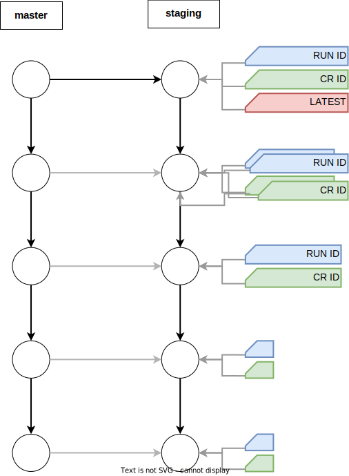
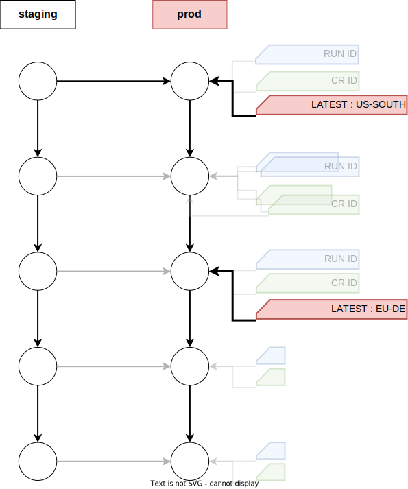

---

copyright: 
  years: 2021, 2023
lastupdated: "2023-12-05"

keywords: DevSecOps

subcollection: devsecops

---

{{site.data.keyword.attribute-definition-list}}

# Understanding DevSecOps pipelines
{: #cd-devsecops-pipelines}

The various pipelines that are provided in the reference continuous integration and continuous deployment toolchains are based on the {{site.data.keyword.contdelivery_short}} support for Tekton Pipelines. To learn more about Tekton Pipelines, see [Working with Tekton pipelines](/docs/ContinuousDelivery?topic=ContinuousDelivery-tekton-pipelines). 
{: shortdesc}

You don't need to be a Tekton expert to use the reference pipelines. Reference pipelines are predefined with a basic structure that includes placeholders for custom scripts for steps such as builds, automated tests, and deployment. Users can declare their custom scripts for their own pipelines and set values for various environment properties for a specific pipeline.
{: note}

## Pipeline status types
{: #cd-devsecops-pipelines-statuses}

It's important to understand the error or failure conditions for a reference pipeline at certain points. Conceptually, two different types of status result from a task run in a compliance pipeline:

* **Compliance status**: The pass or fail state of a `some` check or a set of checks.
* **Pipeline status**: The success or failure state of a task execution itself.

If a test, scan, or check fails, it does not cause the pipeline itself to fail or stop; the task that is running the test is marked as green.
{: tip}

From a compliance point of view, the result of the unit test does not impact the deployment. You can deploy artifacts with failed checks, but the process keeps evidence about that activity. The compliance flow does not block you from releasing a fix when an outage occurs. For example, a green run for a unit test task that found failing tests means that `The task ran successfully and found the following issues`.

If a task fails with a red status, it occurs because the pipeline cannot, or should not, continue. Example conditions for failure include:

* Errors in a task or in the pipeline.
* Something happened that means it makes no sense to continue running the pipeline.

For example, if an artifact build fails in the continuous integration, it breaks the purpose of the continuous integration process itself.

To keep the final pipeline status in sync with the compliance results, a task at the end of the pipeline checks the compliance results and sets the pipeline run status to either `red` or `green`.

## Pull request pipeline
{: #cd-devsecops-pipelines-pr-pipeline}

The pull request pipeline runs pre-set compliance status checks on a pull request for the specified application (app) repository (repo). These status checks might prevent you from merging the pull request into the default active branch, usually `master`, if the checks are unsuccessful. Open or update a pull request against the default active branch to trigger the pull request pipeline run. Users can run their own setup for the pipeline and tests in custom stages. For more information about the pull request pipeline, see [Pull request pipeline](/docs/devsecops?topic=devsecops-cd-devsecops-pr-pipeline).

## Continuous integration pipeline
{: #cd-devsecops-pipelines-ci-pipeline}

The continuous integration pipeline builds the deployable artifacts from the application (app) repositories (repos). Before it builds artifacts, the pipeline checks that the code is scanned and tested, in the same way that pull requests are processed. Built artifacts are also scanned for vulnerabilities and signed in the pipeline before they are marked ready for release and deployment in the [inventory](/docs/devsecops?topic=devsecops-cd-devsecops-inventory). Unlike the pull request pipeline, the continuous integration pipeline collects evidence and result artifacts on each stage of the build, such as testing, scanning, and signing. This data correlates to the built artifacts and can be tracked through the deployment process and change management. For more information about the continuous integration pipeline, see [Continuous Integration pipeline](/docs/devsecops?topic=devsecops-cd-devsecops-ci-pipeline).

## Continuous deployment pipeline
{: #cd-devsecops-pipelines-cd-pipeline}

The continuous deployment pipeline generates all of the evidence and change request summary content. The pipeline deploys the build artifacts to a specific environment, such as staging or prod, and then collects, creates, and uploads all existing log files, evidence, and artifacts to the evidence locker. For more information about the continuous deployment pipeline, see [Continuous deployment pipeline](/docs/devsecops?topic=devsecops-cd-devsecops-cd-pipeline).

## Continuous compliance pipeline
{: #cd-devsecops-pipelines-cc-pipeline}

The continuous compliance pipeline periodically scans the deployed artifacts and their source repositories for newer vulnerabilities since the artifacts were deployed in production. The pipeline also helps to track deviations with due date automatically and provides application awareness into [{{site.data.keyword.compliance_long}}](https://www.ibm.com/cloud/security-and-compliance-center){: external}.
For more information, see [Continuous compliance pipeline](/docs/devsecops?topic=devsecops-devsecops-cc-pipeline).

## Integration with {{site.data.keyword.compliance_short}}
{: #cd-devsecops-pipelines-scc}

See [Using the {{site.data.keyword.compliance_full}} with DevSecOps toolchains](/docs/devsecops?topic=devsecops-cd-devsecops-scc-toolchains).

## Inventory workflow
{: #cd-devsecops-pipelines-inventory-workflow}

See [Evidence](/docs/devsecops?topic=devsecops-devsecops-evidence).

See [Inventory](/docs/devsecops?topic=devsecops-cd-devsecops-inventory).

### Continuous integration writes to Inventory
{: #cd-devsecops-pipelines-inventory-writes}

The inventory contains several branches, including the default branch. These branches can represent deployment stages, environments, or regions, or a combination of these options, depending on the setup and usage.

The default branch is populated from continuous integration builds. The last commit in the target, such as `staging`, has a tag that shows that it was the last concluded deployment.

If the default branch for the inventory is switched out to a different branch, you must rebase the commits from the previous default branch into the new default branch to make the Git commit history linear.
{: note}

### Promotion
{: #cd-devsecops-pipelines-inventory-promotion}

To promote to a target branch, create a pull request. Pull request contents populate the change request fields. After it is reviewed, you can merge the promotion pull request.

### Delta and deployment
{: #cd-devsecops-pipelines-inventory-delta}

After the promotion pull request is merged, the deployment pipeline can start. The deployment delta is the difference between the contents of the last concluded deployment and the current deployment. The deployment delta lists the inventory items that are being deployed.

### Conclude
{: #cd-devsecops-pipelines-inventory-conclude}

When the deployment finishes, the `latest` tag  is moved ahead.

During the dev-mode trigger, the tags will not be advanced, the purpose of the dev-mode trigger is solely for testing the CD pipeline and it is not recommended for use in the production environment.
{:warning}

### Promote to further environments
{: #cd-devsecops-pipelines-inventory-promote-env}

Promotion and deployment can happen from any branch to another one.

### Inventory landscape
{: #cd-devsecops-pipelines-inventory-landscape}

The current, deployed state holds the content to deploy to an environment. Every promoted commit in the target branches contains the relevant pipeline run ID and Change Request ID, as a tag. Some commits can have multiple tags, such as when a failed deployment is run again. The Inventory stores each piece of information to replay the deployments.

{: caption="Figure 1. Inventory landscape" caption-side="bottom"}

#### Use of tags
{: #cd-devsecops-pipelines-inventory-tags}

* `latest`: Tags the current, successfully deployed and concluded state of the inventory on a branch.
* `pipeline run id`: Tags the most recent inventory state in the branch, with the pipeline run ID or the build number of the actual deployment. You can use this information to refer to the actual inventory point hash in the branch history so that when parallel deployments are triggered you avoid inventory content overlapping.
* `change request id`: Optional. Tags the current state. Change request IDs are historically represented and tracked in the inventory.

### Single target - multiple region setup
{: #cd-devsecops-pipelines-single-target-multi-region}

The single target - multiple region setup is an iteration on this model where multiple `latest` tags for a single target environment are introduced. This model allows multiple continuous pipelines to work on the same target for different types of use cases.

For example, you can use the same target environment for multiple regions (such as `us-south` and `eu-de`) in the prod target environment and the inventory branch.

To specify the deployment region by the continuous deployment pipeline, use the `region` parameter. For more information about this parameter, see [Continuous deployment Pipeline parameters](/docs/devsecops?topic=devsecops-cd-devsecops-pipeline-parm#cd-parameters).

Teams do not need to set up a different branch for each region, such as `us-south-prod` and `eu-de-prod`, and run the promotion redundantly. Instead, specify these additional targets for the same inventory branch and then use them as Git tags.

In this setup, the prod branch has multiple `latest` tags on the same branch, such as `us-south_prod_latest` and `eu-de_prod_latest`, and each continuous deployment pipeline that is responsible for each region can use those tags to deploy.

{: caption="Figure 2. Single target - multiple region setup" caption-side="bottom"}

#### Example scenario
{: #cd-devsecops-pipelines-inventory-example}

A set of changes that can eventually be deployed everywhere, might be released to a single region first. You can then gradually deploy this set of changes to other regions by using continuous deployment pipelines that target those regions.
