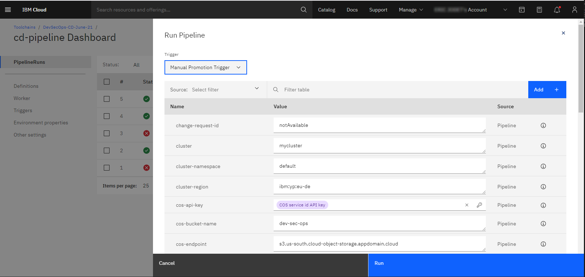
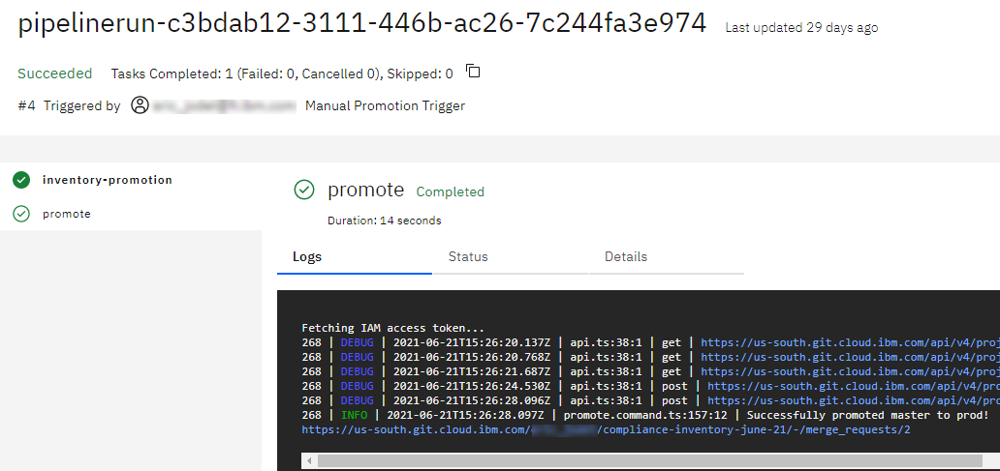
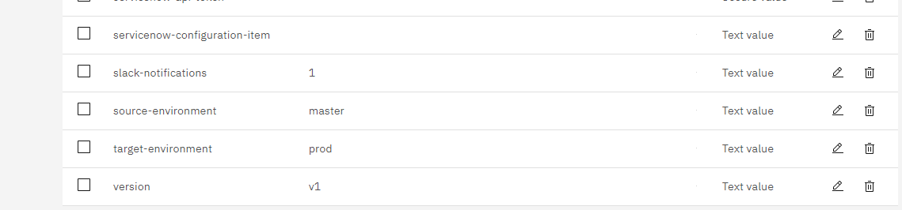
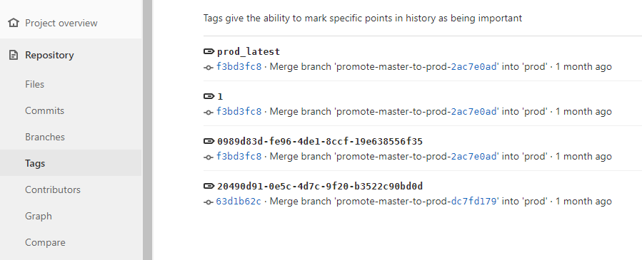

---

copyright:
  years: 2024
lastupdated: "2024-05-24"

keywords: DevSecOps, inventory model, inventory, IBM Cloud

subcollection: devsecops

---
{{site.data.keyword.attribute-definition-list}}

# Promoting and deploying inventory changes
{: #cd-devsecops-promote-branches}

The [DevSecOps reference implementation](/docs/devsecops?topic=devsecops-cd-devsecops-peer-review) helps to enforce the review of code changes before they are merged, promoted, and deployed to production. See,[Best practices for peer review compliance](/docs/devsecops?topic=devsecops-cd-devsecops-peer-review) to know more about peer review for delivering secure and compliant software.
{: shortdesc}

## Promoting inventory entries from source to target branches
{: #cd-devsecops-promote-entries}

To promote code changes from the source branch to the target (staging, prod) branch of your inventory repository, complete the following steps:

1. The continuous integration pipelines populate the source (master) branch with [inventory entries](/docs/devsecops?topic=devsecops-cd-devsecops-inventory#inventory-entry-format). Use the continuous deployment [promotion pipeline](/docs/devsecops?topic=devsecops-cd-devsecops-promotion-pipeline) to promote this content from your source (master) branch to the target (staging or prod) branch.

   1. From the **cd-pipeline dashboard**, click **Run Pipeline**.
   1. Select **Manual Promotion Trigger**.
   1. Click **Run**. The pipeline-run creates a merge request to promote your code changes from the source branch to the target branch.

   {: caption="Manual Promotion Trigger" caption-side="bottom"}

1. Approve and merge the pull request.

   1. Click the pipeline-run and check the execution log of the promotion pipeline.

   {: caption="MR execution log" caption-side="bottom"}

   1. Locate the URL of the merge request and open the merge request.
   1. Populate the [required fields](/docs/devsecops?topic=devsecops-cd-devsecops-promotion-pipeline#cd-devsecops-promotion-pipelineoutputs) (Priority, Change Request assignee, Additional Description, and other fields).
   1. Merge the merge request (MR) to promote your changes from the source branch to the target branch.

Now, that your changes are promoted to the target branch, you can deploy them by using the [continuous deployment pipeline](/docs/devsecops?topic=devsecops-tutorial-tekton-cd-compliance#tutorial-tekton-cd-pipeline-run).

## Using the promotion validation pipeline
{: #cd-devsecops-promotion-validation}

Once a promotion PR is opened, you can optionally perform the evidence aggregation and summary generation in the Promotion validation pipeline, and set the evidence statuses on the promotion pull/merge request (PR). The PR may be created by the Promotion pipeline or manually in the inventory repo. Learn more on [promotion validation pipeline](/docs/devsecops?topic=devsecops-cd-devsecops-promotion-pipeline#cd-devsecops-promotion-validation-pipeline).

## Deploying changes from the source-environment to the target-environment
{: #cd-devsecops-deploy-branches}

The source and target environments are defined at the continuous deployment pipeline level.

{: caption="Continuous deployment pipeline properties" caption-side="bottom"}

Depending on the trigger settings of your continuous deployment pipeline [trigger settings](/docs/devsecops?topic=devsecops-cd-devsecops-triggers), the pipeline is either automatically triggered after a merge request is merged or the pipeline is merged manually. To manually merge the pipeline, click **Run Pipeline** and choose the trigger to run.

The pipeline starts and tags the current commit in the inventory repo with the Pipeline Run ID. The pipeline uses that tag to pick up the content from the target branch (prod) and calculates the deployment delta between the current commit and the content of the last successful deployment. The delta is marked by the `<target-environment>_latest` tag, where `target-environment` is the value that is set in your continuous deployment pipeline properties, such as `prod_latest`.

The pipeline attempts to deploy the content. During the deployment, the change request ID is attached to the commit that the pipeline works with as a tag. A successful deployment concludes by attaching the `<target-environment>_latest` tag to the commit that you promoted.

{: caption="{{site.data.keyword.gitrepos}} repo tags" caption-side="bottom"}

For more information about the inventory workflow, see [Understanding DevSecOps pipelines](/docs/devsecops?topic=devsecops-cd-devsecops-pipelines#cd-devsecops-pipelines-inventory-workflow).

## Updating the image location in the inventory
{: #cd-devsecops-update-image-location}

After an image is promoted to the target container registry, update the image location in the inventory to reference the promoted image.

Use the `cocoa inventory update-locations` command to update the artifact location in the inventory repository.

```bash
cocoa inventory update-locations \
  --name="${inventory_image_type}/inventory.json" \
  --org="<org>" \
  --repo="<repo-name>" \
  --location="prod#${inventory_target_name}@${DIGEST}" \
  --environment="master"
```

For example:

```bash
cocoa inventory update-locations \
  --name="<inventory-entry-name>/inventory.json" \
  --org="<org-name>" \
  --repo="<repo-name>" \
  --location="prod#icr.io/.../baseimage:4.x.y@sha256:..." \
  --environment="master"
```

The `--location` parameter specifies the target image location and its SHA-256 digest. The location has the following format:

```text
<environment>#<image>:<tag>@sha256:<digest>
```

For example:

```text
prod#icr.io/<namespace>/<repository>/baseimage:4.x.y@sha256:<digest>
```

## Image promotion and signing
{: #cd-devsecops-image-promotion-signing}

The image must be copied to the target registry and have a valid signature for the destination image reference before the inventory is updated.

For information about copying an image between registries, removing the source signature, and signing the promoted image for the destination registry, see [Image promotion and signature transfer](/docs/devsecops?topic=devsecops-devsecops-garasign#devsecops-garasign-signature-transfer).

After the image is promoted and signed, obtain the digest of the image in the target registry and use that digest with `cocoa inventory update-locations`.
{: important}
Run `cocoa inventory update-locations` after the image has been promoted and signed. The inventory must reference the image in the target registry and the corresponding image digest.

## Promotion workflow
{: #cd-devsecops-promotion-workflow}

The release workflow is:

1. Promote the image from the source registry to the target registry.
2. Remove the source signature and sign the image for the destination image reference as described in [Image promotion and signature transfer](/docs/devsecops?topic=devsecops-devsecops-garasign#devsecops-garasign-signature-transfer).
3. Obtain the digest of the promoted image in the target registry.
4. Run `cocoa inventory update-locations` with the target image location and digest.

The `cocoa inventory update-locations` command updates the **inventory metadata**. It does not copy or sign the container image.
