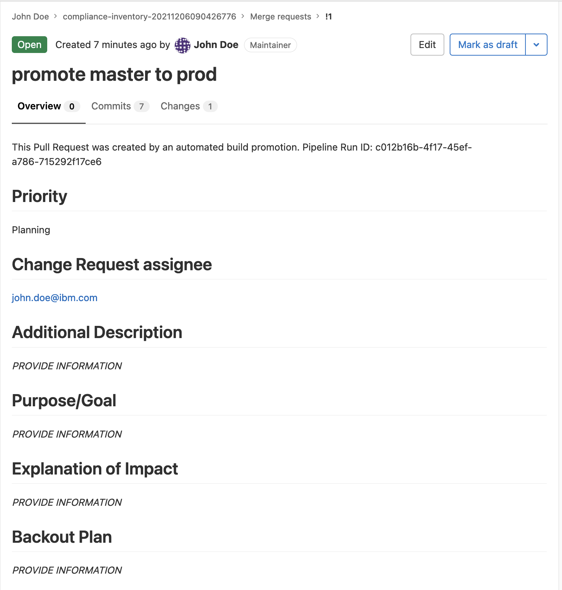

---

copyright:
  years: 2021
lastupdated: "2021-12-21"

keywords: DevSecOps, IBM Cloud

subcollection: devsecops

---

{:shortdesc: .shortdesc}
{:table: .aria-labeledby="caption"}
{:external: target="_blank" .external}
{:codeblock: .codeblock}
{:pre: .pre}
{:screen: .screen}
{:tip: .tip}
{:note: .note}
{:important: .important}
{:download: .download}
{:help: data-hd-content-type='help'}
{:support: data-reuse='support'}

# Promotion pipeline
{: #cd-devsecops-promotion-pipeline}

The promotion pipeline promotes inventory entries from one environment to another and creates a promotion pull/merge request.
{: shortdesc}

## Promotion pipeline steps
{: #cd-devsecops-promotion-pipelinesteps}

1. Get inputs for the promotion and the promotion pull/merge request.
2. Promote the inventory entries from the source environment to the target environment.
3. Create the promotion pull/merge request. Edit the pull/merge request to indicate which changes to perform. Watch for optional and mandatory fields.
4. Merge the pull/merge request.
5. Send a Slack notification if the feature is turned on.

## Running the promotion pipeline
{: #cd-devsecops-promotion-pipelinerun}

Use the manual promotion trigger to run the promotion pipeline. If the source (master) branch is ahead of the target (prod) branch, the pipeline creates a promotion pull/merge request that you can review and edit. If the source branch is behind the target, the promotion pipeline fails with the `All changes have already been promoted` message.

To modify the default values of the promotion pull/merge request, or to promote from an alternative source to target, users can modify the [inputs](#cd-devsecops-promotion-pipelineinputs) from the Pipeline Environment Variables UI.

Before you run the continuous delivery pipeline, make sure that the promotion pull/merge request is merged. You can find the pull/merge request URL in the pipeline logs.
{: tip}

For more information about the inventory and promotion process, see [Inventory promotion](/docs/devsecops?topic=devsecops-cd-devsecops-inventory).

## Promotion pull/merge requests
{: #cd-devsecops-promotion-pipelinepr}

The information from the body of the promotion pull/merge request is used to create the change request. Files that are changed by the promotion pull/merge request represent the entries, such as images, that are deployed by the continuous delivery pipeline. If the changes were made because of an emergency, the promotion pull/merge request is marked with an emergency label. The change request that is created by the continuous delivery pipeline is also marked as `emergency`.
    
## Inputs
{: #cd-devsecops-promotion-pipelineinputs}

|Variable |Description	|Default value |Required or optional |
|:----------|:------------------------------|:------------------|:----------|
|source-environment 		|The source inventory branch of the promotion.		|`master`		|Required		|
|target-environment		|The target inventory branch of the promotion.		|`prod`			|Required		|
|priority		|The priority of the change. 		|`critical`, `high`, `moderate`, `low`, or `planning`		|Optional		|
|assignee		|The functional ID or the email of the person to assign the change request to in the Change Request {{site.data.keyword.cloud_notm}} Organization.		|`''`		|Optional		|
|description 		|The description of the change that is appended to the change request description.   	|`''`		|Optional		|
|purpose 		|The reason why the change is required. 		|`''`		|Optional		|
|impact 		|More notes about what this change implementation impacts.   	|`''`		|Optional		|
|backout-plan		|The plan that describes how the change is rolled back in a failure. 		|`''`		|Optional		|
|slack-notifications		|The switch to turn the Slack Integration on or off  	|0		|Optional		|
{: caption="Table 1. Promotion pipeline inputs" caption-side="top"}

## Outputs and effects
{: #cd-devsecops-promotion-pipelineoutputs}

* Slack notification
* Promotion pull/merge request

You must edit and modify the pull/merge request if the optional parameters were not provided.

|Variable |Description |Required or optional |
|:----------|:------------------|:--------------|
|Priority| One of the following values: `Critical`, `High`, `Moderate`, `Low`, `Planning` | Required |
|Change Request assignee | The email ID of the assignee. | Required |
|Additional Description | The description about the changes in the application. | Optional |
|Purpose | The purpose of the changes that are made to the application. | Optional |
|Explanation of Impact | The impact of the change to the application behavior or environment. | Optional |
|Backout Plan | The steps to back out if the deployment fails. | Optional |
{: caption="Table 2.Optional parameters" caption-side="top"}

 {: caption="Promotion pull and merge request" caption-side="bottom"}

## Next step
 {: #devsecops-promotion-pipeline-next}

 After the Promotion Pipeline finishes successfully, you can [proceed to the CD Pipeline](/docs/devsecops?topic=devsecops-cd-devsecops-cd-pipeline).
