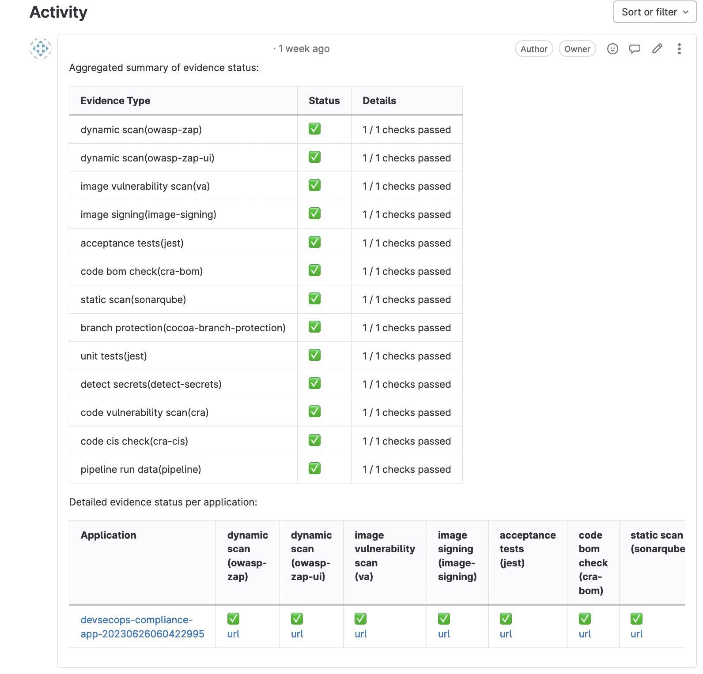

---

copyright: 
  years: 2021, 2023
lastupdated: "2023-08-16"

keywords: DevSecOps, IBM Cloud

subcollection: devsecops

---

{{site.data.keyword.attribute-definition-list}}

# Promotion pipeline
{: #cd-devsecops-promotion-pipeline}

The promotion pipeline promotes inventory entries from one environment to another and creates a promotion pull/merge request.
{: shortdesc}

## Promotion pipeline steps
{: #cd-devsecops-promotion-pipelinesteps}

1. Get inputs for the promotion and the promotion pull/merge request.
2. Promote the inventory entries from the source environment to the target environment.
3. Create the promotion pull/merge request. Edit the pull/merge request to indicate which changes to perform. Watch for optional and mandatory fields.
4. Optional. Set the evidence statuses, and add the aggregated evidence summary to the promotion pull/merge request.
5. Merge the pull/merge request.
6. Send a Slack notification if the feature is turned on.

## Running the promotion pipeline
{: #cd-devsecops-promotion-pipelinerun}

Use the manual promotion trigger to run the promotion pipeline. If the source (master) branch is ahead of the target (prod) branch, the pipeline creates a promotion pull/merge request that you can review and edit. If the source branch is behind the target, the promotion pipeline fails with the `All changes have already been promoted` message.

To modify the default values of the promotion pull/merge request, or to promote from an alternative source to target, users can modify the [inputs](#cd-devsecops-promotion-pipelineinputs) from the Pipeline Environment Variables UI.

Before you run the continuous deployment pipeline, make sure that the promotion pull/merge request is merged. You can find the pull/merge request URL in the pipeline logs.
{: tip}

For more information about the inventory and promotion process, see [Inventory promotion](/docs/devsecops?topic=devsecops-cd-devsecops-inventory).

## Promotion pull/merge requests
{: #cd-devsecops-promotion-pipelinepr}

The information from the body of the promotion pull/merge request is used to create the change request. Files that are changed by the promotion pull/merge request represent the entries, such as images, that are deployed by the continuous deployment pipeline. If the changes were made because of an emergency, the promotion pull/merge request is marked with an emergency label. The change request that is created by the continuous deployment pipeline is also marked as `emergency`.

The evidence that is collected in the continuous integration pipeline is summarized and attached to the change request in the continuous deployment pipeline. 

## Promotion validation pipeline
{: #cd-devsecops-promotion-validation-pipeline}

Once a promotion PR is opened, you can optionally perform the evidence aggregation and summary generation in the Promotion validation pipeline, and set the evidence statuses on the promotion pull/merge request (PR). The PR may be created by the Promotion pipeline or manually in the inventory repo.
The pipeline enables early validation of the promotion PR before the PR is merged to the target branch (environment). Based on the status of the PR, users can either proceed with the promotion (when all the evidence statuses are green), or choose to fix the problem in the continuous integration pipeline (when the evidence status is red).
Additionaly the validation pipeline also adds the aggregated summary of evidences for one or more apps in the inventory to the promotion pull/merge request as a comment, in a user-friendly tabular format (as shown in Figure 3). The table provides useful links, such as links to pipeline runs, app repos, and issues created for each of the apps.
While the validation is in progress, merging of the promotion pull/merge request is blocked. Once the validation pipeline completes, the evidence status is set on the pull/merge request. Clicking on each entry in the status takes the user to the specific stage in the corresponding CI pipeline run.

## How to opt-in into promotion validation?
{: #cd-devsecops-promotion-validation-pipeline-opt-in}

[Deprecated]{: tag-deprecated} The `opt-in-promotion-validation` option used to automatically kick-off the promotion validation pipeline on a pull request is deprecated in favor of the Git Promotion Validation trigger. If you have this property in the environment settings, you will see the deprecation notice in the pipeline logs and Slack notification.

For all new CD toolchains, Git Promotion Validation trigger is automatically created and set to enabled.
{: note}

To enable the Git Promotion Validation trigger on an existing pipeline, you can use the following steps.
1. Go to the **Trigger** page of the CD pipeline that you want to add it to.
2. Select **Add > Git Repository**  to add a new trigger.
3. Input the following information required for the the trigger:
    - Provide a trigger name. For example: Git Promotion Validation Trigger.
    - Specify `promotion-validation-listener or promotion-validation-listener-gitlab` as the `EventListener`. 
    - Select the corresponding inventory repository for the pipeline for the **Repository** field.
    - Select the name of the target environment for the **Branch**.
    - Check the box for the field **When a pull request is opened or updated**.
 4. Click **Add**.
 5. Set the trigger to **On**.

## Inputs
{: #cd-devsecops-promotion-pipelineinputs}

|Variable |Description	|Default value |Required or optional |
|:----------|:------------------------------|:------------------|:----------|
|source-environment 		|The source inventory branch of the promotion.		|`master`		|Required		|
|target-environment		|The target inventory branch of the promotion.		|`prod`			|Required		|
|priority		|The priority of the change. 		|`critical`, `high`, `moderate`, `low`, or `planning`		|Optional		|
|assignee		|The functional ID or the email of the person to assign the change request to in the Change Request {{site.data.keyword.cloud_notm}} Organization.		|`''`		|Optional		|
|description 		|The description of the change that is appended to the change request description.   	|`''`		|Optional		|
|purpose 		|The reason why the change is required. 		|`''`		|Optional		|
|impact 		|More notes about what this change implementation impacts.   	|`''`		|Optional		|
|backout-plan		|The plan that describes how the change is rolled back in a failure. 		|`''`		|Optional		|
|slack-notifications		|The switch to turn the Slack Integration on or off  	|0		|Optional		|
|customer-impact		|Impact of the change on the customers. 		|`critical`, `high`, `moderate`, `low`, or `no_impact`		|Optional		|
{: caption="Table 1. Promotion pipeline inputs" caption-side="top"}

## Outputs and effects
{: #cd-devsecops-promotion-pipelineoutputs}

* Slack notification
* Promotion pull/merge request

You must edit and modify the pull/merge request if the optional parameters were not provided.

|Variable |Description |Required or optional |
|:----------|:------------------|:--------------|
|Priority| One of the following values: `Critical`, `High`, `Moderate`, `Low`, `Planning` | Required |
|Change Request assignee | The email ID of the assignee. | Required |
|Additional Description | The description about the changes in the application. | Optional |
|Purpose | The purpose of the changes that are made to the application. | Optional |
|Explanation of Impact | The impact of the change to the application behavior or environment. | Optional |
|Customer Impact| One of the following values: `Critical`, `High`, `Moderate`, `Low`, `No_Impact` | Required |
|Backout Plan | The steps to back out if the deployment fails. | Optional |
{: caption="Table 2.Optional parameters" caption-side="top"}

 {: caption="Figure 1. Promotion pull and merge request" caption-side="bottom"}
 
 When the (optional) promotion PR validation runs, the evidence status is set on the pull/merge request.
 {: caption="Figure 2. Evidence status on promotion pull and merge request" caption-side="bottom"}

The aggregated evidence summary of the evidences (that can be coming from multiple apps in the inventory) is displayed in tabular format as a comment in the PR.
{: caption="Figure 3. Aggregated evidence summary in promotion pull and merge request" caption-side="bottom"}

## Next step
 {: #devsecops-promotion-pipeline-next}

 After the Promotion Pipeline finishes successfully, you can [proceed to the CD Pipeline](/docs/devsecops?topic=devsecops-cd-devsecops-cd-pipeline).
