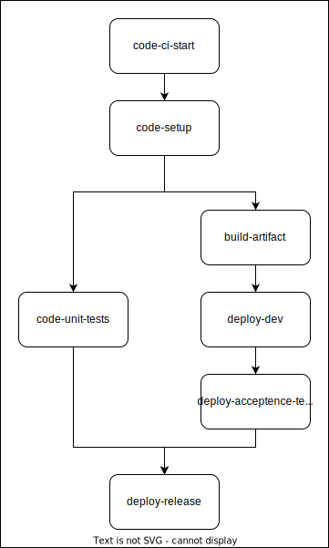

---

copyright:
  years: 2023, 2025
lastupdated: "2025-10-07"

keywords: DevSecOps, parallelization, IBM Cloud, task parallelization, concurrency, concurrent execution

subcollection: devsecops

---

{{site.data.keyword.attribute-definition-list}}

# Improving compliance pipeline performance in DevSecOps
{: #devsecops-conc}

Enable concurrency to make sure the pipeline tasks run simultaneously in DevSecOps toolchains.
{: shortdesc}

## Before you begin
{: #devsecops-conc-prereq}

Use IBM-managed workers or TAAS-managed-workers directly as this is as prerequisite step.

To use private workers, ensure that the pipeline of the worker nodes must be Tekton version v0.45 or later. For more information, see [Installation instructions](https://tekton.dev/docs/pipelines/install/)

## Enabling concurrency in DevsecOps
{: #devsecops-conc-enable}

To enable concurrency in DevsecOps, take the following steps:

1. Go to the **Triggers** page of your PR or CI or CD or CC pipeline.
1. Click the **Actions** icon  on the repository entry and click **Edit**.
1. Update the branch to `open-v10` and click **Update**.

{: caption="pipeline definitions" caption-side="bottom"}

### PR pipeline structure
{: #devsecops-conc-pr-pipeline}

The PR pipeline runs compliance checks on a pull request for a given application repository and acts as a safeguard for merging into the main branch. The PR pipeline is triggered by opening or updating a pull request against the main branch.

For more information, see the [PR pipeline documentation](/docs/devsecops?topic=devsecops-cd-devsecops-pr-pipeline)

| PR Pipeline Stage | Stage Description |
| ----------------- | ----------------- |
| `code-pr-start` | Clone the GitHub repository in association with the Pull Request. |
| `code-setup` | Set up your build and test environment to prepare the rest of the pipeline stages. |
| `code-detect-secrets` | Runs to detect secrets scan on application code. |
| `code-unit-tests` | Runs unit test for code that is associated with the PR. |
| `code-compliance-checks` | Code Risk Analyzer (CRA) and Mend Unified Agent scans for vulnerability detection on open source dependencies and  any other compliance checks on application repositories. |
| `code-pr-finish` | Consolidates pipeline status. The stage fails if the previous run compliance checks fail. This stage  is the "fail-safe" behavior to ensure that compliance issues are remediated before a PR can be merged and/or a build can be deployed. |
{: caption="Stages of PR pipeline structure and descriptions of each stage" caption-side="bottom"}

{: caption="PR pipeline structure" caption-side="bottom"}

### CI pipeline structure
{: #devsecops-conc-ci-pipeline}

The CI pipeline builds deployable artifacts from application repositories. It scans, tests, and signs built artifacts while also collecting evidence on each stage to be released in the inventory and tracked through the deployment and change management.

For more information, see the [CI pipeline documentation](/docs/devsecops?topic=devsecops-cd-devsecops-ci-pipeline).

| CI Pipeline Stage | Stage Description |
| ----------------- | ----------------- |
| `code-ci-start` | Set up the pipeline environment, including cloning the configuration and application repositories to the pipeline local file system
| `code-setup` | Set up your build and test environment to prepare the rest of the pipeline stages.  |
| `code-detect-secrets` | Runs detect secrets scan on application code.  |
| `code-unit-tests` | Run unit tests and application tests on application code. |
| `code-peer-review` | Peer review of code changes. |
| `code-static-scan` | Run static scan on application code. |
| `code-compliance-checks` | Code Risk Analyzer (CRA) and Mend Unified Agent scans for vulnerability detection on open source dependencies and any other compliance checks on application repositories. |
| `build-artifact` | Build the artifacts and images. |
| `build-sign-artifact` | Sign built artifacts and images. |
| `build-scan-artifact` | Scan the container image with Vulnerability Advisor. |
| `deploy-dev` | Deploy the built artifacts to the dev environment. |
| `code-dynamic-scan` | Runs the OWASP-Zap dynamic scan on the application that is deployed to a cluster. |
| `deploy-acceptance-tests` | Run acceptance and integration tests on the deployed built artifacts on the dev environment. |
| `deploy-release` | Add the built artifacts to the inventory that will be used by the Continuous Delivery pipeline. |
| `code-ci-finish` | Collect, create, and upload the logs files, artifacts, and evidence to the evidence locker. If any of the compliance checks. Previously ran in the pipeline fail, this stage fails. This stage is the "fail-safe" behavior to ensure that compliance issues are remediated before a PR can be merged, a build is deployed, or when both. |
{: caption="Stages of CI pipeline structure and descriptions of each stage" caption-side="bottom"}

{: caption="CI pipeline structure" caption-side="bottom"}

### CD pipeline structure
{: #devsecops-conc-cd-pipeline}

The CD pipeline compiles all the content for evidence and the change request summary. It deploys the build to an environment, such as staging or production, while uploading all evidence to the evidence locker.

For more information, see the [CD pipeline documentation](/docs/devsecops?topic=devsecops-cd-devsecops-cd-pipeline)

| CD Pipeline Stage | Stage Description |
| ----------------- | ----------------- |
| `prod-start` | Calculate deployment delta  |
| `prod-setup` | Setup build and test environment.  |
| `prod-verify-artifact` | Verifies signatures of images that are built in the CI pipeline.  |
| `prod-change-request` | Creation and approval of change request and implement state.  |
| `prod-deployment` | Deploy the build to an environment.  |
| `prod-acceptance-tests` | Run acceptance tests.  |
| `prod-finish` | Publish acceptance tests, deploy record, collect CycloneDX SBOM, and close change request.  |
{: caption="Stages of CD pipeline structure and descriptions of each stage" caption-side="bottom"}

{: caption="CD pipeline structure" caption-side="bottom"}

### CC pipeline structure
{: #devsecops-conc-cc-pipeline}

The CC pipeline performs periodic scans on deployed artifacts and their source repositories. It scans the latest deployed state in the inventory and creates or updates incident issues in the incident repository.

For more information, refer to [CC pipeline documentation](/docs/devsecops?topic=devsecops-devsecops-cc-pipeline)

| CC Pipeline Stage | Stage Description |
| ----------------- | ----------------- |
| `cc-start` | Clone repository, process inventory based on tag, and register repos and artifacts |
| `cc-setup` | Set up the pipeline environment for the scans in later stages. This may include installing build dependencies or performing Maven builds
| `cc-detect-secrets` | Runs to scan and detect secrets in an application code |
| `cc-static-scan` | Run static scan code on the application code |
| `cc-dynamic-scan` | Runs the OWASP-Zap dynamic scan on the application that is deployed to a cluster |
| `cc-compliance-checks` | Code Risk Analyzer (CRA) and Mend Unified Agent scans for vulnerability detection on open source dependencies and any other compliance checks on application repositories. |
| `cc-scan-artifact` | Scan the container image with Vulnerability Advisor. |
| `cc-finish` | Collect, create, and upload the logs files, artifacts, and evidence to the evidence locker. If any of the compliance checks previously ran in the pipeline fail, this stage fails. This stage has a "fail-safe" behavior to ensure that compliance issues are remediated before a PR can be merged and/or a build can be deployed.  |
{: caption="Stages of CC pipeline structure and descriptions of each stage" caption-side="bottom"}

{: caption="CC pipeline structure" caption-side="bottom"}

### Dev mode pipeline structures
{: #devsecops-conc-devmode-pipeline}

Dev mode pipelines are used for testing pipeline only.

They lack the following functions:
- Evidence collection
- Gating based on evidence.

Dev mode pipeline structures not production ready.
{: important}

{: caption="Dev mode PR pipeline structure" caption-side="bottom"}

{: caption="Dev mode CI pipeline structure" caption-side="bottom"}

## Disabling concurrency in DevsecOps
{: #devsecops-plz-disable}
{: deprecated}

To disable concurrency in DevsecOps, take the following steps:

1. Go to the **Triggers** page of your PR or CI or CC pipeline.
1. Click the **Actions** icon  on the repository entry and select **Edit**.
1. Update the branch to `open-v9` and select **Update**.
