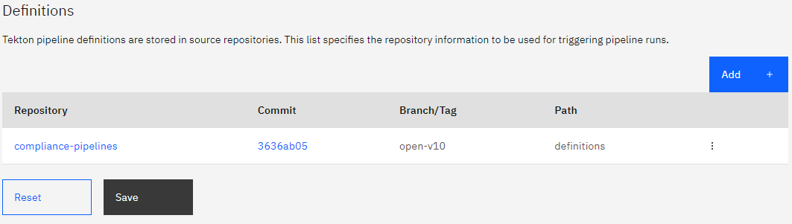

---

copyright: 
  years: 2023, 2023
lastupdated: "2023-09-05"

keywords: DevSecOps, parallelization, IBM Cloud, task parallelization, concurrency, concurrent execution

subcollection: devsecops

---

{{site.data.keyword.attribute-definition-list}}

# Improve compliance pipeline performance using concurrent tasks
{: #devsecops-conc}

Enable concurrency so that pipeline tasks can run simultaneously in one pipeline toolchains. 
{: shortdesc}

## Prerequisites
{: #devsecops-conc-prereq}

When using IBM managed workers or taas-managed-workers no prerequisites are required.

When using private worker ensure that the following prerequisites are in place:
 
* The worker nodes that are used in the pipelines need to be at Tekton v 0.45 or later. [Installation instructions](https://tekton.dev/docs/pipelines/install/)

## Enabling concurrency in one pipeline
{: #devsecops-conc-enable}

To enable concurrency in one pipeline, take the following steps:
  
1. Go to the **Triggers** page of your PR or CI or CD or CC pipeline.
1. Click the **Actions** icon  on the repository entry and click **Edit**.
1. Update the branch to `open-v10` and click **Update**.

{: caption="Figure 1. pipeline definitions" caption-side="bottom"}

### PR pipeline structure
{: #devsecops-conc-pr-pipeline}

Figure 2 shows PR pipeline structure while using concurrency.
 
{: caption="Figure 2. PR pipeline structure" caption-side="bottom"}

### CI pipeline structure
{: #devsecops-conc-ci-pipeline}

Figure 3 shows CI pipeline structure while using concurrency.
  
{: caption="Figure 3. CI pipeline structure" caption-side="bottom"}

### CD pipeline structure
{: #devsecops-conc-cd-pipeline}

Figure 4 shows CD pipeline structure while using concurrency.
  
{: caption="Figure 4. CD pipeline structure" caption-side="bottom"}

### CC pipeline structure
{: #devsecops-conc-cc-pipeline}

Figure 5 shows CC pipeline structure while using concurrency.
  
{: caption="Figure 5. CC pipeline structure" caption-side="bottom"}

### Dev mode pipeline structures
{: #devsecops-conc-devmode-pipeline}

Figure 6 shows dev mode PR pipeline structure while using concurrency.
  
{: caption="Figure 6. Devmode PR pipeline structure" caption-side="bottom"}

Figure 7 shows dev mode CI pipeline structure while using concurrency.
  
{: caption="Figure 7. Devmode CI pipeline structure" caption-side="bottom"}

  
## Disabling concurrency in one pipeline
{: #devsecops-plz-disable}

To disable concurrency in one pipeline, take the following steps:
  
1. Go to the **Triggers** page of your PR or CI or CC pipeline.
1. Click the **Actions** icon  on the repository entry and click **Edit**.
1. Update the branch to `open-v9` and click **Update**.

