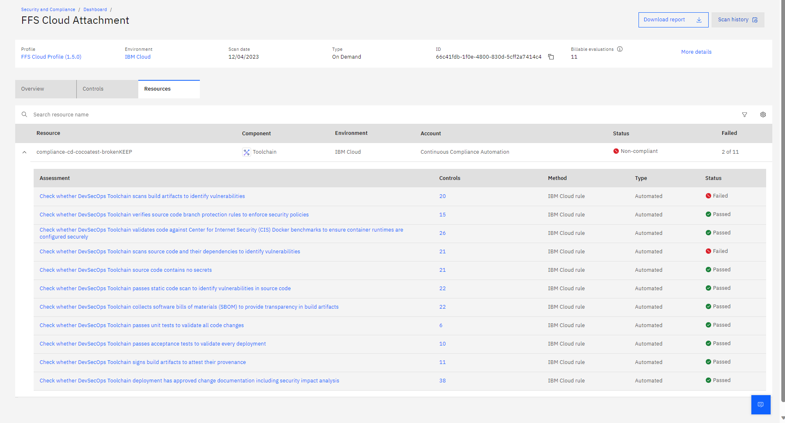
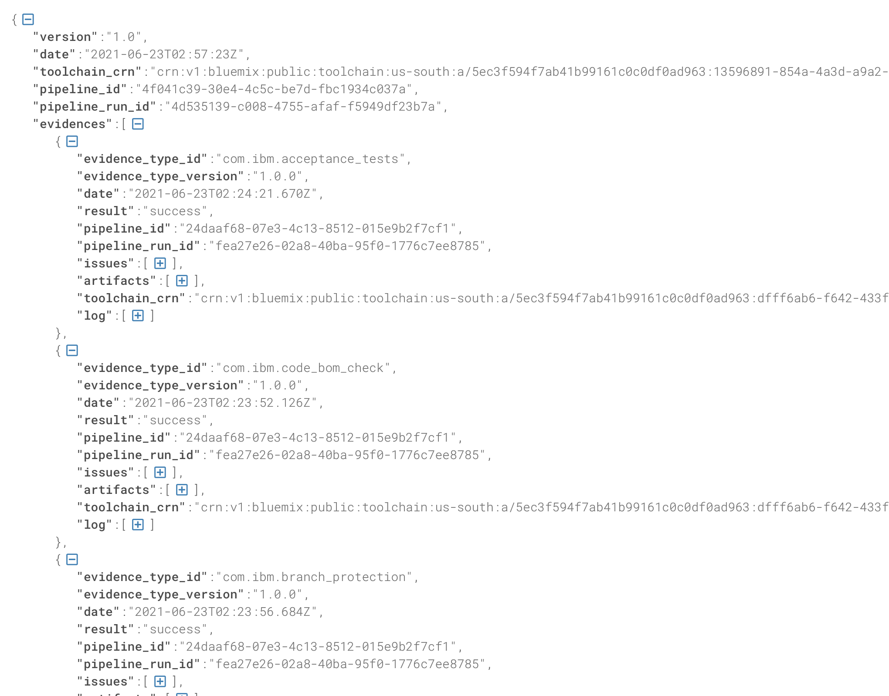
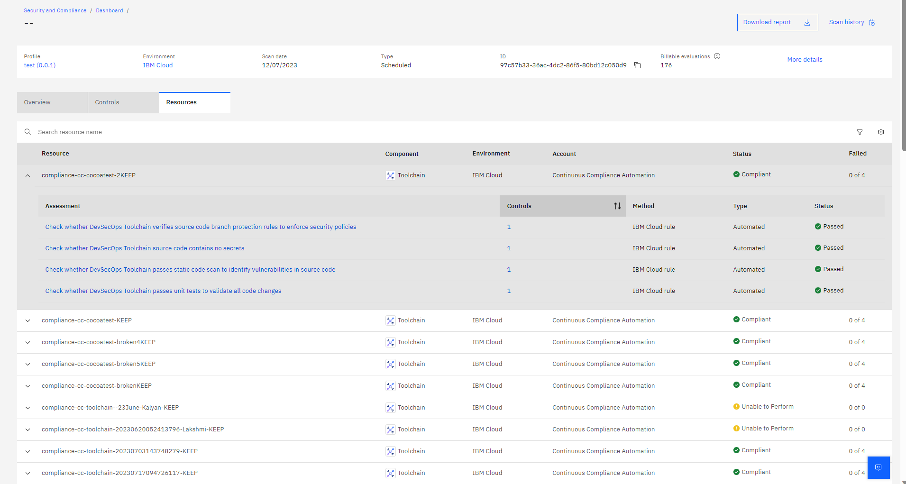
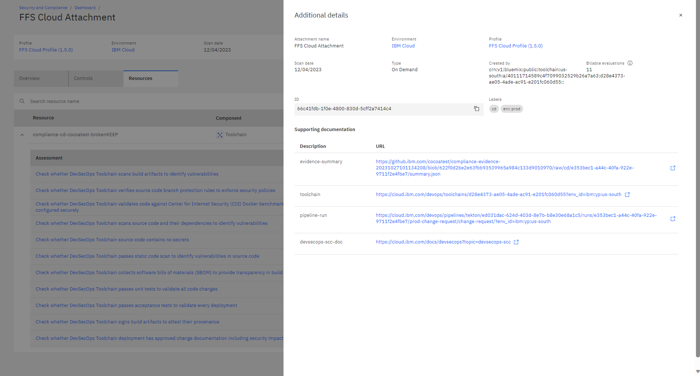
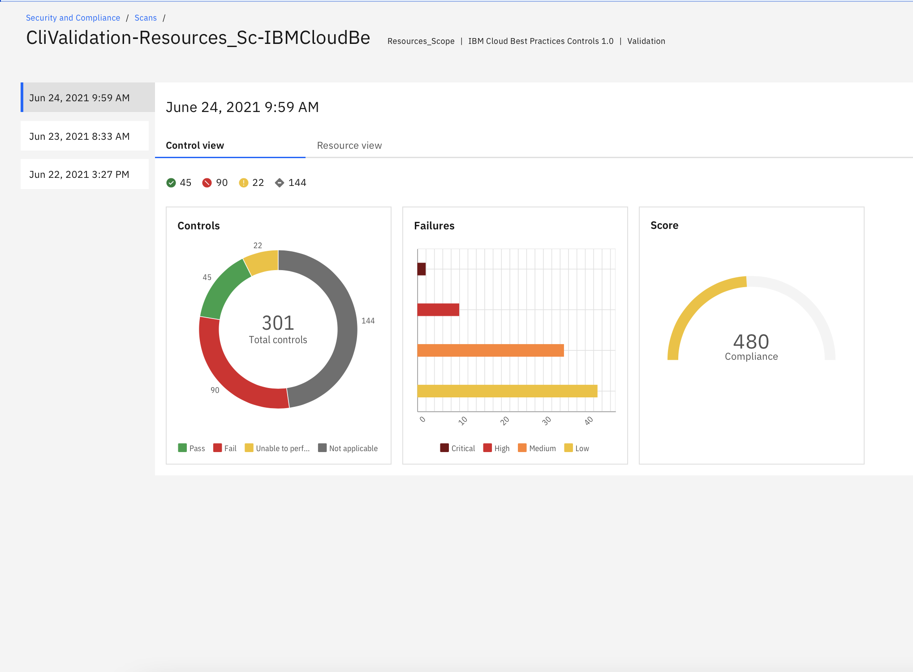
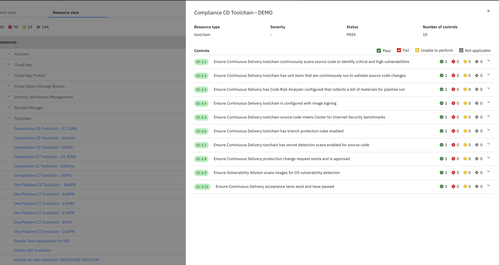

---

copyright:
  years: 2022, 2023
lastupdated: "2023-12-11"

keywords: DevSecOps

subcollection: devsecops

---

{{site.data.keyword.attribute-definition-list}}

# Understanding your results after integrating {{site.data.keyword.compliance_short}} with DevSecOps toolchains
{: #cd-devsecops-scc-toolchains}

With {{site.data.keyword.compliance_full}}, you can automate the evaluation of your security and compliance posture to detect vulnerabilities. By enabling the {{site.data.keyword.compliance_short}} integration by using DevSecOps templates, you can store evidence and monitor your deployments for compliance.
{: shortdesc}

Every Continuous Integration (CI) pipeline run creates evidence. The evidence includes the details of the operations that are performed and is saved in either a Git repository or {{site.data.keyword.cos_short}} bucket, which is known as an evidence locker. By default, a Git repository is used, but if you require the evidence to be more durable - for example, you need a longer lifespan, you can configure a {{site.data.keyword.cos_short}} bucket. Similarly, the Continuous Delivery (CD) pipeline collects evidence that provides an audit trail of the tasks performed that pertain to acceptance tests, change requests, and more. Most importantly, the Continuous Compliance (CC) pipeline writers an aggregation of all of the individual evidence fragments to an evidence summary when your deployment is complete. When validation tests are run against pipeline data, you can verify that your various best practices are carried out as part of the application deployment process.

## Before you begin
{: #before-scc-toolchains}

View the results that are generated by {{site.data.keyword.compliance_short}} to ensure that you meet the following pre-requisites:

* The level of access needed to view and interact with the results in {{site.data.keyword.compliance_short}}. To view your results, you must have *Reader* access to the {{site.data.keyword.compliance_short}} service.
* A configured pipeline.
   For help with configuring your pipeline to work with {{site.data.keyword.compliance_short}}, see [Configuring {{site.data.keyword.compliance_short}}](/docs/devsecops?topic=devsecops-scc).

## Viewing results
{: #view-scc-toolchain-results}

To view the results of the compliance evaluation, refer to [{{site.data.keyword.compliance_short}} dashboard](/security-and-compliance-center).
{: caption="Security and Compliance Center dasboard view" caption-side="bottom"}

When the DevSecOps pipelines interact with {{site.data.keyword.compliance_short}}, the information is gathered in two different ways. {{site.data.keyword.compliance_short}} pushes or pulls the information into the dashboard accordingly.

### Pull data model
{: #view-scc-toolchain-results-push-data}

:   When a CI/CD pipeline runs, an [evidence summary](/docs/devsecops?topic=devsecops-devsecops-evidence-summary) is created and named `summary.json`. This evidence summary is forwarded to an evidence locker or a repository. Each entry in the summary is mapped to a control in {{site.data.keyword.compliance_short}}.

   {: caption="CD evidence summary task" caption-side="bottom"}

:   Based on the schedule that is set when an attachment is created in {{site.data.keyword.compliance_short}}, the service pulls the information summary from the locker to evaluate and present the results in the {{site.data.keyword.compliance_short}} UI.

   {: caption="Toolchain controls" caption-side="bottom"}

Push data model
:   Each time that a CD/CC pipeline with a valid integration is run, an evidence summary is generated and forwarded to the {{site.data.keyword.compliance_short}} service. The service evaluates and presents in the {{site.data.keyword.compliance_short}} dashboard.  \n From the dashboard, click the profile that you want to view results for. Then, select the **Resources** tab. From there, click **Additional details** to view more information such as where to find your supporting documentation. For example, you might see links to `pipeline-run evidence summary`, `toolchain`, `pipeline-run`, or `devsec-scc-doc`.

{: caption="Security and Compliance Center More Details view" caption-side="bottom"}

Each piece of information is evaulated against a control and a status is provided. For each control, you are marked as either **Compliant** or **Noncompliant**. For individual resources, the status might be **Pass** or **Fail** depending on whether the evidence fragment met the control qualification. It might also be **Unable to perform**. This status can be returned when an evaluation is attempted but there isn't any corresponding evidence to evaluate; a task might have been removed or skipped in the CI pipeline or a deployment is performed by using the `CD EMERGENCY` to override evidence failures.

Example control dashboard:

{: caption="Validation by control" caption-side="bottom"}

Example resource dashboard:

{: caption="Validation by resource" caption-side="bottom"}

While it is possible to deploy an image with imperfect validations, they are reported on inspection in {{site.data.keyword.compliance_short}}.
{: note}

## Next steps
{: #scc-toolchains-next}

To explore toolchains in {{site.data.keyword.compliance_short}}, you can learn about [managing scopes](/docs/security-compliance?topic=security-compliance-scopes) in the [{{site.data.keyword.compliance_short}} documentation](/docs/security-compliance?topic=security-compliance-getting-started).
