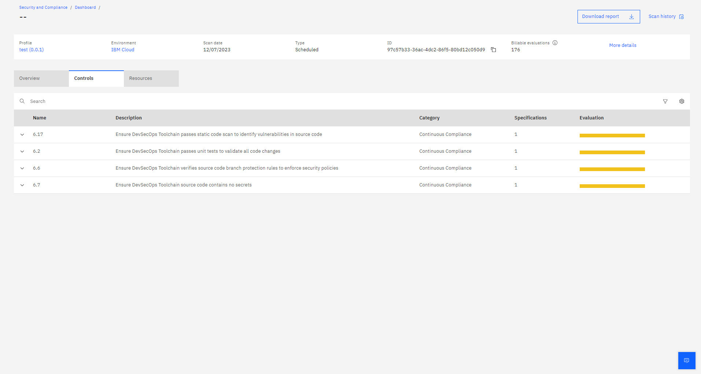
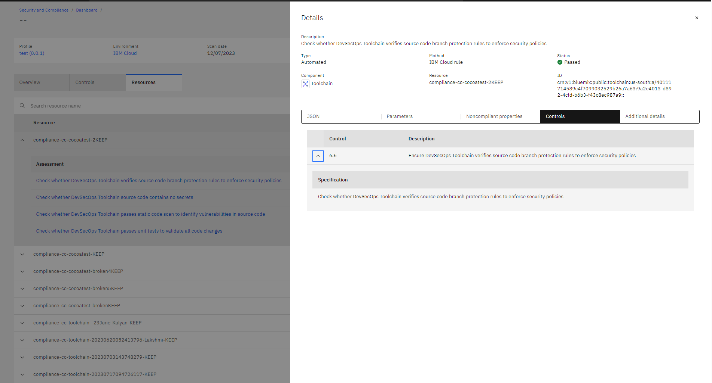

---

copyright:
  years: 2022
lastupdated: "2022-09-26"

keywords: DevSecOps

subcollection: devsecops

---

{{site.data.keyword.attribute-definition-list}}

# Using the {{site.data.keyword.compliance_short}} with DevSecOps toolchains
{: #cd-devsecops-scc-toolchains}

{{site.data.keyword.compliance_full}} automates security and compliance postures, enables configuration governance, and detects vulnerabilities and threats. Use the DevSecOps templates and enable the {{site.data.keyword.compliance_short}} integration to store evidence and monitor deployments.
{: shortdesc}

For more information, see [{{site.data.keyword.compliance_long}}](https://www.ibm.com/cloud/security-and-compliance-center){: external}

Every CI Pipeline run that is performed creates evidence that is related to the run. The evidence is made up of the details of the operations that are being performed and the evidence is written to an evidence locker. The evidence locker is a Git repository but a {{site.data.keyword.cos_full}} bucket can also be used if you require the evidence to be more durable (for example, longer TTL). Similarly, the CD pipeline collects evidence that provides an audit trail of the tasks it performs pertaining to acceptance tests, change requests, and so forth. Most importantly, the compliance pipeline writes an aggregation of all the individual evidence fragments to an evidence summary when a deployment completes. 

The evidence summary format that is used by the DevSecOps CI/CD templates is published [here](/docs/devsecops?topic=devsecops-devsecops-evidence#cd-devsecops-evidence-summary). This summary is the link between the DevSecOps CD toolchain and the {{site.data.keyword.compliance_short}}. Every entry in the evidence summary maps to what is termed a fact in {{site.data.keyword.compliance_short}}. Figure 1 shows a snapshot of an evidence summary that is produced in the CD pipeline. 

{: caption="Figure 1. CD evidence summary task" caption-side="bottom"}

Figure 2 shows the evidence summary information that is presented as Facts when the same toolchain is selected in the {{site.data.keyword.compliance_short}} UI

{: caption="Figure 2. Toolchain facts" caption-side="bottom"}

A {{site.data.keyword.compliance_short}} data [collector](/docs/security-compliance?topic=security-compliance-collector) can retrieve the evidence summary from a CD toolchain if the toolchain contains a {{site.data.keyword.compliance_short}} tool integration. This tool integration identifies the location of the evidence locker and the path to the evidence summary. When the evidence is collected as a set of facts, validation tests can be run against that data set to verify that various best practices that are carried out as part of the application development process. The results of the validation are rendered in the {{site.data.keyword.compliance_short}} dashboard as shown in Figures 3 and 4:

{: caption="Figure 3. Validation by control" caption-side="bottom"}

{: caption="Figure 4. Validation by resource" caption-side="bottom"}

The 10 entries that are shown in Figure 4 map to the individual evidence fragments gathered in the CI pipeline. In this evidence sample, all the validations passed. There might be cases when few validations are classified as **Fail** or as **Unable to perform**. This situation can occur when a validation check finds no corresponding evidence, for example if task is removed or skipped in the CI pipeline. This condition might occur when a deployment is performed by using the CD EMERGENCY process to override the evidence failures. It is to be noted here that while it is possible to deploy an image with imperfect validations, these facts are reported on inspection in {{site.data.keyword.compliance_short}}.

To explore toolchains in {{site.data.keyword.compliance_short}}, it might be a useful start to learn about [managing scopes](/docs/security-compliance?topic=security-compliance-scopes) in the [{{site.data.keyword.compliance_short}} documentation](/docs/security-compliance?topic=security-compliance-getting-started).
