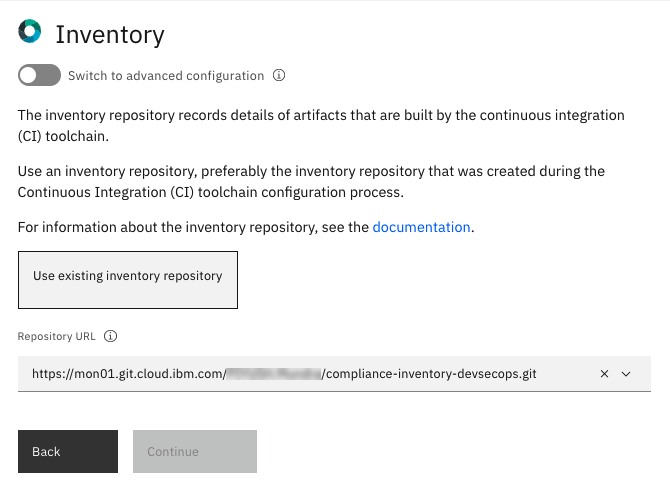
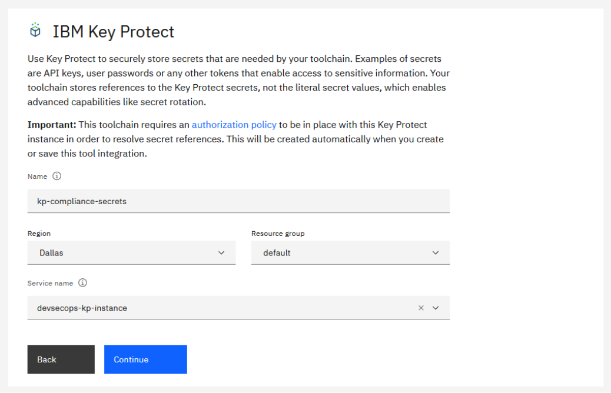
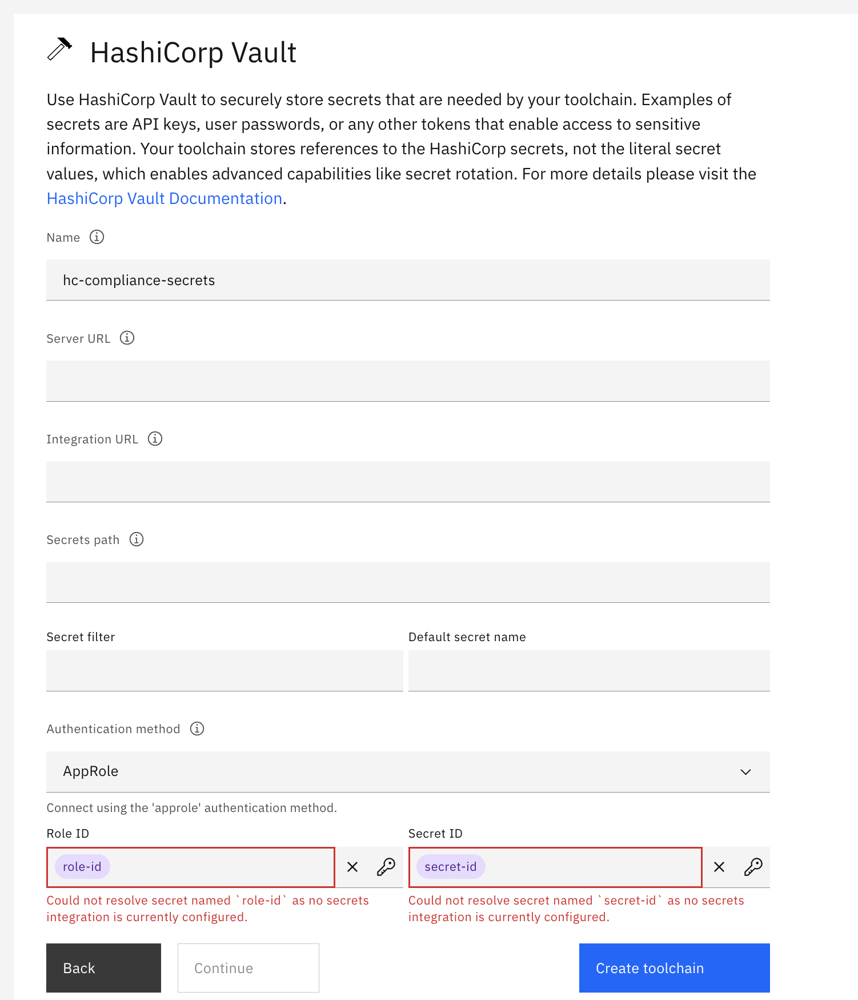
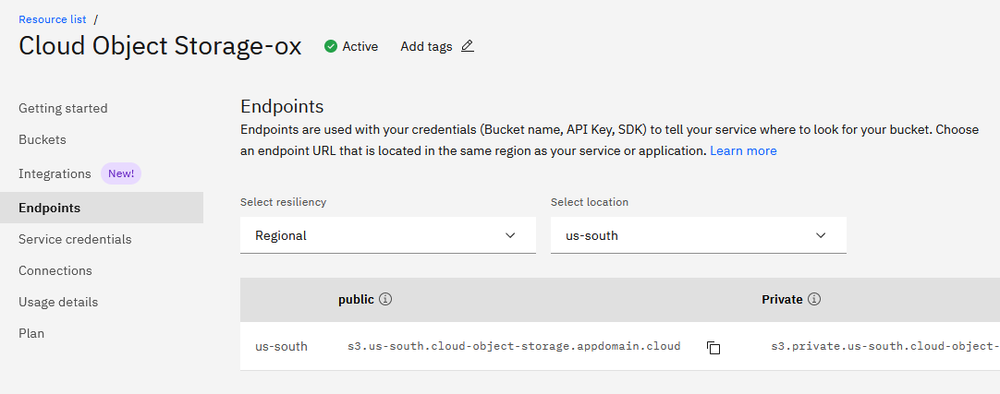
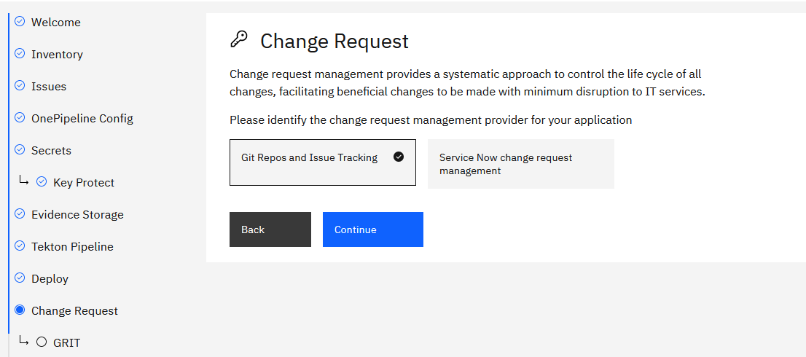
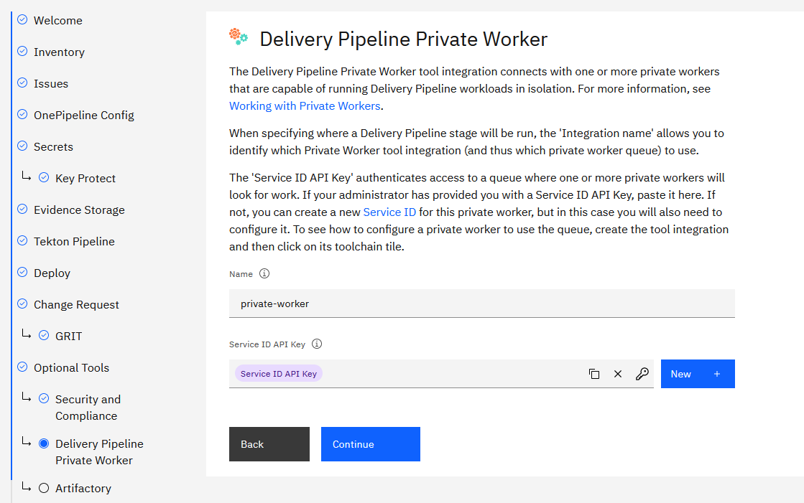
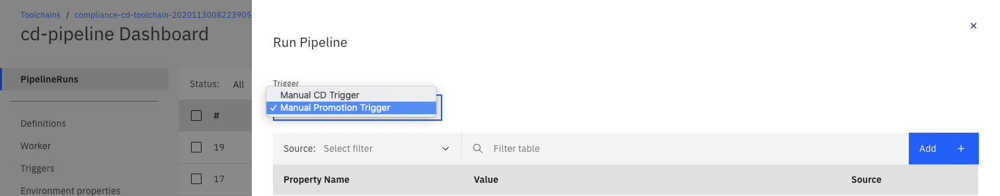

---

copyright:
  years: 2021, 2022
lastupdated: "2022-05-11"

keywords: DevSecOps, CD, compliance, secure toolchain, IBM Cloud

subcollection: devsecops

---

{{site.data.keyword.attribute-definition-list}}

# Setting up Tekton continuous delivery pipelines with DevSecOps
{: #cd-devsecops-tekton-cd-compliance}

Complete these steps to set up the Tekton continuous delivery pipelines with compliance. Configuration options guide you through the steps to create your toolchain.
{: shortdesc}

## Before you begin
{: #cd-tekton-cd-prereq}

* [Create a Kubernetes cluster](/docs/containers?topic=containers-getting-started) on IBM Cloud Kubernetes Service to deploy your application.
* [Create toolchain secrets](/docs/devsecops?topic=devsecops-cd-devsecops-toolchains-secrets) to access different integrations and secure them.
* [Compliance CI toolchain](https://us-south.git.cloud.ibm.com/open-toolchain/compliance-ci-toolchain){: external} configured with DevOps Insight Integrations.
* Optional. [COS Bucket](/docs/devsecops?topic=devsecops-cd-devsecops-cos-config) as Compliance Evidence Locker to store pipeline run evidences.
* [Validate recommended IAM permissions](/docs/devsecops?topic=devsecops-cd-devsecops-iam-permissions) are assigned to corresponding integrations.

## Guided setup overview for the CD toolchain
{: #cd-tekton-cd-guided}

View the following video tutorial to get an overview of the setup process:

{: video output="iframe" data-script="none" id="watsonmediaplayer" width="560" height="315" scrolling="no" allowfullscreen webkitallowfullscreen mozAllowFullScreen frameborder="0" style="border: 0 none transparent;"}

{: caption="DevSecOps Continuous Delivery toolchain welcome page" caption-side="bottom"}

A progress indicator shows your progress in completing the configuration. If you need to return to a previous step, you can use the progress indicator to navigate to a previous step. 

The configuration options for the current step are displayed in the main area of the page.

To advance to the next step, click **Continue**. You can advance to the next step only when the configuration for the current step is complete and valid. You can navigate to the previous step by clicking **Back**.

Some steps might have a **Switch to advanced configuration** toggle. These steps present you with the minimum recommended configuration. However, advanced users that need fine-grained control can click the **Switch to advanced configurations** toggle to see all options for the underlying integration.

{: caption="DevSecOps advanced configuration toggle" caption-side="bottom"}

After you successfully complete all of the steps, click **Create** to create the toolchain.

You can return to previous steps in the guided installer. The toolchain installer retains all of the configurations that you completed.
{: tip}

## Start the CD toolchain setup
{: #cd-tekton-cd-setup}
{: step}

Start the CD toolchain configuration by using one of the following options:

* Click **Create toolchain**.

   [](https://cloud.ibm.com/devops/setup/deploy?repository=https://us-south.git.cloud.ibm.com/open-toolchain/compliance-cd-toolchain&env_id=ibm:yp:us-south)

* From the {{site.data.keyword.cloud_notm}} console, click **Menu**  and select **DevOps**. On the Toolchains page, click **Create toolchain**. On the Create a Toolchain page, click **CD-Develop with DevSecOps practices**.

## Set up the toolchain name and region
{: #cd-tekton-cd-name-region}
{: step}

{: caption="DevSecOps CD toolchain name and region" caption-side="bottom"}

Review the default information for the toolchain settings. The toolchain's name identifies it in IBM Cloud. Make sure that the toolchain's name is unique within your toolchains for the same region and resource group in IBM Cloud.

The toolchain region can differ from the cluster and registry region.
{: tip}

## Set up the CD tool integrations
{: #cd-tekton-cd-tool-integrations}
{: step}

This section covers the setup of the various tool and service integrations that the CD toolchain uses. This section might not follow the order in which the IBM Cloud installer wants you to set up these tools.

If you used [CI Pipeline Toolchain Template](https://us-south.git.cloud.ibm.com/open-toolchain/compliance-ci-toolchain){: external} to set up your CI process, refer to your CI toolchain and copy the names of the repositories that are used in that toolchain.

If you want to set up your CI toolchain from scratch, configure these repositories during CI Toolchain creation and then use them here.

### Application Related Repositories
{: #cd-app-repos}

- **Inventory:** Change management is tracked in this repository. Each successful CI pipeline run CD pipeline creates a new branch that is named as the created CR number, and merges it to master after deployment is concluded.
    For example, `https://<region>.git.cloud.ibm.com/myorg/my-compliance-ci-inventory`

- **Issues:** Issues about incidents that happen during the build and deployment process are stored here.
    For example, `https://<region>.git.cloud.ibm.com/myorg/my-compliance-ci-issues`

- **Evidence:** All raw compliance evidence that belongs to the application is collected here.
    For example, `https://<region>.git.cloud.ibm.com/myorg/my-compliance-ci-evidence`

- **Toolchain:** The tekton pipeline definitions (for example pipelines, triggers, and listeners) are stored in this repo.
    For example, `https://<region>.git.cloud.ibm.com/myorg/my-compliance-ci-toolchain`

After you capture the names of repos from continuous integration toolchain, proceed with the `Guided Setup` to begin continuous delivery toolchain creation. During the setup process, for each repository you can either provide the URL to an existing IBM hosted Git Repos and Issue Tracking (GRIT) repository that is created for your CI Toolchain or choose to create a new repository. Currently, the toolchain supports creating only GRIT repositories. Future releases provide support to create repositories with GitHub, GitHub Enterprise (GHE), and other SCM Providers.

### Inventory
{: #cd-devsecops-inventory}

 The default behavior of the toolchain is to `Use existing inventory` to link an existing Inventory Repository for the toolchain. As noted earlier, the toolchain currently supports linking only to existing GRIT repositories.

- **Repository URL**: URL of the Inventory Repository configured in your CI Toolchain as captured in [Application Related Repositories](#cd-app-repos).

{: caption="DevSecOps inventory repository" caption-side="bottom"}

### Issues
{: #cd-devsecops-issues}

 The default behavior of the toolchain is to `Use existing issues repository` to link an existing Issues Repository for the toolchain. As noted earlier, the toolchain currently supports linking only to existing GRIT repositories.

- **Repository URL**: URL of the Issues Repository configured in your CI Toolchain as captured in [Application Related Repositories](#cd-app-repos).

{: caption="DevSecOps issues repository" caption-side="bottom"}

### Pipeline Configuration
{: #cd-devsecops-pipeline-config}

The repository contains custom scripts to run pipeline tasks in the CD Pipeline (`.pipeline-config.yaml`). Refer to [hello-compliance-deployment](https://us-south.git.cloud.ibm.com/open-toolchain/hello-compliance-deployment) sample repository that contains some default configuration and scripts.

By default, the setup `Clone deployment configuration` from the sample repository. When the repository is cloned, you can customize configurations and scripts for pipeline runs. 

- **New repository name**: Name of the IBM hosted GRIT Repository that is created by the toolchain as your deployment configuration repository. The region of the repository remains the same as that of the toolchain. Choose a unique name for the new repository.

If you have a deployment configuration repo from an existing continuous delivery toolchain, select the **Switch to advanced configuration** to configure the same settings for this pipeline.

{: caption="DevSecOps pipeline configuration" caption-side="bottom"}

### Secrets
{: #cd-devsecops-secrets}

Several tools in this toolchain require secrets to access privileged resources. An {{site.data.keyword.cloud_notm}} API key is an example of such a secret. All secrets must be stored securely in a secrets vault and then referenced as required by the toolchain.

With {{site.data.keyword.cloud_notm}}, you can choose from various secrets management and data protection offerings that help you to protect your sensitive data and centralize your secret. The Secrets step specifies which secret vault integrations are added to your toolchain. Use the provided toggles to add or remove the vault integrations that you require as explained in [Managing {{site.data.keyword.cloud_notm}} secrets](/docs/secrets-manager?topic=secrets-manager-manage-secrets-ibm-cloud). This documentation gives you information on prerequisites and how to use a list of prescribed secret names that are otherwise known as hints. By using hints in a template, a toolchain can be automatically populated with preconfigured secrets without any need to manually select them from various vault integrations that are attached to the toolchain.

This document uses IBM Secrets Manager as the vault for secrets.

{: caption="DevSecOps secrets options" caption-side="bottom"}

### IBM Key Protect
{: #cd-devsecops-key-protect}

Use [Key Protect](https://cloud.ibm.com/catalog/services/key-protect){: external} to securely store and apply secrets like API keys, Image Signature, or HashiCorp credentials that are part of your toolchain. You must create a Key Protect Service Instance before you proceed further. If you already created a Key Protect Service Instance, you can link the same in this step.

{: caption="Key protect" caption-side="bottom"}

- **Name**: Name of Key Protect instance created by the toolchain. This key protect instance can be accessed by this name during various stages of the toolchain setup.
- **Region**: Region in which the Key Protect service is located.
- **Resource Group**: Resource Group that the Key Protect service belongs.
- **Service name**: Key Protect service name.

To comply with best practices for using Hashicorp Vault, this template includes a Key Protect tool integration to securely manage the HashiCorp `Role ID` and `Secret ID`. By storing these HashiCorp secrets in Key Protect as a prerequisite for users to create toolchains, you protect access to HashiCorp Vault, which is the default secrets repo for most consumers.

### IBM Secrets Manager
{: #cd-devsecops-secrets-manager}

Use [Secrets Manager](https://cloud.ibm.com/catalog/services/secrets-manager){: external} to securely store and apply secrets like API keys, Image Signature, or Hashicorp credentials that are part of your toolchain. You must create a Secrets Manager Service Instance before you proceed further. If you already created a Secrets Manager Service Instance as prerequisite, you can link the same in this step.

{: caption="DevSecOps secrets manager" caption-side="bottom"}

- **Name**: Name of Secrets Manager instance created by the toolchain. This Secrets Manager instance can be accessed by this name during various stages of the toolchain setup.
- **Region**: Region in which the Secrets Manager service is located.
- **Resource Group**: Resource Group that the Secrets Manager service belongs.
- **Service name**: Secrets Manager service name.

### Hashicorp Vault
{: #cd-devsecops-vault}

Use HashiCorp Vault to securely store secrets that are needed by your toolchain. Examples of secrets are API keys, passwords, or any other tokens that enable access to sensitive information. Your toolchain stores references to the HashiCorp secrets, not the literal secret values, which enable advanced capabilities like secret rotation.

{: caption="HashiCorp Vault" caption-side="bottom"}

- **Name**: A name for this tool integration. This name is displayed in the toolchain.
- **Server URL**: The server URL for your HashiCorp Vault Instance. (For example, `https://192.168.0.100:8200`)
- **Integration URL**: The URL that you want to navigate to when you click the HashiCorp Vault Integration tile.
- **Secrets Path**: The mount path where your secrets are stored in your HashiCorp Vault Instance.
- **Authentication Method**: The Authentication method for your HashiCorp Vault Instance.
- **Role ID:** Your team's [AppRole Role ID](https://www.hashicorp.com/blog/authenticating-applications-with-vault-approle){: external}.
- **Secret ID:** Your team's [Secret ID](https://www.hashicorp.com/blog/authenticating-applications-with-vault-approle){: external}.

You can use the `AppRole` authentication method to read secret values.
{: tip}

### Evidence Storage
{: #cd-devsecops-evidence-storage}

All raw compliance evidence that belongs to the application is collected in this repository. Use this repository option for evaluation purposes only. 

The default behavior of the toolchain is to `Use existing evidence locker`. The `Repository URL` field can be set to the Evidence Repository URL that was created/used for CI Toolchain. If you want to create an Evidence Locker for the toolchain, choose `Create new evidence locker repository`, which creates a new repository as IBM hosted GRIT Repository.

However, you should collect and store all the evidences in a COS bucket that can be configured as described in [Cloud Object Storage Bucket](#cd-devsecops-cos-bucket).

{: caption="DevSecOps Evidence Storage" caption-side="bottom"}

### Evidence
{: #cd-devsecops-evidence}

- **Repository URL**: URL of the Evidence Locker Repository configured in your CI Toolchain as captured in [Application Related Repositories](#cd-app-repos).

### Cloud Object Storage Bucket
{: #cd-devsecops-cos-bucket}

{: caption="COS bucket toggle" caption-side="bottom"}

Cloud Object Storage is used to store the evidences and artifacts that are generated by the Compliance Pipelines. If you want to use this feature, you must have a Cloud Object Storage instance and a Bucket. For more information, follow the steps [here](/docs/devsecops?topic=devsecops-cd-devsecops-cos-config).

You can set any type of Cloud Object Storage bucket as a locker, even without a retention policy. The pipeline does not currently check or enforce settings.
{: tip}

For help, see the [Cloud Object Storage documentation](/docs/cloud-object-storage?topic=cloud-object-storage-getting-started-cloud-object-storage).

You need to provide the following information for the Pipelines to reach the bucket:

- Cloud Object Storage endpoint
- Bucket name
- Service API key

You can set up the COS locker later, by providing the necessary `cos-bucket-name` and `cos-endpoint`.

To get the **Cloud Object Storage Endpoint**, go to your COS Instance's page and select the _'Endpoints'_ section in the menu. Copy the Public Endpoint matching the Bucket's _region_ and _resiliency_.

{: caption="DevSecOps Cloud Object Storage Endpoint menu" caption-side="bottom"}

If you decide not to use Cloud Object Storage as an evidence locker, you can also set the required values after the creation of the toolchain by setting the `cos-bucket-name`, `cos-endpoint` environment variables in the CI Pipeline.


- **Repository URL**: URL of the Tekton Pipeline Definition Repository configured in your CI Toolchain as captured in [Application Related Repositories](#cd-app-repos).

The Pipeline Repository contains configurations for both CI and CD Toolchains and hence can be kept common across the two toolchains. If you want to use separate pipeline definitions for CD Toolchain Tekton definitions use the `Switch to advanced configuration` toggle to clone the repository.

{: caption="DevSecOps Tekton Pipeline" caption-side="bottom"}

### Deploy
{: #cd-devsecops-deploy}

Configure the target Kubernetes cluster where the application is deployed. Choose the target Kubernetes cluster that you intend to use as the production or stage environment. The toolchain deploys the build application image to the cluster and runs the acceptance-test and other compliance checks.

### IBM Cloud API Key
{: #cd-tool-integration-api-key}

 The API key is used to interact with the `ibmcloud` CLI tool in several tasks. If you created a cluster, an API to access the cluster and stored the key in a secure vault (any of Key Protect, Secrets Manager, or HashiCorp Vault), as prerequisite you can use the same in this step.

    - Option-1: An existing key can be imported from an existing Secret Provider intance created as prerequisites (Key Protect Instance, Secret Manager Instance or HashiCorp Vault) by clicking the key icon (Recommended)
    - Option-2: An existing key can be copy & pasted (Not Recommended)
    - Option-3: A new key can be created from here by clicking the `New +` button. Generate a new api-key if you don’t have one or copy an existing key to the field.The newly generated API key can be immediately saved to an existing Key Protect instance

Click the `Key` icon to use an existing key from your Secret Provider.

- **Provider**: The Secret Provider that stores your API Key to access the cluster, as linked to your toolchain earlier. It can be a Key Protect Instance, Secret Manager Instance, or Hashicorp Vault Instance.
- **Resource Group**: Resource Group that the Secrets Manager Provider belongs.
- **Secret name**: Name/Alias of the secret, that is, API Key.

When the API Key field is filled, the registry and cluster related fields are filled automatically.

{: caption="DevSecOps Tekton Pipeline" caption-side="bottom"}

### Inventory target and source branches
{: #cd-devsecops-inventory-branches}

- **Inventory Source Environment:** The environment from where you want to promote the application. Default: `master`

- **Inventory Target Environment:** The environment to where you want to deploy the application. Default: `prod`

- **Target Region:** The target region to where the application is deployed(Optional)

- **Emergency Label for change request PRs and issues:** Label on Change Request to be used for Emergency deployment

### Change Request Management
{: #cd-devsecops-change-request}

You can select IBM Cloud hosted GRIT (Git Issues and Issue Tracking) repository to manage Change Requests.

{: caption="Change request" caption-side="bottom"}

### Git Repo and Issue Tracking
{: #cd-devsecops-grit}

- **New repository name:** Name of the GRIT Repository to be used for Change Request Management.

The default behavior of the toolchain is to `Use default GRIT change request management repo` that creates a new Change Request Management Repository as IBM hosted GRIT Repository. Choose a unique name for the new repository.

In case you have an existing Change Request repository from an existing CD Toolchain, use the `Switch to advanced configuration` toggle to configure the same for this pipeline.

{: caption="Change request management" caption-side="bottom"}

### Link to existing DevOps Insights Toolchain
{: #cd-tool-integration-insights}

We already created an instance of DevOps Insights during the CI toolchain creation. The same needs to be referred to in the CD toolchain. After each compliance check evidence is published into it, the toolchain publishes the deployment records to DevOps insights. You can link DevOps Insights integration from CI toolchain by providing the Integration ID to consolidate all the deployment data in single DevOps Insight Instance.

You can copy the Toolchain ID from the URL of your toolchain. A toolchain's URL follows this pattern: `https://cloud.ibm.com/devops/toolchains/<toolchain-ID-comes-here>?env_id=ibm:yp:us-south`

For example, if the URL is `https://cloud.ibm.com/devops/toolchains/aaaaaaa-bbbb-cccc-dddd-eeeeeeeeeeee?env_id=ibm:yp:us-south` then the toolchain's ID is `aaaaaaa-bbbb-cccc-dddd-eeeeeeeeeeee`.

Make sure to include only the ID here, not the full URL.
{: note}

You can also set a target environment for the DOI interactions. This parameter is optional. If you provide this parameter, it is used instead of the target environment from the inventory.

{: caption="DevSecOps DevOps Insights Toolchain" caption-side="bottom"}

### Optional tools
{: #cd-devsecops-optional-tools}

#### Slack
{: #cd-devsecops-slack}

If you want to receive notifications about your CD Pipeline events, you can configure the Slack Tool during the setup from the toolchain template, or you can add the Slack Tool later.

In order for a Slack channel to receive notifications from your tools, you need a Slack webhook URL. To get a webhook URL, see the Incoming Webhooks section of the [Slack API website](https://api.slack.com/messaging/webhooks).

{: caption="DevSecOps Slack" caption-side="bottom"}

After you create your toolchain, you can toggle sending notifications with the `slack-notifications` Environment Property in your CD Pipeline (0 = off, 1 = on):

{: caption="DevSecOps Slack Toggle" caption-side="bottom"}

#### Common DevOps Insights Toolchain
{: #cd-devsecops-insights-toolchain}

DevOps Insights can optionally be included in the created toolchain and after each compliance check evidence is published into it. The toolchain can use an existing DevOps Insights instance to publish the deployment records to insights. You can link DevOps Insights integration from CI toolchain by providing the Integration ID to consolidate all the deployment data in single DevOps Insight Instance.

{: caption="DOI Toolchain ID" caption-side="bottom"}

You can copy the Toolchain ID from the URL of your toolchain.
A toolchain's URL follows this pattern: `https://cloud.ibm.com/devops/toolchains/<toolchain-ID>?env_id=ibm:yp:us-south`

For example, if the URL is: `https://cloud.ibm.com/devops/toolchains/aaaaaaa-bbbb-cccc-dddd-eeeeeeeeeeee?env_id=ibm:yp:us-south`, then the toolchain's ID is: `aaaaaaa-bbbb-cccc-dddd-eeeeeeeeeeee`.

Make sure to include the ID only, and not the full URL.
{: important}

You can also set an optional target environment for the DOI interactions. If you provide this parameter, it is used instead of the target environment from the inventory.

#### DevOps Insights
{: #cd-devsecops-devops-insights}

Use this option if you want to create a new instance of DevOps Insights to be used for the toolchain. No configuration is required and toolchain creates a new instance of DevOps Insight if this option is selected. The CD pipeline automatically uses the insights instance that is included in the toolchain.

### Security and Compliance
{: #cd-devsecops-sec}

To integrate the toolchain with the Security and Compliance Service, you need to provide a project name and the evidence locker repository name for the Security and Compliance data collector.

{: caption="DevSecOps Security and Compliance" caption-side="bottom"}

You can also configure the Security and Compliance integration to trigger a validation after a deployment:

{: caption="DevSecOps Security and Compliance Enabled" caption-side="bottom"}


Read more about the Security and Compliance Center [here](https://cloud.ibm.com/security-compliance/overview){: external}.

### Private Worker
{: #cd-devsecops-private-worker}

{: caption="Private worker" caption-side="bottom"}

The Delivery Pipeline Private Worker tool integration connects with one or more private workers that can run Delivery Pipeline workloads in isolation. For more information, see [Working with Private Workers](/docs/ContinuousDelivery?topic=ContinuousDelivery-private-workers).

## Create the CD toolchain
{: #cd-devsecops-tekton-cd-create}
{: step}

Click the **Create**, and wait for the toolchain to be created.

{: caption="DevSecOps Summary Page" caption-side="bottom"}

{: caption="DevSecOps CD Toolchain Created" caption-side="bottom"}

You can configure the individual toolchain integrations after the pipeline is created.
{: tip}

## Explore the CD toolchain
{: #cd-toolchain-explore}
{: step}

### Run the Promotion Pipeline
{: #cd-toolchain-promotion-pipeline-run}

* Make sure that the CI Pipeline ran successfully before you run the Promotion Pipeline.
* The Promotion Pipeline creates a Pull Request with the content of the inventory on the Inventory Source Environment (for example: master) branch targeting the Inventory Target Environment branch (for example: staging or prod). An intermediary branch for the PR is created which can be discarded after the PR is merged.

{: caption="DevSecOps Promotion Pipeline" caption-side="bottom"}

After the `Promotion Pipeline` finishes successfully, the `promote` Task provides a link to the `Pull Request` in the Inventory Repository. The pull request name is of the format `promote <Inventory Source Environment> to <Inventory Target Environment>`.

1. Open the `Pull Request` in your browser with the link provided in the log. Complete the details in the following sections:
   * **Priority**: (mandatory) One of Critical, High, Moderate, Low, Planning
   * **Change Request assignee**: (mandatory) email-id of the assignee
   * **Additional Description**: Description about the changes in the application
   * **Purpose**: Purpose of the changes that are made to the application
   * **Explanation of Impact**: Impact of the change to the application behavior or environment
   * **Backout Plan**: Steps to back out if the deployment fails
1. Complete the fields in the `Pull Request` and `save`.
1. Add the `EMERGENCY` label to your PR if any compliance checks in CI failed and you want to continue with deployment
1. Merge the `Pull Request` from the GRIT.

The details of the `Pull Request` are used by the CD Pipeline to create a Change Request in Change Request Management repository during the CD pipeline run.

## Run the CD pipeline
{: #cd-devsecops-tekton-cd-run-pipeline}

### Run Promotion Pipeline
{: #cd-devsecops-tekton-cd-run-promotion-pipeline}

1. Make sure that CI Pipeline ran successfully before you run the `Promotion Pipeline`.
1. The Promotion Pipeline creates a `Pull Request` with the content of the inventory on the Inventory Source Environment (for example: `master`) branch targeting the Inventory Target Environment branch (for example: `staging` or `prod`). An intermediary branch for the PR is created which can be discarded after the PR is merged. 

{: caption="Running the promotion pipeline" caption-side="bottom"}

1. After the `Promotion Pipeline` finishes successfully, the `promote` task provides you with a link to the previously mentioned `Pull Request` in the Inventory Repository. The pull request name is in the following format:

   ```text
   promote <Inventory Source Environment> to <Inventory Target Environment>
   ```

1. Open the `Pull Request` in your browser with the link provided in the log. Complete the sections as follows:

    - **Priority**: (mandatory) One of Critical, High, Moderate, Low, Planning
    - **Change Request assignee**: (mandatory) email-id of the assignee
    - **Additional Description**: Description about the changes in the application 
    - **Purpose**: Purpose of the changes that are made to the application
    - **Explanation of Impact**: Impact of the change to the application behavior or environment
    - **Backout Plan**: Steps to backout if the deployment fails

1. Complete the fields in the `Pull Request` and save. 

1. Merge the `Pull Request` from the GRIT.

The details of the `Pull Request` is used by the CD Pipeline to create a Change Request in Change Request Management repository during the CD Pipeline Run.

### Run the CD Pipeline
{: #cd-toolchain-cd-pipeline-run}

You can start a CD pipeline in either of the following ways:
* Trigger the CD pipeline manually.
* Automatically after every `Merge` action in Inventory Repository. After the merge, you must manually trigger the run of CD Pipeline. A GRIT trigger is set up to trigger automatic CD Pipeline, but is disabled by default and can be enabled after the first promotion.

{: caption="DevSecOps CD Pipeline Manual Promotion" caption-side="bottom"}

{: caption="DevSecOps CD Pipeline Automatic Promotion" caption-side="bottom"}

You can also trigger the `CD Pipeline` manually anytime, but if there are no changes since the last successful deployment, the `CD pipeline` doesn't deploy anything new.
{: tip}

A successful CD pipeline run looks like this:

{: caption="DevSecOps CD Pipeline Successful" caption-side="bottom"}

Flow of the tasks in the CD Pipeline:

{: caption="DevSecOps CD tasks" caption-side="bottom"}

After a successful CD pipeline run, you can find the sample app running on the prod namespace.
The app url can be found under `run stage` substep of `prod deployment` step of CD Pipeline run.
Use that url to check that the app is running.

{: caption="DevSecOps App running" caption-side="bottom"}
