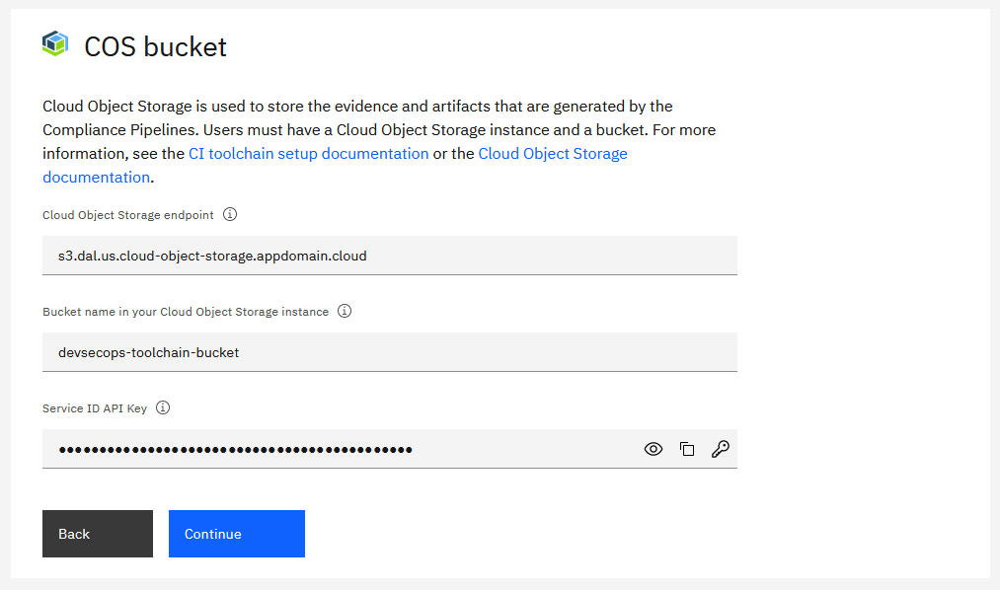
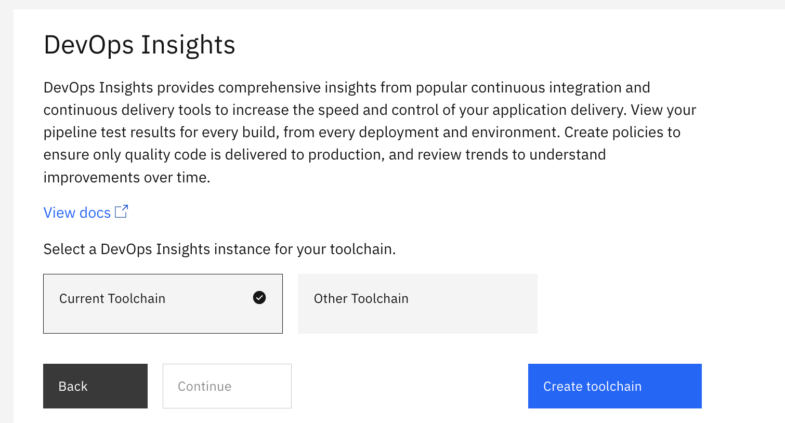
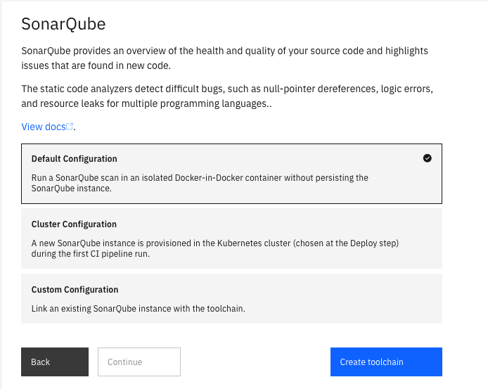
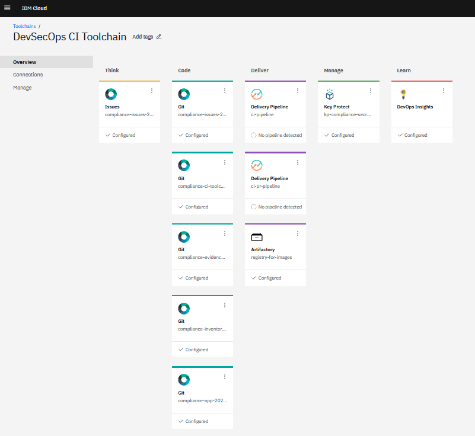
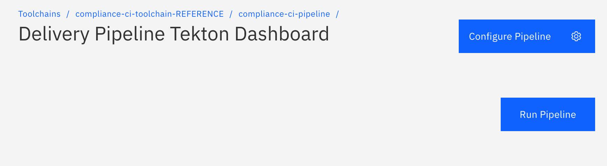
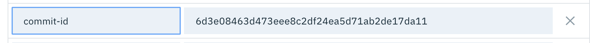
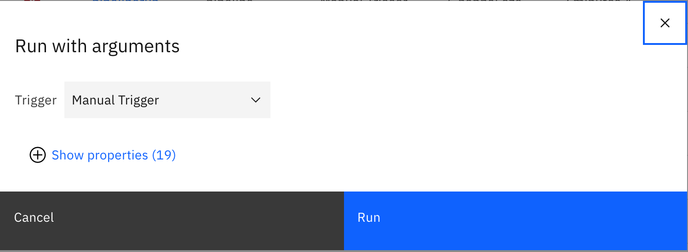

---

copyright:
  years: 2021
lastupdated: "2021-11-15"

keywords: DevSecOps, CI, compliance, secure toolchain, IBM Cloud

subcollection: devsecops

---

{:shortdesc: .shortdesc}
{:table: .aria-labeledby="caption"}
{:external: target="_blank" .external}
{:codeblock: .codeblock}
{:pre: .pre}
{:screen: .screen}
{:tip: .tip}
{:note: .note}
{:important: .important}
{:download: .download}
{:help: data-hd-content-type='help'}
{:support: data-reuse='support'}

# Setting up Tekton continuous integration pipelines with compliance
{: #cd-devsecops-tekton-ci-compliance}

## Before you begin
{: #cd-devsecops-tekton-ci-prereq}

* [Create a Kubernetes cluster](/docs/containers?topic=containers-getting-started) on IBM Cloud Kubernetes Service to deploy your application.
* [Install the {{site.data.keyword.cloud_notm}} CLI](/docs/containers?topic=containers-getting-started) on your operating system to interact with {{site.data.keyword.cloud_notm}} resources.
* [Create an image signing key](/docs/devsecops?topic=devsecops-cd-devsecops-image-signing) with proper encoding to sign your application docker images.
* [Create toolchain secrets](/docs/devsecops?topic=devsecops-cd-devsecops-toolchains-secrets) to access different integrations and secure them.
* Optional. [COS Bucket](/docs/devsecops?topic=devsecops-cd-devsecops-cos-config) as the compliance evidence locker to durably store pipeline run evidence.
* [Validate recommended IAM permissions](/docs/devsecops?topic=devsecops-cd-devsecops-iam-permissions) are assigned to corresponding integrations.

## Guided setup overview
{: #cd-devsecops-tekton-ci-guided}

Any of the methods in this tutorial takes you to the guided setup experience. You are guided through the toolchain setup process in a logical order, and you are presented with the recommended configuration options that are needed to create your toolchain.

A progress indicator shows the steps to complete the configuration. You can use the progress indicator to navigate to a previous step with a mouse click. The configuration options for the current step are displayed in the main area of the page.

You can also view the following video tutorial that demonstrates the setup process:

{: video output="iframe" data-script="none" id="watsonmediaplayer" width="560" height="315" scrolling="no" allowfullscreen webkitallowfullscreen mozAllowFullScreen frameborder="0" style="border: 0 none transparent;"}

{: caption="DevSecOps Continuous Integration toolchain welcome page" caption-side="bottom"}

To advance to the next step, click **Continue**. You can advance to the next step only when the configuration for the current step is complete and valid. You can navigate to the previous step by clicking **Back**.

Some steps include an **Advanced Options** toggle. These steps by default present you with the minimum recommended configuration needed. However, advanced users that need finer grained control can click the **Advanced Options** toggle to reveal all options for the underlying integration.

{: caption="DevSecOps Advanced options toggle" caption-side="bottom"}

After all the steps are successfully completed, you create the toolchain by clicking **Create** on the Summary step.

You can always go back to previous steps in the guided installer. The toolchain installer retains all the configuration settings from the successive steps.
{: tip}

## Start the CI toolchain setup
{: #devsecops-ci-tekton-setup}

Start the CI toolchain configuration by using one of the following options:

* Click the following **Create toolchain** button.

   {: external}

* From the {{site.data.keyword.cloud_notm}} console, click the **Menu** icon  and select **DevOps**. On the Toolchains page, click **Create toolchain**. On the Create a Toolchain page, click **CI-Develop with DevSecOps practices**.

## Set up the toolchain name and region
{: #devsecops-ci-tekton-name-region}

Review the default information for the toolchain settings. The toolchain's name identifies it in {{site.data.keyword.cloud_notm}}. Make sure that the toolchain's name is unique within your toolchains for the same region and resource group in {{site.data.keyword.cloud_notm}}.

The toolchain region can differ from cluster and registry region.
{: note}

{: caption="DevSecOps CI toolchain name and region" caption-side="bottom"}

## Set up tool integrations
{: #devsecops-ci-tekton-tool-integrations}

Multiple repositories must be configured during the guided setup, as described in the next sections.

For each repository, you can either clone the repository that's provided as a sample, or you can provide a URL to an existing IBM-hosted Git Repos and Issue Tracking (GRIT) repository that you own. The toolchain supports linking only to existing GRIT repositories.
{: note}

### Application
{: #devsecops-ci-tool-app}

The Application step that refers to the application source code repository is shown in the following image.
  
{: caption="[DevSecOps application repository" caption-side="bottom"}

The recommended options are displayed by default, but you can click the **Advanced Options** toggle to see all of the configuration options available for the underlying Git integration. The default behavior of the toolchain is `Use default sample` that clones the sample application as IBM-hosted GRIT Repository.

Enter the name of the IBM-hosted GRIT repository that was created by the toolchain as your application repository.

The region of the repository remains the same as the region of the toolchain.

If you want to link an existing Application Repository for the toolchain, select the `Bring your own app` option, and provide it as input to `Repository URL` field. As noted earlier, the toolchain currently supports linking only to existing GRIT repositories. If you want to know more about `Bring your own app`, see [Bringing your own app to DevSecOps](/docs/devsecops?topic=devsecops-cd-devsecops-apps-byoa).

### Inventory
{: #devsecops-ci-tool-inventory}

Change management is tracked in this repository. CD pipeline creates a new branch named as the created CR number, and merges it to master after deployment is concluded. 

{: caption="DevSecOps inventory repository" caption-side="bottom"}

The default behavior of the toolchain is to `Create new inventory` that creates a new Inventory Repository as IBM hosted GRIT Repository. In case you wish to link an existing Inventory Repository for the toolchain, you may choose `Use existing inventory` option and provide it as input to `Repository URL` field. As noted earlier, the toolchain currently supports linking only to existing GRIT repositories.

- **New repository name**: Name of the IBM hosted GRIT Repository created by the toolchain as your inventory repository. The region of the repository will remain the same as that of the toolchain.

### Issues
{: #cd-devsecops-issues-ci}

Issues about incidents that are captured during the build and deployment process are tracked in the repository.

{: caption="Issues repository" caption-side="bottom"}

The default behavior of the toolchain is to `Create new issues repository` that creates a new repository as IBM hosted GRIT Repository. In case you wish to link an existing Issues Repository for the toolchain, you may choose `Use existing issues repository` option and provide it as input to `Repository URL` field. As noted earlier, the toolchain currently supports linking only to existing GRIT repositories.

- **New repository name**: Name of the IBM hosted GRIT Repository created by the toolchain as your inventory repository. The region of the repository will remain the same as that of the toolchain.

### Secrets
{: #cd-devsecops-secrets-ci}

Several tools in this toolchain require secrets to access privileged resources. An {{site.data.keyword.cloud_notm}} API key is an example of such a secret. All secrets should be stored securely in a secrets vault and then referenced as required by the toolchain. The **Secrets** step allows you to specify which secret vault integrations will be added to your toolchain. Use the provided toggles to add or remove the vault integrations that you require. These can be configured in subsequent steps however you should familiarize yourself with the concepts in the [Protecting your sensitive data in Continuous Delivery](/docs/ContinuousDelivery?topic=ContinuousDelivery-cd_data_security#cd_secure_credentials) documentation as this provides important information about preconfiguring your vault providers and integrations appropriately.

{: caption="Choose secrets providers" caption-side="bottom"}

#### IBM Key Protect
{: #cd-devsecops-key-protect-ci}

Use [Key Protect](https://cloud.ibm.com/catalog/services/key-protect) to securely store and apply secrets like API keys, Image Signature, or HashiCorp credentials that are part of your toolchain. It's recommended that you create a Key Protect Service Instance before proceeding further. Incase you have already created a Key Protect Service Instance as prerequisite, you can link the same in this step.

{: caption="Key Protect" caption-side="bottom"}

- **Name**: Name of Key Protect instance created by the toolchain. This key protect instance can be accessed by this name during various stages of the toolchain setup.
- **Region**: Region in which the Key Protect service resides.
- **Resource Group**: Resource Group that the Key Protect service belongs.
- **Service name**: Key Protect service name.

To comply with best practices for using Hashicorp Vault, this template includes a Key Protect tool integration to securely manage the HashiCorp `Role ID` and `Secret ID`. By storing these HashiCorp secrets in Key Protect as a prerequisite for users to create toolchains, you protect access to HashiCorp Vault, which is the default secrets repo for most consumers.

#### IBM Secrets Manager
{: #cd-devsecops-secrets-manager-ci}

Use [Secrets Manager](https://cloud.ibm.com/catalog/services/secrets-manager) to securely store and apply secrets like API keys, Image Signature or Hashicorp credentials that are part of your toolchain. It's recommended that you create a Secrets Manager Service Instance before proceeding further. Incase you have already created a Secrets Manager Service Instance as prerequisite, you can link the same in this step.

{: caption="IBM Secrets Manager" caption-side="bottom"}

- **Name**: Name of Secrets Manager instance created by the toolchain. This Secrets Manager instance can be accessed by this name during various stages of the toolchain setup.
- **Region**: Region in which the Secrets Manager service resides.
- **Resource Group**: Resource Group that the Secrets Manager service belongs.
- **Service name**: Secrets Manager service name.

#### HashiCorp Vault
{: #cd-devsecops-vault-ci}

Use HashiCorp Vault to securely store secrets that are needed by your toolchain. Examples of secrets are API keys, user passwords or any other tokens that enable access to sensitive information. Your toolchain stores references to the HashiCorp secrets, not the literal secret values, which enables advanced capabilities like secret rotation.

{: caption="HashiCorp Vault" caption-side="bottom"}

- **Name**: A name for this tool integration. This name will be displayed in the toolchain.
- **Server URL**: The server URL for your HashiCorp Vault Instance. (for instance `https://192.168.0.100:8200`)
- **Integration URL**: The URL that you want to navigate to when you click the HashiCorp Vault Integration tile.
- **Secrets Path**: The mount path where your secrets are stored in your HashiCorp Vault Instance.
- **Authentication Method**: The Authentication method for your HashiCorp Vault Instance.
- **Role ID:** Your team's [AppRole Role ID](https://www.hashicorp.com/blog/authenticating-applications-with-vault-approle).
- **Secret ID:** Your team's [Secret ID](https://www.hashicorp.com/blog/authenticating-applications-with-vault-approle).

Note: _We advise you to use AppRole authentication method as this method can be used to read secret values._

### Evidence Storage
{: #cd-devsecops-evidence-storage-ci}

All raw compliance evidence that belongs to the application is collected in this repository. This repository option should only be used for evaluation purpose. 

The default behavior of the toolchain is to `Create new evidence locker repository` that creates a new repository as IBM hosted GRIT Repository. In case you wish to link an existing Evidence Locker for the toolchain, you may choose `Use existing evidence locker` option and provide it as input to `Repository URL` field. As noted earlier, the toolchain currently supports linking only to existing GRIT repositories.

{: caption="Evidence Repository" caption-side="bottom"}

**Note:** However, it is strongly recommended to collect and store all the evidences in a COS bucket which can be configured as described below.

#### COS bucket
{: #cd-devsecops-cos-bucket-ci}

{: caption="COS bucket toggle" caption-side="bottom"}

Cloud Object Storage is used to store the evidences and artifacts generated by the Compliance Pipelines.
If you wish to use this feature, you must have a Cloud Object Storage instance and a Bucket. For more information, follow the steps [here](/docs/devsecops?topic=devsecops-cd-devsecops-cos-config).

**Note:** This is currently optional. You can set any kind of COS bucket as a locker, even without a retention policy. The pipeline won't check or enforce settings at the moment.

For help, see the [Cloud Object Storage documentation](/docs/cloud-object-storage?topic=cloud-object-storage-getting-started-cloud-object-storage).

You need to provide the following information for the Pipelines to reach the mentioned bucket:
- Cloud Object Storage endpoint
- Bucket name
- Service API key

You can set up the COS locker later, by providing the necessary `cos-bucket-name` and `cos-endpoint`.

{: caption="COS Endpoint" caption-side="bottom"}

If you decide not to use Cloud Object Storage as an evidence locker, you can also set the required values after the creation of the toolchain by setting the `cos-bucket-name`, `cos-endpoint` environment variables in the CI Pipeline.

### Tekton pipeline
{: #cd-devsecops-tekton-pipeline-ci}
 
The toolchain comes with an integrated Tekton pipeline to automate continuous build, test and deploy of the application to development cluster. This repository contains Tekton resources defined in YAML files that carry out the pipeline tasks. Tekton definitions can be changed also once the toolchain is created. These repositories can be contributed to or can be forked although it is recommended to use the default repository provided by this step.

{: caption="DevSecOps Tekton Pipeline" caption-side="bottom"}

The default behavior of the toolchain is to `Clone existing pipeline` that creates a new repository as IBM hosted GRIT Repository. In case you wish to link an existing Pipeline Repository for the toolchain, you may choose `Use existing repository` option and provide it as input to `Repository URL` field. As noted earlier, the toolchain currently supports linking only to existing GRIT repositories.

### Deploy
{: #cd-devsecops-deploy-ci}

The default behavior of the toolchain is to `Clone existing pipeline` that creates a new repository as IBM hosted GRIT Repository. In case you wish to link an existing Pipeline Repository for the toolchain, you may choose `Use existing repository` option and provide it as input to `Repository URL` field. As noted earlier, the toolchain currently supports linking only to existing GRIT repositories.

- **App name:**

The name of the application.
    - Default: `hello-compliance-app`

- **{{site.data.keyword.cloud_notm}} API Key:**

The API key is used to interact with the `ibmcloud` CLI tool in several tasks. In case you have already created a cluster, an API to access the cluster and stored the key in a secure vault (any of Key Protect, Secrets Manager or HashiCorp Vault), as prerequisite you can use the same in this step.

    - Option-1: An existing key can be imported from an existing Secret Provider instance created as prerequisites (Key Protect Instance, Secret Manager Instance or HashiCorp Vault) by clicking the key icon (Recommended)
    - Option-2: An existing key can be copy & pasted (Not Recommended)
    - Option-3: A new key can be created from here by clicking the `New +` button. Generate a new api-key if you don’t have one or copy an existing key to the field. The newly generated API key can be immediately saved to an existing Key Protect instance

Click on the `Key` Icon to use an existing key from your Secret Provider.

- **Provider**: The Secret Provider which stores your API Key to access the cluster, as linked to your toolchain earlier. It can be a Key Protect Instance, Secret Manager Instance or Hashicorp Vault Instance.
- **Resource Group**: Resource Group that the Secrets Manager Provider belongs.
- **Secret name**: Name/Alias of the secret i.e. API Key.

Once the API Key field is filled, the registry and cluster related fields will be filled automatically.

{: caption="Deployment target" caption-side="bottom"}

### Image signing
{: #cd-devsecops-image-signing-ci}

Any images built by this toolchain and recorded in the inventory must be signed before they can be deployed to production. The pipeline uses Skopeo as default tool to provide Image signing capability. You can use an existing GPG Key or [create a new GPG Key](/docs/devsecops?topic=devsecops-cd-devsecops-image-signing).

**Note**: Ensure that the key follows the appropriate encoding as required by the chosen tool to store secrets.

{: caption="Image Signing" caption-side="bottom"}

Click on the `Key` Icon to use an existing key from your Secret Provider.

- **Provider**: The Secret Provider which stores your GPG Key. It can be a Key Protect Instance, Secret Manager Instance or Hashicorp Vault Instance.
- **Resource Group**: Resource Group that the Secrets Manager Provider belongs.
- **Secret name**: Name/Alias of the secret i.e. GPG Key.

### Optional tools
{: #cd-devsecops-optional-tools-ci}

#### Slack
{: #cd-devsecops-slack-ci}

If you want to receive notifications about your PR/CI Pipeline events, you can configure the Slack Tool during the setup from the toolchain template, or you can add the Slack Tool later.

In order for a Slack channel to receive notifications from your tools, you need a Slack webhook URL. To get a webhook URL, see the Incoming Webhooks section of the [Slack API website](https://api.slack.com/messaging/webhooks).

{: caption="Slack tool" caption-side="bottom"}

#### Common DevOps Insights Toolchain
{: #cd-devsecops-insights-toolchain-ci}

DevOps Insights can optionally be included in the created toolchain and after each compliance check evidence is published into it. The toolchain can use an existing DevOps Insights instance, to publish the deployment records to insights. You can link DevOps Insights integration from another toolchain by providing the Integration ID.

{: caption="DOI Toolchain ID" caption-side="bottom"}

You can copy the Toolchain ID from the URL of your toolchain.
A toolchain's URL follows this pattern: `https://cloud.ibm.com/devops/toolchains/<toolchain-ID-comes-here>?env_id=ibm:yp:us-south`

For example, if the URL is: `https://cloud.ibm.com/devops/toolchains/aaaaaaa-bbbb-cccc-dddd-eeeeeeeeeeee?env_id=ibm:yp:us-south` then the toolchain's ID is: `aaaaaaa-bbbb-cccc-dddd-eeeeeeeeeeee`.

**Note**: _Make sure to only include the ID here, not the full URL._

You can also set a target environment for the DOI interactions, this parameter is optional. If you provide this parameter, it will be used instead of the target environment from the inventory.

#### DevOps Insights
{: #cd-devsecops-devops-insights-ci}

Use this option if you wish to create a new instance of DevOps Insights to be used for the toolchain. There is no configuration required and toolchain will create a new instance of Devops Insight if this option is selected. The CI pipeline will automatically use the insights instance included in the toolchain.

#### Orion WebIDE
{: #cd-devsecops-webide-ci}

Develop for the web and the cloud in this browser-based integrated development environment (IDE).

#### SonarQube (Beta Release)
{: #cd-devsecops-sonar-ci}

If you add your own SonarQube instance, the static scan will run on this instance with your rules and quality gate. 

{: caption="SonarQube tool" caption-side="bottom"}

## Create the CI toolchain
{: #cd-devsecops-tekton-ci-create}

 **Create toolchain:**

- Click the create button at the bottom of the **Summary** step, and wait for the toolchain to be created.

   You can configure the individual toolchain integrations after the pipeline is created.
   {: tip}

{: caption="Summary" caption-side="bottom"}

{: caption="Toolchain created" caption-side="bottom"}

## Run the PR/CI Pipeline
{: #cd-devsecops-tekton-ci-run-pipeline}

### Run PR Pipeline
{: #cd-devsecops-run-pr-pipeline}

- To start the PR pipeline, create a pull request in your application repository.

- The corresponding Merge Request in your application repository will be in "Pending" state till all the stages of PR Pipeline finishes successfully.  

### Run CI Pipeline
{: #cd-devsecops-run-ci-pipeline}

There are two ways to start a CI pipeline:
1. After a successful PR pipeline, approving and merging the PR to the master branch.
2. Trigger the CI pipeline manually.

If you want to trigger the CI pipeline manually select the Delivery Pipeline card.

{: caption="Run CI Pipeline" caption-side="bottom"}

## Configure Pipeline
{: #cd-devsecops-config-pipeline-ci}

You can add a `commit-id` text property (click `Add property` button and select `"Text property"`), if you trigger the pipeline manually. If no `commit-id` is supplied, the Pipeline will take the latest commit ID from the master branch of your app.

<!-- TBD: Readme needed after implementing the automated versioning -->

For example:

{: caption="commit-id" caption-side="bottom"}

Add the trigger parameters (click `Run Pipeline` button), select `"Manual Trigger"` and click `Run`.

{: caption="CI Trigger" caption-side="bottom"}
