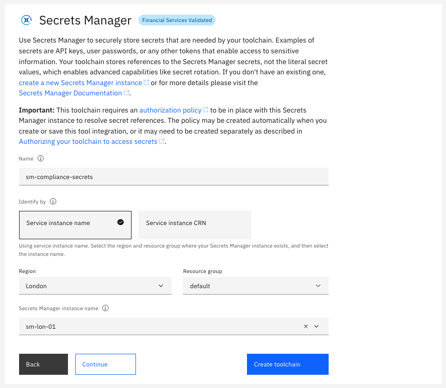

---

copyright:
  years: 2021, 2022
lastupdated: "2022-11-05"

keywords: DevSecOps, secrets in toolchains, managing secrets in toolchains, secrets manager

subcollection: devsecops

---

{{site.data.keyword.attribute-definition-list}}

# Managing secrets in your toolchains
{: #cd-devsecops-toolchains-secrets}

Many of the tool integrations in your CI and CD toolchains require secrets, for example passwords, API keys, certificates, or other tokens. For example, an {{site.data.keyword.cloud}} API key performs basic pipeline tasks, such as logging in to {{site.data.keyword.cloud_notm}}. Similarly, the service ID API key writes evidence to the bucket in Cloud Object Store instance.
{: shortdesc}

For security reasons, these secrets must not belong to or be affiliated with a person's identity or account. This is because people often have greater access permissions than the toolchain automation requires, and it would violate the security principle of ["least privilege"](https://en.wikipedia.org/wiki/Principle_of_least_privilege){: external}. Also, people often change roles or even companies and their credentials must be removed which might break the toolchain automation. By using an identity that is affiliated specifically for automation purposes provides a separation of duties between automation and people who use the automation.

Instead, the secrets that are used for non-{{site.data.keyword.cloud_notm}} resources (such as GitHub Enterprise) must be affiliated with a functional ID within your enterprise with only the appropriate access that is needed by the toolchains. Likewise, secrets for {{site.data.keyword.cloud_notm}} resources must be affiliated with an [IAM service ID API key](/docs/account?topic=account-serviceidapikeys) that is affiliated with an [IAM service ID](/docs/account?topic=account-serviceids). The IAM service ID access permissions should be scoped to the least privilege required by the toolchains.

Managing credentials like these must be done securely and in compliance with best practices in the field of secrets management. In particular, this means vaulting the required secrets by using an approved in-boundary vault provider, such as [HashiCorp Vault](https://www.vaultproject.io){: external} and then linking your toolchain secrets to those resources.

The secrets management capabilities that are provided in the toolchain setup and pipeline user interfaces enable selection of vaulted secrets by using Secrets Integrations for HashiCorp Vault and {{site.data.keyword.keymanagementservicelong}}. By using the Secrets Picker dialog, a toolchain or pipeline editor can easily select named secrets from a bound secrets integration that is then resolved by reference within the toolchain and pipeline. After a secret is chosen, a canonical secret reference is injected into the corresponding toolchain or pipeline secure property where the format is `{vault::integration-name.secret-name}`. This long form canonical reference is used by the front-end user interface components and importantly, the resolved value of the actual secret is never exposed to a user or permitted service.

In addition to manually selecting chosen secrets on a one-by-one basis from any bound secrets integrations in a toolchain, the option of using a `Secret Hint` is also available. This option enables a toolchain template to be predefined with suggested secrets names (also known as `Hints`) that are a short form secret reference. The format of a secret hint is `{vault::secret-name}` whereby no secret integration name is included. This provides flexibility to the toolchain author in that all required secret names can be prepopulated into a `toolchain.yml` and then these names are automatically resolved against whatever secrets integrations are configured for the toolchain.

The secrets that are used in both CI and CD are outlined as follows:

A `Hint` is a suggested default name that is automatically resolved against the first matching secret with the same name across any of the available secrets integrations that are bound to the toolchain.
{: note}

## DevSecOps Pipeline Secrets
{: #devsecops-pipeline-secrets}

| **Secret**                | **Hint**                 | **Information**    |
| -------------             | -------------            | -------------      |
| {{site.data.keyword.cloud_notm}} API Key         | `ibmcloud-api-key`       | **Required: CI & CD** _Used to authenticate with IBM public cloud and perform a wide range of operations_ |
| GPG Private Key          | `signing_key`          | **Required: CI only** _This is the certificate that is used to sign images built by the CI pipeline_ |
| {{site.data.keyword.IBM_notm}} Private Worker Service API Key    | `private-worker-service-api-key`  | **Required: CI only** _A Service ID API Key Used to run delivery pipeline workloads on a Tekton Private Worker Service_|
| GitHub Access Token       | `git-token`              | **Optional: CI & CD** _Used to authenticate with GitHub and provide access to the repositories_ |
| Artifactory API token    | `artifactory-token`      | **Required: CI & CD** _Used to access images used by pipeline tasks_|
| Slack Web Hook           | `slack-webhook`          | **Optional: CI & CD** _This webhook is required if you choose to use the Slack tool integration to post toolchain status notifications_ |
| HashiCorp Vault Role ID   | `role-id`                | **Required: CI & CD** _Used to authenticate with the HashiCorp Vault server_ |
| HashiCorp Vault Secret ID | `secret-id`              | **Required: CI & CD** _Used to authenticate with the HashiCorp Vault server_ |
| {{site.data.keyword.cos_full_notm}} Writer API Key    | `cos-api-key`            | **Required: CI & CD** _Used to authenticate with the {{site.data.keyword.cos_short}} service - This key must have `writer` permission_ |
| SonarQube password or authentication token | `sonarqube-password`              | **Optional: CI** _Used to authenticate with the SonarQube source code analyzer_ |
{: caption="Table 1. DevSecOps Secrets" caption-side="top"}

If you are using a HashiCorp Vault server, ensure that the HashiCorp Vault tool integration uses the [AppRole Auth Method](https://www.vaultproject.io/docs/auth/approle){: external} method. 
When you use the AppRole authentication method, you need `role-id` and `secret-id` to successfully integrate the HashiCorp Vault server with the toolchain. Because `role-id` and `secret-id` are secrets in themselves, it is recommended to store them by using a [{{site.data.keyword.keymanagementservicelong_notm}} tool integration](/docs/ContinuousDelivery?topic=ContinuousDelivery-keyprotect) so that they can be securely retrieved and applied in the toolchain workflow. All other toolchain secrets should be stored and retrieved by using the HashiCorp Vault tool integration.

If the pipeline environment property `git-token` is not set, `ibmcloud-api-key` is used to retrieve the {{site.data.keyword.gitrepos}} Access Token by default. However, if `ibmcloud-api-key` does not have access to `git`, `git-token` must be set.
{: note}

### Configuring the secrets stores
{: #configure-secret-stores}

With {{site.data.keyword.cloud_notm}}, you can choose from various secrets management and data protection offerings that help you protect your sensitive data and centralize your secrets. You can choose between the vault integrations depending on your requirements as explained in [Managing {{site.data.keyword.cloud_notm}} secrets](/docs/secrets-manager?topic=secrets-manager-manage-secrets-ibm-cloud). This documentation provides information about prerequisites and how to use a list of prescribed secret names that are otherwise known as hints. By using hints in a template, a toolchain can be automatically populated with preconfigured secrets without any need to manually select them from various vault integrations that are attached to the toolchain.

Use [{{site.data.keyword.secrets-manager_full}}](/docs/secrets-manager?topic=secrets-manager-getting-started) to securely store and apply secrets like API keys, Image Signature, or HashiCorp credentials that are part of your toolchain.

{: caption="Figure 1. IBM Secrets Manager Tool Integration" caption-side="bottom"}

The templates also come with a HashiCorp tool integration like the following example:

{: caption="Figure 2. HashiCorp Vault Tool Integration" caption-side="bottom"}

To use HashiCorp Vault, you must provide the following information:

* **Name**: A name for this tool integration. This name is displayed in the toolchain.
* **Server URL**: The server URL for your HashiCorp Vault Instance. For example, `https://<vault-service>.<org>.com:8200`.
* **Integration URL**: The URL that you want to navigate to when you click the HashiCorp Vault Integration tile.
* **Secrets Path**: The mount path where your secrets are stored in your HashiCorp Vault Instance.
* **Authentication Method**: The Authentication method for your HashiCorp Vault Instance. Use `AppRole`.
* **Role ID**: Identifier that selects the AppRole against which the other credentials are evaluated.
* **Secret ID**: Credential that is required by default for any login (with secret_id) and is intended to always be secret.

The templates also come with an {{site.data.keyword.keymanagementservicefull}} tool integration:

{: caption="Figure 3. IBM Key Protect tool integration" caption-side="bottom"}

If you stored the `role id` and `secret id` in {{site.data.keyword.keymanagementserviceshort}} in advance, then you can select the {{site.data.keyword.keymanagementserviceshort}} instance that contains those secrets in the tool card as shown in Figure 2. After that is done, then you can click the key icons on the **role id** and **secret id** fields in the HashiCorp tool card, and use the picker to apply the secrets to those fields.

Similarly, any other secrets that are used in the toolchain have a key icon that is attached to the text field. You can use the same picker control to apply the HashiCorp secrets to all the remaining instances.
