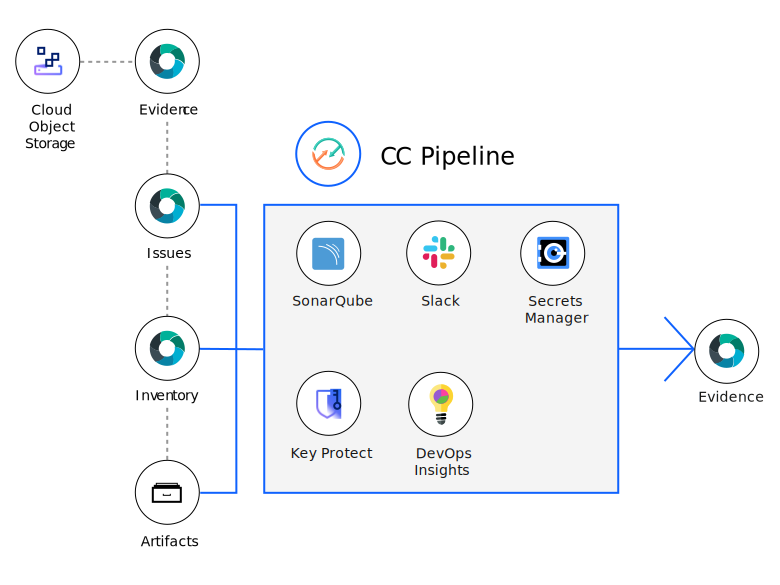

---

copyright:
   years: 2021, 2022
lastupdated: "2022-03-29"

keywords: tekton, pipeline, toolchain, CC, automate, automation, continuous delivery, continuous integration, continuous compliance, compliance, devsecops tutorial, devsecops, DevOps, shift-left, shift left, secure DevOps, IBM Cloud

subcollection: devsecops

content-type: tutorial
services: apps, containers, ContinuousDelivery
account-plan: paid
completion-time: 1h

---

{:shortdesc: .shortdesc}
{:table: .aria-labeledby="caption"}
{:screen: .screen}  
{:codeblock: .codeblock}  
{:pre: .pre}
{:tip: .tip}
{:note: .note}
{:important: .important}
{:download: .download}
{:term: .term}
{:external: target="_blank" .external}
{:step: data-tutorial-type='step'}

# Set up a Continuous Compliance toolchain
{: #tutorial-cc-devsecops}
{: toc-content-type="tutorial"}
{: toc-services="apps, containers, ContinuousDelivery"}
{: toc-completion-time="1h"}

Use this tutorial to learn how to set up a continuous compliance (CC) toolchain to ensure that your deployed artifacts and their source repositories are always compliant. The continuous compliance pipeline works in conjunction with [Continuous Integration (CI)](/docs/devsecops?topic=devsecops-tutorial-cd-devsecops#devsecops-ci-toolchain-intro) and [Continuous Deployment (CD)](/docs/devsecops?topic=devsecops-tutorial-cd-devsecops#devsecops-cd-toolchain-intro) toolchains, both of which must be set up before you begin this tutorial.
{: shortdesc}

## Overview and introduction
{: #devsecops-cc-tutorial-overview}

[DevSecOps](#x9892260){: term} integrates a set of security and compliance controls into the [DevOps](https://www.ibm.com/cloud/learn/devops-a-complete-guide){: external} processes. This integration allows organizations to deliver rapidly and often, while maintaining a strong security posture and continuous state of audit-readiness. Additionally, DevSecOps makes application and infrastructure security a shared responsibility of development, security, and IT operations teams, rather than the sole responsibility of a security silo.

This tutorial provides information and hands-on guidance on Continuous Compliance reference implementation by using {{site.data.keyword.cloud_notm}} Continuous Delivery with Tekton Pipelines. This tutorial steps you through the creation of Continuous Compliance (CC) toolchain by using a toolchain template.

The Continuous [Compliance (CC) pipeline](/docs/devsecops?topic=devsecops-devsecops-cc-pipeline) from this reference implementation can be triggered manually or periodically using triggers. This pipeline is useful for a continuous scanning of existing deployed artifacts and their source repositories independent of your deployment schedule. It runs the static scans and dynamic scans on the Application Source Code, detect secrets in Git repos, Bill Of Materials (BOM) check, CIS check and Vulnerability Advisor scan. After scanning and running checks on artifacts and source repositories, the pipeline creates a new incident issue or updates the existing incident issues in the incident repository. Finally, using these issues and the results, the pipeline collects evidence and summarizes the evidence, so the Security and Compliance Center can update the compliance status of the found artifacts.
The CC pipeline uses [async sub pipeline](/docs/devsecops?topic=devsecops-devsecops-async-stages#async-stages-setup-triggers) that runs in parallel to the main pipeline run to optimize pipeline run time and improve pipeline resiliency.

This tutorial uses a staging environment as an example to configure and showcase the continuous compliance (CC) toolchain.

{: caption="DevSecOps Continuous Compliance toolchain" caption-side="bottom"}

The CC toolchain implements the following best practices:

* Runs a static code scanner at pre-defined internals on the application repositories provided to detect secrets in the application source code and vulnerable packages that are used as application dependencies
* Scan the container image for security vulnerabilities
* Any incident issue found during the scan or updated will be marked with a due date
* Generate a summary.jason and store in IBM Cloud Object Storage at the end of every run summarizing the details of the scan.

Let's now get started with the creation and exploration of the CC template.

## Before you begin
{: #devsecops-tutorial-prereqs-cc-toolchain}

To set up the prerequisites for your CC toolchain, follow these steps:

1. You should have set up the DevSecOps CI and CD toolchains already. For more information, see [this tutorial](/docs/devsecops?topic=devsecops-tutorial-cd-devsecops#devsecops-tutorial-prereqs) to get them working first.
1. Depending on your setup, you will reuse some or all of the resources created during CI and CD toolchain setup while setting up the CC toolchain such as Secret Management vault, Kubernetes cluster, IBM Cloud container registry namespace, IBM Cloud API key, IBM Cloud CLI, IBM Cloud Object Storage instance and bucket, IBM Cloud Satellite cluster group and application and inventory repositories. It will help to keep those resources, CI CD toolchains handy.

## Start the CC toolchain setup
{: #devsecops-cc-toolchain-create-options}
{: step}

Start the CC toolchain configuration by using one of the following options:

* Click the following **Create toolchain** button.

   
   
* From the {{site.data.keyword.cloud_notm}} console, click the **Menu** icon  and select **DevOps**. On the Toolchains page, click **Create toolchain**. On the Create a Toolchain page, click **CC - Keep your app continuously Compliant with DevSecOps practices**.

## Set up the CC toolchain name and region
{: #devsecops-cc-toolchain-name-region}
{: step}

The setup starts with a Welcome page that explains the toolchain, pre-requisites needed to set this up, useful links like documentation, tutorial, etc. and a framework diagram that explains the corelation between different tools integrated.

{: caption="DevSecOps CC toolchain welcome page" caption-side="bottom"}

Review the default information for the toolchain settings. The toolchain's name identifies it in {{site.data.keyword.cloud_notm}}. Make sure that the toolchain's name is unique within your toolchains for the same region and resource group in {{site.data.keyword.cloud_notm}}.

The toolchain region can differ from cluster and registry region.
{: note}

{: caption="DevSecOps CC toolchain name and region" caption-side="bottom"}

You can provide a CI toolchain already setup at this step. Using filter on the region where your CI toolchain resides helps you to find it easily.
The setup will fetch the resource details such as pipeline configuration, repositories like inventory and incidence issues based on the CI toolchain provided. If you chose to not provide any details for the CI toolchain details, you will need to manually provide the aforementioned details in the later steps of the setup.

## Set up CC tool integrations
{: #devsecops-cc-tool-integrations}
{: step}

### Secrets
{: #devsecops-cc-tool-integration-secrets}

Several tools in this toolchain require secrets to access privileged resources. An {{site.data.keyword.cloud_notm}} API key is an example of such a secret. All secrets must be stored securely in a secrets vault and then referenced as required by the toolchain.

With {{site.data.keyword.cloud_notm}}, you can choose from various secrets management and data protection offerings that help you to protect your sensitive data and centralize your secret. In the Secrets step, you specify which secret vault integrations are added to your toolchain. Use the provided toggles to add or remove the vault integrations that you require as explained in [Managing {{site.data.keyword.cloud_notm}} secrets](/docs/secrets-manager?topic=secrets-manager-manage-secrets-ibm-cloud). This documentation gives you information on prerequisites and how to use a list of prescribed secret names that are otherwise known as hints. By using hints in a template, a toolchain can be automatically populated with preconfigured secrets without any need to manually select them from various vault integrations that are attached to the toolchain.

This tutorial uses IBM Secrets Manager as the vault for secrets.
You may want to go with the secret management offering/s you would have used during CI and/or CD toolchain setup.

{: caption="DevSecOps secrets options" caption-side="bottom"}

Use [IBM Secrets Manager](/docs/secrets-manager?topic=secrets-manager-getting-started) to securely store and apply secrets like API keys, Image Signature, or HashiCorp credentials that are part of your toolchain.

{: caption="DevSecOps IBM Secrets Manager" caption-side="bottom"}

If you plan to use IBM Key Protect or HashiCorp vault for managing your secrets, see the [IBM Key Protect section of the CI setup guide](/docs/devsecops?topic=devsecops-cd-devsecops-tekton-ci-compliance#cd-devsecops-key-protect-ci).

Multiple repositories must be configured during the guided setup, as described in the next sections.

For each repository, provide a URL to an existing IBM-hosted Git Repos and Issue Tracking (GRIT) repository that you own and that was specified during CI toolchain setup. The toolchain supports linking only to existing GRIT repositories.
{: note}

### Inventory
{: #devsecops-cc-tool-integration-inventory}

The [inventory](/docs/devsecops?topic=devsecops-cd-devsecops-inventory) repository records details of artifacts that are built by the CI toolchains.

{: caption="DevSecOps inventory repository" caption-side="bottom"}

### Target
{: #devsecops-cc-tool-integration-taregt}

This step asks you to provide details of target environment to scan the deployed artifacts.
The pipeline runs a number of dynamic scans, and it is recommended to use your staging environment.
IBM Cloud API key: The API key you created and used during your CI toolchain setup. Optionally you can create a new key and store it in your preferred choice of secrets vault.
Environment tag in your inventory: It is the [tag in your Inventory repository](/docs/devsecops?topic=devsecops-cd-devsecops-inventory#inventory-tags) which reflects the state of your current deployed environment. This tag is the snapshot of current running application on target.

{: caption="DevSecOps CC target definition" caption-side="bottom"}

### Issues
{: #devsecops-cc-tool-integration-issues}

The Git Repos and Issue Tracking repository records incident issues that are found while the CC pipeline is running.
{: caption="DevSecOps incident issues repository" caption-side="bottom"}

### Pipeline configuration
{: #devsecops-cc-tool-integration-tekton-pipeline}

The toolchain comes with an integrated Tekton pipeline to automate continuous compliance scans of the deployed artifacts and source application repositories. This repository contains Tekton resources that are defined in YAML files that carry out the pipeline tasks. These repositories can be contributed to or can be forked although it is highly recommended to use the default repository provided by this step.

{: caption="DevSecOps CC Tekton Pipeline configuration" caption-side="bottom"}

### Evidence Storage
{: #devsecops-cc-tool-integration-evidence-storage}

All raw compliance evidence that belongs to the application is collected in this repository. This repository option should be used only for evaluation purposes. However, it is recommended to collect and store all the evidences in a Cloud {{site.data.keyword.cos_short}} bucket that can be configured as described in the following image.

{: caption="DevSecOps Evidence Storage" caption-side="bottom"}

### Cloud {{site.data.keyword.cos_short}} bucket
{: #devsecops-cc-tool-integration-cos-bucket}

[{{site.data.keyword.cos_full_notm}}](/docs/cloud-object-storage?topic=cloud-object-storage-about-cloud-object-storage) is used to store the evidence and artifacts that are generated by the DevSecOps pipelines. If you want to use this feature, you must have a Cloud {{site.data.keyword.cos_short}} instance and a bucket created during your DevSecOps CI toolchain. [Read the recommendation](/docs/devsecops?topic=devsecops-cd-devsecops-cos-config) for configuring a bucket that can act as a compliance evidence locker.

You can optionally set any kind of Cloud {{site.data.keyword.cos_short}} bucket as a locker, even without a retention policy. The pipeline doesn't check or enforce settings at the moment. For help, see the [Cloud {{site.data.keyword.cos_short}} documentation](/docs/cloud-object-storage?topic=cloud-object-storage-getting-started-cloud-object-storage).
{: note}

The following details of the bucket in your resource group and region are fetched and displayed. You must choose the one that is configured with the CI toolchain.
* Cloud {{site.data.keyword.cos_short}} instance 
* Bucket name
* Cloud {{site.data.keyword.cos_short}} endpoint

You need to enter the Service API key to write to Cloud Object Storage instance.

{: caption="DevSecOps COS configuration" caption-side="bottom"}

### DevOps Insights
{: #devsecops-ci-tool-integration-insights}

[IBM Cloud DevOps Insights](/docs/ContinuousDelivery?topic=ContinuousDelivery-di_working) created during the CI toolchain setup is reused for the CC  toolchain and after each compliance check evidence is published into it. You do not need to provide any configuration steps for DevOps Insights. DevOps Insights aggregates code scan, test, build, and deployment data to provide visibility into the velocity and quality of all your teams and releases.
We are working on it to make this available at the earliest!

### SonarQube
{: #devsecops-cc-tool-integration-sonarqube}

Configure SonarQube as the static code analysis tool for the toolchain. SonarQube provides an overview of the overall health and quality of your source code and highlights issues that are found in new code. The static code analyzers detect tricky bugs, such as null-pointer dereferences, logic errors, and resource leaks for multiple programming languages.

With **Default Configuration**, the pipeline provisions a new SonarQube instance in the Kubernetes cluster that is configured in the `cc-static-scan` step. A new instance is provisioned during each CC pipeline run.

If you want the toolchain to use an existing SonarQube Instance that you have provisioned on another host, use the **Custom Configuration** option.

{: caption="SonarQube static scan configuration" caption-side="bottom"}

### Optional tools
{: #devsecops-cc-tool-integration-optional-tools}

#### Slack
{: #devsecops-cc-tool-integration-optional-slack}

If you want to receive notifications about your CC Pipeline events, you can configure the [Slack Tool](/docs/ContinuousDelivery?topic=ContinuousDelivery-slack) during the setup from the toolchain template, or you can add the Slack Tool later.

In order for a Slack channel to receive notifications from your tools, you need a Slack webhook URL. To get a webhook URL, see the Incoming Webhooks section of the [Slack API website](https://api.slack.com/messaging/webhooks){: external}.

#### Delivery Pipeline Private Worker
{: #devsecops-cc-tool-integration-optional-private-worker}

The [Delivery Pipeline Private Worker](/docs/ContinuousDelivery?topic=ContinuousDelivery-private-workers) tool integration connects with one or more private workers that can run Delivery Pipeline workloads in isolation.

## Create the CC toolchain
{: #devsecops-cc-toolchain-create}
{: step}

On the Summary page, click **Create toolchain**, and wait for the toolchain to be created.

The individual toolchain integrations can be configured also after the pipeline is created.
{: tip}

{: caption="DevSecOps Summary" caption-side="bottom"}

## Explore the CC toolchain
{: #devsecops-cc-toolchain-explore}
{: step}

The created CC toolchain will look like this:
{: caption="DevSecOps Continuous Compliance Toolchain" caption-side="bottom"}

It contains Continuous Compliance pipeline and async pipeline. It comes with three triggers built in:
* **CC Manual Trigger** : CC Pipeline can be manually triggered.
* **CC Timed Trigger** : CC Pipeline can be triggered at a pre-determined time. The maximum frequency is at every 5 minutes and can go till once a month. Depending on your requirement CC pipeline can be scheduled run every day, or a particular day of the week at a specified time, etc.
* **Subpipeline Webhook Trigger** : Async sub pipeline is triggered. You can trigger any stage that is added to the `.pipeline-config.yaml` configuration file by using async sub pipelines. You don't need to add those stages inline to the pipeline, and you don't need to modify the pipeline. For triggering the stage, a webhook trigger is created with a webhook secret. know more about [Triggering a stage by using async sub pipelines](/docs/devsecops?topic=devsecops-devsecops-async-sub-pipelines).

{: caption="DevSecOps Continuous Compliance pipeline triggers" caption-side="bottom"}

#### Update the app URL to run dynamic scan
{: #devsecops-cc-toolchain-appurl}

To run dynamic scan on the target environment, we need to provide application URL to the CC pipeline.

Dynamic scan may run some tests which are intrusive in nature. It is recommended to use a staging environment to run dynamic scan. So, provide the application URL that is running in the staging environment.
{: note}

To get the application URL:
* Go to a successful CI pipeline run
* Go to stage `deploy-dev`
* Click on the task `run stage`
* Under `Logs` look for `App URL`

A sample app URL looks like this:
{: caption="Sample application URL from CI Pipeline" caption-side="bottom"}

We need to supply this application URL to the CC pipeline. It can be achieved by:
* Go to the CC pipeline from the newly created  CC toolchain tiles
* Click on the `Environment Properties`
* Add a new environment variable using `Add` => `Text value `
* For name of the property mention: `app-url`
* For value mention the application URL
* Click `Save`

The property after addition looks like this:
{: caption="CC pipeline updated with application URL details" caption-side="bottom"}

Now, you are ready to run the CC pipeline run using a manual trigger.

A completed CC pipeline run looks like this:
{: caption="DevSecOps Continuous Compliance pipeline successful run" caption-side="bottom"}

A completed async sub pipeline run that got triggered during CC pipeline run looks like this:
{: caption="DevSecOps Continuous Compliance async sub pipeline successful run" caption-side="bottom"}

Refer a detailed and updated list of [scans and checks run in compliance checks](/docs/devsecops?topic=devsecops-devsecops-cc-pipeline#devsecops-cc-pipeline-compliance-checks).

#### Incident issues
{: #devsecops-cc-toolchain-incident-issues}

During CC pipeline execution, incident issues (vulnerability, CVE) are created and attached to the collected evidence. If found in production, these issues can have a specified time period in which they should be fixed so that deployments are not blocked. Thus, the issues are added with a due date. This also helps to continue with the deployment because thought the same issue is found in build, the deployment does not make the security posture worse.
The detailed feature documentation can be found [here](/docs/devsecops?topic=devsecops-devsecops-issues-grace-period).

The issues are created in the issues repository mentioned at the time of toolchain setup. A sample issue indicating a vulnerability with a due date looks like below:
{: caption="DevSecOps sample incident issue created with CC pipeline" caption-side="bottom"}

#### CI and CC pipeline comparison
{: #devsecops-cc-toolchain-comparison}

You might have observed that the CI and CC pipeline has many common steps. The scans and checks executed are similar in nature and details. the pipelines still have some significant differences as explained below:

| CI pipeline | CC pipeline |
|---------|------------|
| It is part of CI toolchain | It is part of CC toolchain |
| It is triggered after a merge request is merged with master branch | It can be triggered manually or at predefined intervals independent of deployment schedule |
| Application URL and application code repo details are entered as part of setup process | An application URL and application code repo details are provided post CC toolchain is configured before initiation of first pipeline run. |
| The incident issues created as part of various scans and checks during compliance checks do not carry a due date | The incident issues created as part of various scans and checks during compliance checks carry a due date |
| The incident issues created are found during build | The incident issues created are found during periodic scans of staging or production environment. |
| summary.json is not generated at the end of each CI pipeline run | summary.json is not generated at the end of each CI pipeline run |
| It includes steps like app image creation, image signing, deploy to dev cluster. This in turn creates inputs for CD pipeline  | It executes only scans and checks needed for compliance testing |

{: caption="Table 1. Difference in CI and CC pipeline" caption-side="top"}

## Related content
{: #devsecops-tutorial-cc-related-content}

* [Getting started with clusters](/docs/containers?topic=containers-getting-started)
* [Getting started with toolchains](https://cloud.ibm.com/devops/getting-started){: external}
* [Getting started with Continuous Delivery](/docs/ContinuousDelivery?topic=ContinuousDelivery-getting-started)

## Looking for help?
{: #devsecops-tutorial-cc-toolchain-help}

Get help fast directly from the {{site.data.keyword.cloud_notm}} {{site.data.keyword.contdelivery_short}} development teams by joining us on [Slack](https://ic-devops-slack-invite.us-south.devops.cloud.ibm.com/){: external}.

For more support options, see [Getting help and support for {{site.data.keyword.contdelivery_short}}](/docs/ContinuousDelivery?topic=ContinuousDelivery-gettinghelp).
