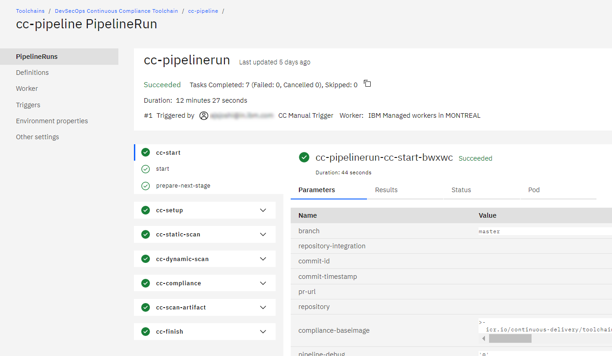
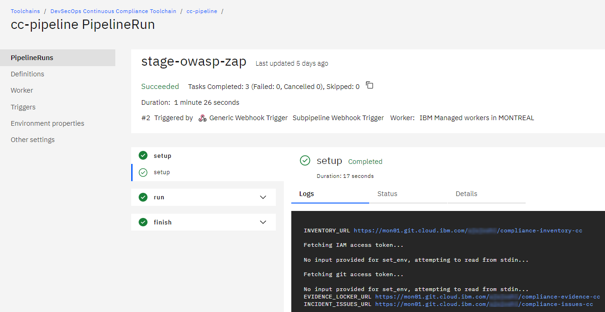
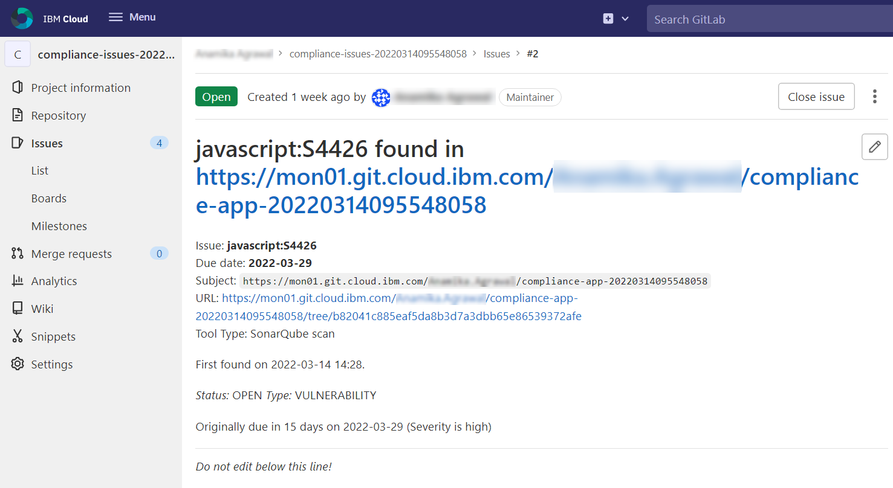
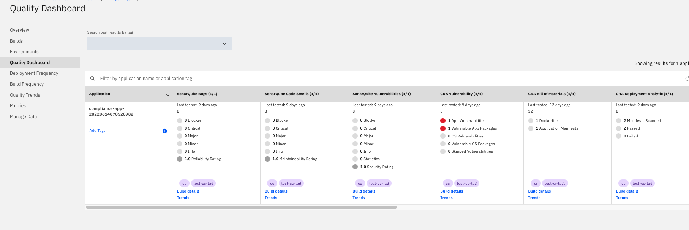

---

copyright:
  years: 2023, 2024
lastupdated: "2024-10-08"

keywords: tekton, pipeline, toolchain, cc, automate, automation, continuous delivery, continuous integration, devsecops tutorial, devsecops, continuous compliance, compliance, devops, secure DevOps, satellite, custom target, multiple clusters, shift-left, shift left

subcollection: devsecops

content-type: tutorial
services: containers, ContinuousDelivery
account-plan: paid
completion-time: 1h

---

{{site.data.keyword.attribute-definition-list}}

# Setting up a Continuous Compliance toolchain
{: #tutorial-cc-toolchain}
{: toc-content-type="tutorial"}
{: toc-services="containers, ContinuousDelivery"}
{: toc-completion-time="1h"}

This tutorial walks you through how you can use the toolchain template for continuous compliance (CC) to make sure that your deployed artifacts and their source repositories are always compliant.
{: shortdesc}

[DevSecOps](#x9892260){: term} integrates a set of {{site.data.keyword.compliance_full}} controls into the [DevOps](https://www.ibm.com/cloud/learn/devops-a-complete-guide){: external} processes. This integration allows organizations to deliver rapidly and often to maintain a strong security posture and a continuous state of audit-readiness.

## Before you begin
{: #tutorial-cc-toolchain-prereqs}

Make sure that the following prerequisites are completed. You might reuse the resources that were created during the CI and continuous deployment (CD) toolchain setup process. It helps to keep the resource information from the CI and CD toolchains handy.

1. Complete [Setting up the prerequisites](/docs/devsecops?topic=devsecops-tutorial-cd-devsecops).
2. Complete [Setting up a CI toolchain](/docs/devsecops?topic=devsecops-tutorial-ci-toolchain).
3. Complete [Setting up a CD toolchain](/docs/devsecops?topic=devsecops-tutorial-cd-toolchain).
4. Refer to, the [CC toolchain practices](/docs-draft/devsecops-working?topic=devsecops-working-practices-ci-toolchain).

## Start the CC toolchain set up
{: #tutorial-cc-toolchain-setup}
{: step}

This tutorial uses a staging environment as an example to configure and showcase the CC toolchain. Follow the steps to access the template for the CC toolchain.

1. In the {{site.data.keyword.cloud_notm}} console, click the **Menu**  > **Platform Automation** > **Toolchains**.
3. From the Toolchains page, click **Create toolchain**.
4. From the Create a Toolchain page, click **CC - Keep your app continuously Compliant with DevSecOps practices** tile.

## Set up the CC toolchain settings
{: #tutorial-cc-toolchain-name-region}
{: step}

1. Click **Start**.
2. Enter a unique toolchain name within your toolchain for the same region and resource group in the {{site.data.keyword.cloud_notm}}. The toolchain region can differ from cluster and registry region.
3. **Select a region**.
4. **Select a resource group**.
5. Optional: You can Choose the associated continuous integration (CI) toolchain from the dropdown. This copies some of the CI configuration to aid in the setup for the CC toolchain. This might overwrite some of the values that you already entered.
6. Click **Continue**.

   You can advance to the next step only when the configuration for the current step is complete and valid. You can always click **Back** to view previous steps in the guided installer. The toolchain installer retains all the configuration settings from the successive steps.
   {: important}

Some steps include a **Switch to advanced configuration** toggle button. These steps by default present you with the minimum configuration. However, advanced users that need finer grained control can click the **Switch to advanced configuration** toggle to reveal the options for the underlying integration.

## Set up CC tool integrations
{: #tutorial-cc-toolchain-tool-integrations}
{: step}

Review the default settings and provide the user-defined configurations wherever necessary to set up CC tool integration.

### Secrets
{: #tutorial-cc-toolchain-secrets}

Specify the secret vault integrations to be added to your toolchain by using the provided toggles. For more information, see [Managing {{site.data.keyword.cloud_notm}} secrets](/docs/secrets-manager?topic=secrets-manager-manage-secrets-ibm-cloud). 

The CI toolchain supports **Arbitrary secrets** and **IAM credentials** secret types only.
{: important}

1. This tutorial uses {{site.data.keyword.secrets-manager_full}} as the vault for secrets. The **Region**, **Resource group**, and **Service name** fields are automatically populated based on available choices. Click the dropdown indicators to see the other choices.
2. Enter your **{{site.data.keyword.secrets-manager_short}} instance name**.
3. Select the **Authorization type**.
4. Click **Continue**.

### Inventory
{: #tutorial-cc-toolchain-inventory}

1. Select the **Repository URL** of the [inventory](/docs/devsecops?topic=devsecops-cd-devsecops-inventory) repository to record the details of artifacts built by the CI toolchain.
2. Click **Continue**.

### Target
{: #tutorial-cc-toolchain-target}

1. Enter your **{{site.data.keyword.cloud_notm}} API key**.
2. Enter the **Environment tag in your Inventory** to scan the deployed artifacts. 
3. Click **Continue**.

### Issues
{: #tutorial-cc-toolchain-issues}

1. Select the **Repository URL** to record the issues while the CC pipeline is running.
2. Click **Continue**.

### Pipeline configuration
{: #tutorial-cc-toolchain-tekton-pipeline}

The pipeline configuration repository contains YAML files and scripts for deployment, testing, and other custom tasks.

1. Accept the default populated settings for **Source Provider**.
2. Select a valid source **Repository URL**. Use the default repository provided for this field.
3. Click **Continue**.

### Evidence Storage
{: #tutorial-cc-toolchain-evidence-storage}

1. Select the **Use existing evidence locker repository** option.
2. Select the **Repository URL** that was created when you configured the CI toolchain. For more information about evidence storage, see [Evidence](/docs/devsecops?topic=devsecops-devsecops-evidence).
3. Toggle the {{site.data.keyword.cos_full_notm}} bucket to store all the evidence in the {{site.data.keyword.cos_full_notm}} bucket.
4. Click **Continue**.

### Cloud {{site.data.keyword.cos_short}} bucket
{: #tutorial-cc-toolchain-cos-bucket}

1. Verify and accept the automatically prepopulated [{{site.data.keyword.cos_full_notm}}](/docs/devsecops?topic=devsecops-cd-devsecops-cos-bucket-evidence) details.
2. Provide your Service API key to write to a Cloud Object Storage instance.
3. Click **Continue**.

### {{site.data.keyword.DRA_short}} toolchain
{: #tutorial-cc-toolchain-insights}

1. Enter your {{site.data.keyword.DRA_short}} {{site.data.keyword.cloud_notm}} API Key.
2. Accept the default configuration.

    You can link to an existing {{site.data.keyword.cloud_notm}} {{site.data.keyword.DRA_short}} toolchain instance from the CI toolchain for **{{site.data.keyword.DRA_short}} toolchain ID**. For example, if the URL is `https://cloud.ibm.com/devops/toolchains/aaaaaaa-bbbb-cccc-dddd-eeeeeeeeeeee?env_id=ibm:yp:us-south` then the toolchain's ID is `aaaaaaa-bbbb-cccc-dddd-eeeeeeeeeeee`.
    {: note}

3. Click **Continue**.

### SonarQube
{: #tutorial-cc-toolchain-sonarqube}

1. Accept the **Default Configuration**.
2. Click **Continue**.

### Optional tools
{: #tutorial-cc-toolchain-optional-tools}

#### Slack
{: #tutorial-cc-toolchain-slack}

You can add the Slack tool after the toolchain creation.

1. Enter your **Slack webhook**. For more information, see [Slack webhook](https://api.slack.com/incoming-webhooks).
2. Enter your **Slack channel** to post a message.
3. Enter the **Slack team name**. For example, if your team URL` https://team.slack.com`, the team name is `team`.
4. Choosing the events for which you want to receive notifications for **Automated Slack Notifications**.
5. Click **Continue**.

 Optionally, you can toggle sending notifications with the `slack-notifications` Environment property in your CD pipeline by using `0 = off, and 1 = on`.

#### {{site.data.keyword.compliance_short}}
{: #tutorial-cc-toolchain-scc}

1. Accept or edit the automatically populated settings. For more information, see the [{{site.data.keyword.compliance_short}}](https://cloud.ibm.com/security-compliance/overview){: external} and the [tool integration](/docs/devsecops?topic=devsecops-scc) process.
2. Click **Continue** to view the Summary page.

## Create the CC toolchain
{: #tutorial-cc-toolchain-summary}
{: step}

1. On the Summary page, click **Create toolchain**, and wait for the toolchain to be created.

   The individual toolchain integrations can be configured after the pipeline creation.
   {: tip}

## Explore the CC toolchain
{: #tutorial-cc-toolchain-explore}
{: step}

1. Now that the CC toolchain is created, click the **cc-pipeline** tile to open and view the **CC Manual Trigger**, **CC Timed Trigger**, and [**Subpipeline Webhook Trigger**](/docs/devsecops?topic=devsecops-devsecops-async-sub-pipelines) pipelines.

### Update the app URL to run dynamic scan
{: #tutorial-cc-toolchain-app-url}

To run dynamic scan on the target environment, you need to provide an application URL to the CC pipeline. Dynamic scan runs some tests that are intrusive in nature. Use a staging environment to run dynamic scan. Follow the steps to fetch the application URL from the `ci-pipeline`.

1. On the **CI toolchain** page, click the **ci-pipeline** tile.
2. Click **Run** against your pipeline name. Observe a pipeline run is running. Wait for the pipeline run to complete.
3. The application URL can be found at the end of the log of the `run stage` step of `deploy-dev` task of the CI pipeline run. Use that URL to verify that the application is running. For example, `Application URL: http://<ipaddress>:<portno>`.

Follow the steps to add the application URL to the CC pipeline by using manual trigger. For more information about updated list, see [scans and checks that are run in compliance checks](/docs/devsecops?topic=devsecops-devsecops-cc-pipeline#devsecops-cc-pipeline-compliance-checks).

1. On the **CC toolchain** page, click the **cc-pipeline** tile.
2. Click **Settings** > **Environment Properties**.
3. Click **Add** > **Text value**.
4. In **Add property**, enter your **Name** as `app-url`.
5. Enter **Value** as `http://<ipaddress>:<portno>` that is extracted from the `ci-pipeline`.
6. Click **Add**. You are now ready to run the CC pipeline by using a manual trigger. A completed CC pipeline is displayed as shown in the screen capture.

{: caption="Figure 2. DevSecOps Continuous Compliance pipeline successful run" caption-side="bottom"}

A completed async subpipeline run that got triggered during the CC pipeline is displayed as shown in the screen capture.

{: caption="Figure 3. DevSecOps Continuous Compliance async sub pipeline successful run" caption-side="bottom"}

### Incident issues
{: #tutorial-cc-toolchain-incident-issues}

During CC pipeline execution, incident issues such as vulnerability, CVE are created and attached to the collected evidence. If found in production, these issues with the due date are created in the issues repository that is mentioned in toolchain setup. For more information, see [Incident issues with due date](/docs/devsecops?topic=devsecops-incident-issues#devsecops-issues-due-date).

{: caption="Figure 4. DevSecOps sample incident issue created with CC pipeline" caption-side="bottom"}

### Explore DevOps Insights
{: #tutorial-cc-toolchain-insights-explore}

In the following places, the evidence from the compliance checks are uploaded.

- Evidence locker repository.
- {{site.data.keyword.cos_short}} bucket.
- DevOps Insights - From the toolchain click **{{site.data.keyword.DRA_short}}**.
- [DevOps Insights quality dashboard](/docs/ContinuousDelivery?topic=ContinuousDelivery-devops-data-aggregation) as displayed in the screen capture.

{: caption="Figure 4. DevSecOps CC evidence" caption-side="bottom"}

### CI and CC pipeline comparison
{: #tutorial-cc-toolchain-comparison}

You have noticed that the CI and CC pipeline have common steps. The scans and checks that are run are similar in nature and details. For more information, see [Difference between CI and CC pipeline](/docs-draft/devsecops-working?topic=devsecops-working-faq_devsecops#ci-cd-pipeline-diff).

## Next steps
{: #tutorial-cd-toolchain-next}

You successfully completed the series of tutorial to setup CI, CD, and CC toolchain and deploy a secure application by using DevSecOps practices..

Now, you can explore to [develop and deploy secure Infrastructure as Code (IaC) by using DevSecOps](/docs-draft/devsecops-working?topic=devsecops-working-devsecops-tutorial-iac) practices.
