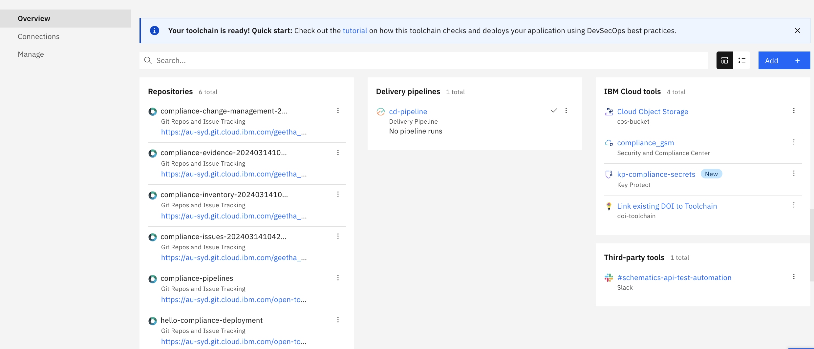

---

copyright:
  years: 2023, 2024
lastupdated: "2024-03-20"

keywords: tekton, pipeline, toolchain, cd, ci, automate, automation, continuous delivery, continuous integration, devsecops tutorial, devsecops, devops, secure devops, satellite, custom target, multiple clusters, shift-left, shift left

subcollection: devsecops

content-type: tutorial
services: containers, ContinuousDelivery
account-plan: paid
completion-time: 1h

---

{{site.data.keyword.attribute-definition-list}}

# Setting up a CD toolchain
{: #tutorial-cd-toolchain}
{: toc-content-type="tutorial"}
{: toc-services="containers, ContinuousDelivery"}
{: toc-completion-time="1h"}

With this tutorial, you can use the toolchain template for continuous deployment (CD) with {{site.data.keyword.compliance_short}} related practices in DevSecOps. The template is preconfigured with the settings. You can validate and provide your configuration to complete the tutorial.
{: shortdesc}

## Before you begin
{: #tutorial-cd-toolchain-prereqs}

1. Complete [Setting up the prerequisites](/docs/devsecops?topic=devsecops-tutorial-cd-devsecops).
2. Complete [Setting up a CI toolchain](/docs/devsecops?topic=devsecops-tutorial-ci-toolchain).
3. View the [Getting started with DevSecOps in {{site.data.keyword.cloud_notm}} - Part 2](https://video.ibm.com/embed/recorded/130714358) video. 
4. Refer to, the [DevSecOps practices to deploy a secure CD application](/docs-draft/devsecops-working?topic=devsecops-working-practices-cd-sec-app).

## Start the CD toolchain setup
{: #tutorial-cd-toolchain-create-options}
{: step}

The {{site.data.keyword.contdelivery_short}} service provides templates that guide you through the CD toolchain setup. Follow the steps to access the template for the CD toolchain.

1. From the [{{site.data.keyword.cloud_notm}} console](https://cloud.ibm.com/).
2. Click **Menu**  and select **DevOps**.
3. On the Toolchains page, click **Create toolchain**.
4. Click **CD - Deploy a secure app with DevSecOps practices** tile to view the template.

## Set up toolchain settings
{: #tutorial-cd-toolchain-name-region}
{: step}

The **Welcome** page summarizes the purpose of the toolchain along with pointers to the documentation and related materials.

1. Click **Start**.
2. Enter a unique **Toolchain name**. **Note** that the toolchain region can differ from cluster and {{site.data.keyword.registryshort}} region.
3. **Select a region** and **Select a resource group** are listed. **Note** you can edit the regions.
4. Optionally you can **Choose the associated continuous integration (CI) toolchain** from the dropdown. This copies some of the CI configuration to aid in the setup for the CD toolchain. **Note** this might overwrite some of the values that you already entered.
5. Click **Continue**.

   You can advance to the next step only when the configuration for the current step is complete and valid. You can always click **Back** to view previous steps in the guided installer. The toolchain installer retains all the configuration settings from the successive steps.
   {: important}

   Some steps include a **Switch to advanced configuration** toggle button. These steps by default present you with the minimum configuration. However, advanced users that need finer grained control can click the **Switch to advanced configuration** toggle to reveal the options for the underlying integration.
   {: important}

## Set up tool integrations
{: #tutorial-cd-toolchain-integrations}
{: step}

If you already linked to an existing CI toolchain in the step, the toolchain name, region, repositories, and other fields are prepopulated. Review the repository URLs, and then continue to the next steps.

### Inventory
{: #tutorial-cd-toolchain-inventory}

1. Select the **Repository URL** of the inventory repository configured in your CI toolchain.
2. Click **Continue**.

### Issues
{: #tutorial-cd-toolchain-issues}

1. Select the **Repository URL** to record the issues while the CD pipeline is running. **Note** that you use an existing issues repository that was created during the CI toolchain.
2. Click **Continue**.

### Pipeline Configuration
{: #tutorial-cd-toolchain-pipeline-config}

The pipeline configuration repository contains YAML files and scripts that are needed for deployment, testing, and other custom tasks.

1. Accept the default settings for **Source Provider**.

   If you do not have a configuration repository, enable the **Advanced configuration** toggle, and select the **Clone repository** type. The toolchain clones the [sample configuration](https://us-south.git.cloud.ibm.com/open-toolchain/hello-compliance-deployment) in your Git organization. For more information about Git repos, see [Configuring your {{site.data.keyword.gitrepos}}](/docs/devsecops?topic=devsecops-devsecops-config-github). For more information about customizable scripts, see [Custom scripts](/docs-draft/devsecops-working?topic=devsecops-working-cd-devsecops-basics-pipelines-customization).
   {: note}

2. Enter a unique **New repository name**.
3. Click **Continue**.

### Secrets
{: ##tutorial-cd-toolchain-secrets}

1. This tutorial uses [{{site.data.keyword.secrets-manager_full}}](https://www.ibm.com/cloud/secrets-manag) as the vault for secrets. The **Region**, **Resource group**, and **Service name** fields are automatically populated based on available choices. Click the drop-down indicators to see the other choices.
2. Type your **{{site.data.keyword.secrets-manager_short}} instance name**.
3. Select the **Authorization type** from the dropdown list.
4. Click **Continue**.

### Evidence storage
{: #tutorial-cd-toolchain-evidence-storage}

1. Select an **Use existing evidence locker repository**.
2. Select the **Repository URL** that was created when you configured the continuous integration (CI) toolchain. For more information about evidence storage, see [Evidence](/docs/devsecops?topic=devsecops-devsecops-evidence).
3. Toggle the {{site.data.keyword.cos_full_notm}} bucket slider to store all the evidence in the {{site.data.keyword.cos_full_notm}} bucket.
4. Click **Continue**.

### Cloud {{site.data.keyword.cos_short}} bucket
{: #tutorial-cd-toolchain-cos-bucket}

1. Verify and accept the automatically populated [{{site.data.keyword.cos_full_notm}}](/docs/devsecops?topic=devsecops-cd-devsecops-cos-bucket-evidence) details. For more information about configuring a bucket that can act as a compliance evidence locker, see [Configuring {{site.data.keyword.cos_short}} for storing evidence](/docs/devsecops?topic=devsecops-cd-devsecops-cos-config).
2. Provide your **Service API key to write to a {{site.data.keyword.cos_full_notm}} instance**.
3. Click **Continue**.

### Artifact Signing
{: #tutorial-cd-toolchain-artifact}

1. Optionally enter **Code Signing Certificate** to verify the validity of signatures for Artifacts. For example, Docker artifacts that are built and signed by the CI pipeline before they are deployed into production.
2. Click **Continue**.

### Deployment target
{: #tutorial-cd-toolchain-target}

1. Accept the **Single cluster (push based deployment)** to deploy your application to targets such as Virtual Server Instance or customize the deployment process, use the **Custom** option.
2. Click **Continue** to view the cluster page.
3. Enter the {{site.data.keyword.cloud_notm}} API Key field to interact with the CLI tool in several tasks. **Note** an existing key can be imported from a secrets vault by clicking the key icon.
4. Verify your **Cluster region**, **Resource group**, **Cluster name**, and
**Cluster namespace** fields where your target cluster is created.
5. Click **Continue**.

### Change request management
{: #tutorial-cd-toolchain-change-request}

1. Accept the populated values for change request management. For more information, see [Automating change management](/docs-draft/devsecops-working?topic=devsecops-working-cd-devsecops-change-management).
2. Enter a unique **New repository name**.
3. Set the **Target Environment purpose** as `Production`.
4. Set the **Target Environment detail**.
5. Click **Continue**.

### {{site.data.keyword.DRA_short}} toolchain
{: #tutorial-cd-toolchain-insights}

Link an existing {{site.data.keyword.DRA_short}} instance from another toolchain to this pipeline, so that all the build, deploy, and test records from the CI and CD toolchain pipelines can be collected in the same place.

The CD toolchain can publish the deployment records to an existing {{site.data.keyword.DRA_short}} instance. To enable this feature, provide the ID of the toolchain that contains the existing {{site.data.keyword.DRA_short}} instance by selecting in the {{site.data.keyword.DRA_short}} toolchain ID list.

The [{{site.data.keyword.cloud_notm}} {{site.data.keyword.DRA_short}}](/docs/ContinuousDelivery?topic=ContinuousDelivery-di_working) is included in the toolchain. View your pipeline test results for every build, from every deployment and environment.

1. Provide your **{{site.data.keyword.DRA_short}} {{site.data.keyword.cloud_notm}} API Key**.
2. Accept the default configuration.
3. Click **Continue**.

### Optional tools
{: #tutorial-cd-toolchain-optional-tools}

#### Slack
{: #tutorial-cd-toolchain-slack}

Configure the [Slack](/docs/ContinuousDelivery?topic=ContinuousDelivery-slack) to receive notifications about your pull requests, or CI pipeline events. You can also add the Slack tool after the toolchain creation.

1. Enter your **Slack webhook**. For more information, see [Slack webhook](https://api.slack.com/incoming-webhooks).
2. Enter your **Slack channel** to post message.
3. Enter the **Slack team name**. For example, if your team URL is `https://team.slack.com`, the team name is `team`.
4. Choosing **Automated Slack Notifications** for the events which you want to receive notifications.
5. Click **Continue**.

Optionally, you can toggle sending notifications with the `slack-notifications` environment property in your CD pipeline by using `0 = off, and 1 = on`.

#### {{site.data.keyword.compliance_short}}
{: #tutorial-cd-toolchain-scc}

1. Accept or edit the automatically populated settings. For more information, see [{{site.data.keyword.compliance_short}}](https://cloud.ibm.com/security-compliance/overview){: external} and the [tool integration](/docs/devsecops?topic=devsecops-scc) configuration process.
2. Click **Continue** to view the Summary page.

## Create the CD toolchain
{: #tutorial-cd-toolchain-summary}
{: step}

The individual toolchain integrations can be configured after the pipeline creation.

1. On the Summary page, click **Create toolchain**, and wait for the toolchain to be created.

{: caption="Figure 1. DevSecOps CD toolchain created" caption-side="bottom"}

## Explore the CD toolchain
{: #tutorial-cd-toolchain-explore}
{: step}

1. Now that the CD toolchain is created, click the **cd-pipeline** tile to open and run the promotion pipeline.

### Run the promotion pipeline
{: #tutorial-cd-toolchain-promotion-pipeline-run}

Make sure that the [CI pipeline](/docs/devsecops?topic=devsecops-cd-devsecops-ci-pipeline) ran successfully before you run the promotion pipeline.

1. Click **cd-pipeline**.
2. Click **Run** for **Manual Promotion Trigger** pipeline.
3. Click **Run** to trigger the pipeline.
4. Click **Manual Promotion Trigger** > `#1promotion-pipelinerun` pipeline. Wait for the promotion pipeline run to complete and check the execution log.

   The promotion pipeline creates a pull request with the content of the inventory on the inventory source environment such as `master` branch targeting the inventory target environment branch such as `staging` or `production`.
   {: note}

5. After the promotion pipeline finishes successfully, the `promote` task log provides a link to the pull request in the inventory repository. The pull request name is of the format `promote <inventory source environment> to <inventory target environment>`, for example, `promote master to prod`
6. Open the pull request in your browser with the link provided in the log. Complete the details in the following sections:
   * **Priority**: (mandatory) set as `Critical`, `High`, `Moderate`, `Low`, or `Planning`.
   * **Change Request assignee**: (mandatory) `Email-ID` of the assignee.
   * **Additional Description**: Description about the changes in the application.
   * **Purpose/Goal**: Purpose of the changes that are made to the application.
   * **Explanation of Impact**: Impact of the change to the application behavior or environment.
   * **Backout Plan**: Steps to back out if there is a deployment failure.
7. Complete the fields in the **Pull Request** and **save**.
8. Add the `EMERGENCY` label to your pull request if any compliance checks in CI failed and you want to [continue with deployment](/docs/devsecops?topic=devsecops-cd-devsecops-approve-cr#cd-devsecops-emergency-label)
9. Merge the pull request from {{site.data.keyword.gitrepos}}.

The details of the pull request are used during the CD pipeline that is run to create and update in the change request repository.

### Run the CD pipeline
{: #tutorial-cd-toolchain-pipeline-run}

You can trigger a CD pipeline in manual or automatic way. You can trigger the CD pipeline manually anytime, but if no changes since the last successful deployment, the CD pipeline stops early as nothing to deploy. You can add and use [`force-redeploy` variable](/docs/devsecops?topic=devsecops-cd-devsecops-pipeline-parm#cd-parameters) to rerun the CD with no code changes. View the successful screen capture of the DevSecOps CD pipeline.

{: caption="Figure 2. DevSecOps CD pipeline successful" caption-side="bottom"}

You can find the sample app that is running on the production namespace. The app URL can be found under `run stage` substep's log of `prod deployment` step of CD pipeline run. Use that URL to verify that the app is running.

## Next steps
{: #tutorial-cd-toolchain-next}

You successfully created a DevSecOps CD toolchain, ran the `cd-pipeline` to trigger manually in the production environment.

Now, continue with [Setting up a CC toolchain](/docs-draft/devsecops-working?topic=devsecops-working-tutorial-cc-toolchain).
