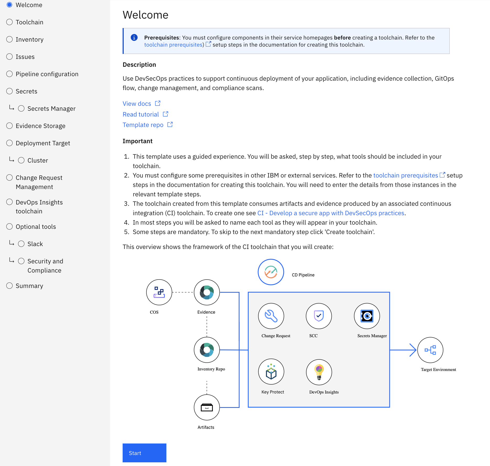

---

copyright: 
  years: 2022, 2023
lastupdated: "2023-11-09"

keywords: tekton, pipeline, toolchain, CD, CI, automate, automation, continuous delivery, continuous integration, devsecops tutorial, devsecops, DevOps, shift-left, shift left, secure DevOps, IBM Cloud, satellite, custom target, multiple clusters

subcollection: devsecops

content-type: tutorial
services: containers, ContinuousDelivery
account-plan: paid
completion-time: 1h

---

{{site.data.keyword.attribute-definition-list}}

# Part 3: Set up a Continuous Deployment (CD) toolchain
{: #tutorial-cd-toolchain}
{: toc-content-type="tutorial"}
{: toc-services="containers, ContinuousDelivery"}
{: toc-completion-time="1h"}

This tutorial is part 3 of a 4-part tutorial series where you learn {{site.data.keyword.cloud}} DevSecOps best practices by using a complete reference implementation that is available as a service and powered by {{site.data.keyword.contdelivery_full}}. In part 3 of this tutorial series, you use the toolchain template for continuous deployment (CD) with security and compliance-related best practices in DevSecOps.
{: shortdesc}

## Before you begin
{: #tutorial-cd-toolchain-prereqs}

Before you begin part 3 of this tutorial series, ensure that you complete the following prerequisites:
1. Complete [Part 1: Set up prerequisites](/docs/devsecops?topic=devsecops-tutorial-cd-devsecops).
1. Complete [Part 2: Set up a Continuous Integration (CI) toolchain](/docs/devsecops?topic=devsecops-tutorial-ci-toolchain).
1. View the [Getting started with DevSecOps in IBM Cloud - Part 2](https://video.ibm.com/embed/recorded/130714358) video.

## CD - Deploy a secure app with DevSecOps practices
{: #tutorial-cd-toolchain-tekton-pipeline}

The DevSecOps CD toolchain contains only one pipeline for continuous deployment. It implements the following best practices:

* Change Management automation to help developers, approvers, and auditors track deployments from the lens of compliance.
* Creates an evidence summary from the evidence that is collected in the CI pipeline
* Creates a change request in {{site.data.keyword.gitrepos}} based change management repository and adds deployment evidence to it
* Uses the inventory repository to promote built artifacts to deployment environments like staging and prod
* Checks the CR, and auto approves if all checks pass
* If CR is approved, or emergency, deploys the image from the inventory to production

## Guided setup overview for the CD toolchain
{: #tutorial-cd-toolchain-guided-setup}

Any of the methods in this tutorial takes you to the guided setup experience. You are guided through the toolchain setup process in a logical order, and you are presented with the recommended configuration options that are needed to create your toolchain.

A progress indicator shows the steps to complete the configuration. You can use the progress indicator to navigate to a previous step with a mouse click. The configuration options for the current step are displayed in the main area of the page.

{: caption="Figure 1. DevSecOps Continuous Deployment toolchain welcome page" caption-side="bottom"}

To advance to the next step, click **Continue**. You can advance to the next step only when the configuration for the current step is complete and valid. You can navigate to the previous step by clicking **Back**.

Some steps include a **Switch to advanced configuration** toggle. These steps by default present you with the minimum recommended configuration needed. However, advanced users that need finer grained control can click the **Switch to advanced configuration** toggle to reveal all options for the underlying integration.

{: caption="Figure 2. DevSecOps Advanced configuration toggle" caption-side="bottom"}

After all the steps are successfully completed, you create the toolchain by clicking **Create** on the Summary step.

You can always go back to previous steps in the guided installer. The toolchain installer retains all the configuration settings from the successive steps.
{: tip}

## Start the CD toolchain setup
{: #tutorial-cd-toolchain-create-options}
{: step}

Start the CD toolchain configuration by using one of the following options:

* Click the following **Create toolchain** button.

   {: external}

* From the {{site.data.keyword.cloud_notm}} console, click **Menu**  and select **DevOps**. On the Toolchains page, click **Create toolchain**. On the Create a Toolchain page, click **CD-Develop with DevSecOps practices**.

## Set up the CD toolchain name and region
{: #tutorial-cd-toolchain-name-region}
{: step}

Review the default information for the toolchain settings. The toolchain's name identifies it in {{site.data.keyword.cloud_notm}}. Make sure that the toolchain's name is unique within your toolchains for the same region and resource group in {{site.data.keyword.cloud_notm}}.

The toolchain region can differ from cluster and registry region. 
{: note}

You can optionally choose the associated CI toolchain in the dropdown. This copies some of the CI configuration to aid in the setup of this CD toolchain.

{: caption="Figure 3. DevSecOps associated CI toolchain" caption-side="bottom"}

**Warning**: This might overwrite some of the values that you already entered.

## Set up CD tool integrations
{: #tutorial-cd-toolchain-integrations}
{: step}

If you already linked to an existing CI toolchain in the Welcome step, the names of application-related repositories that are used in that toolchain are prefilled. Review the repository URLs, and then continue to the next steps.
{: tip}

### Application-related repositories
{: #tutorial-cd-toolchain-application}

If you want to set up your CD toolchain from scratch, configure these repositories during CI toolchain creation, and then use or link to them here.

To fetch the respective URL, go to the CI Pipeline, select the respective tool card. Right-click the tool card, and select **Copy link address**.

* **Inventory**: The inventory repository records details of artifacts that are built by the CI and CD pipelines. For example, `https://<region>.git.cloud.ibm.com/myorg/my-compliance-ci-inventory`
* **Issues**: The issues repository records issues that are found while the CI pipeline is running. For example, `https://<region>.git.cloud.ibm.com/myorg/my-compliance-ci-issues`.
* **Evidence**: All raw compliance evidence that belongs to the application is collected here. For example, `https://<region>.git.cloud.ibm.com/myorg/my-compliance-ci-evidence`.

The toolchain currently supports linking only to existing IBM-hosted {{site.data.keyword.gitrepos}} repositories.
{: note}

### Inventory
{: #tutorial-cd-toolchain-inventory}

**Repository URL**: URL of the Inventory Repository configured in your CI Toolchain as captured in the previous step.

### Issues
{: #tutorial-cd-toolchain-issues}

**Repository URL**: URL of the Issues Repository configured in your CI Toolchain as captured in the previous step.

### Pipeline Configuration
{: #tutorial-cd-toolchain-pipeline-config}

The Pipeline configuration repository contains YAML files and scripts that are needed for deployment, testing, and other custom tasks.

If you do not have a configuration repository, enable the **Advanced configuration** toggle, and select the **Clone repository** type. The toolchain clones the [sample configuration](https://us-south.git.cloud.ibm.com/open-toolchain/hello-compliance-deployment) in your Git organization.

For more information about Git repos, see [Configuring your {{site.data.keyword.gitrepos}}](/docs/devsecops?topic=devsecops-cd-devsecops-config-github). For more information about customizable scripts, see [Custom scripts](/docs/devsecops?topic=devsecops-custom-scripts).

### Secrets
{: ##tutorial-cd-toolchain-secrets}

Several tools in this toolchain, and possibly in your customizable scripts, require secrets to access privileged resources. An IBM Cloud API key is an example of such a secret. These secrets must be securely stored within an IBM-recommended secrets management tool, such as [IBM Key Protect for IBM Cloud](https://www.ibm.com/cloud/key-protect), [{{site.data.keyword.secrets-manager_full}}](https://www.ibm.com/cloud/secrets-manager){: external}, or [HashiCorp Vault](https://www.vaultproject.io/){: external}. The secrets management tool can be integrated into the toolchain so that you can easily reference the secrets in your Tekton pipeline.

This tutorial uses {{site.data.keyword.secrets-manager_full}} as the vault for secrets.

### Evidence Storage
{: #tutorial-cd-toolchain-evidence-storage}

The evidence repository stores evidence for all the tasks that the pipeline runs. This evidence is collected by the pipeline during the pipeline run.

Select an existing evidence repository, preferably the evidence repository that was created when you configured the continuous integration (CI) toolchain.

It is a best practice to use a Cloud Object Storage bucket as an evidence locker to store all the evidence and artifacts that are collected during the pipeline run.

For more information about evidence storage, see [Evidence](/docs/devsecops?topic=devsecops-devsecops-evidence).

### Evidence
{: #tutorial-cd-toolchain-evidence}

**Repository URL**: URL of the Evidence Locker Repository configured in your CI Toolchain as captured in the previous step.

### Cloud {{site.data.keyword.cos_short}} bucket
{: #tutorial-cd-toolchain-cos-bucket}

To use this feature, you must have a Cloud {{site.data.keyword.cos_short}} instance and a bucket. Click [Using Cloud {{site.data.keyword.cos_short}} buckets as an evidence locker](/docs/devsecops?topic=devsecops-cd-devsecops-cos-bucket-evidence) to create a Cloud {{site.data.keyword.cos_short}} instance. For more information on configuring a bucket that can act as a compliance evidence locker, see [Configuring Cloud {{site.data.keyword.cos_short}} for storing evidence](/docs/devsecops?topic=devsecops-cd-devsecops-cos-config).
{: note}

* Cloud {{site.data.keyword.cos_short}} instance, Bucket name, and Cloud {{site.data.keyword.cos_short}} endpoint fields are automatically populated.
* Enter the Service ID API key
   * Preferred: An existing key can be imported from a secrets vault by clicking the key icon.
   * An existing key can be copy and pasted.

The endpoint field is optional. It is recommended to select or provide the endpoint during the setup of the toolchain or during the pipeline run.
{: note}

### Deployment target
{: #tutorial-cd-toolchain-target}

Configure the target where the application is deployed. The toolchain provides with an option to either deploy your application to **Single cluster** or to **Multiple clusters** by using {{site.data.keyword.satelliteshort}} Config. If you want to deploy your application to targets like VSI (Virtual Server Instance) or customize deployment process, use the **Custom** option. 

### IBM Cloud API Key
{: #tutorial-cd-toolchain-api-key}

The API key is used to interact with the ibmcloud CLI tool in several tasks.
* Preferred: An existing key can be imported from a secrets vault by clicking the key icon.
* An existing key can be copy and pasted.
* A new key can be created from here by clicking the **New +**.

The newly generated API key can be immediately saved to a secrets vault.
{: tip}

### Single cluster deployment target
{: #tutorial-cd-toolchain-single-cluster-target}

With this option, you can deploy your application to an existing Kubernetes cluster on {{site.data.keyword.cloud_notm}}. The toolchain currently supports Kubernetes cluster that is managed by {{site.data.keyword.containerlong_notm}} or a Red Hat OpenShift cluster. After the {{site.data.keyword.cloud_notm}} API Key field is completed, select the **Resource group** and **Cluster region** field where your target cluster is created. Select the target **Cluster name** after you choose the appropriate value for the resource group and cluster region fields.

Provide the name of **Cluster namespace** where you want to deploy your application. If the namespace exists, your application is deployed in that namespace, else toolchain creates a new namespace with the name during the first deployment of the application.

### Multiple clusters deployment target
{: #tutorial-cd-toolchain-multiple-clusters-target}

With this option, you can deploy your application to a group of {{site.data.keyword.containerlong_notm}} clusters or Red Hat OpenShift clusters on {{site.data.keyword.cloud_notm}}.

The toolchain uses [Satellite Config](/docs/satellite?topic=satellite-cluster-config) to group multiple clusters in a cluster group and simultaneously deploy the application to all the clusters. [Learn more](/docs/satellite?topic=satellite-setup-clusters-satconfig#setup-clusters-satconfig-groups) about setting up cluster groups for multiple clusters. 

After your cluster group is set up, provide the name of **Cluster namespace** where you want to deploy your application. If the namespace exists, your application is deployed in that namespace. Otherwise, elthese toolchain creates a new namespace with the name during the first deployment of the application.

### Custom target
{: #tutorial-cd-toolchain-custom-target}

With this option, you can customize the deployment step to deploy your application to any target other than a Kubernetes cluster (for example, Virtual Server Instances (VSI)). This option requires you to provide the {{site.data.keyword.cloud_notm}} API key that can later be used within deployment scripts within the pipeline to access various cloud resources.

### Change request management
{: #tutorial-cd-toolchain-change-request}

Use an {{site.data.keyword.cloud_notm}}-hosted {{site.data.keyword.gitrepos}} repository to manage change requests. For more information, see [Automating change management](/docs/devsecops?topic=devsecops-cd-devsecops-change-mgmt).

### DevOps Insights toolchain
{: #tutorial-cd-toolchain-insights}

Link an existing DevOps Insights instance from another toolchain to this pipeline, so that all the build, deploy, and test records from the CI and CD toolchain pipelines can be collected in the same place.

The CD toolchain can publish the deployment records to an existing DevOps Insights instance. To enable this feature, provide the ID of the toolchain that contains the existing DevOps Insights instance by selecting it in the DevOps Insights toolchain ID drop-down.

### Optional Tools
{: #tutorial-cd-toolchain-optional-tools}

#### Slack
{: #tutorial-cd-toolchain-slack}

Configure the [Slack Tool](/docs/ContinuousDelivery?topic=ContinuousDelivery-slack) to receive notifications about your PR/CI Pipeline events.
* [Slack webhook](https://api.slack.com/incoming-webhooks){: external}
* Preferred: An existing webhook can be imported from a secrets vault by clicking the key icon.
* An existing webhook can be copy and pasted.
* Slack channel: an existing Slack channel to post message to
* Slack team name: the phrase before *.slack.com* in our team URL. For example, if your team URL is `https://team.slack.com`, the team name is *team*.
* Automated Slack Notifications: Customize your selection by choosing the events for which you want to receive notifications.

You can add the Slack Tool after toolchain creation.
{: note}

After you create your toolchain, you can toggle sending notifications with the `slack-notifications` Environment Property in your CD Pipeline (0 = off, 1 = on)

#### Security and Compliance
{: #tutorial-cd-toolchain-scc}

To integrate the toolchain with {{site.data.keyword.compliance_short}}, you must provide the following information:
* A project name and the evidence locker repository name for the {{site.data.keyword.compliance_short}} data collector.
* The evidence namespace for the type of the toolchain, which is either **Continuous Deployment** or **Continuous Compliance**.

Use the {{site.data.keyword.cloud_notm}} Framework for Financial Services profile for DevSecOps toolchains.
{: tip}

Read more about the [Security and Compliance Center](https://cloud.ibm.com/security-compliance/overview){: external} and the [tool integration](/docs/devsecops?topic=devsecops-scc) configuration process. 

## Create the CD toolchain
{: #tutorial-cd-toolchain-summary}
{: step}

On the Summary page, click **Create**, and wait for the toolchain to be created.

The individual toolchain integrations can be configured also after the pipeline is created.
{: tip}

{: caption="Figure 4. DevSecOps CD Toolchain Created" caption-side="bottom"}

## Explore the CD toolchain
{: #tutorial-cd-toolchain-explore}
{: step}

Now that the CD Toolchain is created, click the **cd-pipeline** card to open and run the Promotion Pipeline.

### Run the Promotion Pipeline
{: #tutorial-cd-toolchain-promotion-pipeline-run}

Make sure that the [CI Pipeline](/docs/devsecops?topic=devsecops-cd-devsecops-ci-pipeline) ran successfully before you run the Promotion Pipeline.
{: note}

The Promotion Pipeline creates a Pull Request with the content of the inventory on the Inventory Source Environment (for example: master) branch targeting the Inventory Target Environment branch (for example: staging or prod). 

* On the **cd-pipeline Dashboard**, click **Run pipeline**, and select the **Manual Promotion Trigger**. Click **Run** to trigger the pipeline. 
* Wait for the Promotion Pipeline run to complete and check execution log.
* After the Promotion Pipeline finishes successfully, the `promote` Task log provides a link to the pull Request in the Inventory Repository. The pull request name is of the format `promote <Inventory Source Environment> to <Inventory Target Environment>`.

1. Open the pull request in your browser with the link provided in the log. Complete the details in the following sections:
   * **Priority**: (mandatory) One of Critical, High, Moderate, Low, Planning
   * **Change Request assignee**: (mandatory) email-id of the assignee
   * **Additional Description**: Description about the changes in the application
   * **Purpose**: Purpose of the changes that are made to the application
   * **Explanation of Impact**: Impact of the change to the application behavior or environment
   * **Backout Plan**: Steps to back out if there is a deployment failure
1. Complete the fields in the **Pull Request** and **save**.
1. Add the `EMERGENCY` label to your PR if any compliance checks in CI failed and you want to [continue with deployment](/docs/devsecops?topic=devsecops-cd-devsecops-approve-cr#cd-devsecops-emergency-label)
1. Merge the pull request from {{site.data.keyword.gitrepos}}.

The details of the pull request are used by the CD Pipeline to create a Change Request in Change Request Management repository during the CD pipeline run.

### Run the CD Pipeline
{: #tutorial-cd-toolchain-pipeline-run}

You can start a CD pipeline in either of the following ways:
* Preferred: trigger the CD pipeline manually.
* Optional: automatically after every `Merge` action in the Inventory Repository. A {{site.data.keyword.gitrepos}} trigger is set up to trigger automatic CD Pipeline, but is disabled by default.

You can also trigger the CD pipeline manually anytime, but if there are no changes since the last successful deployment, the CD pipeline aborts early because there is nothing to deploy. You can add and use [`force-redeploy` variable](/docs/devsecops?topic=devsecops-cd-devsecops-pipeline-parm#cd-parameters) to rerun the CD with no code changes.
{: tip}

A successful CD pipeline run looks like this:

{: caption="Figure 5. DevSecOps CD Pipeline Successful" caption-side="bottom"}

After a successful CD pipeline run, you can find the sample app that is running on the prod namespace. The app URL can be found under `run stage` substep's log of  `prod deployment` step of CD Pipeline run. Use that URL to verify that the app is running.

{: caption="Figure 6. DevSecOps App running" caption-side="bottom"}

## Next steps
{: #tutorial-cd-toolchain-next}

Continue to [Part 4: Set up a Continuous Compliance (CC) toolchain](/docs/devsecops?topic=devsecops-tutorial-cc-toolchain).
