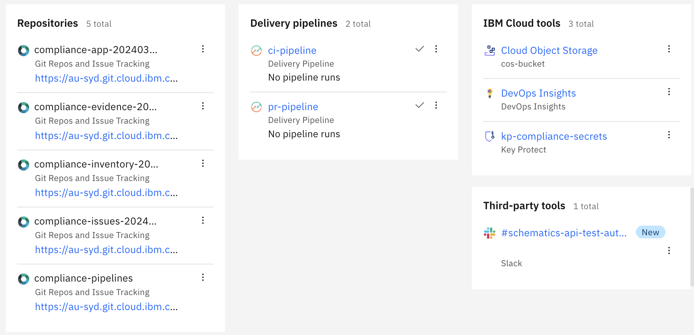

---

copyright:

  years: 2022, 2025
lastupdated: "2025-02-14"

keywords: tekton, pipeline, toolchain, cd, cd, automate, automation, continuous delivery, continuous integration, devsecops tutorial, devsecops, devops, secure devops, satellite, custom target, multiple clusters, shift-left, shift left

subcollection: devsecops

content-type: tutorial
services: containers, ContinuousDelivery
account-plan: paid
completion-time: 1h

---

{{site.data.keyword.attribute-definition-list}}

# Part 2: Set up a CI toolchain
{: #tutorial-ci-toolchain}
{: toc-content-type="tutorial"}
{: toc-services="containers, ContinuousDelivery"}
{: toc-completion-time="1h"}

This tutorial walks you through how to use the toolchain template for continuous integration (CI) with {{site.data.keyword.compliance_short}} related practices in DevSecOps. The template is preconfigured for continuous deployment (CD) with inventory integration, change management with {{site.data.keyword.gitrepos}}, evidence collection, and deployment to {{site.data.keyword.containerlong_notm}}.
{: shortdesc}

You can customize and centrally manage the IAM settings for the accounts in your enterprise to meet the compliance and internal standards.

## Before you begin
{: #tutorial-ci-toolchain-prereqs}

1. Complete the [Setting up prerequisites](/docs/devsecops?topic=devsecops-tutorial-cd-devsecops) tutorial.
2. View the [Getting started with DevSecOps in {{site.data.keyword.cloud_notm}}](https://video.ibm.com/embed/recorded/130714354) video.

## Start the CI toolchain setup
{: #tutorial-ci-toolchain-create-options}
{: step}

The {{site.data.keyword.contdelivery_short}} service provides templates that guide you through the toolchain setup and create processes in a logical order. A progress indicator shows the steps to complete the configuration. Follow the steps to access the template for the CI toolchain.

1. In the {{site.data.keyword.cloud_notm}} console, click the **Menu** icon  > **Platform Automation** > **Toolchains**.
3. From the Toolchains page, click **Create toolchain**.
4. Click the **CI - Develop a secure app with DevSecOps practices** tile.

## Set up the CI toolchain settings
{: #tutorial-ci-toolchain-name-region}
{: step}

The Welcome page summarizes the purpose of the toolchain along with pointers to the documentation and related materials.

1. Click **Start**.
2. Enter a unique **Toolchain name** within your toolchain for the same region and resource group in the {{site.data.keyword.cloud_notm}}.
3. **Select a region**.
4. **Select a resource group**.
5. Click **Continue**.

   You can advance to the next step only when the configuration for the current step is complete and valid. You can always click **Back** to view previous steps in the guided installer. The toolchain installer retains all the configuration settings from the successive steps.
   {: important}

Some steps include a **Switch to advanced configuration** toggle button. These steps by default present you with the minimum configuration. However, advanced users that need finer grained control can click the **Switch to advanced configuration** toggle to reveal the options for the underlying integration.

## Set up CI tool integrations
{: #tutorial-ci-toolchain-tool-integrations}
{: step}

Review the default settings and provide the user-defined configurations wherever necessary to set up CI tool integration.

### Application
{: #tutorial-ci-toolchain-application}

1. Select **Source Provider** as **{{site.data.keyword.gitrepos}}**.
2. The default behavior of the toolchain is **Use default sample application**. The toolchain currently supports linking only to existing {{site.data.keyword.gitrepos}} repositories. If using you **own application / service** source code repository, refer to:
- [Bringing your own app to DevSecOps](/docs/devsecops?topic=devsecops-cd-devsecops-apps-byoa).
- [Auto configure your DevSecOps pipelines](/docs/devsecops?topic=devsecops-devsecops-inferred-pipeline-configuration) using the Inferred DevSecOps Pipeline Configuration feature.
3. Enter a unique name for **New repository name**.
4. Click **Continue**.

### Inventory
{: #tutorial-ci-toolchain-inventory}

The inventory repository records details of artifacts that are built by the CI toolchains.

1. You can accept the default configuration provided in the template or edit the configuration as per your requirement.
2. Click **Continue**.

### Issues
{: #tutorial-ci-toolchain-issues}

The issues repository records issues that are found while the CI pipeline is running.

1. You can accept the default configuration provided in the template or edit the configuration as per your requirement.
2. Click **Continue**

### Secrets
{: #tutorial-ci-toolchain-secrets}

Specify the secret vault integrations to be added to your toolchain by using the toggles. For more information, see [Managing {{site.data.keyword.cloud_notm}} secrets](/docs/secrets-manager?topic=secrets-manager-manage-secrets-ibm-cloud).

The CI toolchain supports **Arbitrary secrets** and **IAM credentials** secret types only.
{: important}

1. This tutorial uses {{site.data.keyword.secrets-manager_full}} as the vault for secrets. The **Region**, **Resource group**, and **Service name** fields are automatically populated based on available choices. Select the drop-down indicators to see the other choices.
2. Enter your **{{site.data.keyword.secrets-manager_short}} instance name**.
3. Select the **Authorization type**.
4. Click **Continue**.

### Evidence Storage
{: #tutorial-ci-toolchain-evidence-storage}

The evidence repository stores all the evidence and artifacts that are generated by the DevSecOps CI pipeline.

1. Toggle the {{site.data.keyword.cos_full_notm}} bucket slider to store all the evidence in the {{site.data.keyword.cos_full_notm}} bucket that can be configured on the next page.
2. Accept the default settings.
3. Click **Continue**.

### Cloud {{site.data.keyword.cos_short}} bucket
{: #tutorial-ci-toolchain-cos-bucket}

You must have the [{{site.data.keyword.cos_full}} instance](/docs/devsecops?topic=devsecops-cd-devsecops-cos-bucket-evidence) and a [Cloud {{site.data.keyword.cos_short}} bucket](/docs/devsecops?topic=devsecops-cd-devsecops-cos-config) to act as a compliance evidence locker.
{: note}

1. The **Cloud {{site.data.keyword.cos_short}} instance**, **Bucket name**, and **Cloud {{site.data.keyword.cos_short}} endpoint** fields are automatically populated.
2. Enter your **Service ID API key**.
   * Preferred: An existing key can be imported from a secrets vault by clicking the key icon.
   * An existing key can be copied and pasted.
3. Click **Continue**.

The endpoint field is optional. It is recommended to select or provide the endpoint during the setup of the toolchain or during the pipeline run.
{: note}

### Deploy
{: #tutorial-ci-toolchain-deploy}

Configure the target Kubernetes cluster where the application is deployed.

1. Use the default **App name** `hello-compliance-app`.
2. Type your **{{site.data.keyword.cloud_notm}} API Key**. The API key is used to interact with the {{site.data.keyword.cloud_notm}} CLI tool in several tasks.
   * Preferred: An existing key can be imported from a secrets vault by clicking the key icon.
   * An existing key can be copied and pasted.
   * A new key can be created from here by clicking the **New +**.

   The newly generated API key can be immediately saved to a secrets vault.
   {: tip}

3. If the API key is valid and has sufficient access, the **{{site.data.keyword.registryshort}}**, **{{site.data.keyword.registryshort}} namespace**, **Dev cluster region**, **Resource group**, **Cluster name**, **Cluster namespace** are automatically populated. You can change any of these fields to match your configuration.
4. Click **Continue**.

### Artifact signing
{: #tutorial-ci-toolchain-image-signing}

The artifacts are built by the toolchain and recorded in the inventory must be signed before deployed to production.

1. Enter the **GnuPG Private Key**. Alternatively you can create a new GPG key by clicking **NEW**. For more information, see [Generating a GPG key](/docs/devsecops?topic=devsecops-devsecops-image-signing).
2. Click **Continue**.

### {{site.data.keyword.DRA_short}}
{: #tutorial-ci-toolchain-insights}

The [{{site.data.keyword.cloud_notm}} {{site.data.keyword.DRA_short}}](/docs/ContinuousDelivery?topic=ContinuousDelivery-di_working) is included in the toolchain. View your pipeline test results for every build, from every deployment and environment.

1. Accept the default configuration.
2. Click **Continue**.

### SonarQube
{: #tutorial-ci-toolchain-sonarqube}

Configure SonarQube as the static code analysis tool for the toolchain. SonarQube provides an overview of the overall health and quality of your source code and highlights issues that are found in new code. The static code analyzers detect tricky bugs, such as null-pointer dereferences, logic errors, and resource leaks for multiple programming languages.

1. Accept the **Default Configuration**.
2. Click **Continue**.

### Optional tools
{: #tutorial-ci-toolchain-optional-tools}

#### Slack
{: #tutorial-ci-toolchain-slack}

Configure [Slack](/docs/ContinuousDelivery?topic=ContinuousDelivery-slack) to receive notifications about your pull requests or CI pipeline events. You can also add the Slack tool after toolchain creation.

1. Enter your **Slack webhook**. For more information, see [Slack webhook](https://api.slack.com/messaging/webhooks).
2. Enter your **Slack channel** to post message.
3. Enter the **Slack team name**. For example, if your team URL` https://team.slack.com`, the team name is `team`.
4. Choose the events that you want to receive notifications for **Automated Slack Notifications**.
5. Click **Continue**.

## Create the CI toolchain
{: #tutorial-ci-toolchain-summary}
{: step}

1. On the Summary page, click **Create toolchain**.
2. Wait for the toolchain creation. This can take a few minutes.

## Explore the CI toolchain
{: #tutorial-ci-toolchain-explore}
{: step}

The CI toolchain contains `ci-pr-pipeline (PR)` and `ci-pipeline (CI)`. These pipelines trigger when a new merge request is submitted or merged to master in the application repository.

Follow the steps to access your toolchain:

1. In the {{site.data.keyword.cloud_notm}} console, click the **Menu** icon  > **Platform Automation** > **Toolchains**.
3. From the Toolchains page, click **Create toolchain**.
4. Click your toolchain to view the output as shown in following artifact.

{: caption="DevSecOps CI toolchain" caption-side="bottom"}

### Run the ci-pr Pipeline
{: #tutorial-ci-toolchain-pr-pipeline-run}

To start the `ci-pr pipeline`, you need to create a merge request in your application repository.

1. From the CI toolchain page, click the `ci-pr pipeline` tile. By default, it's created with the name `compliance-app-<timestamp>`.
2. Create a branch from the master branch.
3. Update code in the application or add a readme file, and save changes.
4. Click submit **Merge request**.
5. On the CI toolchain page, click the **pr-pipeline** tile. Verify that the `ci-pr pipeline` is triggered by the creation of the merge request.
6. Wait for the `ci-pr pipeline` run to complete. The corresponding merge request that is in your application repository is in the `Pending` state until all the stages of the PR pipeline finish successfully.
7. After the PR pipeline run is successful, click the pipeline to explore numerous steps that are completed and to view the page.

   {: caption="DevSecOps PR Pipeline Successful" caption-side="bottom"}

8. Access the **Merge request** to merge the request so that your changes are copied to the master branch of your application repository.

### Run the CI pipeline
{: #tutorial-ci-toolchain-ci-pipeline-run}

Start the CI pipeline in one of the following ways:

   * Automatically: After a successful PR pipeline, by approving and merging the PR to the master branch.
   * Manually: To trigger the CI pipeline manually, select the Delivery Pipeline card, click **Run Pipeline**, and select **Manual Trigger**.

In this tutorial, the CI pipeline was triggered after you merged your code changes to the master branch of your application repository.

1. On the **CI toolchain** page, click the **ci-pipeline** tile.
2. Click **Run** against your pipeline name. Observe a pipeline run is running. Wait for the pipeline run to complete.
3. After the CI pipeline run is successful, click the pipeline to explore the completed steps to view the page as shown in the screen capture.

   {: caption="DevSecOps CI pipeline" caption-side="bottom"}

4. Click the **{{site.data.keyword.DRA_short}}** tile to review the collected evidence on the **Quality Dashboard** page, as shown in the screen capture.

   {: caption="DevSecOps CI evidence" caption-side="bottom"}

   You can also review the evidence if {{site.data.keyword.cos_full_notm}} bucket is enabled during setup. To evaluate if you have any failures in your pipeline run, you need to check the final step of your pipeline, which has a pipeline evaluator.
   {: note}

### Viewing the running application
{: #tutorial-ci-toolchain-view-app}

After a successful CI pipeline run, the sample application is deployed on your Kubernetes cluster.

The application URL can be found at the end of the log of the `run stage` step of `deploy-dev` task of the CI pipeline run. Use that URL to verify that the application is running.

### Pipeline customization
{: #tutorial-ci-toolchain-pipeline-config}

The various pipelines that are provided in the reference continuous integration and continuous deployment toolchains are based on the Continuous Delivery support for Tekton Pipelines. For more information about pipeline customization, see [How do a user customize the pipeline](/docs-draft/devsecops-working?topic=devsecops-working-faq_devsecops#faq-ci-sec-pipeline-customize)?

## Next steps
{: #tutorial-ci-toolchain-next}

You successfully created a DevSecOps CI toolchain, ran `ci-pr pipeline` and `ci-pipeline` to build, test, and deploy your changes to the development environment. Now you're ready explore to [Setting up a CD toolchain](/docs-draft/devsecops-working?topic=devsecops-working-tutorial-cd-toolchain).
