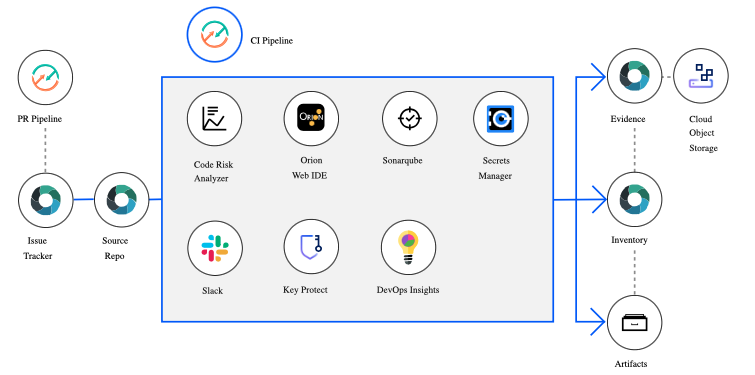
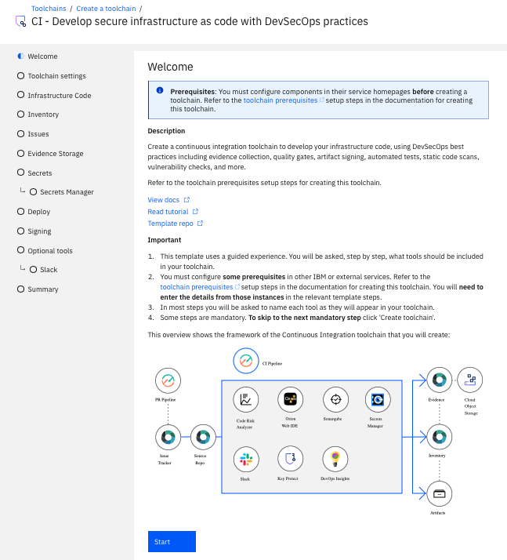
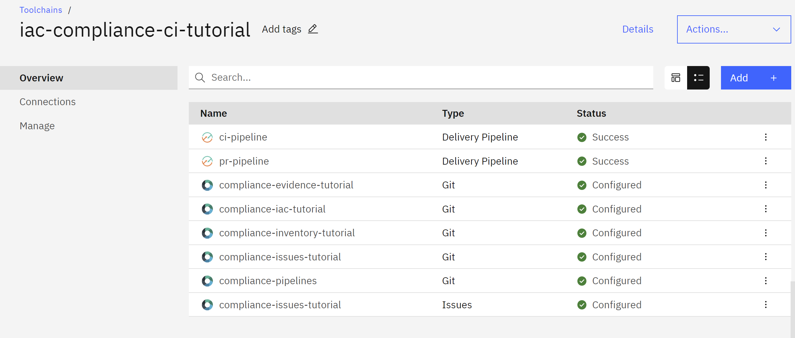
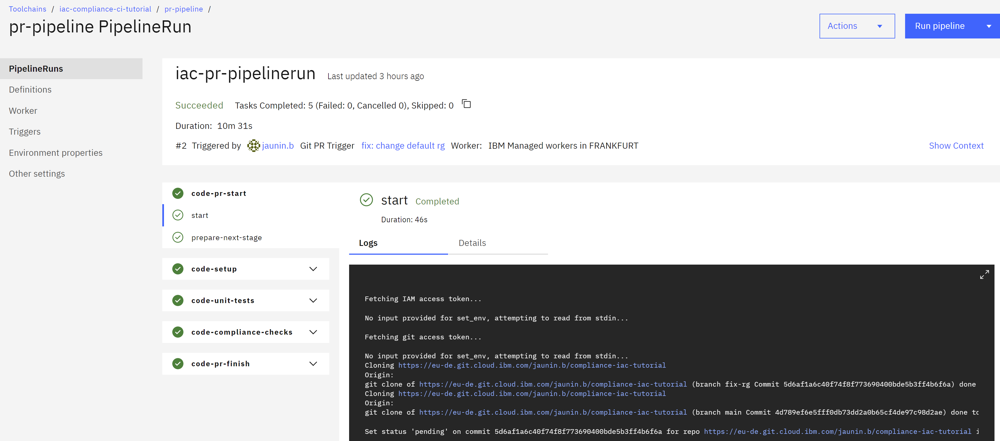
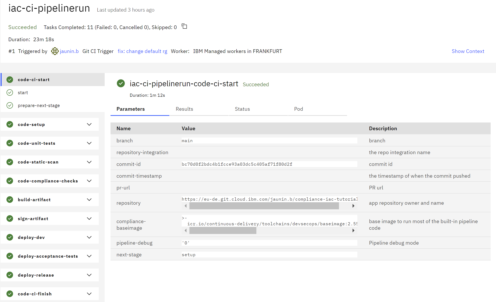

---

copyright:
  years: 2022, 2024
lastupdated: "2024-02-20"

keywords: tekton, pipeline, toolchain, CD, CI, CC, automate, automation, continuous delivery, continuous integration, continuous compliance, devsecops tutorial, devsecops, DevOps, shift-left, shift left, secure DevOps, IBM Cloud, infrastructure-as-code, terraform, schematics

subcollection: devsecops

content-type: tutorial
services: schematics, ContinuousDelivery
account-plan: paid
completion-time: 1h

---

{{site.data.keyword.attribute-definition-list}}

# Part 2: Set up a CI toolchain for Infrastructure as Code (Terraform)
{: #devsecops-tutorial-iac-ci}
{: toc-content-type="tutorial"}
{: toc-services="schematics, ContinuousDelivery"}
{: toc-completion-time="1h"}

This tutorial is part 2 of a 3-part tutorial series where you learn {{site.data.keyword.cloud}} DevSecOps best practices by using a complete reference implementation that is available as a service and powered by {{site.data.keyword.cloud_notm}} continuous delivery. In part 2 of this tutorial series, you use the toolchain template for continuous integration (CI) with security and compliance-related best practices in DevSecOps for Terraform. It is preconfigured for continuous deployment with inventory integration, change management with {{site.data.keyword.gitrepos}}, evidence collection, and deployment of the infrastructure to {{site.data.keyword.cloud_notm}}.
{: shortdesc}

## Before you begin
{: #devsecops-tutorial-iac-ci-prereqs}

Before you begin part 2 of this tutorial series, ensure that you complete the following prerequisites:

1. Complete [Part 1: Set up prerequisites](/docs/devsecops?topic=devsecops-devsecops-tutorial-iac).
1. View the [Getting started with DevSecOps in IBM Cloud - Part 1](https://video.ibm.com/embed/recorded/130714354) video.
1. Start the [{{site.data.keyword.cloud_notm}} console](https://cloud.ibm.com/). The console is the starting point of this tutorial.

## Continuous Integration (CI) toolchain for Infrastructure as Code (IaC) introduction
{: #devsecops-tutorial-iac-ci-intro}

The CI toolchain implements the following best practices:

* Runs a static code scanner on the infrastructure code repositories and performs Terraform linting checks on the Infrastructure code.
* Runs compliance checks on the infrastructure code to detect secrets and security vulnerabilities.
* Builds artifacts on every Git commit.
* Stores the built artifacts metadata in inventory repository.
* Automatically builds and validates any code that is merged into the target Git repository branch.

{: caption="Figure 1. DevSecOps Continuous Integration toolchain" caption-side="bottom"}

## Guided setup overview for the CI toolchain
{: #devsecops-tutorial-iac-ci-setup}

The {{site.data.keyword.contdelivery_short}} service provides templates to guide you through the toolchain setup process in a logical order, presenting you with the recommended configuration options that you need to create your toolchain.

A progress indicator shows the steps to complete the configuration. Use the progress indicator to navigate to previous steps. The configuration options for the current step are displayed in the main area of the page.

{: caption="Figure 2. DevSecOps Continuous Integration toolchain welcome page" caption-side="bottom"}

To advance to the next step, click **Start**. You can advance to the next step only when the configuration for the current step is complete and valid. Navigate to the previous step by clicking **Back**.

Some steps include a **Switch to advanced configuration** toggle. These steps by default present you with the minimum recommended configuration needed. However, advanced users that need finer grained control can click the **Switch to advanced configuration** toggle to reveal all options for the underlying integration.

{: caption="Figure 3. DevSecOps Advanced configuration toggle" caption-side="bottom"}

When all the steps are successfully completed, create the toolchain by clicking **Create** on the **Summary** step.

You can always go back to previous steps in the guided installer. The toolchain installer retains all the configuration settings from the successive steps.
{: tip}

## Start the CI toolchain setup
{: #devsecops-tutorial-iac-ci-options}
{: step}

Use one of the following options to access the template for the CI toolchain:

* Click **Create toolchain**.

   {: external}

* From the [{{site.data.keyword.cloud_notm}} console](https://cloud.ibm.com/){: external}, click **Menu**  and select **DevOps**. On the Toolchains page, click **Create toolchain**. On the **Create a Toolchain** page, click **CI - Develop secure infrastructure as code with DevSecOps practices**.

## Set up the CI toolchain name and region
{: #tutorial-ci-terraform-name}
{: step}

The **Welcome** page summarizes the purpose of the toolchain that is created, along with links to documentation and related materials. When you are ready to proceed, click **Start** to begin configuring the toolchain.

Review the default information for the toolchain settings:

1. The toolchain's name identifies it in {{site.data.keyword.cloud_notm}}. Make sure that the toolchain's name is unique within your toolchains for the same region and resource group in {{site.data.keyword.cloud_notm}}.
1. The toolchain region is the region where the toolchain itself and related resources (Git repos, pipelines, for example) are created. Toolchains can deploy to any region, regardless of where they are created.

## Set up CI tool integrations
{: #devsecops-tutorial-iac-ci-tools}
{: step}

 Configure multiple repositories during the guided setup, as described in the following sections.

You can clone the sample repositories or you can use your own, but the toolchain supports {{site.data.keyword.gitrepos}} repositories only.
{: note}

### Infrastructure code
{: #tutorial-ci-terraform-infra}

The infrastructure source code repository is hosted on {{site.data.keyword.ghe_short}}. For consistency, this tutorial refers to {{site.data.keyword.gitrepos}}.
{: note}

The recommended options are displayed by default, but you can click the **Switch to advanced configuration** toggle to see all of the configuration options available for the underlying Git integration. The default behavior of the toolchain is **Use default sample infrastructure code**, which clones the sample application into an IBM-hosted {{site.data.keyword.gitrepos}} repository.

Enter a name for the IBM-hosted {{site.data.keyword.gitrepos}} repository that is created by the toolchain as your infrastructure code repository.

The region of the repository remains the same as the region of the toolchain.

To link an existing infrastructure code repository for the toolchain, select **Bring your own infrastructure code**, and provide it as input to the **Repository URL** field. The toolchain currently supports linking only to existing {{site.data.keyword.gitrepos}} repositories. For more information, see [Bringing your own infrastructure code to DevSecOps](https://us-south.git.cloud.ibm.com/open-toolchain/hello-iac-sample/blob/main/README.md){: external}.

### Inventory
{: #devsecops-tutorial-iac-ci-inventory}

The inventory repository records details of artifacts that are built by the CI toolchains.

### Issues
{: #devsecops-tutorial-iac-ci-issues}

The issues repository records issues that are found while the CI pipeline is running.

### Secrets
{: #devsecops-tutorial-iac-ci-secrets}

Specify the secret vault integrations to be added to your toolchain by using the toggles provided. For more information, see [Managing {{site.data.keyword.cloud_notm}} secrets](/docs/secrets-manager?topic=secrets-manager-manage-secrets-ibm-cloud).

This tutorial uses {{site.data.keyword.secrets-manager_full}} as the vault for secrets. The **Region**, **Resource group**, and **Service name** fields are automatically populated based on available choices. Click the drop-down indicators to see the other choices.

### Evidence Storage
{: #devsecops-tutorial-iac-ci-evidence}

The evidence repository stores all the evidence and artifacts that are generated by the DevSecOps CI pipeline.

Toggle the **Cloud Object Storage bucket** slider to also store all the evidence in a Cloud {{site.data.keyword.cos_short}} bucket, which you can configure on the next page.

### Cloud {{site.data.keyword.cos_short}} bucket
{: #devsecops-tutorial-iac-ci-cos-bucket}

To use this feature, you must have a Cloud {{site.data.keyword.cos_short}} instance and a bucket. Click [Using IBM Cloud Object Storage buckets as an evidence locker](/docs/devsecops?topic=devsecops-cd-devsecops-cos-bucket-evidence) to create a Cloud {{site.data.keyword.cos_short}} instance. See [Configuring IBM Cloud Object Storage for storing evidence](/docs/devsecops?topic=devsecops-cd-devsecops-cos-config) to configure a bucket that can act as a compliance evidence locker.
{: note}

* **Cloud {{site.data.keyword.cos_short}} instance**, **Bucket name**, and **Cloud {{site.data.keyword.cos_short}} endpoint** fields are automatically populated.
* Enter the Service ID API key:
   * Preferred: An existing key can be imported from a secrets vault by clicking the **key** icon.
   * You can also copy and paste an existing key.

The endpoint field is optional. Select or provide the endpoint during the setup of the toolchain or during the pipeline run.
{: note}

### Deploy
{: #devsecops-tutorial-iac-ci-deploy}

* **{{site.data.keyword.cloud_notm}} API Key:**
   The API key interacts with the {{site.data.keyword.cloud_notm}} CLI tool in several tasks, it also clones the Git repository.
   * Preferred: Import an existing key from a secrets vault by clicking the **key** icon.
   * You can also copy and paste an existing key.
   * Create a key by clicking **New +**.

Save the newly generated API key to a secrets vault.
{: tip}

If the API key is valid and has sufficient access, the schematic workspace, Git repos, and resource group are automatically populated. You can change any of these fields to match your configuration if needed.

Configure the target schematic workspace where the terraform states are maintained:

* **Schematic workspace name:**
   The name of the schematic workspace.
   * Default: `toolchainName-toolchainId-pipelineID`

### Signing
{: #devsecops-tutorial-iac-ci-signing}

Any code that is built by this toolchain and recorded in the inventory must be signed before the code is delivered to production environment.

To enable signing, provide a GPG key. You can select an existing key from a secret store or input the value directly. Alternatively you can create a new GPG key by clicking **NEW**.

Ensure that the key follows the appropriate encoding as required by the chosen tool to store secrets.

DevSecOps for IaC creates a detached signature file for the `tar.gz` file that is created containing the Terraform configuration.
{: note}

You can also sign the Git release tag that is created by using this GPG key. Add the GPG public key to the Git user profile to verify the signed commits. Use `gpg --armor --output <public key file> --export <Email Address>` to get the public key content if the `gpg --list-keys` shows the appropriate GPG key entry.
{: note}

### Optional tools
{: #devsecops-tutorial-iac-ci-opt}

#### Slack
{: #devsecops-tutorial-iac-ci-slack}

Configure [Slack](/docs/ContinuousDelivery?topic=ContinuousDelivery-slack) to receive notifications about your PR or CI pipeline events:

* [Slack webhook](https://api.slack.com/incoming-webhooks){: external}
* Preferred: Import an existing webhook from a secrets vault by clicking the **Key** icon.
* Copy and paste an existing webhook.
* Slack channel: an existing Slack channel to post messages to.
* Slack team name: the phrase before *.slack.com* in our team URL. For example, if your team URL https://team.slack.com, the team name is *team*.
* Automated Slack notifications: Customize your selection by choosing the events for which you want to receive notifications.

You can add the Slack Tool after toolchain creation.
{: note}

## Create the CI toolchain
{: #devsecops-tutorial-iac-ci-summary}
{: step}

On the **Summary** page, click **Create**, and wait for the toolchain to be created.

Other toolchain integrations can be configured after the pipeline is created.
{: tip}

## Explore the CI toolchain
{: #devsecops-tutorial-iac-ci-explore}
{: step}

The DevSecOps CI IaC toolchain looks like this:

{: caption="Figure 4. DevSecOps Continuous Integration toolchain" caption-side="bottom"}

The toolchain contains two pipelines:

* **pr-pipeline (PR)**: triggers when a new Merge Request (MR) is submitted in the infrastructure code repository.
* **ci-pipeline (CI)**: triggers when an MR is merged to main in the infrastructure code repository, but can be manually triggered.

The sample that is used in this tutorial expects a `resource_group` to create the KeyProtect instance. The default `resource_group` name is `Default`. If the default is not appropriate for your account, replace the default `resource_group` variable in the `variables.tf` file or specify the `resource_group` variable by setting the `TF_VAR_resource_group` environment property in the PR pipeline and CI pipeline to the appropriate resource group name.
{: note}

### Run the pr pipeline
{: #devsecops-tutorial-iac-pr-pipeline}

To start the pr pipeline, create a merge request in your application repository:

1. From the **CI toolchain** page, click the application repository tile. By default it gets created with a name `compliance-app-<timestamp>`.
1. Create a branch from main branch.
1. Update some code such as an app or readme file and save changes.
1. Submit merge request.
1. On the CI toolchain page, click the **pr-pipeline** tile. Verify that the PR pipeline is triggered (by the creation of the Merge Request).
1. Wait for the PR pipeline run to complete.

The corresponding Merge Request that is in your application repository is in `Pending` state until all the stages of PR pipeline finish successfully.

When the PR pipeline run is successful, click it to explore numerous steps completed.

{: caption="Figure 5. DevSecOps PR pipeline successful" caption-side="bottom"}

1. Navigate back to the merge request.
1. Merge the request so that your changes are copied to the main branch of your application repository: the CI pipeline is automatically triggered.

### Run the CI pipeline
{: #devsecops-tutorial-iac-ci-pipeline}

Start the CI pipeline in one of the following ways:
* Automatically: after a successful PR pipeline, by approving and merging the PR to the main branch.
* Manually: select the **Delivery Pipeline** card, click **Run Pipeline**, and select **Manual Trigger**.

In this tutorial, the CI Pipeline is triggered after you merge your code changes to the main branch of your application repository

1. On the **CI toolchain** page, click the **ci-pipeline** tile.
1. Observe: a pipeline-run is running. Wait for the pipeline-run to complete.

When the CI pipeline run completes, click it to explore the completed steps.

{: caption="Figure 6. DevSecOps CI pipeline" caption-side="bottom"}

Evidence from all compliance checks in the CI pipeline is uploaded to the evidence-locker repository, but also to the Cloud Object Storage bucket if you enabled it during setup.

To evaluate if you have any failures in your pipeline run, check the final step of your pipeline, which has a pipeline evaluator.
{: note}

### Customizing the pipeline
{: #devsecops-tutorial-iac-ci-pipeline-cfg}

Custom scripts are extension points in the pipeline where adopters, teams, and users can provide scripts to run custom tasks that are required by their continuous integration and continuous deployment strategies.

Custom scripts control the pipeline stages. Use the `pipeline-config.yaml` configuration file to configure the behavior of stages, script content, and the base image that runs the scripts. The scripts and configuration for pipeline stages are loaded from a Git repository (repo) that can either be the application (app) repo (similar to `.travis.yml` or `Jenkinsfile`) or a custom repo.

For more information on customizing the CI pipelines, see [Custom scripts](/docs/devsecops?topic=devsecops-custom-scripts).

### Wrapping up
{: #devsecops-tutorial-iac-ci-done}

By completing the CI part of this tutorial, you:

* Created a DevSecOps CI toolchain for Terraform.
* Modified some code in the infrastructure code repository.
* Ran the pr pipeline before you merge your changes.
* Ran the ci-pipeline to build, test, and deploy your changes to your dev environment.

## Related content
{: #devsecops-tutorial-iac-ci-related}

* [Getting started with toolchains](https://cloud.ibm.com/devops/getting-started){: external}
* [Getting started with {{site.data.keyword.contdelivery_short}}](/docs/ContinuousDelivery?topic=ContinuousDelivery-getting-started)

## Next steps
{: #tutorial-iac-ci-next}

Continue to [Part 3: Set up a CD toolchain for Infrastructure as Code](/docs/devsecops?topic=devsecops-devsecops-tutorial-iac-cd).
